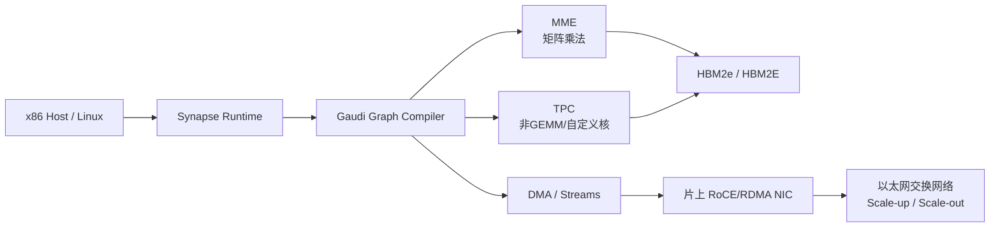
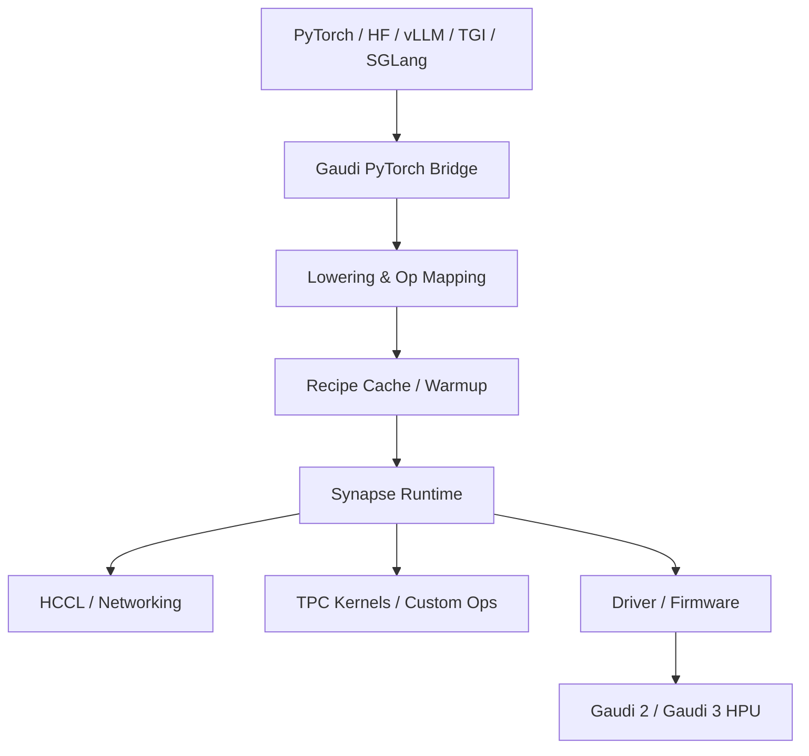
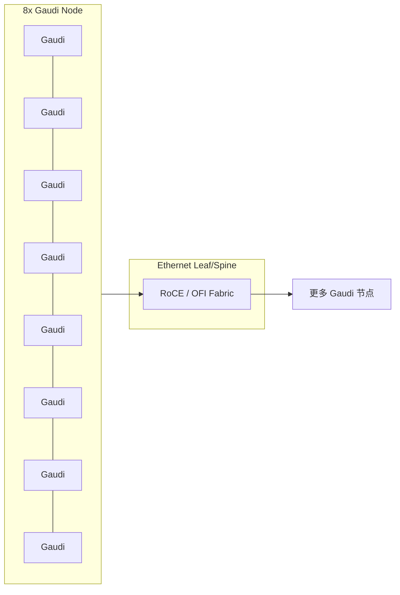

# Gaudi AI 加速卡技术全景调研报告

[下载 PDF 版](/files/research/Gaudi-AI加速卡技术全景调研报告.pdf)

[下载 Word 版](/files/research/Gaudi%20AI%20加速卡技术全景调研报告.docx)

## 执行摘要

对 AI 基础设施团队而言，Intel Gaudi 家族在 2026 年的现实定位已经相当清晰：**硬件上最有差异化的价值来自“片上以太网/RoCE 网络 + 大容量 HBM + 面向矩阵与非矩阵混合工作负载的异构架构”**，软件上最可用、最值得投入的主线则是 **PyTorch + SynapseAI/Intel Gaudi Software + Optimum-Habana + vLLM Hardware Plugin 或 Hugging Face TGI**。官方文档明确表明当前 Gaudi 软件套件围绕图编译器、运行时、TPC 内核库、HCCL、驱动/固件、Profiler 和 PyTorch 集成构建；最新文档版本覆盖 Gaudi 2 与 Gaudi 3，且当前默认执行路径已经转向 `eager + torch.compile`，Lazy mode 仅作为 legacy fallback。citeturn31view0turn32view0turn32view1turn9search11turn16search5

从**推理**视角看，Gaudi 生态已经有可用的生产路径，但不是“CUDA/TensorRT-LLM 等价替代”。Gaudi 当前的强项是：对 Hugging Face 生态的深度耦合、对 LLM/VLM 的现成配方、片上 Ethernet/RDMA 带来的多机扩展简化，以及官方提供的 FP8/UINT4 推理文档、CustomOp/TPC SDK、Kubernetes Operator、监控与分析工具链。Gaudi 当前的弱项同样非常明确：**TensorFlow 已在 1.15 起停止支持，ONNX 在官方 PyTorch 支持矩阵中为 No，公共 PyTorch 支持仍带 preview/限制色彩，且部分不支持算子会回退到 CPU**。因此，Gaudi 更适合“愿意接受 PyTorch-first 与 shape-aware 调优范式”的团队，而不适合已经深度绑定 ONNX/TensorRT/CUDA 自定义核的存量平台直接平移。citeturn10search3turn10search1turn11search0turn31view0turn33search1turn33search3

如果把结论压缩成基础设施决策建议，可以概括为三点。第一，**Gaudi 3 是当前真正值得评估的主力 SKU**；Gaudi 1 主要属于历史兼容路径，Gaudi 2 仍适合成本敏感或已部署集群的延续扩容，但面向大模型推理的新投入应优先看 Gaudi 3。第二，**Gaudi 推理的最佳落点不是“万能推理底座”，而是“以 HF/vLLM/TGI 为中心的 LLM/VLM 服务平台”**。第三，若你们团队的重点是多机推理、KV cache 规模、服务吞吐和以太网扩展治理，Gaudi 的网络设计值得认真评估；但若重点是最广泛的算子/框架覆盖、最成熟的 ONNX/TensorRT 路径、以及大量现成的第三方推理服务生态，NVIDIA 仍然最稳，AMD ROCm 在主流开源推理方面的广度也已明显超过 Gaudi。citeturn19view0turn30view0turn29search3turn24search4turn24search5turn24search7turn24search0

## 硬件架构与产品形态

Gaudi 的底层设计不是传统意义上“GPU 万能并行核”路线，而是**异构 AI SoC**。官方架构文档将其拆成三个主子系统：计算、内存和网络；计算部分由 **MME** 与 **TPC** 两类引擎组成。MME 负责可下沉到矩阵乘法的主干算子，如全连接、卷积、batched GEMM；TPC 则是面向深度学习非线性与非 GEMM 算子的**可编程 VLIW SIMD 处理器**。这意味着 Gaudi 的优化思路天然强调“图编译、流水线、算子融合和异构执行配平”，而不是只看某一类 Tensor Core 峰值。citeturn19view0turn31view0turn13search9

Gaudi 3 的公开硬件描述已经相当完整。官方架构页与技术白皮书都说明，**Gaudi 3 采用两个 compute die**，通过高带宽、低时延的 interposer bridge 连接，并对软件透明；合计提供 **8 个 MME、64 个 TPC、24 个 200Gbps RDMA NIC 端口、128GB HBM2e、3.7TB/s HBM 带宽**。官方架构页给出的顶层性能口径是 **FP8/BF16 1.8 PFLOPs**；而白皮书的详细计算表给出 **MME 矩阵计算 1678 TFLOPs，TPC 向量 BF16 28.7 TFLOPs**。这两者并不完全矛盾，但反映出**不同 Intel 材料采用了不同的汇总口径**；做选型时，建议以具体 SKU datasheet 和可复现实测为最后依据。citeturn19view0turn35view0turn36view1

Gaudi 2 的公开信息同样稳定：**24 个 100GbE RoCE v2 NIC、96GB HBM2E、2.45TB/s 带宽、48MB SRAM**，并且支持 FP32、TF32、BF16、FP16 与 FP8。Intel 的日文/韩文 Gaudi 3 白皮书表格还给出了与 Gaudi 3 的同口径对照：**Gaudi 2 约 432 BF16 MME TFLOPs、865 FP8 MME TFLOPs、24 个 TPC、2 个 MME**。与此同时，Intel 中文页和中文 Gaudi 2D 产品简介还表明，存在面向出口限制场景的 **Gaudi 2D/HL-225D** 变体，其 TDP 与网络容量等参数与标准 Gaudi 2 并不完全相同，因此采购与调研时不能把“Gaudi 2D”和“标准 Gaudi 2”混为一谈。citeturn19view0turn20search8turn20search4turn20search1turn35view0turn34search3

在产品形态上，Gaudi 3 同时覆盖 OAM 与 PCIe。官方技术白皮书描述 **HL-325L OAM** 支持最高 **900W TDP**；Gaudi 3 PCIe 产品简介则说明 **HL-338** 是一张 **PCIe 5.0 x16、全高双槽、10.5 英寸、最高 600W TDP** 的卡，带 **128GB HBM2e 和 96MB SRAM**，并支持用 top bridge 将 4 卡聚合为 **900GB/s** 带宽拓扑。对做企业推理平台的团队来说，PCIe 卡非常重要，因为它决定了 Gaudi 3 不只是“大型八卡整机/OAM”路线，也可以走标准 PCIe 服务器集成，尤其适合低延迟和中等规模 LLM 推理节点。citeturn35view0turn35view1turn36view2turn21search2

下面这张表把 Gaudi 2、Gaudi 2D 与 Gaudi 3 的**硬件口径**拉齐到基础设施团队最关心的维度：

| 产品 | 公开架构形态 | 计算引擎 | HBM | HBM 带宽 | 片上网络 | 主机接口 | 典型功耗/形态 | 备注与来源 |
|---|---|---:|---:|---:|---:|---|---|---|
| Gaudi 2 | 官方公开文档未强调 chiplet，重点披露异构 SoC 架构 | 2 MME，24 TPC | 96GB HBM2E | 2.45–2.46 TB/s | 24 × 100GbE RoCE v2，双向 600 GB/s | PCIe Gen4 x16，峰值 64 GB/s | 标准资料常见 600W OAM | 架构页、白皮书对照表、Intel 产品页。citeturn19view0turn35view0turn27search0turn20search8 |
| Gaudi 2D | 面向受限市场的变体 | 2 MME，24 TPC | 96GB HBM2E | 中文资料给出 2.4 TB/s 级别 | 24 × 100GbE RoCE v2，产品简介写明网络容量可达 2.1 Tbps | OAM | 单卡最高 450W | 这是特定 SKU，不应直接代表标准 Gaudi 2。citeturn20search1turn20search4 |
| Gaudi 3 OAM | 两个 compute die，经 interposer bridge 互连 | 8 MME，64 TPC | 128GB HBM2e | 3.7 TB/s | 24 × 200Gbps RDMA，双向 1200 GB/s | PCIe Gen5 x16，峰值 128 GB/s | OAM，最高 900W | 顶层性能口径 1.8 PFLOPs FP8/BF16；详细表格 1678 TFLOPs MME。citeturn19view0turn35view0turn36view1 |
| Gaudi 3 PCIe HL-338 | 与 OAM 同代架构，PCIe 卡形态 | 8 MME，64 TPC | 128GB HBM2e | 3.7 TB/s | RoCE v2 片上端口 + 4 卡 bridge 900GB/s | PCIe 5.0 x16，128 GB/s | 全高双槽 PCIe，最高 600W | 面向低延迟/标准服务器集成很关键。citeturn35view1turn36view2turn21search2 |

从**硬件选型逻辑**看，Gaudi 的最大差异点不是单纯“显存更大”或“峰值算力更高”，而是**把 scale-up 与 scale-out 所需的 Ethernet/RDMA 能力直接做进了芯片**。这在多机推理、服务扩容、机架网络运维、以及避免额外 high-end fabric 绑定方面都很有现实意义。与此同时，Gaudi 3 的 128GB HBM2e 仍然显著小于 AMD MI325X 的 256GB HBM3E，也小于 NVIDIA H200 的 141GB HBM3e；对于超长上下文、超大 KV cache 或希望降低分片数的大模型推理，这一点会直接影响可服务模型的形状和 batch 策略。citeturn16search1turn37search1turn8search1turn8search7turn27search5

上图反映了官方文档描述的 Gaudi 执行路径：模型先被桥接层与图编译器转成面向 MME/TPC/DMA/NIC 的执行配方，再通过多个异步 stream 进行并行与流水调度。citeturn31view0turn19view0

## 软件栈与编译运行时

Gaudi 的软件总栈传统上被业界简称为 **SynapseAI**，在当前官方文档中更常见的表述是 **Intel Gaudi Software** 或 **Intel Gaudi Software Suite**。其核心组件包括：**Graph Compiler and Runtime、TPC Kernel Library、驱动与固件、HCCL、TPC SDK、Profiler，以及面向 PyTorch 的桥接层**。这套设计的关键不是“手写内核 + 运行时直调”而是“先图级 lowering，再用图编译器做融合、布局管理、并行化、流水化和内存管理，最后缓存 recipe 复用”。citeturn31view0

在 PyTorch 路径上，Gaudi 的当前状态需要精确理解。官方支持矩阵明确写道：**默认模式是 `Eager mode + torch.compile`，Lazy mode 是 legacy fallback，已不再继续开发**；同时，`torch.compile(backend="hpu_backend")` 是主要图执行路径，而 `torch.compile(backend="inductor")` 不是官方支持路径。理论上，PyTorch 推理与训练都支持，但支持矩阵也同时明确列出：**CUDA 原生不是支持设备，ONNX 导出/运行都是 No，稀疏张量/嵌套张量等也存在缺口**。这意味着 Gaudi 对 PyTorch 用户友好，但其兼容层并不是“把 PyTorch 的所有变体都自然吞掉”。citeturn32view0

更值得基础设施团队关注的是：**公共 PyTorch 支持已经存在，但仍带 preview 色彩**。官方 Theory of Operations 说明，桥接层兼容 Intel Gaudi PyTorch fork 与公共 PyTorch 2.10.0；公共 PyTorch 的支持目前限制于 `eager + torch.compile`，且**没有 dedicated Docker image**。从 ABI 角度看，v1.22 开始 `_GLIBCXX_USE_CXX11_ABI` 已切到与公共 PyTorch 一致的 `1`，旧版按 `0` 编译的扩展需要重编译。对推理平台团队而言，这两个点都非常关键：第一，它意味着你不必永远绑定 vendor fork；第二，它也意味着你们现有 C++/PyBind 扩展、轮子与容器 ABI 必须重新审查。citeturn32view1

如果你们有大量 CUDA/PyTorch 存量代码，Intel 官方建议走 **GPU Migration Toolkit**。其目标不是自动把所有性能问题解决，而是把 `torch.cuda` 等 GPU 依赖 API 替换为 HPU 对应调用，降低初次迁移的代码改动量。换句话说，它更像**兼容性加速器**，不是性能魔法棒。要拿到真正稳定的推理性能，后续仍然要做 shape 管理、图 warmup、算子核查、量化配置、HCCL/parallelism 策略与容器化收敛。citeturn33search1turn33search3turn33search7turn33search11

最重要的断点是**TensorFlow 与 ONNX**。官方 release notes 已明确：**自 1.15.0 起 TensorFlow 不再支持，并且 Model References 中删除了所有 TensorFlow 模型**。而 PyTorch 支持矩阵中 OFFICIAL ONNX 相关条目是 **No/No**。这意味着若你们现在的生产推理主线建立在 TensorFlow Serving、ONNX Runtime、TRT-ONNX、或一套“多后端统一 ONNX 资产格式”的体系之上，Gaudi 不是低摩擦迁移对象；应把它视为一条新的、PyTorch 为核心的推理平台，而不是你们现有模型资产格式的平滑延展。citeturn10search3turn10search1turn11search0

当前公开的官方支持矩阵也给出了一个很实用的“落地版本窗口”：

| 组件 | Gaudi 3 当前公开支持口径 | 实操含义 | 来源 |
|---|---|---|---|
| Intel Gaudi Software | 1.24.0 | 建议围绕 1.24 做新集群基线 | citeturn16search5turn29search7 |
| PyTorch | 2.10 | 新平台可以围绕 PyTorch 2.10 收敛，但需关注 ABI 与 preview 公共轮子路径 | citeturn16search5turn32view1 |
| DeepSpeed | 官方 fork 0.14.4 口径 | 多卡 LLM 推理/训练仍然常用 | citeturn16search5turn32view0 |
| Intel Neural Compressor | 3.8.1 | FP8/低比特量化应视为主线能力 | citeturn16search5turn13search5 |
| Optimum for Intel Gaudi | 1.21.0 | HF 工作流主入口 | citeturn16search5turn12search0 |
| TGI | 3.3.2 | 官方支持的 LLM 服务路径之一 | citeturn16search5turn30view0 |
| vLLM Hardware Plugin for Intel Gaudi | 0.17.1 / 0.19.0 / 0.19.1 / 0.21.0 | 需严格按矩阵配版本，不建议随意追最新 upstream | citeturn16search5turn29search3 |
| Kubernetes | 1.33 / 1.34 / 1.35 | K8s 集群版本选择有明确窗口 | citeturn16search5turn29search7 |

这个软件栈图背后的现实含义是：**Gaudi 的性能不是“只换设备名就有”，而是强依赖图编译、缓存与形状管理**。这也是它在推理场景里最常见的成功条件与失败根源。citeturn31view0turn32view1turn30view0

## 推理框架、模型集成与算子优化

从 2026 年的成熟度看，Gaudi 推理生态的主线有四条：**Optimum-Habana、Hugging Face TGI、vLLM Hardware Plugin for Intel Gaudi，以及 SGLang**。Optimum-Habana 是 Hugging Face Transformers/Diffusers 与 Gaudi HPU 之间的直接接口，覆盖单卡和多卡加载、训练与推理。TGI 是面向生产的 LLM 服务端；vLLM 插件则是当前 Gaudi 面向高吞吐 LLM 服务的另一条重要路线；SGLang 则反映出 Gaudi 近一年的推理生态仍在继续向新一代 serving/runtime 靠拢。citeturn12search0turn12search18turn12search1turn16search11turn15search3

Optimum-Habana 的价值在于它把 Hugging Face 的模型加载、推理示例与 Gaudi 优化参数系统化；Intel 官方性能页中大量 LLM 吞吐数据也是基于 Optimum-Habana 测得。与此同时，官方 Model References 仓库仍然是可复现配方的重要来源；它包含生成式 AI、LLM 和 CV 的参考实现，且在 2026 年仍有更新。对 infra 团队而言，这意味着**Gaudi 成功率很大程度取决于你是否愿意接受“以官方参考仓库为真相源”**，而不是一开始就照搬你们现有 CUDA 推理脚本。citeturn25view2turn38view2turn12search3turn23search10

TGI 路径在 2025–2026 的一个重要变化，是**Gaudi 后端已向 Hugging Face 上游收敛**。Gaudi release notes 写明，旧的 `tgi-gaudi` 仓库会被弃用并迁移到 `huggingface/text-generation-inference`；TGI 的 Gaudi 后端文档还给出了现成 Docker 用法、sharding 参数、FP8 支持、VLM 示例以及 warmup/参数调优注意事项。对平台团队来说，这种 upstream 化非常重要，因为它减少了“厂商私有 fork 永久追版本”的维护税。citeturn9search6turn30view0

vLLM 路径则经历了另一种演变：**Intel 自有的 `vLLM-fork` 正在退场，而社区维护的 `vLLM Hardware Plugin for Intel Gaudi` 正成为主路径**。官方 release notes 已明确指出旧 fork 已 EOL，而支持矩阵则把重点放在插件版本与 Gaudi 软件版本的对应；最新 release notes 还说明该插件已经验证了包括 Qwen3-VL、Granite、Ernie4.5-VL、GPT-OSS、reranking 模型在内的一系列模型。这个变化的战略意义在于：Gaudi 不再试图永久维护一个平行 vLLM 世界，而是努力通过可插拔硬件后端进入 upstream 生态。citeturn13search4turn9search8turn29search3turn29search10turn12search1

不过，要客观看待这件事。Gaudi 的 vLLM 路线虽然正在 upstream 化，但其公共文档仍然反复强调：**原始 vLLM 项目中的 Gaudi 支持不一定覆盖当前驱动/固件上的所有特性，Intel 自己的路径更强调“与最新驱动/固件对齐和保证可运行”**。这说明 Gaudi 的 vLLM 生态虽可用，但版本耦合仍然比较重。换成 infra 话语，就是：**不要把 vLLM 当作完全 vendor-agnostic 组件来管理**，而要把它视为“硬件插件 + 特定 Gaudi 版本组合”的产品化工件。citeturn9search2turn18search2turn12search9

在模型覆盖方面，Gaudi 的 TGI 后端目前已列出很长的支持清单，包括 **Llama、Mixtral、Mistral、Qwen 2/3、Phi、Gemma、Granite、Cohere、Falcon、Starcoder、Baichuan，以及多种 VLM**。vLLM FAQ 与 release notes 也给出 Llama/Mistral/Mixtral/Qwen-VL/Granite/Ernie4.5-VL 等的验证情况。这说明在**主流开源 LLM/VLM** 上，Gaudi 的覆盖已达到“足以搭平台”的程度；但这并不等于“任何 HF 模型都能无缝跑”，因为 shape、量化格式、注意力实现、KV cache、Remote Code 与 custom layers 依然会决定成败。citeturn30view0turn29search0turn29search3turn29search10

在算子与内核层面，Gaudi 官方文档的态度是务实的。PyTorch Operators 文档直接说明：**支持的算子通常只覆盖 selected variants 和有限 optional parameters**；而 Software Suite 文档又明确表示，**不支持的算子会在 CPU 上执行**。这对推理平台是一条红线：一旦热点路径上出现 CPU fallback，端到端延迟与吞吐会迅速失控，尤其在 decode 阶段更明显。因此，对上模型前必须做 operator audit 和 profiler 验证，而不能只看“模型能跑”。citeturn18search0turn31view0

Gaudi 当前已经提供了比较完整的**自定义核与融合能力**：其一是 **PyTorch CustomOp API**，可以为新算子实现自定义 HPU kernel；其二是 **TPC SDK**，带 LLVM-based TPC-C 编译器、模拟器和调试器；其三是图编译器层面的 kernel library 集成，可以通过 `GC_KERNEL_PATH` 接入自定义 TPC 内核。官方还给出了面向特定模型块的 fused/custom op，例如为 Mixtral/LLaMA 中 MoE block 提供更适合 Gaudi 的实现，以及持续优化 FusedSDPA。对于需要把特定 attention/MoE 卷积 path 打磨到生产级的团队，这是一条可行但门槛不低的道路。citeturn13search1turn13search3turn13search0turn13search16turn18search11

量化方面，Gaudi 在推理上已经把 **FP8 与 UINT4** 明确推到主线。官方文档写得很直接：**FP8 对 LLM 推理可将所需内存带宽减半，并把计算速度提升到 BF16 的两倍级别；UINT4 则进一步降低内存带宽压力**。当前推荐的量化工具是 **Intel Neural Compressor**，其已替代旧的 Habana Quantization Toolkit；官方推理量化页还说明，也支持用 **BitsAndBytes** 处理部分数据类型。需要注意的是，**剪枝/蒸馏更多是 INC 的通用能力，而不是像 FP8/UINT4 那样在当前 Gaudi 推理文档里有成熟的一线 recipe**。因此，如果你们以“压榨在线推理吞吐”为目标，优先级应是 FP8、KV cache 量化、图 warmup、shape 管理与 flash/fused attention，而不是先做剪枝。citeturn13search2turn13search8turn13search14turn13search5turn4search12turn13search20

下表给出一个面向推理工程的框架成熟度判断：

| 路径 | 当前状态 | 适用场景 | 主要限制/风险 | 来源 |
|---|---|---|---|---|
| PyTorch 原生 + Gaudi Bridge | 官方主线 | 自研推理、模型迁移、单模型调优 | ONNX 不支持；不支持算子会 CPU fallback；公共 PyTorch 路径仍有限制 | citeturn32view0turn32view1turn31view0 |
| Optimum-Habana | 非常成熟 | HF LLM/VLM/CV 快速落地 | 强依赖官方 recipe 与版本配齐 | citeturn12search0turn25view2turn38view2 |
| Hugging Face TGI on Gaudi | 成熟且上游化 | 生产 LLM 服务、连续批处理、分片 | 需要 warmup 和 shape 参数调优；仍以 HF 模型生态为中心 | citeturn30view0turn9search6 |
| vLLM Hardware Plugin for Intel Gaudi | 已可生产评估 | 高吞吐 LLM 服务、插件化后端 | 与驱动/固件/插件版本耦合较重；旧 fork 已 EOL | citeturn12search1turn29search3turn13search4 |
| SGLang | 新增且值得关注 | 新一代 LLM 服务 | 生态与文档深度仍在增长 | citeturn16search11turn15search3 |
| Triton Inference Server | 可用，但不是当前优化主战场 | 已有 Triton 管理面、需要统一服务框架 | 官方公开优化重心更偏向 TGI/vLLM/SGLang | citeturn33search13turn9search13turn16search6 |
| TensorFlow | 已退出主流 | 不建议新项目采用 | 1.15 起不再支持 | citeturn10search3turn10search1 |
| ONNX | 非官方主线 | 不建议作为 Gaudi 主资产格式 | 官方矩阵为 No | citeturn11search0 |

## 通信栈与分布式推理能力

Gaudi 与 NVIDIA/AMD 最不同的地方之一，是**网络不是平台附属品，而是架构本体**。官方文档指出，Gaudi 是首批把 **RoCE v2 RDMA engines 直接集成到芯片**中的深度学习处理器，用户可以在机内、机架内和跨机架都使用同一种基于标准以太网交换网络的扩展方式。对基础设施团队而言，这会影响的不只是吞吐，还包括 NIC 规划、交换机策略、布线、拥塞测试、故障面和数据中心网络团队的协作方式。citeturn19view0turn16search1

在软件层，Gaudi 的 NCCL 等价物是 **HCCL**。官方文档把它定义为 Intel Gaudi 对标准 collective routines 的实现，并提供 **NCCL-compatible APIs**。HCCL 支持的主 collective primitives 包括 **AllReduce、Broadcast、Reduce、AllGather、ReduceScatter，以及 P2P 的 Send/Recv**。同时，PyTorch 分布式可通过 `backend='hccl'` 初始化，DDP、DeepSpeed、FSDP、DTensor 与 Tensor Parallel 也在支持矩阵中有不同程度的支持。citeturn31view0turn37search0turn37search2turn37search6turn32view0

这里有一个很容易被忽略、但对大模型推理非常关键的细节：**HCCL 当前只支持 single device per process**。这与很多团队在 NCCL 上已经习惯的进程/设备组织方式有相似之处，但在容器调度、多租户隔离、vLLM/TGI 运行器封装和 launcher 设计上，仍然要按 Gaudi 的推荐方式去做，而不要想当然地移植你们原来的多卡单进程布局。citeturn37search7turn37search6

Gaudi 的 scale-out 还有一条很现实的优势：**除了用 Gaudi 片上 NIC，它还支持通过 Host NIC 走 OFI/libfabric 路径**。官方文档说明，HCCL 会自动选择最优的扩展方式，并给出优先级：优先使用 Gaudi NIC；其次是 Host NIC Gaudi Direct；再其次是经主机内存的 OFI 路径。对于 Host NIC Gaudi Direct，文档列出要求包括 **libfabric 版本、Linux 内核 5.12+、Gaudi 2/3 对 verbs provider 的支持** 等。也就是说，你们可以在标准网络架构上把 Gaudi 融入现有数据中心 fabrics，而不一定要接受完全封闭的平台 interconnect 思路。citeturn16search0turn16search3turn16search5

从带宽口径看，Gaudi 3 官方网络配置文档给出了一组对 infra 很有用的数字：**每个 Gaudi 3 的 scale-up 理论单向带宽约 525 GB/s，双向约 1050 GB/s；每个 Gaudi 3 的 scale-out 带宽为每方向 75 GB/s，双向 150 GB/s；8 卡 HLS-3 box 级别的 scale-out 则是单向 600 GB/s，双向 1200 GB/s**。文档同时注明，Gaudi 2 的网络结构类似，但链路速率是 100Gbps，因此对应带宽基本减半。对于做多节点前缀缓存、分布式 prefill/decoding、或专家并行/MoE 的团队，这些数值比单卡 TFLOPs 更接近真实上线约束。citeturn37search1

需要特别指出一个**API 与文档口径的边界问题**：HCCL 的“Supported Collective Primitives”主文档没有列出 `all2all`，但网络配置与拥塞测试文档又提到可使用 `all2all` 进行测试。这意味着**all2all 至少在 demo/诊断层面存在，但是否将其视为所有版本下的正式主线 primitive，应按具体软件版本与官方示例再次确认**。如果你们的推理方案严重依赖 expert parallel / all-to-all 模式，务必在 PoC 期就把这一点前置验证。citeturn37search0turn37search9

在分布式模型并行层面，Gaudi 当前最稳的推理路线仍然是：**TGI/vLLM 自身的分片与连续批处理机制 + DeepSpeed/HCCL + 适度的张量并行**。支持矩阵表明，DeepSpeed、DDP、FSDP、DTensor 和 Tensor Parallel 都有支持，但 Pipeline Parallel 与 Distributed Elastic 仍为 No。对在线推理团队而言，这已经足够支撑大模型服务，但意味着你们不应期待“PyTorch 全量分布式技术栈在 Gaudi 上完全等价”。citeturn32view0turn37search3

这种“芯片内置 RoCE + 标准交换网络”的拓扑思维，是 Gaudi 与典型 GPU 平台最大的架构文化差异之一。citeturn16search1turn37search1turn16search0

## 部署运维、容器化与开源成熟度

Gaudi 的运维栈比很多人想象得要完整。官方文档已经提供预构建容器镜像，并明确支持在 Ubuntu 22.04.5 和 24.04.3 上使用预构建 Docker 镜像；支持矩阵还给出了 Docker、Kubernetes、OpenShift、Slurm 等版本窗口。对于平台团队来说，这意味着**Gaudi 已经不仅是“跑 benchmark 的裸机设备”，而是有相对完整的云原生接入面**。citeturn14search0turn16search5turn29search7

Kubernetes 方面，官方当前推荐路径是 **Intel Gaudi Base Operator**，它会自动管理**驱动、Kubernetes device plugin、container runtime、feature discovery 和 monitoring tools**。文档还显示，device plugin 会把设备暴露为 `habana.ai/gaudi` 资源。对已经在 GPU 集群中使用 Operator + device plugin 模式的团队来说，这种接入方式不会陌生；真正的差异在于你需要把 Gaudi 特定 runtime、监控 exporter、固件与驱动生命周期纳入集群平台治理。citeturn14search1turn14search5turn14search17turn14search9

在观测与运维工具方面，Gaudi 提供了相当于 `nvidia-smi` 的 **`hl-smi`**，以及 HLML/PYHLML 这样的管理库；固件更新有 **`hl-fw-loader`**；分析与剖析有 **Intel Gaudi Profiler、Remote Trace Viewer**；可用性验证还有 `hl_qual` 工具包。最新文档树中还出现了 **Prometheus Metric Exporter**、**BMC Exporter** 和 **Redfish Data Model for Gaudi 3**，表明硬件监控与平台集成已经进入更标准化阶段。对于生产服务平台，这些工具的重要性并不亚于模型框架本身。citeturn14search11turn15search7turn15search1turn14search3turn15search19turn15search6turn15search18turn19view0

需要注意的是，Gaudi 的**warmup/graph compile** 对生产运维影响非常直接。TGI Gaudi 文档明确解释了固定 tensor shapes、graph compiler 生成 shape 相关二进制、server 启动阶段 warmup 的必要性，并提醒**尤其在 FP8 模式下，warmup 可能需要数分钟**。这意味着你们的服务设计必须把冷启动、灰度切换、实例预热、模型滚动升级和磁盘缓存策略纳入 SLO 设计；不能简单沿用一些 GPU 服务里“拉起即接流量”的思路。citeturn30view0

多租户方面，官方文档给出了比较谨慎的指导：在 Docker 多 workload 场景下，虽然技术上能做部分卡分配，但**推荐的组合主要是 2 卡和 4 卡成组**，并建议按模块拓扑选择 `HABANA_VISIBLE_MODULES`。这说明 Gaudi 并非不能做细粒度分卡，但在当前官方支持下，**最佳实践更偏向按拓扑切块分配**，而不是完全任意切分。对在线推理平台，这会影响算力池切片方式与资源碎片化成本。citeturn14search12

从开源成熟度看，Gaudi 生态有一个很鲜明的特征：**关键基础设施组件已经开源，但整体社区体量与第三方渗透度仍明显低于 CUDA，也小于 ROCm 的主流推理生态**。正面证据是，HabanaAI GitHub 组织中持续维护着 `gaudi-pytorch-bridge`、`Model-References`、`Gaudi-tutorials`、`gaudi-base-operator`、`gaudi-device-plugin`、`gaudi-container-runtime` 等仓库，且 Kubernetes/operator 相关仓库在 2026 年仍有更新；Optimum-Habana 在 Hugging Face 上游维护，vLLM-Gaudi 走社区维护插件路线。负面证据则是：Gaudi 仍依赖更严格的版本映射、较少的现成 SaaS/托管推理分发、以及更窄的框架兼容边界。citeturn11search1turn14search10turn12search3turn12search15turn23search1turn12search0turn12search1turn24search7turn24search0turn24search4turn24search5

在许可证与支持通道上，Gaudi 也相对清晰。`gaudi-pytorch-bridge`、`gaudi-base-operator`、`vllm-gaudi`、`optimum-habana` 大体走 **Apache-2.0**；`gaudi-device-plugin` 则是 **GPL-2.0**。公开支持通道包括 **Intel Gaudi Developer Community** 和 Intel Community；另外，Intel 产品页也明确把购买与支持引导到 OEM 伙伴或 Intel 代表。对企业法务与平台团队来说，这意味着需要在“核心训练/推理代码 Apache-2.0 可内部分发”与“部分集群组件 GPL-2.0”之间做一次标准的开源合规审查。citeturn23search1turn14search2turn22search8turn22search5turn14search14turn22search6turn22search10turn17search4

下面这张小表适合直接交给平台、法务和 SRE 一起看：

| 项目 | 角色 | 许可证 | 备注 | 来源 |
|---|---|---|---|---|
| HabanaAI/gaudi-pytorch-bridge | PyTorch 桥接与 HPU 核心运行能力 | Apache-2.0 | 基础中的基础 | citeturn23search1turn23search9 |
| huggingface/optimum-habana | HF 到 Gaudi 的主入口 | Apache-2.0 | 上游协作，适合模型侧团队 | citeturn12search0turn22search5 |
| vllm-project/vllm-gaudi | vLLM 硬件插件 | Apache-2.0 | 社区维护插件，需控版本 | citeturn12search1turn22search1turn22search8 |
| HabanaAI/gaudi-base-operator | K8s Operator | Apache-2.0 | 推荐的 K8s 部署方式 | citeturn14search2turn14search5 |
| HabanaAI/gaudi-device-plugin | K8s 设备插件 | GPL-2.0 | 集群层需做合规核查 | citeturn14search14 |

## 基准、竞品对比、迁移路线与行动建议

先看**官方或准官方可复现的推理性能数据**。Intel 当前公开的 Gaudi 3 性能页给出了大量 LLM 吞吐行，适合拿来做集群容量估算。例如：**Llama 3.1 8B 在 1 张 Gaudi 3 上，FP8、输入 128/输出 128、batch 1536 时可到 24364 tokens/s；在输入 128/输出 2048、batch 768 时约 18063 tokens/s。Llama 3.1 70B 在 2 张 Gaudi 3 上，128/2048 时约 6278 tokens/s；在 8 张 Gaudi 3 上，128/2048 时约 16891 tokens/s。Llama 3.1 405B 则要求最少 8 卡，128/2048 时约 4793 tokens/s。** 对应的 Gaudi 2 公开性能页显示，Llama 3.1 8B 1 卡在 128/128 时约 19873 tokens/s，70B 2 卡在 128/2048 时约 3894 tokens/s，70B 8 卡在 128/2048 时约 12681 tokens/s。换言之，**Gaudi 3 对当前主流 LLM 推理的提升是明确而且可量化的**。citeturn25view2turn38view2

但要注意，官方公开性能页目前**显著偏向 LLM/生成式 AI**。你要求的 BERT、ResNet 这类经典模型，在当前公开的 Gaudi 3 最新性能页中并没有像 LLM 那样系统给出新近的 inference latency/throughput 表；Gaudi 2 的历史 release notes 与 Model References 仍保留了 **BERT-L inference、ResNet/BERT MLPerf 2.1 复现实验脚本** 等内容，但在当前 1.24 的官方性能门户里，并没有同等新鲜度与同口径的 BERT/ResNet 推理表。也就是说：**Gaudi 在一手公开材料中，已经把重心明显转向 LLM/VLM 推理，而不是继续用标准化表格去维护经典 NLP/CV 的线上推理指标。** 这个空白本身就是生态信号。citeturn9search10turn26search2turn25view2turn38view2

MLPerf 与第三方实测也能补充一些判断。Intel 新闻稿给出 **Gaudi 2 在 MLPerf Inference v4.0 上，Llama v2-70B 为 8035.0 offline tokens/s、6287.5 server tokens/s，Stable Diffusion XL 为 6.26 offline samples/s、6.25 server queries/s**，并说明用了 Hugging Face TGI 来支持连续批处理和张量并行。另一方面，Intel 2025 年发布的 Signal65/IBM Cloud 摘要写明，在 IBM Cloud 的实测里，**Gaudi 3 对 H100 持续表现更高、对 H200 则是“高度竞争”，并且当时 Cloud 实例价格比 H100 低约 30%**。Signal65 单独报告还说明，某些 Granite-3.1-8B 测试下 Gaudi 3 相对 H200 可在特定 batch 下高出几个百分点，而在 405B 测试中可高出 8.5%–21%。这些数据不能外推成“一定比 H200/H100 更快”，但足以说明：**Gaudi 3 不是只靠低价换存在感，而是在部分真实 LLM 服务配置上有竞争力**。citeturn26search0turn35view2turn28search2

下面这张表把你们做 PoC 最常用的几组官方公开吞吐数字拉平：

| 模型与配置 | Gaudi 2 | Gaudi 3 | 读法 | 来源 |
|---|---:|---:|---|---|
| Llama 3.1 8B，1 卡，FP8，128/128 | 19873 tok/s | 24364 tok/s | 适合短 prompt、短回复的上限吞吐估算 | citeturn38view2turn25view2 |
| Llama 3.1 8B，1 卡，FP8，128/2048 | 15054 tok/s | 18063 tok/s | 更接近日常对话型服务 | citeturn38view2turn25view2 |
| Llama 3.1 70B，2 卡，FP8，128/2048 | 3894 tok/s | 6278 tok/s | 中型 70B 服务的两卡口径 | citeturn38view2turn25view2 |
| Llama 3.1 70B，8 卡，FP8，128/2048 | 12681 tok/s | 16891 tok/s | 八卡节点满编吞吐参考 | citeturn38view2turn25view2 |
| Llama 3.1 405B，8 卡，FP8，128/2048 | 官方页未给 Gaudi 2 对应值 | 4793 tok/s | 405B 属于 Gaudi 3 重点展示场景 | citeturn25view2 |

从竞争对手视角看，Gaudi 3 的硬件比较应把“**单包内存**”“**内存带宽**”“**互联模型**”“**软件生态广度**”分开看，而不要只看一个 FP8 数字：

| 平台 | 显存容量 | 显存带宽 | 峰值推理计算口径 | 互联/扩展思路 | 软件主线 | 适合怎样的团队 | 来源 |
|---|---:|---:|---|---|---|---|---|
| Intel Gaudi 3 | 128GB HBM2e | 3.7 TB/s | 顶层口径 1.8 PFLOPs FP8/BF16；详细矩阵表为 1678 TFLOPs MME | 24×200GbE 片上 RDMA，RoCE/OFI/HCCL | SynapseAI/Intel Gaudi Software、Optimum-Habana、TGI、vLLM Plugin | 愿意采用 PyTorch-first、强调以太网 scale-out 的 infra 团队 | citeturn19view0turn35view0turn31view0turn30view0turn29search3 |
| NVIDIA H100 | 80GB HBM3 | 3.35 TB/s | FP8 Tensor Core 3958 TFLOPS | 依平台形态使用 SXM/NVL 等 GPU fabric | CUDA、cuDNN、TensorRT-LLM、Triton、vLLM | 追求最广生态与最稳生产工具链 | citeturn8search0turn24search4turn24search5turn24search8 |
| NVIDIA H200 | 141GB HBM3e | 4.8 TB/s | FP8 约 4 PFLOPS | 同样依赖 NVIDIA 平台互联方案 | CUDA、TensorRT-LLM、Triton、vLLM | 长上下文、超大 KV cache、最成熟 LLM 推理栈 | citeturn8search1turn24search4turn24search5 |
| AMD MI300X | 192GB HBM3 | 5.3 TB/s | 官方更强调大模型容量与 ROCm 栈 | OAM + Infinity Fabric 类互联 | ROCm、vLLM、TGI | 希望获得更大单包显存，且接受 ROCm 工程化 | citeturn8search2turn8search10turn24search7turn24search0 |
| AMD MI325X | 256GB HBM3E | 6 TB/s | 官方强调 FP16/BF16/FP8/INT8 全覆盖 | OAM 形态 | ROCm、vLLM、TGI | 极重视显存与带宽，模型尽量少分片 | citeturn8search3turn8search7turn24search7turn24search0 |

基于上表，可以把**Gaudi 与 NVIDIA/AMD 的竞争关系**概括为一句话：**Gaudi 3 的核心卖点不是“绝对最强单卡”，而是“足够有竞争力的 LLM 推理性能 + 片上 Ethernet 网络 + 更开放的系统/软件定价思路”；但在单包显存、软件广度与现成生态上，它仍落后于 H200 和 MI325X 路线。** 这也是为什么 Intel 的公开材料经常同时强调性能、开放软件与成本效率，而不只强调单项峰值。citeturn22search14turn27search6turn35view2turn24search7turn24search5

在**成本与可获得性**上，当前没有统一透明的官方“建议零售价”可以作为可靠的企业采购基线，因此这里不展开具体价格。公开一手材料能确认的是：**Gaudi 3 已通过 OEM 伙伴进入 on-prem 路线，并已在 IBM Cloud 上提供公有云实例；旧的 Gaudi 1 则历史上在 AWS DL1 上可用；TGI 文档还提到 Intel Cloud 上的 Gaudi 2/3。** 这说明它并非“买不到”，但云与 OEM 覆盖度显然少于 NVIDIA。公开价格层面，Intel 的一些对比文档更多使用“基于公开信息和内部分析的 price/performance 估算”，而不是统一官方卡价。对采购与平台团队而言，这意味着 **PoC 预算、交付周期、维保 SLA 和区域可用性必须前置询价，不能靠公开网页反推**。citeturn17search4turn17search3turn17search0turn30view0turn27search1turn35view2

### 迁移检查清单

| 检查项 | 为什么重要 | 建议标准 |
|---|---|---|
| 确认模型主资产格式是否为 PyTorch/HF | ONNX/TensorFlow 不是 Gaudi 当前主线 | 非 PyTorch 资产需先做重构评估 |
| 为目标模型做 operator audit | 不支持算子会回退 CPU | 上线前必须做 profiler 与 fallback 核查 |
| 锁定官方支持矩阵版本 | vLLM/TGI/Optimum 与驱动/固件耦合明显 | 先锁 Gaudi Software 1.24 基线 |
| 设计 shape/warmup 策略 | 图编译与缓存直接影响冷启动与抖动 | 预热脚本、缓存盘、滚动升级策略必须就位 |
| 量化优先级排序 | Gaudi 推理主收益常来自 FP8/UINT4 | 先做 FP8，再评估 UINT4 和 KV cache 量化 |
| 分布式拓扑验证 | HCCL、OFI、RoCE、Host NIC 路径都需实测 | 至少验证单机 8 卡与双机扩展两档 |
| ABI/容器审计 | 公共 PyTorch/旧扩展 ABI 已变化 | 自研 wheel 与 C++ 扩展必须重编译验收 |
| K8s/调度资源模型收敛 | 设备插件、Operator、多租户约束不同 | 统一 `habana.ai/gaudi` 资源治理与分卡策略 |

上表基本对应 Intel 官方“模型迁移”“优化检查表”“运行时与支持矩阵”的真实坑点，可以直接转成贵团队的落地验收单。citeturn33search11turn33search1turn32view1turn30view0turn16search5

### 推荐路线图

建议路线不要一上来就做大规模分布式，而是按下面的顺序推进：

| 阶段 | 目标 | 关键产出 | 退出条件 |
|---|---|---|---|
| 单机单卡 PoC | 验证模型可运行、无严重 fallback | 1 个代表性 8B/7B 模型的 BF16 与 FP8 报告 | P99 不出现明显 CPU 热点，吞吐达到官方同级别 70%+ |
| 单机多卡 | 验证 70B 级模型分片与 warmup 流程 | 2 卡/8 卡服务基线 | HCCL、sharding、重启预热稳定 |
| 双机/多机 | 验证 OFI/RoCE、交换机配置和观测 | 网络基线与故障演练 | 扩展效率与稳定性达到业务阈值 |
| Kubernetes 生产化 | 统一调度、镜像、监控与升级 | Operator + device plugin + exporter 套件 | 可灰度发布、可回滚、可观测 |
| 成本优化 | 量化/缓存/批处理压榨性价比 | FP8/UINT4、批处理政策、容量模型 | 单 token 成本与 SLA 达标 |

### 优先行动项与主要风险

我会把优先级排成这样：

首先要做的是**选一条主 serving 路径**。如果目标是大部分开源 LLM/VLM 的生产服务，优先比较 **TGI 与 vLLM Plugin** 两条路；如果你们的模型团队严重依赖 HF 配方和快速迭代，先从 **Optimum-Habana + TGI** 开始通常更稳。citeturn30view0turn12search0turn29search3

其次要做的是**建立版本冻结与镜像策略**。Gaudi 的可用性高度依赖“驱动/固件/插件/框架/容器”一整套版本配平，支持矩阵与 backward/forward compatibility 表就是为此存在的。建议你们把 Gaudi 当作一个“整机软件发行版”来管，而不是把驱动与框架独立升级。citeturn16search5

再次要做的是**围绕固定 shape 设计服务协议**。对话服务里最大输入、最大总 token、prefill batch token 上限、decode batch size、warmup 档位和缓存策略，应该被提升为平台配置项，而不是只藏在模型镜像里。Gaudi 的图编译特性决定了这些参数就是性能工程的一部分。citeturn30view0

最后，需要在立项前就接受以下风险现实。**最大的兼容性风险**来自 ONNX/TensorFlow 非主线、公共 PyTorch 仍有限制、以及自定义/边缘算子 fallback 到 CPU；**最大的运维风险**来自 warmup、形状抖动、固件/驱动版本错配和多机网络调优；**最大的生态风险**来自 Gaudi 外部社区规模小于 CUDA/ROCm、云供应与第三方集成较少；**最大的商业风险**则是 Intel 公开材料虽强调性价比与可得性，但真实采购渠道、区域供货与售后 SLA 仍需逐一核实。citeturn11search0turn10search3turn32view1turn30view0turn14search5turn35view2turn17search4

### 主要一手资料入口

以下这些资料最值得你们团队内部继续精读，并且都可以直接作为采购、PoC 与平台落地的“真相源”：

- **Gaudi Architecture**：硬件架构、MME/TPC/NIC/HBM 总览。citeturn19view0  
- **Intel Gaudi Software Suite**：编译器、运行时、HCCL、TPC SDK、PyTorch 集成。citeturn31view0  
- **PyTorch Support Matrix**：执行模式、分布式支持、ONNX/TensorFlow 边界。citeturn32view0  
- **PyTorch Gaudi Theory of Operations**：公共 PyTorch、ABI、recipe cache、内存管理。citeturn32view1  
- **Support Matrix 1.24**：驱动、固件、容器、K8s、PyTorch、vLLM/TGI/Optimum 版本窗口。citeturn16search5turn29search7  
- **Gaudi 3 Technical Paper / PCIe Product Brief**：Gaudi 3 OAM 与 PCIe 形态、TDP、HBM、接口。citeturn35view0turn35view1  
- **Model Performance Data**：Gaudi 2 / Gaudi 3 官方公开 LLM 吞吐。citeturn25view2turn38view2  
- **TGI Gaudi Backend** 与 **vLLM Hardware Plugin for Intel Gaudi**：当前最重要的两条 LLM serving 路线。citeturn30view0turn12search1turn29search3  
- **Kubernetes Base Operator / Device Plugin / hl-smi / hl-fw-loader / Profiler**：平台化部署与运维核心。citeturn14search5turn14search9turn14search11turn14search3turn15search19

综合判断，如果你们团队的目标是构建一套**以 PyTorch/Hugging Face 模型为主、强调多机以太网扩展、愿意为 FP8/shape/warmup 做性能工程**的推理平台，那么 Gaudi 3 是值得认真进入 PoC 清单的一条路线；如果目标是**统一 ONNX/TensorRT 资产、最低迁移摩擦、最大第三方生态覆盖**，那么 Gaudi 更适合作为专项平台而非通用推理底座。这个边界越早接受，后面的投入回报越高。citeturn31view0turn32view0turn30view0turn24search4turn24search5turn24search7
