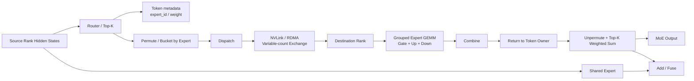
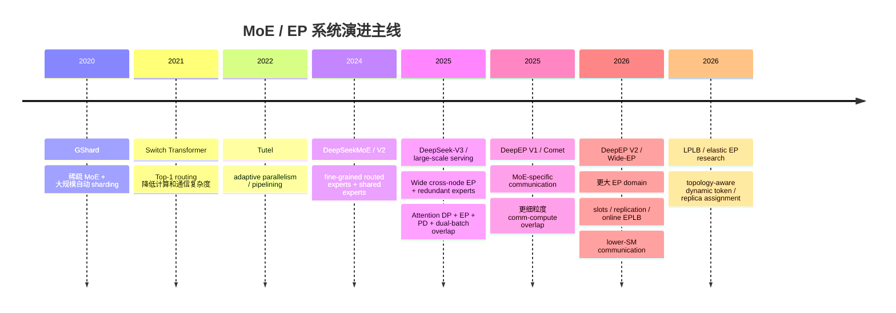
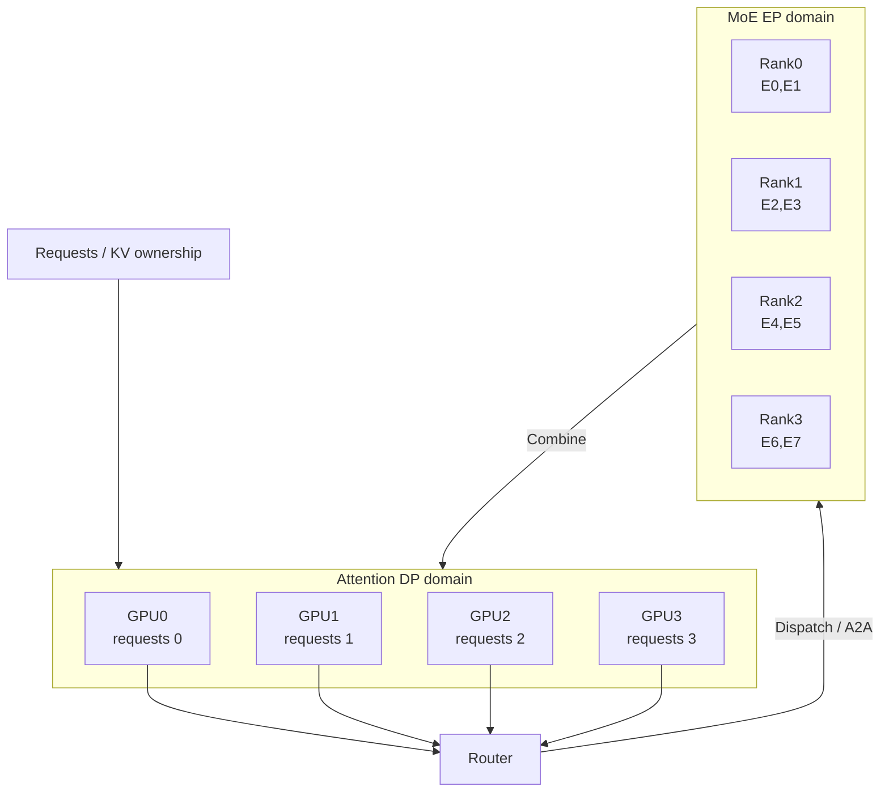
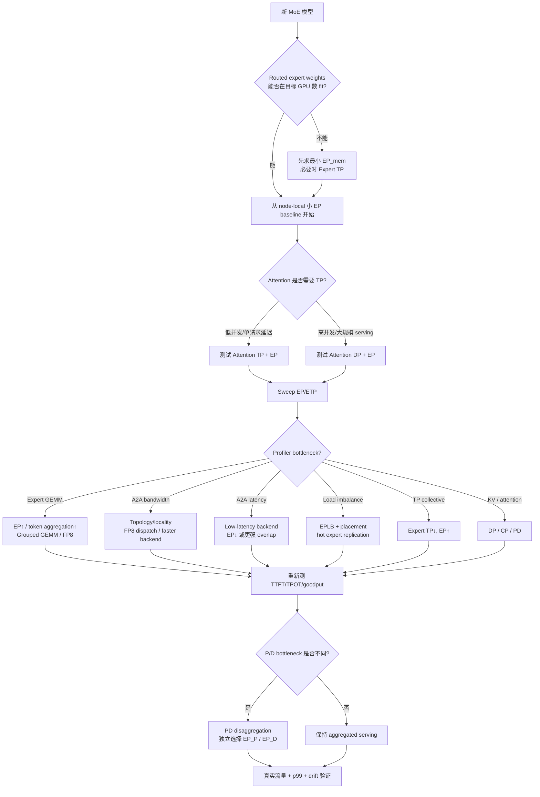

# LLM 推理与 Serving 场景下的 MoE Expert Parallelism 深度研究

[下载 PDF 版](/files/research/LLM推理与Serving场景下的MoE-Expert-Parallelism深度研究.pdf)

[下载 Word 版](/files/research/LLM推理与Serving场景下的MoE-Expert-Parallelism深度研究.docx)

## 执行摘要、研究边界与关键结论

本报告聚焦 **LLM inference / serving 场景中的 Mixture-of-Experts Expert Parallelism（EP）**，训练侧技术仅作为 EP 的来源、算法背景或实现参照。研究范围按照你上传的调研框架展开，覆盖 Router、Routed/Shared Expert、Dispatch/Combine、All-to-All、Grouped GEMM、EP Size、Expert Placement/Replication、EPLB、DeepEP，以及 EP 与 TP/DP/PP/CP/PD 的组合。fileciteturn0file0

资料状态截至 **2026 年 8 月 18 日**。一个需要首先纠正的“旧认知”是：**2025 年 DeepEP V1 的很多介绍已经不能原样套到今天的 DeepEP。** 当前 DeepEP V2 已进行了完整重构，把 throughput-oriented 和 low-latency EP 统一到 `ElasticBuffer`，将底层从 NVSHMEM 切换为 NCCL Gin，官方称支持扩展到 EP2048，并显著降低通信 kernel 的 SM 使用；同时，V2 明确注明旧版那种 **0-SM RDMA low-latency EP 已不再支持**。所以今天讨论“DeepEP vs NCCL”时，不能再把两者简单视为互斥方案：当前 DeepEP 本身就是一个建立在 NCCL Gin 之上的 **MoE 专用 dispatch/combine runtime**。citeturn16view0turn16view1

### 核心结论

**第一，EP 的本质不是“把模型切到更多 GPU”，而是把 MoE 的稀疏性从算法属性变成系统并行维度。** Expert 权重留在 owner rank；token 根据 Router 结果迁移到 Expert 所在 GPU。TP 是“权重切开、token 基本留下”；EP 则更接近“Expert 保持完整、token 移动”。TensorRT-LLM 对两者的定义也正是：TP 把每个 Expert 的矩阵切到多个 GPU，EP 则把完整 Expert 分配给 GPU，只让命中本地 Expert 的 token 被本 GPU 计算。citeturn18view0turn18view1

**第二，现代大规模 MoE serving 最关键的转变，是从“小范围 Expert sharding”走向了 `Attention DP + Wide EP + Expert Replication + 专用 A2A runtime`。** DeepSeek 公布的 V3/R1 在线系统就是最典型案例：Prefill 使用 Routed Expert **EP32**、MLA/Shared Expert **DP32**；Decode 反而使用更大的 Routed Expert **EP144**、MLA/Shared Expert **DP144**，两者都放置 32 个 redundant routed experts。citeturn15view0

这意味着一个常见经验——“Decode 延迟敏感，因此 EP 应该比 Prefill 小”——**并不普遍成立**。DeepSeek 的生产实践恰好相反。原因是 Wide EP 不只是切权重：当 Attention 是 DP、每个 rank 都提供不同 request/token 时，扩大 EP group 同时扩大了整个 Expert 池看到的 token pool，使每个 Expert 的有效 batch 变大；与此同时每张 GPU 只需读取更少 Expert 权重。DeepSeek 将这两点明确列为大规模跨节点 EP 提升吞吐和降低延迟的重要理由。citeturn15view0

**第三，EP Size 并不存在一个模型规模到 EP 的静态公式。** 其最优值是 memory、Expert GEMM、通信、网络拓扑、load balance、Attention 并行方式与请求并发共同决定的。特别要区分 **strong scaling** 与 **serving weak scaling**：

\[
\text{Strong scaling: }T_{\rm group}\text{ 固定}
\]

此时扩大 EP 主要降低每 rank 计算和 Expert 权重，但不会增加每 Expert 的平均 token 数：

\[
M_{\rm expert}\approx \frac{T_{\rm group}K}{E}.
\]

而在 Attention-DP + EP 的 serving 中，如果每个 rank 保持约 \(T_{\rm local}\) 个 token：

\[
T_{\rm group}\approx P T_{\rm local},
\qquad
M_{\rm expert}\approx \frac{P T_{\rm local}K}{E}.
\]

此时 **增加 EP 甚至可能把 Expert GEMM 从 small-M 推向更高效的 M**。这正是理解 DeepSeek Wide EP 的关键。citeturn15view0turn15view1

**第四，EP 的通信语义更像“variable-count sparse exchange”，但它不等于某个固定的 `AllToAllV()` API。** Router 命中的 Expert 数不同，每个 source→destination 的 token 数天然不同，因此逻辑上接近 All-to-All-V；但工程实现可以是 grouped P2P、AllGather/ReduceScatter、AllGather-V/ReduceScatter-V、one-sided NVLink、NVSHMEM、DeepEP、NIXL 或 MORI。最新 Megatron-Core inference 就同时提供 NCCL AllGather/ReduceScatter 与 NVLS AllGather-V/ReduceScatter-V dispatcher；vLLM 默认甚至仍提供基于 AllGather/ReduceScatter 的通用 EP backend。citeturn19view0turn16view3

**第五，Expert load balance 不能只看 Router 的 `tokens/expert`。** 系统真正等待的是最慢 GPU：

\[
T_{\rm layer}\simeq \max_r T_r,
\]

所以真正需要优化的是：

\[
\max_r(
T_{\rm dispatch,r}
+T_{\rm GEMM,r}
+T_{\rm combine,r}
).
\]

Expert token count 均匀，并不意味着 rank workload、NIC traffic 或 grouped-GEMM time 均匀。DeepSeek 的 EPLB 因而不仅做专家重排，还进行 **redundant expert replication + hierarchical/global placement**；最新实验性 LPLB 更进一步尝试用线性规划进行动态 replica/token assignment，但官方同时明确指出，其当前 cost model 只平衡 token count，尚不能准确表达 grouped GEMM 的非线性执行时间。citeturn14search2turn22search10

**第六，Shared Expert 不应该简单当成“另一个 routed expert”。** 在 DeepSeek 在线系统中，Routed Experts 做 EP，而 MLA/Shared Expert 做 DP；Megatron-Core 也明确规定 Shared Expert 遵循 dense/attention 的并行方式，并在 EP ranks 上复制，而不是跟 Routed Experts 一起被 EP partition。其计算还非常适合与 Routed Expert dispatch/combine 重叠。citeturn15view0turn14search0turn19view0

**第七，Prefill 与 Decode 需要分别优化。** Prefill 通常更接近大 GEMM + bandwidth-oriented communication；Decode 更容易受到 communication latency、launch overhead、small/irregular GEMM 与同步影响。DeepSeek 的公开 profile 使用 Prefill EP32/TP1、每 GPU 16K token，并以两个 microbatch 重叠 A2A；Decode profile 则使用 EP128/TP1、每 GPU 128 requests，同样使用双 microbatch，但其 A2A 在发出 RDMA 请求后会释放 GPU SM。需要注意：该公开 profile **人为模拟了完全均衡的 MoE routing**，因此不能用它评估真实生产流量下的 expert imbalance。citeturn15view1

### 未指定项与本文量化假设

用户没有指定具体硬件与模型，因此以下变量必须明确标为 **未指定**；本文之后的数值例子只用于建立计算方法，而不是声称某部署应该取得这些性能。

| 项目 | 用户给定状态 | 本文示例值 | 说明 |
|---|---:|---:|---|
| GPU 型号 | **未指定** | H800/H100-class 仅作概念参照 | 不直接使用理论峰值预测真实性能 |
| GPU/node | **未指定** | 8 | 便于讨论 node-local / cross-node EP |
| GPU 互联 | **未指定** | NVLink/NVSwitch | 实际拓扑必须通过 topology 验证 |
| 跨节点网络 | **未指定** | RDMA，假设有效 60 GB/s/rank | 纯建模假设，不代表任何特定 NIC |
| Expert 数 \(E\) | **未指定** | 256 | V3-like 示例 |
| Top-K \(K\) | **未指定** | 8 | 与 DeepEP 官方 V3-like benchmark 一致 |
| Hidden \(H\) | **未指定** | 7168 | 与 DeepEP benchmark 一致 |
| Expert intermediate \(I\) | **未指定** | 2048 | 本文量化假设 |
| Dispatch dtype | **未指定** | FP8，1 B/value | DeepSeek 在线系统采用 FP8 dispatch |
| Combine dtype | **未指定** | BF16，2 B/value | DeepSeek 在线系统采用 BF16 combine |
| Prefill \(T_{\rm local}\) | **未指定** | 8192 token/rank | 用于算例 |
| Decode \(T_{\rm local}\) | **未指定** | 128 token/rank | 用于算例 |
| Expert GEMM 有效算力 | **未指定** | 150–300 TFLOP/s | 是测量假设，不是 GPU peak spec |
| PP/CP | **未指定** | 1 | 单独讨论组合 |
| Shared Expert 数/宽度 | **未指定** | 1 × \(I=2048\) | 只用于示例 |

DeepEP 当前官方性能测试本身采用 **8K tokens、H=7168、Top-8、FP8 dispatch、BF16 combine**；V2 在其公开测试中报告 SM90/CX7 EP8×2 的 dispatch/combine logical bandwidth 分别约 90/81 GB/s，EP8×4 为约 61/61 GB/s，并特别提醒这些是 **logical bandwidth，包含 local-rank traffic**，不应直接等价为 NIC wire bandwidth。citeturn16view1


## EP 基础原理、数据流与技术演进

一次 Routed-MoE forward 可以抽象为：

\[
X
\rightarrow Router
\rightarrow TopK
\rightarrow Permute
\rightarrow Dispatch
\rightarrow Expert\ GEMM
\rightarrow Combine
\rightarrow Unpermute.
\]

Router 产生 token→expert assignment；dispatch 把 hidden state 的副本发给相应 Expert owner；Expert 完成 FFN；combine 再把 Top-K Expert 的结果送回原始 token owner，按 routing weight 聚合。MoE 的核心价值是 **参数容量随 \(E\) 大幅增加，但每 token 只计算 \(K\ll E\) 个 experts**。GShard 使用稀疏 top-2 MoE 将模型扩展到数百亿乃至数百-billion 以上的规模；Switch Transformer进一步强调 Top-1 routing 来降低 routing/communication complexity。citeturn21search4turn21academia48

DeepSeekMoE 后续进一步引入 **fine-grained expert segmentation 和 shared expert isolation**：把大 Expert 切成更多细粒度 Routed Experts，并隔离一部分 Shared Experts 来吸收 common knowledge，从而减少 Routed Experts 间的冗余。DeepSeek-V2/V3 又把这一结构扩大到更大模型，并在 V3 引入 auxiliary-loss-free load balancing。citeturn1academia50turn1academia48turn14search1

### Token 实际经过什么



这个图也解释了为什么 **EP 不可能仅优化一个 NCCL collective 就结束**。在 A2A 前后仍有 Top-K、token count、prefix/offset、permutation、layout conversion、buffer management、metadata、expert scheduling、grouped GEMM 和 inverse permutation。SGLang 当前甚至把 MoE forward 显式抽象成 `TopK → Dispatcher.dispatch → pre-permute → MoeRunner/grouped GEMM → post-permute → Dispatcher.combine`，从框架设计上把通信与计算 backend 解耦。citeturn17view0

### EP 与 TP、DP 的本质差异

假设 8 个 Expert、4 张 GPU：

```text
EP=4

GPU0: E0 E1
GPU1: E2 E3
GPU2: E4 E5
GPU3: E6 E7
```

GPU0 上某 token 路由到 E6：

```text
GPU0 token
    │
    ├── dispatch hidden state ──> GPU3:E6
    │
    <── combine expert output ───┘
```

而 Expert TP=4 的模型更像：

```text
Expert E6

W_E6[0] → GPU0
W_E6[1] → GPU1
W_E6[2] → GPU2
W_E6[3] → GPU3

same tokens → all TP ranks
              ↓
        collective/reduction
```

因此：

| 并行 | 主要切分维度 | 权重 | Token | 主要通信 |
|---|---|---|---|---|
| EP | Expert | 每 rank 若干完整 Expert | 根据 Router 移动 | Dispatch/Combine，A2A-like |
| Expert TP | Expert 内矩阵 | 每 Expert 被切开 | 多 rank 共同处理相同 Expert token | AllReduce/AllGather/RS |
| Attention TP | attention projection/head | dense 权重切开 | 通常多 rank 共享 request | Collective |
| DP | request/batch | 权重复制 | request 保持在 owner | 推理 attention 通常几乎无模型同步 |
| PP | layer | 不同 stage 持不同层 | activation 逐 stage 传递 | P2P |
| CP | context/sequence | 按上下文维切 | sequence/context 分片 | attention context communication |

TensorRT-LLM 当前直接支持 TP、EP 与 Hybrid ETP，并要求其 MoE tensor-parallel size 与 expert-parallel size 的乘积匹配对应的 overall parallel domain。citeturn18view0turn18view1

### 通信为什么天然是 variable-count

假设某 source rank 上：

```text
A → E5
B → E1
C → E5
D → E7
```

那么逻辑通信可能是：

```text
Rank0 → Rank0 : 1 token
Rank0 → Rank1 : 0
Rank0 → Rank2 : 2
Rank0 → Rank3 : 1
```

另一个 rank 的分布完全可能不同。因此 EP 的数据交换语义是：

\[
n_{s,r}\neq n_{s,r'},
\]

本质上是 **variable-count sparse exchange**。但“语义类似 All-to-All-V”不代表实现一定调用名为 AllToAllV 的 collective。最新 Megatron inference 的 default path 就是 NCCL AllGather/ReduceScatter；另一个 opt-in path 才是 Hopper+ NVLS AllGather-V/ReduceScatter-V。citeturn19view0

### 技术演进：每一代在解决什么



GShard、Switch、Tutel 分别把重点从 sparse conditional computation 推向简化 routing 和 adaptive parallel execution；Comet 则代表把优化粒度进一步下沉到 communication-computation fine-grained overlap。当前 TensorRT-LLM Wide-EP 与 DeepSeek EPLB 又把关注点推进到 **Expert replica、slot、placement 与在线 workload adaptation**。citeturn21search4turn21academia48turn20academia0turn20academia1turn18view2turn14search2


## 计算、通信性能模型与 EP Size 选择

### MoE FLOPs 模型

对 SwiGLU-like Expert：

\[
XW_{\rm gate},\qquad
XW_{\rm up},\qquad
(\operatorname{act}(XW_{\rm gate})\odot XW_{\rm up})W_{\rm down}.
\]

令 hidden size 为 \(H\)，Expert intermediate size 为 \(I\)，每次 matrix multiply 的 multiply-add 按 2 FLOPs 计算，则单 token、单 expert 近似：

\[
F_{\rm expert}
=
2HI+2HI+2IH
=
6HI.
\]

因此 Top-K Routed Expert：

\[
\boxed{
F_{\rm routed}
\approx 6TKHI
}
\]

Router projection 粗略为：

\[
F_{\rm router}\approx 2THE.
\]

若 Shared Expert 的总 intermediate width 为 \(I_s\)，并且所有 token 都执行：

\[
F_{\rm shared}\approx 6THI_s.
\]

故一个 MoE layer 的主要 FLOPs 可近似：

\[
\boxed{
F_{\rm MoE}
\approx
2THE+6TKHI+6THI_s
}
\]

忽略 activation、norm、permutation 等非 GEMM 操作。DeepSeekMoE 的 Shared/Routed Expert 设计与现代 MoE 系统中的 Grouped GEMM 正是这一计算模式的典型实现。citeturn1academia50turn14search8

### 数值示例：V3-like MoE

采用：

\[
E=256,\;K=8,\;H=7168,\;I=2048.
\]

单 token × 单 Routed Expert：

\[
6\times7168\times2048
=
88,080,384
\approx88.08\text{ MFLOPs}.
\]

Top-8 routed computation：

\[
8\times88.08
\approx704.64\text{ MFLOPs/token}.
\]

若再有一个等宽 Shared Expert：

\[
704.64+88.08
\approx792.72\text{ MFLOPs/token}.
\]

Router：

\[
2\times7168\times256
\approx3.67\text{ MFLOPs/token},
\]

所以 Router FLOPs 本身远小于 Expert GEMM；但 Router/top-k/permutation 的 **kernel latency 与数据依赖**仍然可能在 decode 中显著。Grouped GEMM、router fusion 与 permute fusion被 Megatron-Core单独列为 MoE 关键优化，也反映了这一点。citeturn14search8

### Expert 权重显存

一个 SwiGLU Expert 的主要参数约：

\[
N_{\rm expert}=3HI.
\]

示例中：

\[
3\times7168\times2048
=44.04\text{ M parameters}.
\]

FP8 粗略为：

\[
W_e\approx44.04\text{ MB/expert/layer}.
\]

256 Expert 整层约：

\[
11.27\text{ GB}.
\]

如果无 replication：

\[
W_{\rm routed/rank}\approx
\frac{E}{P}W_e.
\]

例如：

- EP8：约 **1.409 GB/rank/layer**；
- EP32：约 **352 MB/rank/layer**。

这只是 routed-expert matrix 的一阶估算，不包括 scale、alignment、buffer、dense parameters、KV cache、Shared Expert 和 runtime workspace。Expert replication 会重新增加这部分显存；vLLM 当前也明确提醒 EPLB 的 redundant experts 会与 KV cache 争夺显存。citeturn16view4turn16view5

### Dispatch / Combine 字节模型

定义 \(T\) 为整个 EP group 当前的 source token 数，dispatch dtype bytes 为 \(b_d\)，combine dtype bytes 为 \(b_c\)。

Top-K dispatch 的 logical payload：

\[
\boxed{
B_{\rm dispatch}
\approx TKHb_d
}
\]

combine：

\[
\boxed{
B_{\rm combine}
\approx TKHb_c
}
\]

总 payload：

\[
B_{\rm EP}\approx
TKH(b_d+b_c).
\]

如果 Expert 均匀放置，routing 与 rank 独立，约 \(1/P\) 的 assignment 会命中本地 Expert，因此跨 rank 量的一阶估算：

\[
B_{\rm offrank}
\approx
TKH(b_d+b_c)\left(1-\frac1P\right).
\]

实际还存在 expert id、routing weight、scale、offset/count 等 metadata，以及多 hop / topology forwarding；因此该式是 **logical payload lower-level model，而非 NIC wire-byte 精确值**。DeepEP 官方自己的 benchmark 也特别区分 logical bandwidth 与实际 local/RDMA traffic。citeturn16view1

### Prefill 算例

假设每 source rank：

\[
T_{\rm local}=8192,
\quad K=8,\quad H=7168.
\]

FP8 dispatch：

\[
8192\times8\times7168\times1
=
469.76\text{ MB/rank}.
\]

BF16 combine：

\[
8192\times8\times7168\times2
=
939.52\text{ MB/rank}.
\]

合计：

\[
1.409\text{ GB/rank/layer}.
\]

对应 routed Expert FLOPs：

\[
8192\times8\times6\times7168\times2048
=
5.772\text{ TFLOPs/rank/layer}
\]

——这里假定典型 weak-scaling 情形，即各 rank 都贡献约 8192 source tokens 且 routing 平衡。

假设测得 Expert grouped-GEMM 有效吞吐为 300 TFLOP/s：

\[
T_{\rm compute}
\approx\frac{5.772}{300}\text{s}
=
19.24\text{ ms}.
\]

若有效 EP payload bandwidth 仅 60 GB/s：

\[
T_{\rm comm,bandwidth}
\approx
\frac{1.409\text{ GB}}{60\text{ GB/s}}
=
23.49\text{ ms}.
\]

这是没有考虑 local traffic、latency、overlap 和 topology 的极简上界模型；其价值是告诉我们为什么大 batch MoE 仍可能是 communication-sensitive。当前 DeepEP V2 的 V3-like benchmark 使用同样的 H=7168、Top-8、8K token、FP8 dispatch、BF16 combine，说明这组 shape 具有实际系统意义。citeturn16view1

### Decode 算例

若每 rank 只有：

\[
T_{\rm local}=128,
\]

则：

\[
B_{\rm dispatch}=7.34\text{ MB},
\qquad
B_{\rm combine}=14.68\text{ MB},
\]

总计约：

\[
22.02\text{ MB/rank/layer}.
\]

同一 60 GB/s 假设下，纯 bandwidth floor 只有：

\[
0.367\text{ ms},
\]

但 decode 的实际通信时间不能只用 bytes/bandwidth 推导，因为这里的：

\[
T_{\rm comm}
\simeq
\alpha_{\rm peers}
+
\frac{B}{BW_{\rm eff}}
+
T_{\rm sync}
+
T_{\rm metadata}
+
T_{\rm scheduling}
\]

中，\(\alpha\)、同步与 kernel launch 的占比会明显升高。这也是为什么 SGLang/DeepEP 等 runtime 明确区分 normal/high-throughput 与 low-latency decode path。citeturn17view0turn16view1

### Roofline 风格分析

每一个 routed expert assignment 的 Expert FLOPs：

\[
6HI.
\]

若只考虑 dispatch+combine hidden payload：

\[
H(b_d+b_c).
\]

因此 compute / network-byte 比：

\[
\boxed{
R_{\rm C/N}
=
\frac{6HI}{H(b_d+b_c)}
=
\frac{6I}{b_d+b_c}
}
\]

示例 FP8 dispatch + BF16 combine：

\[
R_{\rm C/N}
=
\frac{6\times2048}{1+2}
=
4096\text{ FLOP/B}.
\]

假设测得：

\[
F_{\rm effective}=300\text{ TFLOP/s},
\qquad
BW_{\rm network}=60\text{ GB/s},
\]

系统 machine balance 为：

\[
R_{\rm machine}
=
\frac{300\times10^{12}}
{60\times10^9}
=
5000\text{ FLOP/B}.
\]

此时：

\[
4096<5000,
\]

在没有 overlap 的简化模型下会偏 **communication-bound**。

但如果 small/irregular grouped GEMM 只有：

\[
150\text{ TFLOP/s},
\]

则：

\[
R_{\rm machine}=2500\text{ FLOP/B},
\]

反而变成 compute-sensitive。

这解释了一个很重要的工程现象：

> **提高 FP8/FP4 Expert GEMM 性能以后，端到端速度可能几乎不再线性提升，因为系统会沿 Roofline 向 communication wall 移动。**

Megatron-Core 也明确指出 FP8 一方面提高 Tensor Core compute，另一方面可把 EP dispatch volume 相比 BF16 降低约一半；DeepSeek 在线系统则实际采用 FP8 matrix multiply/dispatch 与 BF16 MLA/combine，因此 combine 仍可能成为不可忽略的通信量。citeturn14search8turn15view0

### EP Size 应如何看

“Small EP / Large EP / Wide EP”没有统一的标准化数值边界，最好按 **topology domain** 理解，而不是死记 EP=8 就叫 small、EP=64 就叫 large。TensorRT-LLM 当前甚至把 Wide-EP 单独作为一种高级并行模式，并把 Expert replica、dynamic placement 与 EPLB 纳入其定义。citeturn18view0turn18view2

| EP Size 类型 | 典型形态 | 优势 | 主要风险 | 推荐前提 |
|---|---|---|---|---|
| EP1 | 无 Expert sharding | 无 A2A；最简单 | Expert 权重可能装不下；带宽集中 | 小 MoE / baseline |
| EP2–8 | 通常可限制在单 NVLink domain | 延迟低；调试容易 | 每 GPU Expert 多、权重流量大 | **优先 baseline** |
| EP8–32 | node-local 到少量跨节点 | 显存下降、Expert aggregate batch 增大 | 开始出现 RDMA/A2A | 高吞吐 Prefill 常见候选 |
| EP32–64 | Cross-node large EP | 更少 Expert/GPU；更大 token pool | topology/load balance 重要 | 需专用 A2A + overlap |
| EP64–256+ | Wide EP | 极低 Expert/GPU；可显著扩大 Expert batch | latency、replica、routing、NIC 成为一等问题 | Attention DP、EPLB、fast fabric |
| EP≫E | replica / ETP / slot 化 | 热 Expert 多副本，扩大系统 scale | 已不是简单 E/P sharding | Wide-EP / specialized runtime |

DeepSeek 的实际部署证明 EP32 Prefill 和 EP144 Decode 都可以合理，而当前 DeepEP V2 把库层面的支持域扩大到了 EP2048；**EP2048 是通信库能力，不等于 EP2048 是模型 serving 的推荐配置。**citeturn15view0turn16view0

一个特别容易忽略的量是 Expert GEMM 的 \(M\)：

\[
\boxed{
M_e
\approx
\frac{T_{\rm group}K}{E}
}
\]

如果 Attention DP 使每个 rank 都贡献 \(T_{\rm local}\)：

\[
M_e
\approx
\frac{P T_{\rm local} K}{E}.
\]

以 Decode：

\[
T_{\rm local}=128,\quad
E=256,\quad K=8
\]

为例：

| EP P | 全组 token | 平均 \(M_e\) |
|---:|---:|---:|
| 8 | 1,024 | 32 |
| 16 | 2,048 | 64 |
| 32 | 4,096 | 128 |
| 64 | 8,192 | 256 |
| 128 | 16,384 | 512 |
| 144 | 18,432 | 576 |

因此在这种 **weak-scaling serving geometry** 下，Wide EP 反而能缓解 small-M。DeepSeek 官方将“大规模 EP 扩大 batch，使每个 Expert 获得更充足 batch”明确列为设计动机。citeturn15view0

这也是为什么不能仅说：

> EP 越大 → 每 Expert token 越少。

在 fixed-global-batch strong scaling 中，每 Expert \(M\) 基本不由 P 决定；在 Attention-DP weak scaling 中，\(M\) 甚至随 P 增大。真正缩小的是 **每 rank 总 expert workload** 和 **experts/rank**。


## Expert Placement、Shared Expert、负载均衡与通信优化

### Placement 从静态切分走向 runtime mapping

最基本 placement：

```text
contiguous

GPU0: E0 E1 E2 E3
GPU1: E4 E5 E6 E7
...
```

对于 routing 无结构、专家热度完全一致的模型，这样已经足够；现实中 Expert 热度、group-limited routing、node topology 和请求 domain 都会破坏这一假设。DeepSeek EPLB 因此实现两套策略：适用于较小 Prefill EP 的 **hierarchical balancing** 会先把 expert group 分到节点，再在节点内复制/放置 Experts；更大 Decode EP 可使用 **global balancing**，不再受 expert group placement 的同样约束。citeturn14search2

| Placement | 方法 | 优点 | 缺点 | 更适合 |
|---|---|---|---|---|
| Contiguous/static | 连续 Expert IDs → rank | 简单、确定 | 不识别热点 | baseline |
| Round-robin/interleaved | Expert 轮询分 rank | 避免某些 ID clustering | 不利用 topology/load | 简单 MoE |
| Group/topology-aware | 同路由 group 尽量共 node | 减少 inter-node traffic | 受 routing 结构约束 | group-limited routing |
| Load-aware static | 根据历史 activation 重排 | runtime 成本低 | workload drift 后失效 | 稳定业务 |
| Hierarchical EPLB | node balance → replica → GPU packing | 同时考虑 topology 与 load | planner 更复杂 | Prefill / smaller EP |
| Global EPLB | 全局 replica + packing | Wide EP 自由度大 | inter-node traffic 可能更多 | Decode / wide EP |
| Slot-based | logical Expert→physical slot | replication/remap 更灵活 | runtime复杂 | TensorRT Wide-EP |
| Dynamic LP | 每批统计+replica+token assignment | 理论上适应变化最快 | solver/cost model 开销 | Experimental |

DeepSeek EPLB 的 hierarchical/global 策略以及 TensorRT-LLM Wide-EP 的 logical Expert→physical slot 映射都已经公开；LPLB 则仍由官方明确标为 **early research stage**。citeturn14search2turn18view2turn22search10

### Expert balance 与 Rank balance 必须分开

设 Expert e 的 token assignments 为 \(n_e\)：

\[
\mu_e=\frac1E\sum_e n_e,
\]

常用 Expert imbalance：

\[
I_e=\frac{\max_e n_e}{\mu_e},
\]

以及：

\[
CV_e=\frac{\sigma(n_e)}{\mu_e}.
\]

vLLM 当前 EPLB logging 使用的一个直接指标就是：

\[
B_e
=
\frac{\text{avg tokens/expert}}
{\text{max tokens/expert}},
\]

越接近 1 越均衡。citeturn16view4

但系统真正应测：

\[
n_r=\sum_{e\in\mathcal E(r)} n_{e,r},
\]

以及：

\[
I_r=
\frac{\max_r n_r}{\operatorname{mean}_r(n_r)}.
\]

进一步最好直接使用时间：

\[
B_{\rm time}
=
\frac{\operatorname{mean}_r T_{\rm expert,r}}
{\max_r T_{\rm expert,r}}.
\]

因为：

\[
n_e=100
\]

并不保证两个 Expert cost 一样：量化 padding、shape、replica mapping、kernel schedule、cache behavior 都可能不同。SGLang 的 EPLB 文档也将 mean/max computation time balancedness 与 throughput 联系起来，而 DeepSeek LPLB 官方明确承认“只用 token 数代替 grouped-GEMM time”是当前限制。citeturn17view0turn22search10

### Router Balance 不等于 Serving Balance

训练时 auxiliary loss、capacity factor、Top-K 或 DeepSeek-V3 的 auxiliary-loss-free strategy 可以改善逻辑 Expert 使用分布；但模型 Router 并不知道物理 GPU 是否跨节点、某 Expert 是否有 replica、某 NIC 是否拥塞，以及某 rank 是否正在执行更重的 Shared Expert/Attention workload。因此：

\[
\boxed{
Expert\ count\ balance
\neq
GPU\ compute\ balance
\neq
network\ balance
}
\]

DeepSeek-V3 的 auxiliary-loss-free routing 解决的是模型层面的负载均衡，而 DeepSeek EPLB 解决的是部署后基于 workload statistics 的 replica/placement；它们属于两层不同问题。citeturn14search1turn14search2

### Replication 为什么越来越重要

如果 Expert 17 特别热门：

```text
logical E17
      │
      ├── slot/rank 3
      ├── slot/rank 27
      └── slot/rank 49
```

runtime 可以把命中 E17 的 token 再二次分发到多个 physical replicas。对于 inference，这通常比 training 更容易，因为 Expert weights 是只读的，不需要每 step 同步 optimizer state/gradient；但仍需要付出 **显存、权重重分布、routing table consistency 和迁移干扰**。TensorRT-LLM Wide-EP 和 DeepSeek EPLB 都明确把 hot expert replication 作为 load-balancing 机制。citeturn18view2turn14search2

vLLM 当前已经把 redundant experts 暴露为 EPLB 配置，并给出了显存公式；其文档以 DeepSeek-V3 为例估算每 EP rank 每增加一个 redundant expert 约增加 **2.4 GB**，并建议大规模场景评估 32 个 redundant experts。这个数字是 vLLM 对其实现/模型的官方估算，不能直接套用其他模型。citeturn16view4turn16view5

### Shared Expert 应该如何并行

一个典型结构：

```text
                   ┌──── Routed Expert A ────┐
                   ├──── Routed Expert B ────┤
X ── Router ───────┤                         ├─> weighted sum
                   └──── Routed Expert K ────┘
│
└──────── Shared Expert ─────────────────────────> add
```

DeepSeekMoE 引入 Shared Expert 的目的之一，是让其捕获更公共的知识，从而让 Routed Experts 更专注于差异化 specialization；因此 Shared Expert 通常是 **所有 token 都执行，而不是 Top-K Router 的普通候选**。citeturn1academia50

Serving 中三个主要选项是：

| Shared Expert 策略 | 优势 | 问题 | 判断 |
|---|---|---|---|
| 每 EP rank replicate | 无额外 EP dispatch；最自然 | 占更多显存 | **首选**，只要放得下 |
| 跟 attention 一样 TP shard | Shared Expert 太大时节省显存 | 引入 TP collective | 大 Shared Expert |
| Dedicated ranks | compute isolation | 需要额外数据交换/同步 | 特殊 disaggregation 才考虑 |

Megatron-Core 当前明确规定 Shared Expert **follow dense/attention parallelism，不由 EP 分布，并复制到 EP ranks**；DeepSeek V3/R1 在线 serving 同样采用 Routed Expert EP32/144，而 MLA/Shared Expert 使用 DP32/144，每 GPU 有一份 Shared Expert。citeturn14search0turn15view0

更进一步，Shared Expert 很适合做 overlap：

```text
Routed path:  dispatch ─────── expert GEMM ───── combine
Shared path:       shared expert GEMM ────────────
                    <-------- overlap -------->
```

Megatron inference 的 NVLS dispatcher 已能在单独 stream 上启动 SharedExpertMLP，使其和 AGV dispatch、Expert GEMM、RSV combine 并发；SGLang 的 Single-Batch Overlap 也提供 dispatcher hooks，用于将 Shared Expert 与 DeepEP combine 等操作交叠。citeturn19view0turn17view0

### Grouped GEMM 与 small-M

经过 routing 后，各 Expert 的 shape 是不均匀的：

```text
E0: M=2
E1: M=43
E2: M=0
E3: M=17
```

逐 Expert 启动独立 kernel 会带来大量 launch overhead 和极差的 Tensor Core utilization；Grouped GEMM 把多个不同 \(M\) 的 expert GEMMs 编排进更少 kernel，从而提高 GPU 利用率。Megatron-Core 当前把 Grouped GEMM 明确列为 fine-grained MoE 的核心 compute optimization；SGLang 则提供 Triton、DeepGEMM、CUTLASS、FlashInfer 等多个 MoE runner backend。citeturn14search8turn17view0

因此 Decode 的“small-M 问题”准确地说并不是“Decode 永远 M 小”，而是：

> **低并发/小 EP pool 时，单 Expert 的 M 很小；Wide EP + Attention DP 可以通过汇聚更多 rank 的 token 把 M 重新做大。**

这比简单说“Decode MoE GEMM 一定很小”更符合目前大规模 serving 的实际架构。DeepSeek 对 Wide EP 扩大 per-expert batch 的解释与公开 EP128/EP144 decode 配置提供了直接证据。citeturn15view0turn15view1

### 通信后端比较

| Backend / 模式 | 数据交换方式 | 强项 | 主要限制/适用性 | 当前状态 |
|---|---|---|---|---|
| NCCL collectives/P2P | AG/RS、Send/Recv 等 | 通用、成熟 | 不理解 MoE routing/layout 本身 | 基础设施 |
| vLLM AG/RS | AllGather + ReduceScatter | 通用 EP+DP | 可能搬运更多非必要数据 | 默认通用 backend citeturn16view3 |
| DeepEP V2 | NCCL Gin + 专用 dispatch/combine | NVLink/RDMA、FP8、SM/QP tuning | 对硬件/软件有明确要求 | Production-oriented citeturn16view0turn16view1 |
| NVSHMEM/IBGDA | GPU-initiated one-sided | latency/control 灵活 | 编程/环境复杂 | V1 DeepEP/PPLX 等路径 citeturn19view3turn17view0 |
| Megatron NVLS AGV/RSV | variable-count NVLink collectives | 不等 token/rank、device-only metadata | Hopper+、NVLink、symmetric memory | Opt-in citeturn19view0 |
| FlashInfer EP | one-sided/NCCL/NIXL 等 | Blackwell/NVLink 等优化 | backend/hardware-specific | 快速演进 |
| NIXL-EP | NVLink/RDMA-oriented | elastic serving | 新生态 | SGLang 已集成 citeturn17view0 |
| MORI-EP | XGMI + RDMA dispatch/combine | AMD ROCm | AMD-specific | vLLM/SGLang 等已集成 citeturn22search0turn22search2 |
| TensorRT Wide-EP kernels | GB200/MNNVL 专用 | Wide EP、replica、one-sided A2A | NVIDIA topology-specific | Production-oriented citeturn18view2 |

特别要注意 DeepEP 的版本变化：**V1：NVSHMEM-oriented；V2：NCCL Gin-oriented。** V2 统一 high-throughput 和 low-latency API，并支持 analytical SM/QP count；官方同时报告 V3-like legacy workload 的 communication SM 从 24 降到 4–6，同时保持相当或更高性能。citeturn16view0turn16view1

### 通信与计算 overlap

理想串行：

\[
T_{\rm MoE}
=
T_{\rm route}
+
T_{\rm dispatch}
+
T_{\rm expert}
+
T_{\rm combine}.
\]

完全 overlap 的理想极限更接近：

\[
T_{\rm MoE}
\approx
T_{\rm route}
+
\max(T_{\rm communication},T_{\rm compute})
+
T_{\rm tail}.
\]

但“调用 asynchronous collective”并不自动等于 overlap。通信 kernel 如果占用大量 SM/HBM bandwidth，会直接拖慢 Expert GEMM；因此真正需要优化的是 **resource-level overlap**。DeepEP V2 把减少 communication SM occupation 作为核心目标；Comet 的研究同样表明，粗粒度 overlap 可能损害 compute efficiency，因此发展到了细粒度 dependency-aware scheduling。citeturn16view0turn20academia1

DeepSeek 生产系统采用 two-microbatch overlap：Prefill 让 microbatch A 的通信隐藏在 microbatch B 的计算后；Decode 因各阶段时长更不均衡，则将 attention 进一步切成步骤形成五阶段 pipeline。其公开 profile 也显示 Prefill EP32 与 Decode EP128 都采用两 microbatch。citeturn15view0turn15view1


## EP 与 TP、DP、PP、CP、Attention DP 和 PD 的组合，以及主流 Runtime 实现

现代 MoE serving 最重要的系统观念是：

> **Attention 与 MoE FFN 不应该被迫使用相同的并行方式。**

Transformer layer 可以是：



这类 **Attention DP + MoE EP** 让每个 attention rank 保留不同 request/KV cache，同时把这些 ranks 的 token 汇聚成一个大 Expert pool。TensorRT-LLM 当前明确支持 Attention DP：attention weights 复制，KV cache 因不同 requests 而自然 partition；DeepSeek 在线系统的 MLA/Shared DP32/144 + Routed Expert EP32/144 正是这一架构的生产实例。citeturn18view0turn15view0

### 并行组合比较

| 组合 | Expert 部分 | Attention 部分 | 优点 | 风险/代价 | 典型判断 |
|---|---|---|---|---|---|
| EP only | Experts 分 rank | dense 部分需另外处理 | Expert memory 高效 | dense 部分可能重复/不匹配 | 基础 |
| EP × Expert TP | Expert 先 EP，再内部 TP | 可独立 TP/DP | 超大 Expert 也可切 | A2A + TP collective 叠加 | 单 Expert 放不下时 |
| Attention TP + EP | Routed EP | attention TP | 单 request latency 可低 | 每 layer 多种 collective | 小 batch |
| **Attention DP + EP** | Routed Wide EP | request/KV DP | 汇聚大 Expert batch；少 attention collective | dense weights replicated | 大规模 MoE serving |
| DP × EP | 每 DP rank/token pool 参与 EP | DP requests | throughput 与 Expert batch 扩展 | global scheduling 更复杂 | 现代主流 |
| PP × EP | 每 PP stage 建 EP group | stage 切 layers | 模型容量继续扩大 | PP bubble × EP imbalance | 显存不足/多节点 |
| CP × EP | MoE EP | sequence/context partition | long context | layout 转换/通信叠加 | 长上下文 |
| PD + different EP | P/D 独立 Expert topology | P/D 独立 Attention | 分别优化 TTFT/TPOT | KV transfer 与双套容量 | 大规模 production |

TensorRT-LLM 当前正式支持 TP、PP、DP、EP、CP 和 Wide-EP，并支持 Hybrid ETP；TensorRT-LLM 的 disaggregated serving 还明确允许 Context/Prefill 与 Generation/Decode 使用不同 GPU pool 与不同 parallelism，然后进行 KV cache transfer/layout conversion。citeturn18view0turn18view3

### EP × TP：怎样取舍

TensorRT-LLM 给出的 Hybrid ETP 很容易理解：

```text
8 GPU domain

MoE TP8 × EP1
MoE TP4 × EP2
MoE TP2 × EP4
MoE TP1 × EP8
```

其中：

\[
P_{\rm moe}=P_{\rm ETP}\times P_{\rm EP}.
\]

如果单 Expert 放得下且 grouped GEMM shape 已足够好，**增大 EP、减小 Expert TP** 往往能避免 Expert 内高频 collective；但如果 Expert 本身很宽、权重装不下或单 Expert GEMM 需要更多 GPU 算力，则必须增加 Expert TP。最终不能只看 FLOPs，而应同时 benchmark A2A 和 TP collective。TensorRT-LLM 之所以显式提供 Hybrid ETP，就是因为不存在一个固定比例对所有 workload 最优。citeturn18view1

Megatron-Core 同样支持 EP 与 TP 组合，并在其通用并行指南中要求相应的 sequence-parallel 配置；其当前 MoE 文档还发展出 parallel folding 等思路，让 Attention 与 MoE 采用不同的 TP degree。citeturn14search4turn14search8

### EP × DP：为什么越来越重要

Dense inference 的 DP 一般意味着完整模型副本；现代 MoE 中则可以把 **dense/attention 部分的 request ownership** 和 **Routed Expert 的 EP group** 叠合起来：

```text
DP rank 0 token ─┐
DP rank 1 token ─┼─> Routed Expert EP pool
DP rank 2 token ─┤
DP rank 3 token ─┘
```

这意味着扩大 DP/EP domain 同时扩大 Expert 看到的聚合 batch；这正是 Wide EP 能在 Decode 中仍保持较高 Expert GEMM M 的核心系统机制之一。DeepSeek 官方明确指出，cross-node EP 本身“inherently requires Data Parallelism”并需要同时解决 DP load balancing。citeturn15view0

什么时候 **增加 DP 比继续增加 EP 更好**？通常是在 Routed Expert 已经能够 fit、A2A 已经接近 latency/network wall，而需求仍然是增加整体请求 throughput 时。反之，如果 Expert 权重仍然占用大量 HBM、单 GPU 要处理太多 Experts、或者 Expert batch 因 token pool 太小效率不佳，则继续扩大 EP/Attention-DP domain 仍可能有收益。这个判断最终必须以 fixed-SLO goodput benchmark 为准，而不是只看 peak tokens/s。

### PP / CP × EP

PP 把不同 Transformer layers 分 stage，因此每 stage 内可以建立自己的 EP group。问题是 MoE 的 straggler 会进一步传播为 pipeline bubble：

\[
T_{\rm PP\ stage}
\simeq
\max(
T_{\rm attention},
T_{\rm slowest\ EP\ rank}
).
\]

所以 PP stage partition 不应简单按“层数相等”切，而应考虑 MoE layer 的 measured cost。TensorRT-LLM 与 Megatron-Core 均支持 PP 和 EP；DeepEP V2 当前也提供 PP/CP primitives，但 **DeepEP 官方明确把其 PP/CP/Engram primitives 标成 experimental**，不能与成熟的 EP path 混为一谈。citeturn18view0turn16view1

CP 主要解决 long-context Attention；进入 MoE 后仍需要形成 Expert routing layout，因此可能发生：

```text
CP sequence layout
       ↓
local hidden tokens
       ↓
Router
       ↓
EP dispatch layout
       ↓
Expert Compute
       ↓
EP combine
       ↓
return to CP/attention layout
```

所以 CP×EP 的隐含成本之一是 **layout transformation 与不同 communicator/domain 的交互**。TensorRT-LLM 当前把 CP 与 EP 都作为独立可组合 parallelism；这类组合应在 long-context workload 上单独 profiling。citeturn18view0

### PD Disaggregation × EP

PD 分离最大的 EP 价值不是“把同一个方案拆成两个 pool”，而是终于可以：

\[
EP_{\rm prefill}\neq EP_{\rm decode},
\]

以及：

\[
backend_{\rm prefill}\neq backend_{\rm decode}.
\]

DeepSeek 的实际答案是：

\[
EP_{\rm P}=32,
\qquad
EP_{\rm D}=144.
\]

TensorRT-LLM 的 disaggregated serving 同样把“Context 和 Generation 使用不同 parallelism”列为核心价值之一。citeturn15view0turn18view3

因此 PD 下合理的设计可能是：

```text
Prefill pool
  larger GEMM
  bandwidth-oriented A2A
  topology-aware/hierarchical EPLB
  TTFT optimized

             KV transfer

Decode pool
  latency-sensitive
  wide EP if needed for expert memory/batch
  low-latency dispatcher
  global replication / EPLB
  TPOT optimized
```

SGLang 当前文档也明确建议 PD 模式下 Prefill 使用 DeepEP `normal`，Decode 使用 `low_latency`。citeturn17view0

### 主流 Runtime / Library 状态

下表中的 “Production-ready / Experimental / Model-specific” 是**本报告基于当前官方文档与公开实现作出的工程成熟度分类，不等同于厂商 SLA 或商业支持认证**。

| 系统 | 当前 EP 能力 | Load balance / replication | 通信/计算特色 | 成熟度判断 |
|---|---|---|---|---|
| **DeepEP V2** | 专用 dispatch/combine，EP up to 2048 library domain | 本身主要负责通信，配 EPLB | NCCL Gin、FP8、NVLink/RDMA、统一 HT/LL | **Production-ready-oriented**；PP/CP/Engram **Experimental** citeturn16view0turn16view1 |
| **vLLM** | `--enable-expert-parallel`；AG/RS、DeepEP、FlashInfer 等 | EPLB、async rebalance、redundant experts | high-throughput/low-latency backend；DBO | **Production-ready core / backend-specific** citeturn16view3turn16view4 |
| **SGLang** | 模块化 Dispatcher + MoeRunner | DeepSeek EPLB、replication | DeepEP/NIXL/Mooncake/MORI/PPLX/FlashInfer；TBO/SBO | **Production-ready core；部分组合 backend-specific** citeturn17view0 |
| **TensorRT-LLM** | TP/EP/ETP/Wide-EP | offline/online EPLB、slot、replication | custom EP kernels、MNNVL | **Production-ready-oriented，NVIDIA-specific** citeturn18view0turn18view2 |
| **Megatron-Core** | NCCL AG/RS、NVLS AGV/RSV、flex paths | shared expert support；training-oriented LB 丰富 | fused/grouped MoE、shared overlap | 核心 **Production-ready-oriented**；部分 Flex/DeepEP path **Experimental** citeturn19view0turn14search8 |
| **DeepSpeed-MoE** | EP + expert slicing + tensor slicing | 经典 MoE partition | communication scheduling / kernel injection | **Legacy production-capable**；不是当前 Wide-EP reference stack citeturn18view4 |
| **DeepSeek EPLB** | placement planner | hierarchical/global replication | workload-statistics driven | **Production-ready / deployed algorithm** citeturn14search2turn15view0 |
| **DeepSeek LPLB** | dynamic LP assignment | topology-aware replicas | runtime LP solver | **Experimental**，官方 early research stage citeturn22search10 |
| **AMD MORI-EP** | XGMI/RDMA dispatch/combine | 与 serving runtime 协同 | AMD GPU-oriented Wide EP | **Production-oriented / hardware-specific**；已进入 SGLang/vLLM 等生态 citeturn22search0turn22search2 |
| **NVIDIA Dynamo** | 不自己实现 Expert GEMM；编排 backend | 依赖 vLLM/SGLang/TRT-LLM | multinode、PD、routing/orchestration | **Production-ready orchestration；EP delegated** citeturn22search13turn22search15 |
| **LMDeploy** | 当前支持多种 MoE 模型 | 官方入口未呈现与前三者同等级 Wide-EP/EPLB reference path | TurboMind/PyTorch serving | **Model-specific / EP reference status 不充分** citeturn13search0 |

### vLLM 当前实现要点

vLLM 当前 EP 文档已经明确区分：

- `allgather_reducescatter`：通用 default；
- `deepep_high_throughput`：multi-node Prefill；
- `deepep_low_latency`：multi-node Decode；
- FlashInfer NVLink one-/two-sided 等硬件相关 backend。citeturn16view3

其 EPLB 则每 forward 收集 expert load statistics，按 `window_size` 与 `step_interval` 周期 rebalancing，并允许 asynchronous weight transfer communicator 和 redundant experts。当前默认 window 1000 step、rebalance interval 3000 step只是 vLLM 默认参数，实际生产应重新 benchmark。citeturn16view4

### SGLang 当前实现要点

SGLang 的当前架构尤其适合研究 EP，因为它把：

```text
communication:
  --moe-a2a-backend

compute:
  --moe-runner-backend
```

显式分离。通信 backend 当前包括 DeepEP、Mooncake、NIXL、MORI、FlashInfer、PPLX 等；compute backend 则包括 DeepGEMM、CUTLASS、Triton 与 FlashInfer 系列。它还明确区分 DeepEP normal/prefill 与 low-latency/decode，并支持 two-batch 与 single-batch overlap。citeturn17view0

一个需要关注的当前限制是：SGLang 文档指出多个专用 A2A backend 目前要求 `ep_size = tp_size`，hybrid EP+TP 的某些组合仍需走 `none` backend 的 AllReduce/AllGather path。因此“框架支持 EP×TP”与“所有专用 EP kernel 都支持任意 EP×TP geometry”是两件不同的事。citeturn17view0

### TensorRT-LLM 当前实现要点

TensorRT-LLM 的价值在于它已经把普通 EP 进一步抽象为 **Wide-EP**：

```text
Logical Expert
      ↓
Expert → Slot routing table
      ↓
multiple physical replicas
      ↓
dynamic placement / EPLB
```

Wide-EP 支持 offline/online load balancing、hot-expert replication 和 layer-wise weight redistribution，并针对 GB200 MNNVL 有专用 communication kernel。citeturn18view2

### Megatron-Core 与 DeepSpeed 的定位差异

Megatron-Core 仍然是最完整的 MoE primitive/reference stack 之一，当前 inference path 已经有专门的 `token_dispatcher_inference`，包含 NCCL fixed/padded AllGather 和 Hopper+ NVLS variable-count path，并可让 Shared Expert 和 dispatch/combine 并发。citeturn19view0

DeepSpeed-MoE 则是较早一代的 EP 系统路线：官方 inference tutorial仍围绕 `ep_size`、tensor slicing、expert slicing 和 kernel injection 展开，并指出当 GPU 数大于 Expert 数时可继续做 Expert slicing。它对理解 EP 历史很重要，但与当代 DeepEP/Wide-EP/EPLB/Attention-DP serving stack 的抽象已经有明显代际差异。citeturn18view4


## Benchmark、Profiler、可复现测量与部署决策树

真正的 EP benchmark 不应该问：

> “EP32 是多少 tokens/s？”

而应该问：

> **在相同模型、相同总 GPU、相同 workload distribution、相同 SLO 和相同网络条件下，EP8/16/32/64 分别把时间花在哪里？**

### 可复现 Benchmark Matrix

至少跑四组 workload：

| Workload | 目的 | 建议控制变量 |
|---|---|---|
| Prefill-heavy | bandwidth + large GEMM | 固定 input tokens、batch tokens |
| Low-concurrency Decode | latency/small-M | 固定 active sequences |
| High-concurrency Decode | Wide EP aggregation | sweep concurrency |
| Mixed serving | production relevance | 固定 arrival process 与 P/D ratio |
| Real-domain traces | Expert skew | code/math/chat/中文/英文 |
| Synthetic uniform router | 系统 upper bound | 强制均衡 routing |

不要把 random/synthetic routing 结果当生产性能。DeepSeek 自己公开的 profile 明确采用 **absolutely balanced simulated routing**，这正说明 profile 可以用于理解 overlap timeline，却不能替代真实 expert activation distribution 的评估。citeturn15view1

对于每个 workload 至少 sweep：

```text
EP = 1 / 2 / 4 / 8 / 16 / 32 / 64 / ...
TP = 1 / 2 / 4
DP = feasible values
replicas = 0 / small / tuned
A2A backend = generic / DeepEP / vendor backend
overlap = off / on
dtype = BF16 / FP8 / ...
```

其中不能 fit 的配置标为 OOM，而不是从结果集中消失，因为 **minimum feasible EP** 本身就是部署结果。

### 必须同时做 Strong Scaling 与 Serving Weak Scaling

**Strong scaling：**

\[
T_{\rm group}=\text{constant}.
\]

测：

\[
Speedup(P)
=
\frac{Throughput(P)}{Throughput(P_0)}
\]

和：

\[
Efficiency
=
\frac{Speedup(P)}{P/P_0}.
\]

它回答“更多 GPU 能否更快完成相同工作”。

**Serving weak scaling：**

\[
T_{\rm local}\approx\text{constant},
\quad
T_{\rm group}\propto P.
\]

它回答“扩大 Wide EP/Attention-DP group 后，每 GPU 是否仍维持甚至提高 goodput”，也是更接近 DeepSeek large-EP 思路的 benchmark。citeturn15view0

### 必须采集的指标

| 层面 | 指标 | 怎么解释 |
|---|---|---|
| Serving | TTFT p50/p95/p99 | Prefill/Scheduling |
| Serving | TPOT/ITL p50/p95/p99 | Decode critical path |
| Serving | E2E latency | 用户最终体验 |
| Serving | tokens/s、req/s | throughput |
| Serving | **goodput under SLO** | 比裸 tokens/s 更有部署价值 |
| GPU | SM Active | GPU 是否有空洞 |
| GPU | Tensor Active | GEMM/Tensor Core 是否充分 |
| GPU | DRAM/HBM activity | 是否 memory-bound |
| GPU | occupancy | kernel 并行度 |
| Expert | \(n_e\)、M distribution | Expert activation shape |
| Expert | max/mean、CV | Expert imbalance |
| Rank | expert tokens/rank | physical balance |
| Rank | compute time/rank | 真正 straggler |
| Communication | dispatch/combine bytes | 网络量 |
| Communication | dispatch/combine latency | EP critical path |
| Communication | NVLink TX/RX | node-local traffic |
| Communication | RDMA/NIC TX/RX | cross-node traffic |
| Kernel | Router/TopK time | routing cost |
| Kernel | permute/unpermute | data-layout cost |
| Kernel | grouped GEMM time | compute wall |
| Kernel | launch gaps | scheduling wall |
| Overlap | overlap ratio | comm 有多少真正被隐藏 |

DCGM 当前提供 SM activity、Tensor activity、DRAM activity 以及 NVLink TX/RX 等 profiling fields；Nsight Systems 可以同时 trace CUDA/NCCL timeline，而 Nsight Compute 可深入到类似 `sm__throughput...pct_of_peak` 的 kernel counters。citeturn8search0turn8search9turn8search13

### 推荐 profiler 执行方式

首先用 Nsight Systems 找“时间去哪了”，而不是一开始就对所有 kernels 跑 Nsight Compute：

```bash
nsys profile \
  -t cuda,nvtx,nccl \
  -o moe_ep_profile \
  <your_serving_or_benchmark_command>
```

NVIDIA 当前 Nsight Systems 能对 NCCL 通信进行 timeline tracing，并把 A2A 类路径的底层 grouped P2P/collectives 显示出来，因此很适合回答 dispatch、GEMM、combine 是否真的 overlap。citeturn8search9

然后对 Expert GEMM / dispatch / combine 做 Nsight Compute：

```bash
ncu \
  --set full \
  --kernel-name regex:"(moe|gemm|dispatch|combine|permute)" \
  <microbenchmark_command>
```

这里的目的不是生成一个“GPU utilization”总数字，而是判断：

\[
\text{Tensor Core utilization},
\quad
\text{SM utilization},
\quad
\text{memory throughput},
\quad
\text{occupancy}
\]

分别是否成为 wall。Nsight Compute 官方支持上述 SM throughput 等指标。citeturn8search13

集群长期采样则使用 DCGM exporter / DCGM profiling counters，特别记录各 GPU 的 SM、Tensor、DRAM 与 NVLink differences；**平均 GPU utilization 不够，应记录 max/min/std per rank**，否则 Expert straggler 会被集群平均值掩盖。citeturn8search0

### 每层建议加入的 EP telemetry

实际 runtime 最值得加入：

```text
layer_id
expert_id
physical_slot
replica_id
tokens_received
tokens_sent
expert_M
expert_gemm_us
dispatch_send_bytes
dispatch_recv_bytes
dispatch_us
combine_send_bytes
combine_recv_bytes
combine_us
rank_moe_us
```

每 N 个 serving steps 聚合：

\[
\mu,\;\sigma,\;\max,\;p95
\]

并保存：

```text
logical Expert → physical rank/slot
```

的映射。没有 placement history，就很难判断一次性能突变究竟来自 workload drift 还是 kernel/network regression。DeepSeek EPLB 和 TensorRT Wide-EP 都依赖历史/实时 workload statistics，因此这一 telemetry 是 runtime balancing 的基础。citeturn14search2turn18view2

### Profiler 瓶颈判定表

| 观察 | 判断 | 第一动作 | 第二动作 |
|---|---|---|---|
| GEMM 占 critical path，Tensor Core 高 | Compute-bound | 增 EP / FP8/FP4 / kernel tuning | 减 Expert TP，检查 grouped GEMM |
| GEMM 长但 Tensor Active 低 | small/irregular GEMM | 增 token pool / DP-EP aggregation | grouped/persistent GEMM |
| dispatch+combine 很长，NIC/NVLink 接近饱和 | Bandwidth-bound | FP8 dispatch / locality / hierarchy | 减 K 或 EP 跨节点度（若模型允许） |
| comm 长但 bandwidth 很低 | Latency/synchronization-bound | low-latency backend | 减 peers、CUDA Graph、persistent path |
| max rank ≫ median | Load imbalance | EPLB placement | redundant hot experts |
| expert counts 均衡但 rank time 不均衡 | Physical imbalance | 按 measured time 重新 cost model | topology-aware placement |
| dispatch 很大、Expert compute 很短 | EP 过宽或 compute 太快 | 缩 EP / 增 DP replica | overlap |
| Expert 权重 HBM traffic 高 | too many experts/GPU | 增 EP | quantize Expert weights |
| TP collectives 很高 | Expert TP 过大 | EP↑、ETP↓ | topology-local TP |
| PP idle/bubble 高 | PP imbalance | 重切 PP stages | 降 PP、增 EP/TP |
| KV pressure/OOM | attention/KV bottleneck | DP/PD/CP、KV优化 | 减 replicas |
| EPLB 权重迁移造成周期性 spike | rebalance too frequent | 拉长 window/interval | async/offline placement |

### 部署决策树



这个流程最重要的原则是：**先用 memory 决定 EP 的下界，再用 profiler 决定 EP 的上界。** 不应从 GPU 数反推 EP，也不应默认“GPU 有多少就 EP 多大”。DeepSeek、TensorRT Wide-EP 和 vLLM 当前 EPLB 的实现都说明，到了 Wide EP 以后，placement/replication/topology 已经与 EP Size 同等重要。citeturn15view0turn18view2turn16view4


## 工程问题逐条回答

| # | 问题 | 结论 |
|---:|---|---|
| 1 | **EP 的本质是什么？** | 沿 **Expert 维度**分布 MoE 权重，并把 token 根据 Router 移动到 Expert owner；它是“移动 activation 到权重”，不是把每个 Expert 矩阵都切开。citeturn18view1 |
| 2 | 为什么 MoE 推理需要 EP？ | 为了分散巨大的 Expert 参数/HBM 流量，并利用稀疏激活把 Expert 计算并行化；Wide EP 还可扩大整个 Expert pool 的 batch。citeturn15view0 |
| 3 | EP 与 TP 最大区别？ | EP 让不同 GPU 负责不同 Experts，并搬 token；TP 让多 GPU 共同计算同一 Expert 的矩阵切片并做 collective。citeturn18view1 |
| 4 | EP Size 如何选择？ | 先由显存求最小可行 P，再 sweep topology-aligned P，以 TTFT/TPOT/goodput、A2A、GEMM、load balance共同选择；不存在单一公式。Wide-EP 的 load balance/replication进一步说明 P 不能孤立选择。citeturn18view2 |
| 5 | 为什么 EP 不能无限扩大？ | peer/domain 扩大后通信 latency、跨节点 traffic、同步和 placement complexity 上升，每 rank useful compute 下降；最终收益被 A2A/latency 抵消。DeepEP 虽支持更大 domain，也没有声称 EP2048 总是最优。citeturn16view0 |
| 6 | Small EP / Large EP 是什么？ | 没有统一标准；工程上更合理按 node-local、cross-node、Wide-EP/topology domain 分类。TensorRT 已将 Wide-EP定义为含 replica/load balancing 的高级模式。citeturn18view0 |
| 7 | Expert 如何放置？ | baseline static；有 routing group 时 topology-aware；有热点时 workload-aware；Wide EP 应采用 EPLB/slot/replication。DeepSeek EPLB 提供 hierarchical 与 global 两类实际算法。citeturn14search2 |
| 8 | 为什么需要 Expert Replication？ | 单个热门 Expert 会把 owner rank 变成 straggler；多个只读 replica 可分摊 token。代价是显存和权重迁移。citeturn14search2turn18view2 |
| 9 | Shared Expert 如何并行？ | 默认跟 dense/attention path，通常 replicate across EP ranks；过大时再 TP shard。DeepSeek production 与 Megatron-Core 都采用这一逻辑。citeturn15view0turn14search0 |
| 10 | 为什么 All-to-All 是核心瓶颈？ | Top-K routing 把 hidden states 发送到不同 Expert ranks，再返回输出；每层都出现 dispatch+combine，并且参与 critical path。citeturn16view1turn20academia1 |
| 11 | 为什么实际更接近 All-to-All-V？ | 每个 source→destination 的 token count 不相等，所以语义是 variable-count；但物理实现可以是 A2AV、P2P、AG/RS、NVLS 等，不一定调用 literal AllToAllV。citeturn19view0turn16view3 |
| 12 | Prefill / Decode EP 为什么差异大？ | Prefill通常有大 token batch、较大 GEMM、偏 bandwidth；Decode 更敏感于 latency/launch/同步。但 Wide EP 可把 Decode 的全局 Expert M 做大。DeepSeek因此实际 Prefill EP32、Decode EP144。citeturn15view0 |
| 13 | Grouped GEMM 为什么重要？ | Routing 产生多个不同 M 的 Expert GEMM；Grouped GEMM 减 launch overhead 并提高 GPU utilization。citeturn14search8turn17view0 |
| 14 | Small-M 为什么是 Decode 难点？ | 低并发时每 Expert token 少，Tensor Core 难以饱和，launch/weight traffic 占比高；但 Attention-DP Wide EP 可聚合 token 缓解。citeturn15view0 |
| 15 | 如何衡量 Expert Load Balance？ | 至少测 tokens/expert 的 max/mean、CV，并同时测 tokens/rank、time/rank 和 max-rank critical time。vLLM 已提供 avg/max balancedness。citeturn16view4 |
| 16 | Router Balance 与 GPU Load Balance 区别？ | Router 只决定 logical Expert usage；GPU balance 还受 placement、replicas、topology、GEMM nonlinear cost 与网络影响。citeturn14search2turn22search10 |
| 17 | Runtime EPLB 如何实现？ | 收集 expert activation/load statistics → 估计热点 → replica/placement planner → 更新 expert mapping/weights。vLLM、SGLang、DeepSeek、TRT Wide-EP均已有实现路径。citeturn16view4turn17view0turn18view2 |
| 18 | DeepEP 相比普通 NCCL 优化在哪里？ | 它不是“另一个 generic collective”而是 MoE-specific dispatch/combine runtime：处理 layout、buffer、FP8、NVLink/RDMA、SM/QP 与 topology。当前 V2 **本身基于 NCCL Gin**。citeturn16view0 |
| 19 | 为什么需要 Low-Latency EP？ | Decode 的 message 较小，\(\alpha+\)launch+sync 可超过 bytes/BW，因此只追求 peak bandwidth 不够。SGLang 和 vLLM 都把 decode 对应到 low-latency backend。citeturn17view0turn16view3 |
| 20 | 通信与 Expert Compute 如何 overlap？ | microbatch pipeline、chunking、不同 streams、Shared Expert parallel path；但必须控制 SM/HBM contention。DeepSeek two-batch overlap、SGLang TBO/SBO、Megatron shared overlap都有实现。citeturn15view0turn17view0turn19view0 |
| 21 | 大 EP 为什么需要 Replication？ | P 很大时单个 hot Expert 的唯一 owner 很容易决定全组 latency；增加 physical slots 可以分流热点。citeturn18view2turn14search2 |
| 22 | EP×TP 如何选比例？ | Expert 能 fit 且 A2A 合理时倾向 EP↑/Expert-TP↓；Expert 太宽或显存不足才提高 Expert TP。必须同时测 A2A 与 TP collective。TRT-LLM原生支持 Hybrid ETP。citeturn18view1 |
| 23 | EP×DP 为什么越来越重要？ | DP ranks 提供独立 request/token，Wide EP 汇聚成更大的 Expert batch；同时 attention/KV ownership 不需要 TP collective。DeepSeek cross-node EP明确与 DP 耦合。citeturn15view0 |
| 24 | Attention DP + MoE EP 是什么？ | Attention 权重复制、不同 ranks 负责不同 requests/KV；MoE 时这些 token 再进入共同 Expert EP pool。DeepSeek与TRT-LLM均有直接支持/实践。citeturn15view0turn18view0 |
| 25 | PP / CP 如何和 EP 组合？ | PP 切 layer、每 stage 内再建 EP；CP 切 context，MoE 时转换为 EP routing layout。主要风险是 PP bubble、layout conversion和collective interference。TRT/Megatron均支持这些维度。citeturn18view0turn14search4 |
| 26 | FP8 为什么可能让通信更突出？ | GEMM 更快后 \(T_{\rm compute}\) 下降；若 combine/metadata/latency 没同步下降，communication fraction 上升。DeepSeek实际使用 FP8 dispatch/GEMM、BF16 combine。citeturn15view0turn14search8 |
| 27 | PD 下 P/D 应使用不同 EP 吗？ | **应该作为默认搜索空间，而不是强制相同。** DeepSeek实际为 EP32 vs EP144；TRT disaggregation允许不同 parallel strategy。citeturn15view0turn18view3 |
| 28 | Profiler 如何判断四类 bottleneck？ | GEMM critical + Tensor高→compute；A2A critical→communication；max rank≫median→imbalance；GPU大量 gap+小 kernels→launch/scheduling。用 Nsight Systems+Compute、DCGM和 Expert telemetry联合验证。citeturn8search0turn8search9turn8search13 |
| 29 | vLLM / SGLang / TRT-LLM 当前如何实现？ | vLLM：多 A2A backend + EPLB；SGLang：Dispatcher/MoeRunner 模块化 + TBO/SBO/EPLB；TRT：EP/ETP/Wide-EP + slot/online-offline EPLB。citeturn16view3turn16view4turn17view0turn18view2 |
| 30 | 新 MoE 模型如何设计 EP？ | 依次做：Expert memory model → node-local baseline → EP/ETP sweep → Attention TP/DP comparison → real routing profile → topology/comm profile → EPLB/replica → P/D 分开搜索 → fixed-SLO validation。该流程与当前 Wide-EP、DeepSeek deployment、vLLM/SGLang runtime 的实际控制面一致。citeturn15view0turn16view4turn17view0turn18view2 |


## 最终工程判断与参考来源优先级

从工程设计角度，**最不应该把 EP 理解成一个单独的 `ep_size` 参数**。一个更接近 2026 年生产系统的抽象是：

\[
\boxed{
\text{EP System}
=
\text{Routing}
+
\text{Placement}
+
\text{Replication}
+
\text{Dispatch/Combine}
+
\text{Grouped GEMM}
+
\text{Topology}
+
\text{Load Balancing}
+
\text{Scheduling/Overlap}
}
\]

然后再与：

\[
\boxed{
TP/DP/PP/CP/PD
}
\]

组成完整 device mesh。

因此，对于一个例如：

```text
256 routed experts
8 shared experts
Top-8
FP8
64 GPUs
8 GPU/node
NVLink + RDMA
```

的未知新模型，**不应直接回答“EP=64”或“EP=32”**。正确推导顺序应该是：

**先做权重容量模型。** 计算 routed expert weight/GPU 与 Shared/Dense/KV/cache/workspace 后，求最小可行 EP；如果单 Expert 仍过大，再引入 ETP/Expert TP。

**再确定 Attention geometry。** 对高并发 MoE serving，应认真把 `Attention DP + Routed EP` 放入搜索空间，而不是默认沿用 Dense LLM 的 Attention TP。DeepSeek production 与 TensorRT-LLM 当前设计都证明这是核心路线。citeturn15view0turn18view0

**然后测 Expert M distribution，而不是只看总 batch。**

\[
M_e
=
\text{actual tokens routed to expert e}.
\]

如果大量 Expert 长期 M 很小，则扩大 token aggregation domain、continuous batching 或 Wide EP 可能比继续优化 kernel 更有效。

**接着测通信。** 分开记录：

\[
T_{\rm dispatch},
\quad
T_{\rm combine},
\quad
B_{\rm NVLink},
\quad
B_{\rm RDMA},
\quad
\alpha_{\rm effective}.
\]

如果 bytes/BW 已经很小但通信时间仍高，就是 latency/synchronization，而不是 bandwidth。

**然后测 physical load balance。** 如果：

\[
\max_r T_r \gg \operatorname{median}_r T_r,
\]

先做 placement/EPLB/replication，而不是盲目再增加 GPU。DeepSeek EPLB、TensorRT Wide-EP 和 vLLM 当前 EPLB 都已经把这一步从“模型训练问题”提升成 serving runtime 问题。citeturn14search2turn18view2turn16view4

**最后再做 PD 分离搜索。** Prefill 与 Decode 的最佳 EP、通信 backend、batch strategy、replica strategy完全可能不同。DeepSeek 的 **EP32 Prefill / EP144 Decode** 是目前最有代表性的反例：它说明“Decode 应当使用更小 EP”不能当经验定律。citeturn15view0

### 一张最终 EP 技术地图

```text
                               Expert Parallelism
                                      │
          ┌───────────────────────────┼────────────────────────────┐
          │                           │                            │
       Routing                    Placement                    Compute
          │                           │                            │
     Top-K / Gate               Expert → Rank              Grouped GEMM
     Affinity                   Expert → Slot              Persistent GEMM
     Load-aware bias            Replication                FP8 / FP4
     Group-limited              Migration                  Small-M tuning
          │                           │                            │
          └─────────────┬─────────────┴────────────┬──────────────┘
                        │                          │
                  Communication                Runtime Balance
                        │                          │
                 Dispatch / Combine              EPLB
                 All-to-All-like                 Hot Expert
                 AG/RS / AGV/RSV                 Online statistics
                 DeepEP / NIXL                   Dynamic remap
                 MORI / NVSHMEM                  Redundant experts
                        │
                   Scheduling
                        │
             Prefill / Decode / DBO
             Shared Expert Overlap
             Comm-Compute Overlap
                        │
                 Parallel Device Mesh
                        │
           TP × DP × EP × PP × CP × PD
```

### 推荐研究与复现的来源优先级

**最高优先级：实际生产架构与开源 runtime。** DeepSeek 的 V3/R1 inference system overview 是理解 EP32/EP144、Attention/Shared DP、redundant experts、dual-batch overlap 和生产 load balancing 最重要的一手材料；`profile-data` 则能直接下载并观察 Prefill/Decode timeline。citeturn15view0turn15view1

**通信层优先看当前 DeepEP V2，而不是旧 V1 二手文章。** V2 已切换为 NCCL Gin、统一 high-throughput/low-latency API、支持更宽 EP domain，并修改了 SM-resource 设计；基于 V1“NVSHMEM + 0-SM decode”的结论已经部分过期。citeturn16view0turn16view1

**负载均衡优先看 DeepSeek EPLB 与 LPLB。** EPLB 提供已部署的 hierarchical/global replica-placement 算法；LPLB 则代表 2026 年向 per-batch dynamic optimization 前进的实验路线，同时其官方 limitations 非常值得作为 cost-model 设计参考。citeturn14search2turn22search10

**Serving runtime 优先看 vLLM、SGLang 与 TensorRT-LLM 当前文档/源码。** 三者分别代表多 backend EP + EPLB、模块化 Dispatcher/MoeRunner + overlap、以及 Wide-EP/slot/online EPLB 的不同工程路线。citeturn16view3turn16view4turn17view0turn18view2

**底层 primitive/reference implementation 看 Megatron-Core。** 最新 inference dispatcher 已非常清楚地展示 fixed-count NCCL AG/RS 与 variable-count NVLS AGV/RSV 的不同设计，并包含 Shared Expert overlap；它也很好地说明了为什么“EP = NCCL AllToAll”是过度简化。citeturn19view0

**AMD 平台看 MORI-EP。** 当前 MORI 已提供 XGMI/RDMA MoE dispatch/combine，并进入 SGLang/vLLM 等生态；因此 2026 年的 EP 调研已经不能只讨论 CUDA/NVLink/NCCL。citeturn22search0turn22search2

**历史论文按问题演进阅读。** GShard 解决 sparse MoE 大规模 sharding；Switch 简化 routing；Tutel研究 adaptive parallelism；Comet深入 fine-grained communication-computation overlap。它们更适合解释“EP 为什么演进成今天这样”，而不是直接拿旧 benchmark 预测当前 serving 性能。citeturn21search4turn21academia48turn20academia0turn20academia1

最终可以把整个 EP 部署问题归结为一个优化目标：

\[
\boxed{
\min_{\substack{
P_{\rm EP},P_{\rm TP},P_{\rm DP},P_{\rm PP},P_{\rm CP}\\
placement,\ replicas,\ backend,\ scheduling}}
\;
\max(
T_{\rm TTFT},
T_{\rm TPOT},
T_{\rm slowest\ rank}
)
}
\]

subject to：

\[
\boxed{
Memory\le M_{\rm GPU},
\qquad
Goodput\ge G_{\rm target},
\qquad
p99\ Latency\le SLO,
\qquad
Network\le BW_{\rm fabric}.
}
\]

也就是说，**EP Size 不是最终问题；“在给定模型稀疏结构、Expert 热度、request distribution 和网络拓扑下，如何让最慢的 Expert rank 不再决定整个 serving step”才是 EP 优化真正的核心。** DeepSeek 的 Wide EP + redundant experts、TensorRT-LLM 的 Expert-slot abstraction、vLLM/SGLang 的 runtime EPLB，以及 DeepEP V2 对 communication resource consumption 的持续优化，基本都可以从这一目标函数统一理解。citeturn15view0turn18view2turn16view4turn17view0turn16view0
