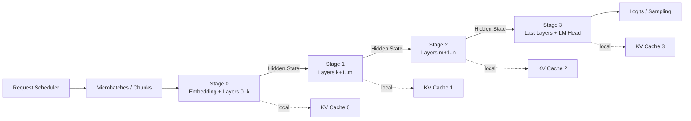

# LLM 推理场景下 Pipeline Parallelism 深度研究：性能模型、Bubble、调度优化与混合并行

[下载 PDF 版](/files/research/LLM推理场景下Pipeline-Parallelism深度研究.pdf)

[下载 Word 版](/files/research/LLM推理场景下Pipeline-Parallelism深度研究.docx)

> **研究日期：2026-08-14；重点：LLM inference / online serving。**  
> 本报告按你给出的研究范围，将训练 Pipeline Parallelism 主要作为技术源流与调度思想来源，核心集中在 **Prefill / Decode、continuous batching、bubble、stage balancing、通信、KV Cache，以及 PP × TP × DP × EP / PD disaggregation 的推理工程问题**。fileciteturn0file0

## Executive Summary

Pipeline Parallelism（PP）最重要的心智模型不是“把模型拆到多张卡上”，而是：

> **PP 用模型深度方向的切分换取更低频率、更局部的跨设备通信，但代价是引入生产者—消费者流水线依赖；LLM 在线推理的核心难题因此从 TP 的 collective communication，转变成“如何持续给每个 stage 找到大小合适、彼此均衡、依赖已满足的工作”。**

Tensor Parallelism（TP）把同一个层内部的矩阵/Attention 拆开，GPU 在同一 token step 中同步协作；PP 则把不同层放在不同 GPU/设备组上，microbatch 的 hidden state 在 stage 之间顺序传递。因此 PP 通常通信频率更低，特别适合模型跨节点、节点间带宽显著弱于节点内互联的情形。NVIDIA TensorRT-LLM 的当前工程建议仍是：模型若跨节点，优先考虑 **TP 留在高带宽节点内部、PP 跨节点**；其示例也是两节点部署时将 TP 放在节点内、PP 放在节点间。citeturn18view0turn20view0turn20view1

但这并不意味着“PP 越大越好”。对于一个理想的、等速的 \(P\)-stage forward-only 流水线和 \(M\) 个相同 microbatch，

\[
T_{\text{pipe}}=(M+P-1)t
\]

\[
U=\frac{M}{M+P-1},\qquad
B=\frac{P-1}{M+P-1}
\]

其中 \(U\) 是平均流水线利用率，\(B\) 是 fill/drain 导致的结构性 bubble fraction。由此可以得到一个非常实用的经验条件：

\[
U\ge 90\%
\Rightarrow
M\ge 9(P-1)
\]

即 PP=2 约需至少 9 个稳定并行工作单元，PP=4 需约 27 个，PP=8 需约 63 个，才能仅从理想 fill/drain 角度达到 90% 利用率。这个结论也解释了为什么 PP 对**高并发 serving**和大 microbatch 比对单请求 latency 更友好。Megatron 的经典分析同样指出 microbatch 数相对 pipeline depth 越大，flush/bubble 越小，但 microbatch 太小又会损害 GEMM 效率，因此最优值必须 profile，而不是机械增大 \(M\)。citeturn22view1

LLM inference 又比经典训练 PP 更难：在线请求的 prompt length、output length、到达时间、存活时间都在变化。OSDI 2026 的《Revisiting Pipeline Parallelism for LLM Serving》明确把这种在线不均衡拆成 **Prefill-Prefill、Prefill-Decode、Decode-Decode** 三种核心形态；其 Qwen2.5-32B/A100 实验中，2048-token 和 128-token prefill 串联即可造成约 627 ms 的 pipeline bubble。作者进一步表明：固定 chunk size 不是最终答案，需要基于 SLO slack 动态改变 prefill chunk，并对 decode microbatch 重新平衡。citeturn18view2turn18view3

因此，**推理 PP 的真正核心优化对象不是传统的“pipeline schedule”本身，而是 stage service time 的方差**：

\[
s_{i,m}=t_{i,m}+e_{i,m}
\]

这里 \(t_{i,m}\) 是第 \(m\) 个工作单元在 stage \(i\) 的实际计算时间，\(e_{i,m}\) 是无法被计算掩盖的通信时间。只要不同 \(m\) 的 \(s_{i,m}\) 剧烈波动，即使模型层数平均切分，pipeline 仍然会出现大量等待。

Prefill 与 Decode 尤其不能用同一套 PP 直觉分析。Prefill 一次处理大量 token，通常有较大的矩阵计算和较好的算术强度；它的主要问题是**不同 prompt/chunk 的计算量差异**。Decode 每个 request 每轮通常只产生一个 token，同一个 request 的 token \(n+1\) 又依赖 token \(n\) 在最后一个 stage 产生 logits 并完成 sampling；因此**单请求本身没有足够的 token-level pipeline parallelism**。Decode 要填满 PP，主要依靠不同 request / microbatch 的并发，或者进一步改变依赖关系的 speculative execution。OSDI 2026 的 PP 工作正是通过动态 chunked prefill 和 decode microbatch rebalancing 解决这两个阶段的不同问题。citeturn18view1turn18view2

Sarathi-Serve 是 inference-specific PP 调度演进中的另一个关键节点：它用 chunked prefill 把巨大的 prefill 切成更均匀的工作块，并构造 stall-free / decode-maximal batch，从而减少 Prefill 对已有 Decode 的阻塞；OSDI 2024 报告其在 Falcon-180B + PP 场景下最高实现 5.6× end-to-end serving capacity 提升。这里的重要思想不是这个具体倍数，而是**把“请求”重新切成 scheduler 可操控的均匀计算块**。citeturn23view1

另一方面，Prefill/Decode Disaggregation（PD 分离）把问题进一步拆开。DistServe 将 prefill 与 decode 放到不同 GPU 池，让两个阶段拥有独立的资源和并行计划，并报告最高 7.4× 可服务请求率或 12.6× 更严格 SLO。对 PP 而言，这意味着未来优化目标很可能不是“找一个统一 PP degree”，而是：

\[
(PP_P,TP_P,DP_P)
\neq
(PP_D,TP_D,DP_D)
\]

分别为 prefill pool 和 decode pool 求最优并行拓扑。citeturn23view2

最后必须强调：**训练领域的 Zero-Bubble、Interleaved 1F1B、DualPipe 不能直接等价迁移到 inference。** Zero-Bubble Pipeline Parallelism 利用的是 forward、input-gradient backward、weight-gradient backward 等任务之间的重新排序；DualPipe 更进一步利用双向 forward/backward 与通信 overlap。forward-only autoregressive inference 没有这些 backward work 可以拿来填空。训练技术能迁移的是“切小任务、增加独立 ready work、隐藏通信、平衡 critical stage”的思想，而不是调度本身。citeturn19view10turn23view6

一个工程上非常有用的最终结论是：

| 场景 | PP 判断 |
|---|---|
| 单节点、模型能放下、高带宽 NVLink/NVSwitch | 通常先 TP，PP 不应默认开启 |
| 模型单 GPU 放不下但单节点可容纳 | 比较 TP 与低 degree PP，实测 TTFT/TPOT |
| 模型跨普通多节点网络 | **TP intra-node + PP inter-node 是优先起点** |
| 单请求、极低 latency | 尽量降低 PP，因为自回归依赖无法被单请求填满 |
| 高并发 online serving | PP 更有机会达到 steady state；需 continuous batching / dynamic microbatching |
| 长 prompt / Prefill-heavy | PP + chunked prefill，重点优化 chunk size 与 TTFT |
| Decode-heavy | 重点优化 request-level microbatch balance，不只是 chunking |
| 大型 MoE | PP 需和 EP 一起优化；stage time 应看 expert routing 后的 p95/p99，而非层数 |
| PD disaggregation | Prefill / Decode 应分别搜索 PP/TP/DP degree |
| 节点间网络较弱 | PP 通常比跨节点大 TP 更有吸引力，因为跨节点通信事件更少 |

这些判断与 TensorRT-LLM 当前的 topology recommendation、Megatron 的 TP/PP 通信分析以及 OSDI 2026 inference PP 研究结论一致。citeturn20view1turn22view1turn18view0

## PP 的执行模型、通信模型与内存模型

**一句话定义：**

\[
\boxed{\text{PP = 按模型深度切层，并让不同 microbatch 在这些 layer partitions 上流水执行}}
\]

TensorRT-LLM 当前官方定义同样把 PP 描述为“不同 GPU 持有不同层，activations 在 GPU 之间传递”；与之相对，TP 是同一层权重/运算被多个 GPU 分割。citeturn19view0turn20view2

考虑一个 8-layer Transformer：

```text
Input
  │
  ▼
L0 → L1 → L2 → L3 → L4 → L5 → L6 → L7 → LM Head
```

PP=4 时，一个简单 contiguous partition 是：

```text
Stage 0 / GPU0 : Embedding + L0 + L1
Stage 1 / GPU1 :             L2 + L3
Stage 2 / GPU2 :             L4 + L5
Stage 3 / GPU3 :             L6 + L7 + LM Head
```

SGLang 当前 generic Transformer PP 实现就采用这种模式：模型提供 `pp_plan`，然后通过 `get_pp_indices()` 计算本 PP rank 应保留的 layer interval；其他层会被替换为 placeholder。其当前 generic 实现还明确要求可识别一个 `ModuleList`，多个 `ModuleList` block 的 generic PP 路径尚不支持，这说明“模型支持 PP”不仅是 runtime 问题，还依赖模型结构是否能被可靠切开。citeturn21search3

对于三个 microbatch，forward-only execution 是：

```text
Time  ───────────────────────────────────────────────►

Stage0   M0     M1     M2
Stage1          M0     M1     M2
Stage2                 M0     M1     M2
Stage3                        M0     M1     M2

         <----- fill ----->        <---- drain ---->
```

第一批工作必须先经过 Stage 0 才能唤醒 Stage 1；同理，最后的工作离开 Stage 0 后，Stage 0 又会提前空闲。这就是 fill/drain bubble。

更一般的数据流可表示为：



**权重分布。** 若模型总权重字节数为 \(W\)，stage \(i\) 的层集合为 \(S_i\)，则：

\[
W_i=\sum_{\ell\in S_i}W_\ell
\]

若层完全均匀，则近似：

\[
W_i\approx \frac{W}{P}
\]

若 stage 内再做 TP=\(T\)，大部分可 TP-shard 的参数每 GPU 近似变为：

\[
W_{\text{GPU}}
\approx
\frac{W}{P\cdot T}
\]

但 embedding、LM head、某些 GQA/MQA/MLA 参数、shared experts 等未必严格按 \(1/(PT)\) 缩放，因此生产环境应直接统计 checkpoint shard，而不是只用参数量除并行度。TensorRT-LLM 当前文档也明确指出 GQA/MQA/MLA 等情况下，某些 KV cache 甚至可能在 TP ranks 间复制。citeturn20view2

**Activation 传递。** 对 hidden state

\[
X\in\mathbb{R}^{B_\mu\times S\times H}
\]

若 datatype 每元素占 \(d\) bytes，一次 PP boundary 的逻辑 activation payload 近似：

\[
A_{\text{prefill}}
=
B_\mu S H d
\]

对于 decode，每个 request 通常只新计算一个 token，因此：

\[
A_{\text{decode}}
\approx
B_\mu H d
\]

这正是 PP 通信与 TP 通信模式的关键差异：PP 主要在 **stage boundary** 上发送 activation；TP 则在 Transformer layer 内部反复 collective。Megatron 的经典 tensor-parallel Transformer 路径每层 forward 会涉及多个 collective，而其 PP 路径本质上是相邻 stage 间 activation P2P；Megatron Bridge 的当前文档也把 PP communication 明确定义为相邻 PP GPU 的 P2P activation send/recv。citeturn22view1turn19view9

**一个数量级例子。** 假设：

\[
B_\mu=8,\quad
S=2048,\quad
H=8192,\quad
d=2\text{ bytes}
\]

则一次 prefill stage boundary：

\[
A
=
8\times2048\times8192\times2
=
268{,}435{,}456\text{ bytes}
=
256\text{ MiB}
\]

假设跨节点有效 payload bandwidth 为 40 GB/s，则纯数据时间约：

\[
c\simeq \frac{0.2684}{40}
=6.71\text{ ms}
\]

而 decode 若 \(B_\mu=128\)：

\[
A_D
=
128\times8192\times2
=
2\text{ MiB}
\]

同一 40 GB/s 链路纯 payload 时间仅约：

\[
0.052\text{ ms}
\]

这些是**分析假设，不是 H100 实测 benchmark**；真实值还包括 NCCL/P2P latency、protocol、rank mapping、是否 shard activation、network contention 和 overlap。

这也说明一个容易误解的点：**Decode 的 PP 问题往往不是 boundary payload 太大，而是自回归依赖和 workload balance；Prefill 则更容易同时遇到 activation volume 与计算时长波动。**

**KV Cache 如何分布。** Prefill 的职责之一是生成后续 decode 所需 KV cache；decode 每轮复用已有 KV，只为新 token 增加 KV。OSDI 2026 的 inference PP 论文就是按这一 prefill/decode 模型展开其分析。citeturn18view1

对于标准 MHA/GQA，若每层有 \(n_{kv}\) 个 KV heads、每 head dimension 为 \(h_d\)，KV datatype 为 \(d_{kv}\)，一个 token 一层的 KV 字节数近似：

\[
K_{\text{token,layer}}
=
2n_{kv}h_d d_{kv}
\]

前面的 2 来自 Key + Value。于是 stage \(i\) 保存 \(N_i\) 层时：

\[
KV_i
\approx
B_{\text{active}}
L_{\text{context}}
N_i
\cdot
2n_{kv}h_d d_{kv}
\]

因此 PP 对 KV Cache 有一个非常重要的容量优势：

> **KV cache 天然随 layer ownership 分布——一个 PP stage 只需保留自己负责层的 KV。**

在均匀 layer partition 下，单 stage KV 约为全模型 KV 的 \(1/P\)。然而 PP 再和 TP/CP/DCP 混用后，KV 是否继续 TP-shard、复制还是沿 context dimension 切分取决于模型和引擎；例如 TensorRT-LLM 明确记录了特定 GQA/MQA/MLA 场景会产生 KV replication，而 vLLM 当前也已暴露独立 decode-context-parallel / prefill-context-parallel 参数，因此不能再把 KV 简单理解为 \(1/(PP\times TP)\)。citeturn20view2turn19view7

所以一个更现实的单 GPU inference memory budget 应写成：

\[
M_i=
W_i+
KV_i+
A_i^{\text{buffers}}+
M_i^{\text{workspace}}+
M_i^{\text{CUDA Graph}}
+\epsilon
\]

其中 forward-only inference 虽不需要训练那样长时间保存 backward activations，但**为了让 PP 里有多个 concurrent batch 在飞，仍然需要 pipeline buffers**。例如 vLLM 当前 main 明确把 max concurrent batches 与 PP size 关联；DeepSpeed 的 inference pipeline schedule 则显式规定 inference 只需两个 pipeline buffers。citeturn19view5turn20view5

## 性能数学模型与 Bubble 的可计算分解

要真正优化 PP，最重要的是从“画时间线”升级到**能从 profiler 数据计算 makespan、critical stage 和 bubble attribution**。

定义：

\[
P=\text{pipeline stages}
\]

\[
M=\text{microbatches / concurrent pipeline work units}
\]

\[
t_{i,m}
=
\text{microbatch }m
\text{ 在 stage }i\text{ 的计算时间}
\]

\[
c_{i,m}
=
\text{stage }i\rightarrow i+1
\text{ 的通信时间}
\]

对于最一般的 forward-only pipeline，可以直接用 recurrence 计算 completion time：

\[
C_{i,m}
=
\max
\left(
C_{i-1,m}+c_{i-1,m},
C_{i,m-1}
\right)
+
t_{i,m}
\]

其中第一项代表“输入还没从上游来”，第二项代表“本 stage 还没处理完上一个 microbatch”。

最终：

\[
\boxed{
T_{\text{makespan}}=C_{P,M}
}
\]

这实际上就是 inference PP 最有用的离散事件模型：把 profiler 得到的 \(t_{i,m}\) 和 \(c_{i,m}\) 填进去，就能重放真实 timeline。

**理想等 stage 情况。** 当：

\[
t_{i,m}=t,\qquad c_{i,m}=0
\]

则：

\[
T=(M+P-1)t
\]

单 microbatch latency：

\[
L_\mu=Pt
\]

steady-state initiation interval：

\[
II=t
\]

因此 asymptotic microbatch throughput：

\[
Q_\infty=\frac{1}{t}
\]

而处理 \(M\) 个 microbatch 的平均 throughput：

\[
Q_M
=
\frac{M}{(M+P-1)t}
\]

平均 compute utilization：

\[
U
=
\frac{MPt}
{P(M+P-1)t}
=
\boxed{
\frac{M}{M+P-1}
}
\]

bubble fraction：

\[
B
=
1-U
=
\boxed{
\frac{P-1}{M+P-1}
}
\]

这与经典 PP 结论“microbatch 数必须远大于 pipeline depth”一致；Megatron 对训练 PP 的数学分析也得到同一类比例关系，只是训练 schedule 还包含 backward 和 flush。citeturn22view1

更细地拆 fill 和 drain。若 stage index 从 \(0\) 到 \(P-1\)，stage \(i\) 在第一个工作到达前有：

\[
I_i^{fill}=it
\]

最后一个工作离开后：

\[
I_i^{drain}
=(P-1-i)t
\]

所以：

\[
I^{fill}
=
\frac{P(P-1)}2t
\]

\[
I^{drain}
=
\frac{P(P-1)}2t
\]

总 aggregate GPU idle time：

\[
I_{\text{struct}}
=
P(P-1)t
\]

除以整个 pipeline window \(P(M+P-1)t\)，又得到：

\[
B_{\text{struct}}
=
\frac{P-1}{M+P-1}
\]

**数值例一：PP 深度与 microbatch。**

取：

\[
P=4,\quad t=5ms
\]

若 \(M=8\)：

\[
T=(8+4-1)5=55ms
\]

\[
U=\frac8{11}=72.7\%
\]

\[
B=27.3\%
\]

aggregate idle GPU-time 为：

\[
4\times55
-
8\times4\times5
=
60\,GPU\cdot ms
\]

若把 \(M\) 提到 32：

\[
T=175ms,\qquad
U=\frac{32}{35}=91.4\%
\]

吞吐从：

\[
\frac8{0.055}=145.5
\]

提升到：

\[
\frac{32}{0.175}=182.9
\]

个 microbatch/s。

但注意结构 bubble 的 aggregate absolute amount 仍是 60 GPU·ms；只是被更大的 useful work 摊薄。这是理解 microbatching 的核心。

**不均匀 stage 模型。** 对相同 microbatch，设每 stage 的“无法进一步 overlap 的 service time”为：

\[
s_i=t_i+e_i
\]

其中 exposed communication：

\[
e_i=(1-\rho_i)c_i
\]

\(\rho_i\in[0,1]\) 表示 communication overlap fraction。

一个实用近似是：

\[
\boxed{
T
\approx
\sum_{i=1}^{P}s_i+
(M-1)\max_i s_i
}
\]

于是 steady-state throughput 上限：

\[
Q_\infty
\le
\frac1{\max_i s_i}
\]

critical stage：

\[
i^\star=\arg\max_i s_i
\]

这比“平均层数相等”重要得多。

定义 compute-only utilization：

\[
U_{\text{compute}}
=
\frac{
M\sum_i t_i
}{
PT
}
\]

则：

\[
B_{\text{GPU}}
=
1-U_{\text{compute}}
\]

这里会把通信等待也算作 GPU 非计算时间。如果想只测 scheduler bubble，可改用：

\[
U_{\text{service}}
=
\frac{
M\sum_i s_i
}{
PT
}
\]

\[
B_{\text{sched}}
=
1-U_{\text{service}}
\]

生产监控时一定要区分这两者，否则“GPU idle because NCCL”与“GPU idle because scheduler 没有 ready batch”会被混在一起。

当 \(M\to\infty\)，即使完全没有 fill/drain，stage imbalance 仍给出下界：

\[
U_\infty
\le
\frac{
\sum_i t_i
}{
P\max_i t_i
}
\]

因此：

\[
\boxed{
B_{\text{imbalance},\infty}
\ge
1-
\frac{
\sum_i t_i
}{
P\max_i t_i
}
}
\]

这也是“加更多 microbatch 不能解决所有 bubble”的数学原因。

**数值例二：stage imbalance。**

假设四个 stage：

```text
S0 = 4 ms
S1 = 5 ms
S2 = 9 ms
S3 = 5 ms
```

\(M=16\)：

\[
T
\approx
23+15\times9
=
158ms
\]

compute utilization：

\[
U
=
\frac{16\times23}
{4\times158}
=
58.2\%
\]

假如通过 repartition 保持总计算 23 ms 不变而均匀为：

\[
5.75ms/stage
\]

则：

\[
T_{\text{balanced}}
=
23+15\times5.75
=
109.25ms
\]

\[
U_{\text{balanced}}
=
84.2\%
\]

理论吞吐改善：

\[
\frac{158}{109.25}
\approx1.45\times
\]

也就是说，在这种场景中，**stage balancing 比继续增加 M 更重要**。

OSDI 2026 的 inference 实验说明现实中的 \(t_{i,m}\) 甚至不是稳定常数：Prefill 时它强烈依赖 sequence/chunk length，Decode 时依赖 active request 数和 kernel efficiency region；其 A100 实验中 batch 96→128 的时间变化相对较小，而 128→160 可出现约 31% 差异，因此仅仅把每个 microbatch 的 request 数“差不多分均匀”也可能不够。citeturn18view3

完整 Bubble taxonomy 可以写成：

| Bubble 类型 | 数学来源 | 如何测 | 主要优化 |
|---|---|---|---|
| **Fill** | stage \(i\) 等待第一个输入，\(\sum it\) | pipeline startup timeline | 增大持续 work window；跨 batch pipelining |
| **Drain** | 上游先结束，\(\sum(P-1-i)t\) | 最后 microbatch 后 idle | continuous serving；减少人为 flush |
| **Stage imbalance** | \(\max s_i \gg \bar s\) | per-stage p50/p95 service time | profile-guided repartition |
| **Communication** | exposed \(e_i=(1-\rho_i)c_i\) | NCCL/P2P duration 与 CUDA overlap | async P2P、stream、double buffer、topology |
| **Dynamic workload** | \(t_{i,m}\) 随请求变化 | stage×microbatch heatmap | dynamic batching/rebalancing |
| **P-P** | prompt/chunk length 不均匀 | prefill token count 与 stage idle correlation | chunked / dynamic chunk |
| **P-D** | 一个 microbatch prefill-heavy，另一个 decode-heavy | phase composition | mixed scheduling、PD separation |
| **D-D** | active decode request 数不同 | request count / token count per pipeline slot | delay scheduling / request migration |
| **Kernel-efficiency bubble** | batch/chunk 落入低效 GEMM region | Nsight kernel duration vs token count | kernel-aware microbatch sizing |

OSDI 2026 正式提出的 P-P、P-D、D-D 分类与其测量结果直接验证了后五项的现实重要性。citeturn18view2turn18view3

一个更有工程意义的 Bubble 指标不是单一比例，而是：

\[
B_{\text{total}}
\approx
B_{\text{fill/drain}}
+
B_{\text{imbalance}}
+
B_{\text{comm-exposed}}
+
B_{\text{scheduler}}
\]

但四者并不严格可加，因为它们在 timeline 上可能重叠。因此生产分析最好从 **event interval attribution** 出发，而不是把几个理论百分比直接相加。

## 降低 Bubble 的工程方法，以及 Prefill / Decode 的不同最优策略

降低 bubble 的各种技术，本质上只有几个杠杆：

\[
\boxed{
\text{增加 ready work}
+
\text{减小 work-size variance}
+
\text{降低 critical-stage time}
+
\text{隐藏 communication}
}
\]

**Microbatching / chunking。** 最经典的方法是把：

```text
One large batch
      │
      ▼
┌─────┬─────┬─────┬─────┐
│ M0  │ M1  │ M2  │ M3  │
└─────┴─────┴─────┴─────┘
```

变为不同 stage 可以同时处理的工作。

理想模型告诉我们：

\[
B(M)=\frac{P-1}{M+P-1}
\]

所以增加 \(M\) 会单调降低结构 bubble。

但对于**固定总 batch**，增大 \(M\) 意味着每个 microbatch 变小，\(t\) 也不再是常数。真实目标应写成：

\[
\min_M
T(M)
=
\sum_i s_i(q(M))
+
(M-1)\max_i s_i(q(M))
\]

同时满足：

\[
TTFT\le SLO_{TTFT},
\qquad
TPOT\le SLO_{TPOT},
\qquad
Memory\le M_{GPU}
\]

因此 microbatch 越多不等于越好。Megatron 的实验指出 microbatch size 会同时影响 arithmetic efficiency、memory 和 bubble，最优设置与问题有关；OSDI 2026 更直接展示了 prefill chunk 过小虽然 bubble 更少，却因每轮 token 数太低而损害 token throughput、最终拉高 TTFT。citeturn22view1turn18view3

Sarathi-Serve 的关键贡献正是在 inference 中把“大 prefill”切成近似均匀的 chunk，再把 decode 请求 piggyback 到这些 batch 上；论文报告这种 uniform batch 能显著减轻 pipeline imbalance，并在 Falcon-180B PP 场景下实现最高 5.6× serving-capacity 改善。citeturn23view1

**Stage balancing / layer partitioning。** 生产系统不应该只做：

\[
N_{\text{layers}}/P
\]

而应做带 memory constraint 的 contiguous partition optimization：

\[
\min_{k_0,\ldots,k_P}
\max_i
\left[
\sum_{\ell=k_i}^{k_{i+1}-1}
t_\ell
+
e_i
\right]
\]

subject to：

\[
W_i+KV_i+Workspace_i
\le
Memory_i
\]

并且：

\[
0=k_0<k_1<\cdots<k_P=N
\]

这是一个 profile-guided minimax partition 问题。

Embedding、LM head、Attention/MLP 比例、MoE layer、不同 layer 的 kernel efficiency 都可能让“20 层 vs 20 层”并不等价。PipeDream 早在 SOSP 2019 就已经把自动 layer partitioning 建模为 balancing work + minimizing communication；Megatron 后来也明确指出 asymmetric architecture 的 stage assignment 比均匀 Transformer block 更困难。citeturn22view0turn22view1

更进一步，在 inference 中最好分别 profile：

\[
t_\ell^{P}(S,B)
\]

和

\[
t_\ell^{D}(B,L_{ctx})
\]

因为同一个 stage 在 Prefill 与 Decode 下的相对瓶颈可能不同。

一种 workload-aware objective 是：

\[
\min
\max_i
\left[
\alpha t_i^{P}
+(1-\alpha)t_i^{D}
\right]
\]

其中 \(\alpha\) 来自线上 traffic mix。更稳健的策略则直接优化：

\[
\min\max
\left(
\max_i t_i^P,
\max_i t_i^D
\right)
\]

而 MoE 场景应进一步使用 p95/p99，而不是 mean stage time。

**Interleaving / virtual pipeline stage。** Megatron 的 interleaved PP 让一个物理 GPU 持有多个不连续 model chunks，例如：

```text
GPU0: L0 L1  +  L8 L9
GPU1: L2 L3  +  L10 L11
GPU2: L4 L5  +  L12 L13
GPU3: L6 L7  +  L14 L15
```

在训练模型中，若每个 GPU 有 \(v\) 个 virtual chunks，Megatron 的经典推导给出 bubble time 近似降低为原来的 \(1/v\)，但 communication frequency/volume 相应增加约 \(v\) 倍；其 SC'21 论文报告 interleaved schedule 在对应训练测试中有 10%+ throughput 改善。当前 Megatron-Core 仍显式维护 virtual pipeline rank/world-size，并提供 interleaved schedule 支持。citeturn22view1turn19view8

这项技术对 inference **可迁移思想、不宜原样迁移 schedule**。原因是 training interleaving 的巨大收益来自 F/B work 的重排；forward-only serving 已经主要依赖多个独立 request/microbatch 提供 ready work。增加 virtual chunks 还会增加 PP boundary/P2P 频率。Megatron Bridge 当前文档也明确指出：virtual PP size 增大意味着 Transformer layers per chunk 减少，同时 P2P communication frequency 上升。citeturn19view9

因此 inference 里是否 interleave 应比较：

\[
\Delta B_{\text{reduced}}
\quad\text{vs}\quad
\Delta C_{\text{extra}}
\]

而不能因为“训练 Megatron 有收益”就直接打开。

**Asynchronous communication / overlap。** 若原始 boundary communication 时间为 \(c_i\)，通过 CUDA stream、NCCL send/recv、double buffer 等使 overlap fraction 达到 \(\rho_i\)，暴露在 critical path 上的通信可近似写成：

\[
e_i=(1-\rho_i)c_i
\]

理想目标是：

```text
Before:
Compute ███████
Comm           ███
Compute           ███████

After:
Compute ███████ ███████
Comm        ███
            <overlap>
```

但依赖不能违反：microbatch \(m\) 的 stage \(i+1\) 仍必须等到 \(i\) 的 activation 到达；所谓 overlap，是让这次通信和**其他不依赖它的 microbatch computation**并行。

Megatron Bridge 当前提供 `overlap_p2p_comm`，但其训练文档也明确指出 fill/flush 阶段的 PP communication 仍有 exposed 部分。这说明 overlap 是降低通信 bubble，而不是消灭 pipeline dependency。citeturn19view9

**Dynamic / adaptive scheduling 是 inference PP 最关键的新方向。** OSDI 2026 的方案很具有代表性：

- Greedy dynamic chunking：根据当前 TTFT/TPOT SLO slack 调大或调小 prefill chunk；
- Predictive chunking：离线 profile + 在线系统状态预测 iteration latency，提前选 chunk size；
- Delay scheduling：观察不同 microbatch 的 decode request count，将工作从重 microbatch 迁到轻 microbatch。citeturn18view1

其 SGLang prototype 在 4×A100 40GB、Qwen2.5-14B/32B 上实验；在 Conversation workload 上，相对经过调优的静态 PP，动态 chunk + delay scheduling 又把 TPOT 和 E2E latency 分别降低了 35% 和 31%。citeturn18view1

这告诉我们一个非常重要的演进：

```text
Static PP
   │
   ├── 固定 stage partition
   ├── 固定 microbatch
   └── 固定 chunk
           │
           ▼
Online Inference PP
   │
   ├── continuous batching
   ├── dynamic chunk
   ├── request migration
   ├── phase-aware scheduling
   └── SLO-aware control loop
```

**Prefill 为什么与 Decode 必须分开。**

Prefill：

\[
\text{Prompt tokens}
\rightarrow
\text{all layers}
\rightarrow
KV\ Cache
\]

一次处理很多 token，prompt/chunk length 对工作量影响很大。OSDI 2026 的测量显示 prefill latency 随 sequence length 明显增长；这正是 P-P imbalance 的根源。citeturn18view2

它最适合的优化是：

\[
\boxed{
chunked\ prefill
+
chunk\ size\ adaptation
+
stage\ balance
}
\]

比如：

```text
Long prompt:
[===============================]

Chunked:
[======][======][======][======]

Pipeline:
S0  C0     C1     C2
S1      C0     C1     C2
S2           C0     C1     C2
```

Sarathi-Serve 的 stall-free scheduling 进一步允许新的 prefill chunk 与 ongoing decodes 共存，而不是长 prefill 一次阻断整个 decode batch。citeturn23view1

Decode 的结构不同：

```text
token n
  │
S0 → S1 → S2 → S3 → logits → sampling
                             │
                             ▼
                          token n+1
```

对于**同一个 request**，不使用 speculative decoding 时：

\[
token_{n+1}
\]

必须等：

\[
token_n
\]

走完整模型后才能确定，因此单请求无法像训练 microbatch 那样同时把连续 token 填进所有 stage。

对于等速 stage，单请求 decode 时：

```text
Time →
S0  T0                T1
S1     T0                T1
S2        T0                T1
S3           T0                T1
```

在任意时刻通常只有一个 stage 在为这个 request 做真正依赖链上的工作；等速时 aggregate compute utilization 的数量级只有：

\[
\sim\frac1P
\]

所以 **PP 对单请求 decode latency 极其不友好**。

解决方案不是让同一请求“凭空并行”，而是：

```text
S0: Req A → Req B → Req C → Req D
S1:         Req A → Req B → Req C
S2:                 Req A → Req B
S3:                         Req A
```

即依靠**独立请求之间**的 request-level/token-batch parallelism。

这就是 continuous batching 对 inference PP 的意义：它给 scheduler 不断补充独立 ready work。vLLM 当前 main 甚至在配置代码中直接写明“PP requires PP-size concurrent batches to fill the pipeline”；其 V2 runner 在 async scheduling 下会进一步配置 `pp_size + 1` concurrent batches。citeturn19view5turn19view6

Decode-heavy 场景的优化因此应更重视：

\[
\text{requests per microbatch}
\]

而不是 prefill 的：

\[
\text{tokens per chunk}
\]

这正是 OSDI 2026 delay scheduling 的出发点。citeturn18view1turn18view3

**Prefill-Decode Disaggregation** 则是更彻底的方案：

```text
Ingress
   │
   ▼
Prefill Pool
TPp × PPp
   │
   │ KV transfer
   ▼
Decode Pool
TPd × PPd
```

DistServe 证明 P/D 分离可以独立 co-optimize 两阶段的 resource allocation 和 parallelism，并根据 cluster bandwidth 决定 placement。citeturn23view2

从 PP 视角看，这意味着优化空间应该写成：

\[
\arg\min
f(
PP_P,TP_P,DP_P,
PP_D,TP_D,DP_D,
KVTransfer
)
\]

而不是找一个全局统一：

\[
PP=P^\star
\]

这是我认为 2026 年 PP inference 最重要的架构趋势之一。

## PP 与 TP、DP、EP 的组合，以及三个数值化配置案例

混合并行的核心不是记住：

```text
TP × PP × DP × EP
```

而是先理解**每个轴解决哪一种稀缺资源**：

| 并行方式 | 切什么 | 主要解决 | 主要代价 |
|---|---|---|---|
| PP | 模型深度 / layer groups | weight/KV 容量、跨节点扩展 | bubble、stage imbalance、P2P |
| TP | 单层 tensor/operator | 单层 latency、单节点 scale-up | 高频 collective |
| DP | requests / replicas | serving throughput | 权重复制、负载均衡 |
| EP | MoE experts | expert weight 容量与 sparse compute | All-to-All、expert imbalance |
| CP/DCP/PCP | sequence/context | 长上下文与 KV/attention scaling | sequence communication |

TensorRT-LLM 当前同时支持 PP、TP、DP、EP、Context Parallelism；其 MoE 文档明确区分 TP expert slicing 与 EP expert placement，并指出 EP 需要 token dispatch/combine 的 All-to-All。citeturn20view2turn20view3

**TP × PP 的典型拓扑：**

```text
2 nodes × 8 GPU

Node 0
┌──────────────────────────┐
│ Pipeline Stage 0         │
│ GPU0 GPU1 ... GPU7       │
│       TP = 8             │
└──────────────────────────┘
             │
             │ hidden state / P2P
             ▼
Node 1
┌──────────────────────────┐
│ Pipeline Stage 1         │
│ GPU8 GPU9 ... GPU15      │
│       TP = 8             │
└──────────────────────────┘
```

其原因是 TP collective 在模型每层反复发生，因此特别需要高带宽低延迟互联；PP 跨节点主要发送 stage boundary activation。Megatron 的经典 Transformer TP 实现在每层 forward 有两个 all-reduce，而 PP 是 layer-block 之间的数据流；TensorRT-LLM 当前也明确推荐跨普通多节点时“TP within node、PP between nodes”。citeturn22view1turn20view1

### 分析案例：70B、8×H100，不同 TP/PP 配置

这是一个**模型化分析案例，不是实测 benchmark**。

假定 Dense 70B BF16 权重：

\[
W\approx70\times10^9\times2
\approx140GB
\]

OSDI 2026 也以 Llama-3.1-70B BF16 约需 4×A100-40GB 才能仅容纳参数为例说明大模型多 GPU 推理需求。citeturn18view0

8 GPU 总 world size 固定为 8：

| 配置 | 每个 PP stage GPU 数 | 理想权重/GPU | PP bubble 倾向 | 通信形态 |
|---|---:|---:|---|---|
| TP=8, PP=1 | 8 | ~17.5 GB | 无 PP bubble | 每层高频 TP collectives |
| TP=4, PP=2 | 4 | ~17.5 GB | 中等 | stage 内 TP + 1 个 PP boundary |
| TP=2, PP=4 | 2 | ~17.5 GB | 更高 | 较少 TP collective group + 3 个 boundaries |

注意：三者理想 weight/GPU 都约：

\[
140/8=17.5GB
\]

所以真正不同的是**通信与 pipeline schedule**，不是简单 weight capacity。

假设当前请求池只能形成 \(M=8\) 个等速 pipeline work units：

\[
B_{PP=2}
=
\frac1{9}
=
11.1\%
\]

\[
B_{PP=4}
=
\frac3{11}
=
27.3\%
\]

因此仅从 structural bubble：

```text
TP8 PP1 : ████████████████████  100.0% PP-utilization ceiling
TP4 PP2 : ██████████████████    88.9%
TP2 PP4 : ███████████████       72.7%
```

这并不能证明 TP8 一定最快，因为 TP8 有更多 collective overhead；它说明的是：

> **降低 TP、增加 PP，相当于用 collective communication 换 pipeline bubble。**

最终谁赢取决于：

\[
T_{\text{TP-comm saved}}
>
T_{\text{PP bubble added}}
+
T_{\text{PP P2P}}
\]

还是相反。

这正是实际 deployment 应 benchmark 的分界。

作为现实 sanity check，TensorRT-LLM 1.2.1 的官方 benchmark 在 RTX 6000 Pro Blackwell 上给 Llama-3.3-70B FP4 做了纯 PP depth 对比。1024/1024 ISL/OSL 下，其 per-GPU output throughput 为：PP1 1724、PP2 1881、PP4 1798、PP8 1545 tok/s/GPU；也就是说性能并不随 PP degree 单调提升，过深 pipeline 的收益会被 bubble/overhead 反噬。该数字不是 H100，也不能直接迁移到上面的 8×H100 案例，但趋势很有参考意义。citeturn19view2

```text
TensorRT-LLM 官方 Llama-3.3-70B FP4
RTX 6000 Pro Blackwell, ISL/OSL=1024/1024

PP1  1724  ██████████████████
PP2  1881  ████████████████████
PP4  1798  ███████████████████
PP8  1545  ████████████████
       output tok/s/GPU
```

### 分析案例：两节点、16 GPU、400 Gb/s 网络

假设：

```text
Node 0: 8 × GPU, high-bandwidth intra-node fabric
Node 1: 8 × GPU, high-bandwidth intra-node fabric
Inter-node: 400 Gb/s ≈ 50 GB/s theoretical
```

比较：

```text
A: TP=16, PP=1

B: TP=8, PP=2
```

对前面的：

\[
B_\mu=8,S=2048,H=8192,BF16
\]

一个 logical hidden-state payload 是 256 MiB。

配置 B 的核心跨节点事件主要是：

```text
Stage0 ───── 256 MiB activation ─────► Stage1
```

而配置 A 的 TP collectives 则贯穿各个 Transformer layer。

以一个 80-layer Transformer 为概念例，Megatron 风格 TP forward 每层约有两个 major all-reduce points，因此一整个 forward 有数量级：

\[
80\times2=160
\]

个 collective synchronization points；这里不能把它简单等价成 160×256 MiB 的真实网卡 wire bytes，因为 ring/tree/hierarchical collective、tensor sharding、sequence parallelism 和拓扑都会改变实际网络流量，但**跨节点同步事件频率**与 PP 的单 stage-boundary P2P 明显不是同一数量级。Megatron 的 TP 通信结构和 NVIDIA 当前的跨节点 TP/PP recommendation 都支持这一判断。citeturn22view1turn20view1

因此配置 B：

\[
TP8\times PP2
\]

通常是更合理的第一 benchmark point：

```text
Node0: TP8
   │
   │ PP
   ▼
Node1: TP8
```

而不是让 TP collective 跨普通节点网络。

NVIDIA TensorRT-LLM 当前文档也直接给出了类似实例，并明确指出跨普通节点时 PP 更适合承接慢 inter-node links；NVL36/NVL72 这类跨节点 NVLink fabric 则是重要例外。citeturn20view1

### 分析案例：MoE 中 PP × TP × EP

以 DeepSeek-V3 的架构量级作为背景：其技术报告给出 671B 总参数、每 token 激活约 37B 参数，并采用 DeepSeekMoE。citeturn23view5

下面不是 DeepSeek 官方 deployment，而是一个**32-GPU illustrative topology**：

\[
PP=4,\quad TP=2,\quad EP=4
\]

将每个 PP stage 看成 8-GPU logical group：

```text
32 GPU
│
├── PP Stage 0 : 8 GPU
│    ├─ Attention / dense: TP
│    └─ MoE FFN: EP dispatch → experts → combine
│
├── PP Stage 1 : 8 GPU
│
├── PP Stage 2 : 8 GPU
│
└── PP Stage 3 : 8 GPU
```

一个 token 的 MoE stage 数据流近似：

```text
Hidden State
     │
     ▼
   Router
     │
     ├──────── All-to-All Dispatch ───────┐
     ▼                                    ▼
 Expert GPU A                         Expert GPU B ...
     │                                    │
     └──────── All-to-All Combine ────────┘
                         │
                         ▼
                   Stage Output
                         │
                         │ PP activation
                         ▼
                    Next Stage
```

TensorRT-LLM 当前 MoE 实现明确支持 TP、EP 和 hybrid TP×EP，Wide-EP 又增加 hot expert replication、动态 expert placement 与在线 EPLB；其文档明确把 expert workload imbalance 和 All-to-All communication 列为大规模 MoE 的核心问题。citeturn20view3

因此 MoE 下 stage time 应写为：

\[
t_i
=
t_i^{attn}
+
t_i^{router}
+
t_i^{A2A-dispatch}
+
\max_e t_{i,e}^{expert}
+
t_i^{A2A-combine}
\]

而不是：

\[
t_i\propto \text{layer count}
\]

如果 router skew 让某个 stage 的专家严重变热，它会成为整个 PP 的 critical stage。

例如：

```text
Stage0  4ms
Stage1  5ms
Stage2  9ms   ← hot experts / A2A bottleneck
Stage3  5ms
```

即使 PP layer count 完全相等，前述 \(M=16\) 模型仍只有约 58.2% aggregate compute utilization。

所以大型 MoE 上最重要的联动是：

\[
\boxed{
EPLB / expert replication
\rightarrow
降低 stage-tail
\rightarrow
降低 PP bubble
}
\]

这也是为什么“EP load balancing”和“PP balancing”实际上不能分开调。

**DP × PP** 的逻辑更简单：

```text
                  Requests
                    │
             Load Balancer
              /           \
             /             \
Pipeline Replica 0       Pipeline Replica 1
S0→S1→S2→S3            S0→S1→S2→S3
```

若一个 pipeline 的 steady-state capacity 约为：

\[
Q_{PP}\approx\frac1{s^\star}
\]

且 DP replicas 为 \(D\)，在请求充足且 load balance 理想时：

\[
Q_{\text{cluster}}
\approx
\frac D{s^\star}
\]

DP 增加 throughput，但复制 model weights；PP 增加 model/KV capacity，但引入 stage dependency。TensorRT-LLM 当前文档也正是按“DP=复制模型处理不同请求，PP=分层模型”来区分二者。citeturn19view0turn20view2

## 引擎实现现状、技术演进与 Zero-Bubble 的真实边界

截至 **2026-08-14**，PP 已经从“训练专用技巧”变为多个 inference engine 的正式能力，但不同系统的成熟度和设计重点仍有明显区别。

| 系统 | 截至研究日期的 PP 状态 | 工程特征 | 需要特别注意 |
|---|---|---|---|
| **vLLM latest/main** | 正式暴露 `--pipeline-parallel-size/-pp` | PP × TP；multi-node；runner 支持多个 concurrent in-flight batch | PP 要靠并发 batch 填充；V1 async+PP 仍非完整支持 |
| **SGLang main** | 有 PP 基础设施与 `pp_size` | 模型 `pp_plan`、contiguous layer slicing；已用于 OSDI26 inference-PP research | PP 依赖模型结构；部分 feature combination 曾有兼容性限制 |
| **TensorRT-LLM 1.2.x/latest docs** | 正式支持 TP/PP/DP/EP/CP，serve 参数中 PP 仍有 beta 标记路径 | multi-node topology guidance、in-flight batching、MoE hybrid parallel | 应直接 benchmark TP/PP degree |
| **Megatron-Core latest** | 最成熟的 training PP schedule 体系之一 | 1F1B、virtual/interleaved PP、P2P overlap、TP×PP×DP | 主要是 training source-of-truth，不是 modern online-serving scheduler |
| **DeepSpeed 0.19.6 docs** | 有 `PipelineModule` + `InferenceSchedule` | microbatch inference schedule、Send/Recv Activation、2 pipeline buffers | generic pipeline，不等于 vLLM/SGLang continuous-serving stack |
| **HF Accelerate / PiPPy API** | 提供 `prepare_pippy` pipeline inference | 自动/手动 split points、num_chunks | `device_map=auto` 式 placement 不应与真正 pipeline schedule 混为一谈 |

**vLLM。** 当前 latest CLI 明确暴露 `--pipeline-parallel-size` 和 `--tensor-parallel-size`，并支持 multi-node master address/port。更关键的是 main branch 的 runtime 配置已经显式编码：

> PP 需要 PP-size concurrent batches 才能填流水线。

在 V2 model runner + async scheduling 下，其 `max_concurrent_batches` 返回 `pp_size + 1`；同一段代码同时注明 V1 runner 尚未完整支持 async scheduling + PP。这说明 vLLM 的 PP 不再只是“模型放到多个 GPU”，而是 runtime 有明确的 **multi-batch in-flight pipeline** 概念。citeturn19view7turn19view5turn19view6

**SGLang。** 当前 main 的 generic Transformer PP 路径要求模型提供 `pp_plan`，通过 PP rank 计算 layer interval，第一/最后 stage 特殊保留 prefix/suffix modules；generic 路径当前对多个 `ModuleList` block 有限制。citeturn21search3

SGLang 也是 OSDI 2026 《Revisiting Pipeline Parallelism for LLM Serving》的实现基础；该工作在其上实现动态 prefill chunking 和 decode delay scheduling，说明 SGLang 已成为 inference-specific PP scheduler 研究的重要载体。citeturn18view1

值得注意的是，2026 年 2 月 Qwen3.5 PP issue 的运行参数已包含 `pp_max_micro_batch_size`、`pp_async_batch_depth` 等 PP-specific knobs，并在当时特定路径提示 overlap schedule 与 PP 不兼容；该 issue 后续已关闭，因此更合理的解读是**PP feature combinations 仍快速演进，必须按模型/commit 做 capability test**，而不是把当时的 warning 当成永久设计限制。citeturn21search1

**TensorRT-LLM。** NVIDIA 当前文档把 PP 与 TP/DP/EP/CP 并列为正式 parallel strategy，明确支持 single-/multi-node；其 sharding guide 对跨节点策略给出了非常直接的 topology recommendation。citeturn18view6turn20view1

更有价值的是 NVIDIA 已公布 PP degree 的实际 throughput benchmark，例如前述 Llama-3.3-70B FP4 的 PP1/2/4/8 对比，这对验证“deep PP 并不一定有更高 per-GPU throughput”非常有帮助。citeturn19view2

**Megatron-Core。** 如果目标是理解 PP schedule 的理论与工程实现，Megatron 仍然是最重要的 source-of-truth 之一。其 SC'21 工作系统讨论了 GPipe、PipeDream-Flush/1F1B、interleaved 1F1B、TP×PP×DP，并给出了 bubble 和 communication trade-off；当前 Megatron-Core API 仍有 virtual pipeline rank/world-size，而 Megatron Bridge 当前又提供 P2P communication overlap。citeturn22view1turn19view8turn19view9

但要避免一个常见错误：

> **Megatron 的训练 pipeline schedule ≠ online LLM inference pipeline scheduler。**

训练 batch 的 microbatch 集合是预先知道的；在线 serving 的 request arrival、prompt/output length、completion time 都在动态改变，这正是 OSDI 2026 指出传统静态 PP 在 online inference 上会失衡的根源。citeturn18view0turn18view2

**DeepSpeed。** 当前 DeepSpeed 0.19.6 文档仍有明确的 `InferenceSchedule(micro_batches, stages, stage_id)`；其 SendActivation / RecvActivation 是成对 blocking communication，并明确写明 inference schedule 只需要两个 pipeline buffers。citeturn19view3turn19view4turn20view5

DeepSpeed PipelineModule 当前还注明与 ZeRO-2/ZeRO-3 不兼容。citeturn20view4

因此 DeepSpeed 更适合作为 generic pipeline runtime/历史技术参考，而不是把它默认视为已经提供与现代 vLLM/SGLang 一样的 continuous-batching PP scheduler。

**Hugging Face Accelerate。** `prepare_pippy` API 明确用于 pipeline-parallel inference，可自动或手动指定 split points，并支持调 `num_chunks`。citeturn20view6

这里需要特别区分：

```text
device_map / layer placement
```

和：

```text
microbatch pipeline schedule
```

前者仅说明不同层在哪里；真正 PP 必须让多个 independent work units 同时驻留在不同 stages。**模型 sharding 是 PP 的必要组成，但不是充分条件。**

**技术演进主线**可以总结为：

```text
2018/2019
GPipe
│
│ batch → microbatches
│ flush pipeline
▼
2019
PipeDream
│
│ inter-batch pipelining
│ automatic partitioning
│ forward/backward scheduling
▼
2021
Megatron 1F1B / Interleaved
│
│ memory-efficient 1F1B
│ virtual chunks
│ TP × PP × DP
▼
2023–2024
Zero-Bubble PP
│
│ split backward work
│ finer-grained scheduling
▼
2024
Sarathi-Serve
│
│ chunked prefill
│ uniform/stall-free inference batches
▼
2024+
PD Disaggregation
│
│ Prefill and Decode independent plans
▼
2024/2025
DualPipe
│
│ bidirectional F/B overlap
│ training-centric communication hiding
▼
2025–2026
Inference-specific PP
│
│ online imbalance
│ dynamic chunks
│ decode rebalance
│ speculative pipeline approaches
▼
Future
SLO-aware / topology-aware / phase-aware PP
```

GPipe 最早系统化了用 microbatch 让深度分割的网络形成流水；PipeDream 进一步加入 inter-batch pipelining、forward/backward 并行调度和 automatic partitioning；Megatron 将 TP、PP、DP 组合并引入 interleaved schedule。citeturn18view15turn22view0turn22view1

Zero-Bubble PP 的核心不是“神奇地取消 pipeline dependency”，而是把 backward computation 进一步拆分并重新调度。其论文报告，在相似 memory constraint 下相对 1F1B throughput 最多提高约 23%，放松 memory constraint 后最多 31%。citeturn19view10

DeepSeek 的 DualPipe 则是另一个典型**训练 PP**方向。其官方 repo 明确描述 DualPipe 为双向 pipeline scheduling，通过 forward/backward 与 communication overlap 减少 bubble，并给出 1F1B、ZB1P、DualPipe、DualPipeV 的 bubble 公式对比。citeturn23view6

为什么这些不能直接成为 inference Zero-Bubble？

因为 forward-only decode 没有：

```text
Backward-input
Backward-weight
Gradient reduction
Optimizer step
```

这些可以拿来填空的独立任务。

所以 inference 的理论下界更简单也更残酷。

对于有限 \(M\)、等速 forward pipeline：

\[
\boxed{
B_{\min,\text{finite}}
=
\frac{P-1}{M+P-1}
}
\]

只有当：

\[
M\rightarrow\infty
\]

时：

\[
B_{\text{fill/drain}}\rightarrow0
\]

如果 stage 不均匀，即使无限工作：

\[
\boxed{
B_{\min,\infty}
\ge
1-\frac{\sum_i t_i}{P\max_i t_i}
}
\]

如果只有**一个 autoregressive decode request**，又没有 speculation，则 token \(n+1\) 必须等 token \(n\) 产生最终结果，因此无法让同一请求的普通 token 彼此占据多个 PP stage。此时 structural serialization 无法通过普通 microbatch schedule 消掉。

因此“inference zero bubble”只有几种语义上可能成立：

1. **steady-state zero structural idle**：有无限充足的独立请求，stage 完美均衡，通信完全隐藏；
2. **用 speculative decoding 改变依赖图**，提前产生未来 token 候选；
3. **把“zero bubble”限定为某类 bubble**，例如不再有 scheduler-induced idle，而不代表整个 GPU timeline 100% compute；
4. 或者使用额外冗余 work 填 pipeline，但这并不等价于零成本。

所以工程上更严谨的目标应叫：

\[
\boxed{
\text{bubble minimization under SLO}
}
\]

而不是追求字面意义的 0%。

## Benchmark、Profiler 方法与 Parallelism Decision Guide

PP benchmark 如果只报 “tokens/s” 几乎没有诊断价值。应该同时测**用户体验、pipeline scheduler、GPU、通信、memory**五层指标。

**用户层指标：**

| 指标 | 含义 | 对 PP 特别敏感的原因 |
|---|---|---|
| TTFT | request 到首 token | Prefill stage latency + fill + queue |
| TPOT | output token 间平均时间 | Decode bubble / recirculation |
| ITL | inter-token latency | 动态 pipeline stall |
| E2E latency | 总请求时间 | TTFT + 所有 decode |
| p50/p95/p99 | tail behavior | imbalance 通常先伤 tail |
| Goodput | 满足 SLO 的 req/s | 比纯 throughput 更适合 online serving |

OSDI 2026 PP 工作和 DistServe 都以 TTFT/TPOT/SLO/goodput 为核心，而不是只看最大 token throughput。citeturn18view1turn23view2

**吞吐层：**

\[
requests/s
\]

\[
prompt\ tokens/s
\]

\[
output\ tokens/s
\]

\[
total\ tokens/s
\]

\[
tokens/s/GPU
\]

特别是 PP/TP topology 对比时，应至少同时报：

\[
\text{cluster throughput}
\]

和：

\[
\text{per-GPU throughput}
\]

否则 PP8 用 8 张 GPU 得到更大总吞吐，可能掩盖每 GPU efficiency 下降；TensorRT-LLM 官方性能表就是以 output tokens/s/GPU 进行不同 GPU 数和 PP degree 的比较。citeturn19view2

**Pipeline-specific 指标建议定义：**

\[
U_i^{compute}
=
\frac{\text{stage i compute time}}
{\text{wall time}}
\]

\[
U_i^{service}
=
\frac{\text{compute + non-overlapped comm}}
{\text{wall time}}
\]

\[
B_i
=
1-U_i^{service}
\]

\[
Imbalance
=
\frac{
\max_i \bar s_i
}{
\frac1P\sum_i\bar s_i
}
\]

\[
CV_s
=
\frac{\sigma(s_{i,m})}{\mu(s_{i,m})}
\]

还应统计：

```text
pipeline fill duration
pipeline drain duration
ready-queue empty time
stage wait-for-input time
stage wait-for-output-buffer time
P-P / P-D / D-D bubble time
microbatch token count distribution
microbatch request-count distribution
prefill chunk size distribution
in-flight batch count
communication overlap ratio
```

其中 \(CV_s\) 非常重要：平均 stage time 相等并不代表在线流水线稳定，service-time variance 仍可能制造大量 bubble。OSDI 2026 的 online serving 分析就是典型例子。citeturn18view2

**GPU metrics：**

```text
SM Active
SM / Tensor Core utilization
achieved FLOP/s
HBM bandwidth
DRAM throughput
kernel duration
kernel launch gaps
GPU memory / KV occupancy
CUDA Graph hit/miss
```

**通信 metrics：**

```text
NCCL Send/Recv duration
NCCL AllReduce / AllGather / ReduceScatter
P2P bytes
effective bandwidth
GPU-NIC bandwidth
NCCL kernel overlap
network congestion
rank-to-rank skew
```

Megatron Bridge 当前文档将 PP communication 明确定义为 P2P activation/gradient sends/receives，并支持测 overlap；因此 PP profile 里一定要把 Send/Recv 与 TP AllReduce 等 collective 分开看。citeturn19view9

推荐的 Nsight Systems timeline 目标应类似：

```text
Time ─────────────────────────────────────────────────────►

Stage0  [P0][D0][D1][P1]....[D2]
         ███ ███ ███ █████  ███

Stage1      [P0][D0][D1][P1]....[D2]
            ███ ███ ███ █████  ███
         ↑            ↑
       fill       exposed bubble

NCCL       send→     send→
              recv→     recv→

CPU scheduler
        sched    sched  sched    sched
```

优化前后不要只比较 GPU utilization，要能回答：

```text
这个 18 ms gap 是：
    upstream compute 慢？
    request queue 空？
    NCCL recv？
    prefill 太长？
    decode microbatch 太大？
    CUDA kernel launch gap？
    expert all-to-all？
```

这才叫 PP profiling。

**建议的实验矩阵**至少控制：

| 维度 | 建议值 |
|---|---|
| PP | 1 / 2 / 4 / 8 |
| TP | 保持 `TP×PP` world-size 可比较 |
| concurrency | 1 → 饱和点 → 过载 |
| ISL | 128 / 1K / 4K / 16K+ |
| OSL | 32 / 256 / 1K+ |
| prefill chunk | 多个档位 + dynamic |
| request distribution | fixed / ShareGPT-like / production trace |
| phase mix | prefill-heavy / balanced / decode-heavy |
| topology | intra-node / inter-node |
| quantization | 至少保持同一实验组一致 |
| SLO | TTFT 与 TPOT 单独约束 |

测试顺序应是：

```text
单 stage profile
      │
      ▼
找到每层 Prefill/Decode cost
      │
      ▼
计算 candidate partition
      │
      ▼
PP-only synthetic workload
      │
      ▼
TP×PP topology sweep
      │
      ▼
real online trace
      │
      ▼
SLO / goodput comparison
```

而不是一上来只跑 ShareGPT。

**Parallelism Decision Guide。**

| 条件 | 首选起点 | 原因 |
|---|---|---|
| 模型能在单 GPU 完整运行，latency 优先 | PP=1 | 不承担通信/bubble 是最好的通信优化 |
| 模型需多 GPU，但完全在单个 NVLink/NVSwitch node 内 | TP 优先，再 benchmark PP2 | TP 可降低 layer latency；节点内 collective 成本较低 |
| 单 node TP 已达到低效区 | 降 TP、增 PP | TP degree 太高会缩小 GEMM、增加 collective |
| 模型跨普通 Ethernet/IB 节点 | **TP intra-node + PP inter-node** | 避免 layer-wise TP collective 跨节点 |
| 单请求 decode latency 至上 | 尽量 PP=1 或最小 PP | 自回归 dependency 使单请求难填流水线 |
| 高 concurrency、throughput 优先 | PP 可提高 | 有足够独立 request 填 pipeline |
| 长 prompt、Prefill-heavy | PP + chunked/dynamic prefill | 降低 long-prefill imbalance |
| Decode-heavy | PP + request-aware microbatch rebalance | D-D imbalance 由 active request count 主导 |
| 模型 weight 能放下但 KV 不够 | 增 PP / CP / DCP，需实测 | PP 可按 layer 分布 KV；长上下文也可能更适合 context parallel |
| 大型 MoE | PP + EP，结合 EPLB | expert imbalance 直接形成 critical PP stage |
| 跨多节点 MoE | topology-aware PP + EP | 同时控制 PP P2P 与 EP All-to-All |
| P/D 干扰严重 | PD disaggregation | Prefill/Decode 分别配置并行计划 |
| traffic 非平稳 | dynamic chunk + adaptive microbatch | 固定 scheduling 无法长期保持 stage balance |

NVIDIA 当前 TensorRT-LLM 的部署建议明确支持“单节点优先 TP、跨普通节点 TP within node + PP between nodes”的起点，同时提醒 NVL36/NVL72 等跨节点 NVLink 系统属于例外。citeturn20view1

最终可以把 PP degree 的选择写成一个真正可优化的问题：

\[
\min_{P,T,D,E,\mathcal{S}}
Cost
\]

subject to：

\[
Memory(P,T,E)\le Capacity
\]

\[
p99(TTFT)\le SLO_{TTFT}
\]

\[
p99(TPOT)\le SLO_{TPOT}
\]

\[
Throughput\ge Q_{target}
\]

其中 scheduler \(\mathcal S\) 又包含：

\[
\{
M,\;
chunk,\;
partition,\;
request\ assignment,\;
overlap
\}
\]

关键中间量则是：

\[
s^\star
=
\max_i
\{
t_i+e_i
\}
\]

和：

\[
B
=
1-
\frac{M\sum_i t_i}{PT}
\]

所以选 PP 的最核心工程问题，其实可以压缩成四个：

**第一，Capacity：** 不加 PP，weight + KV 能不能放下？

**第二，Communication：** 继续增加 TP 后，collective 是否会跨越慢链路并成为主要瓶颈？

**第三，Concurrency：** workload 是否有至少与 PP depth 同量级、最好远高于 PP depth 的独立 ready work？在理想等 stage 模型下，要做到 90% fill/drain efficiency，约需要 \(M\ge9(P-1)\)。

**第四，Variance：** Prefill length、Decode active requests、MoE expert load 是否能被 scheduler 控制到足够均衡？

如果前三个答案是“需要 PP、跨节点通信昂贵、并发足够”，第四个又能通过 dynamic scheduling 控制，那么 PP 很可能是正确方向；反之，尤其是单请求低延迟场景，PP 往往是在解决显存问题的同时主动接受 latency 代价。

最后可以把完整心智模型浓缩为：

```text
                         Pipeline Parallelism
                                  │
                 ┌────────────────┼────────────────┐
                 │                │                │
              Capacity         Throughput       Communication
                 │                │                │
          Weight sharding    Microbatching     Activation P2P
          KV sharding        Continuous batch  Cross-node link
                 │                │                │
                 └──────────── Bubble ─────────────┘
                                  │
             ┌────────────────────┼────────────────────┐
             │                    │                    │
       Stage imbalance      Dynamic workload     Dependency
             │                    │                    │
      Profile partition      P-P / P-D / D-D    autoregressive
             │                    │                    │
             └──────────┬─────────┴──────────┬─────────┘
                        │                    │
               Dynamic chunking       Request rebalance
                        │                    │
                        └─────────┬──────────┘
                                  │
                       Async comm / overlap
                                  │
                                  ▼
             ┌─────────────────────────────────┐
             │  TP × PP × DP × EP × CP / PD  │
             └─────────────────────────────────┘
                                  │
                                  ▼
                    Minimize Cost / Bubble
                     subject to TTFT/TPOT SLO
```

从 2019 年的 GPipe/PipeDream，到 2021 年 Megatron 的 interleaved PP，再到 Zero-Bubble、DualPipe，流水线研究最初主要在问“如何把已知训练 DAG 中的 F/B 工作排得更密”；而 Sarathi-Serve、DistServe 和 OSDI 2026 inference PP 研究已经把问题改变为：

\[
\boxed{
\text{如何在一个不断到达、不断离开、Prefill/Decode 混合、长度未知的请求流中，}
\\
\text{持续制造足够多且足够均匀的 ready work？}
}
\]

GPipe、PipeDream、Megatron、Zero-Bubble 与 DualPipe 提供的是**流水线调度的基础理论**；Sarathi-Serve、PD disaggregation 与 2026 年 dynamic inference PP 则更接近当前 LLM serving 的真正优化方向。citeturn18view15turn22view0turn22view1turn19view10turn23view6turn23view1turn23view2turn18view1

因此，对于现代 LLM inference，PP 最准确的定位已经不是单纯的 **model parallelism**，而是：

\[
\boxed{
\textbf{一种由模型深度切分所约束的分布式在线调度问题}
}
\]

真正决定性能的不是 `pipeline_parallel_size` 这个参数本身，而是 **PP degree、microbatch 数、stage partition、Prefill chunk、Decode request distribution、通信 overlap、TP/EP topology 与 SLO scheduler 的联合优化**。这也是分析 vLLM/SGLang timeline、设计跨节点 serving topology、优化大型 MoE 推理时最值得保留的核心心智模型。
