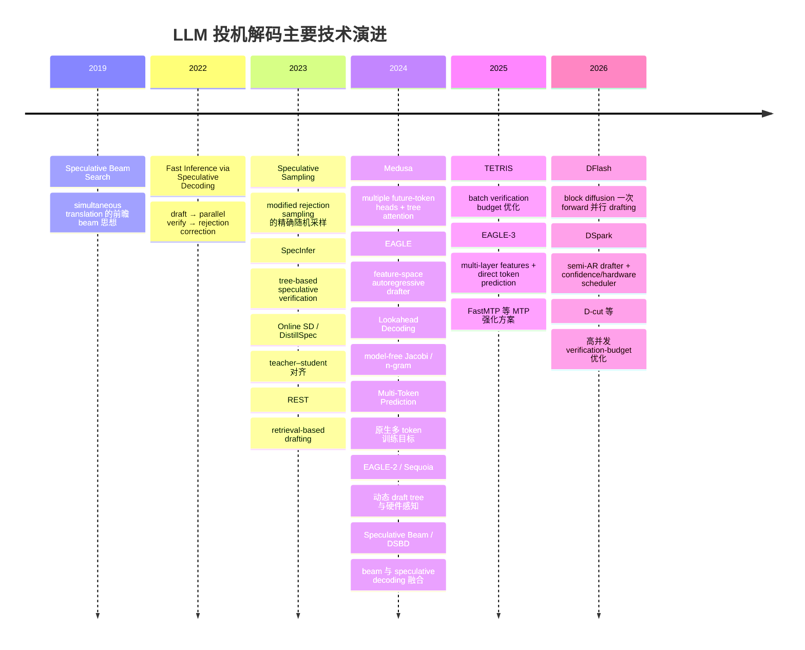

# LLM 推理场景中的投机解码技术演进与比较分析

[下载 PDF 版](/files/research/LLM推理场景中的投机解码技术演进与比较分析.pdf)                                                                    
[下载 Word 版](/files/research/LLM推理场景中的投机解码技术演进与比较分析.docx)

## 执行摘要

投机解码（speculative decoding, SD）的核心不是“让一个小模型替代大模型”，而是**用更便宜的机制先猜若干未来 token，再让目标大模型一次并行验证多个位置，从而用更多算术计算换取更少的串行解码步数和更少的模型权重/HBM 搬运**。在严格的拒绝采样校正下，最终样本可以与直接从目标模型采样具有完全相同的概率分布；在 greedy 情况下则可做到与目标模型逐 token greedy 解码完全一致。Leviathan 等人的原始 Speculative Decoding 在 T5-XXL 上报告约 2–3× 加速；DeepMind 的 Speculative Sampling 在 Chinchilla 70B 上报告约 2–2.5×，两篇工作奠定了今天几乎所有“draft–verify–correct”方法的数学基础。citeturn11view0turn11view1

此后技术演进基本沿着四条轴同时推进：

**第一条轴是“让 drafter 更准”。** 从直接选择一个外部小模型，发展到 DistillSpec、Online Speculative Decoding 等 teacher–student/知识蒸馏方案，再到利用目标模型内部特征的 EAGLE/EAGLE-2/EAGLE-3。原因可以直接从数学上看出：单位置的理论平均接受率为
\[
\alpha=\sum_x\min(p(x),q(x))=1-\mathrm{TV}(p,q),
\]
所以 draft 分布 \(q\) 越贴近目标分布 \(p\)，接受长度越高。DistillSpec 报告在多类 benchmark 上相对普通 speculative decoding 再提高约 10%–45% 的速度；Online SD 则专门解决线上 query distribution 漂移导致 draft 失配的问题。citeturn11view2turn11view3turn17view6

**第二条轴是“消灭独立的小模型”。** Medusa 通过附加多个未来-token head，MTP 将 multi-token prediction 直接加入训练目标，DeepSeek-V3 又把 MTP 模块设计成可在推理阶段充当原生 speculator。Gloeckle 等人的 MTP 实验中，7B 模型在代码等任务上实现约 2.7–3.0× 的 greedy 推理加速；DeepSeek-V3 则把 MTP 作为模型原生能力，并共享 embedding/output head 以减少额外内存。citeturn11view4turn14view0turn21search0turn23view0

**第三条轴是“draft 从串行变成并行”。** EAGLE-3 仍要递归地产生若干候选，而 2026 年的 DFlash 用轻量 block-diffusion drafter **一次 forward 并行预测整个 speculative block**，把传统
\[
T_\text{draft}\propto \gamma
\]
变成近似
\[
T_\text{draft}\approx t_\text{parallel},
\]
并使用目标模型多层 hidden states 经 KV injection 提高 draft 质量。在论文设置中，DFlash 在 Qwen3 instruct 上平均达到约 4.9× greedy、4.1× temperature=1 的 baseline 加速；SGLang/B200 实际 serving 测试中，在并发 1–32 范围仍有明显收益，Qwen3-8B 单项最高约 5.1×。citeturn16view4turn16view5turn17view0turn17view1turn17view2

**第四条轴是“从单请求最优走向 serving 全局最优”。** 固定 speculation length 在低并发时很有效，但在高并发、目标模型已经 compute-bound 时，验证大量最终会被丢弃的 token 会挤占 batch capacity。TETRIS、Nightjar、D-cut 以及 2026 年的 DSpark 都把 speculative decoding 重新表述成“有限 verification budget 如何在请求之间分配”的调度问题。DSpark 进一步把 DFlash 的平行 backbone 与轻量 Markov/RNN 顺序 head 结合，并用 confidence head 估计候选前缀的 survival probability，再根据实测硬件 SPS 曲线动态选择每个 request 的验证长度。在 Qwen3-4B/8B/14B 上，其平均接受长度相对 EAGLE-3 分别提高约 30.9%/26.7%/30.0%，相对 DFlash 提高约 16.3%/18.4%/18.3%；论文还报告在 DeepSeek-V4 线上流量、相同 aggregate throughput 下，用户侧 generation speed 相对此前 MTP-1 baseline 提升约 57%–85%。这些数字来自不同实验条件，**不应直接理解为 DSpark 比 DFlash“快 85%”这一普遍结论**。citeturn16view0turn16view3turn17view3turn17view5

从工程选型看，截至 **2026 年 8 月 12 日**，最成熟的开源路径是 **vLLM/SGLang + EAGLE-3、MTP 或 DFlash**；vLLM 的 Speculators 项目已将 EAGLE-3、P-EAGLE、DFlash、DSpark、MTP 纳入统一训练/格式体系。TensorRT-LLM 对 classic draft-target、Medusa、ReDrafter、EAGLE/EAGLE-3、MTP、n-gram 等有较深的一体化支持；ONNX Runtime GenAI 的 MTP self-speculative runtime 在 2026 年 7 月底仍以开放 PR 形式出现；DeepSpeed-MII 的官方 speculative-decoding feature request 截至目前仍为 open。FlashAttention 本身是 attention kernel，不是 speculative-decoding runtime；真正提供 fused speculative-sampling kernel 的是 FlashInfer。citeturn21search4turn23view1turn23view3turn23view4turn22search2turn23view7

**结论上，不存在一种在所有场景都最优的 speculative decoding。** 单用户、长输出、内存带宽受限时，可以积极增加 \(\gamma\)；高 QPS/大 batch 时则应减少甚至动态关闭 speculation。已有原生 MTP 的模型首选 MTP；没有 MTP、希望成熟通用方案时首选 EAGLE-3；希望更长 block、更低 draft 串行延迟且愿意训练专用 speculator 时，DFlash 是当前非常有竞争力的选择；高并发生产 serving 若能承担额外调度复杂度，DSpark/TETRIS/D-cut 这一类“acceptance-aware + hardware-aware”方法更符合最终方向。vLLM 官方也明确把 speculative decoding 定位在 medium-to-low QPS、memory-bound 工作负载中，这与上述分析一致。citeturn23view2turn17view5

## 统一理论框架与关键公式

### 自回归瓶颈

普通 LLM 解码将条件概率分解为

\[
p_\theta(y_{1:T}\mid x)
=
\prod_{t=1}^{T}
p_\theta(y_t\mid x,y_{<t}).
\]

问题不主要在于单个 token 的 FLOPs，而在于第 \(t+1\) 个 token 必须等待 \(t\)；对于 batch 较小的 decode，GPU 往往需要每一步重新从 HBM 读取大量模型权重，因此处于 memory-bandwidth-bound 状态。投机解码把一个“大模型每次算一个 token”的过程转化成“大模型一次给 \(k+1\) 个位置算 logits”，增加单次 forward 的算术强度，同时减少 target forward 次数。原始 Speculative Decoding、Speculative Sampling 以及今天 EAGLE、DFlash、DSpark 的目标本质上都可以写成降低平均 token 延迟：citeturn11view0turn11view1turn16view4

\[
L_\mathrm{token}
=
\frac{T_\mathrm{draft}+T_\mathrm{verify}}{\tau},
\]

其中 \(\tau\) 是一次 speculative cycle 实际向用户输出的平均 token 数。因此任何方案只能从三处取得收益：

\[
\boxed{
T_\mathrm{draft}\downarrow,\qquad
\tau\uparrow,\qquad
T_\mathrm{verify}\downarrow
}
\]

DFlash 主要攻击第一项；teacher–student/EAGLE/MTP 攻击第二项；TETRIS、DSpark、D-cut 则开始系统性攻击第三项。citeturn16view0turn16view4turn19search3

### 严格 speculative sampling 的接受与校正

设目标模型条件分布为 \(p_i(\cdot)\)，draft 模型为 \(q_i(\cdot)\)，drafter 产生

\[
\tilde y_i\sim q_i(\cdot\mid x,y_{<t},\tilde y_{<i}),
\qquad i=1,\ldots,k.
\]

目标模型一次并行算出 \(p_1,\ldots,p_{k+1}\)。对第 \(i\) 个候选：

\[
A_i
=
\min
\left(
1,\frac{p_i(\tilde y_i)}{q_i(\tilde y_i)}
\right).
\]

采样 \(u_i\sim U(0,1)\)。若 \(u_i<A_i\)，接受；否则在第一次拒绝位置 \(j\)，从校正分布

\[
r_j(v)
=
\frac{[p_j(v)-q_j(v)]_+}
{\sum_u[p_j(u)-q_j(u)]_+}
\]

重新采一个 token，然后结束这一轮。若 \(k\) 个 draft token 全部被接受，再从 \(p_{k+1}\) 采一个“bonus token”。这一 modified rejection sampling 的关键性质是：**输出 token 的边缘分布精确等于 \(p\)**，因此改变的是执行方式而不是模型分布。citeturn11view0turn11view1turn23view7

其单步期望接受率有一个非常重要的等价式：

\[
\begin{aligned}
\alpha
&=
\mathbb E_{\tilde y\sim q}
\left[
\min
\left(1,\frac{p(\tilde y)}{q(\tilde y)}\right)
\right]\\
&=\sum_v\min(p(v),q(v))\\
&=1-\frac12\Vert p-q\Vert_1\\
&=1-\mathrm{TV}(p,q).
\end{aligned}
\]

这解释了为什么 DistillSpec、EAGLE、DFlash、DSpark 等看似完全不同的 architecture，最终都围绕“让 proposal 更靠近 target”展开；DSpark 甚至直接把 TV loss 纳入训练目标。citeturn17view6

若粗略假设每个位置接受概率恒定为 \(\alpha\)，则一次目标 forward 的期望输出长度是

\[
E[\tau]
=
1+\alpha+\alpha^2+\cdots+\alpha^k
=
\frac{1-\alpha^{k+1}}{1-\alpha}.
\]

令一次 draft step 与 target step 的成本比为 \(c\)，传统 autoregressive drafter 需要 \(k\) 次 draft step，则一个经典近似 speedup 为

\[
S(k,\alpha,c)
=
\frac{1-\alpha^{k+1}}
{(1-\alpha)(1+kc)}.
\]

这直接说明“无限增大 speculative length”不会无限加速：\(\alpha^k\) 很快衰减，而 draft 和 verification cost 继续上升。Online Speculative Decoding 对这一关系有明确分析。citeturn11view3

### Greedy 与 sampling 的“无损”含义不同

在 greedy decoding 中，drafter 的 token 只需与 target 的

\[
\arg\max_v p_i(v)
\]

逐位置匹配；一旦出现第一个不同位置，就丢弃后缀并使用 target token。因此可以做到**token-by-token 与普通 greedy 完全相同**。

在随机 sampling 中，“lossless”通常意味着**概率分布相同，而非相同 seed 时字符串逐字节相同**。因为 batch 排序、CUDA kernel、RNG 消耗顺序和 floating-point reduction 顺序可能变化。FlashInfer 的 fused chain speculative sampler 因此专门暴露 deterministic、seed 和 offset 接口，且提醒调用者在 CUDA Graph 环境下正确推进随机数状态。citeturn23view7

此外，若 target 本身进行了 INT4/FP8 量化，那么严格 speculative sampling 保证的是“与这个量化 verifier 的分布一致”，而不是与某个 FP16 原始 checkpoint 的分布一致。这是工程上经常被“lossless”一词掩盖的区别。

## 技术演进时间线

现代 speculative decoding 并非突然出现。2018 年前后的 blockwise parallel decoding 已在探索多 token 并行预测；2019 年 Speculative Beam Search 在 simultaneous translation 中使用“向未来 hallucinate 再决定当前 token”的思想，但它与今天的 draft/rejection-sampling SD 并非同一算法。真正的现代范式在 2022 年底至 2023 年由 Speculative Decoding、Speculative Sampling 定型，随后快速分化成 tree、retrieval、distillation、self-speculation、MTP、feature drafting、parallel drafting 和 serving-aware scheduling。citeturn20search0turn11view0turn11view1



其中几个转折点尤其值得注意：

**2023 年的 SpecInfer** 把“一个 draft sequence”推广成 token tree，并在大模型一次 forward 中同时验证多条共享前缀的候选路径；论文报告分布式 serving 加速约 1.5–2.8×、offloading serving 约 2.6–3.5×。这成为 Medusa、EAGLE 系列各种 tree verifier 的系统基础之一。citeturn19search0turn19search8

**2024 年 Medusa 与 EAGLE 把 draft 模型内化。** Medusa 给 target 增加多个 future-token heads；EAGLE 则发现直接在 second-to-top-layer feature space 做 autoregression 更容易，并通过 shifted token sequence 消除 feature uncertainty。EAGLE 在 LLaMA2-Chat 70B 上报告 2.7–3.5× latency speedup；Medusa-1 报告超过 2.2×，Medusa-2 为约 2.3–3.6×。citeturn18search1turn18search4

**2024 年的 MTP 是模型训练范式上的变化。** 它不再把 speculative decoding 看成单纯的 serving trick，而是在 pretraining 中要求模型学习预测多个未来 token；DeepSeek-V3 随后采用 MTP，并明确允许其推理时作为 speculative decoding 模块。citeturn11view4turn21search0turn21search3

**2025–2026 年关注点又从“平均接受长度”转向“硬件真实吞吐”。** TETRIS 按 request/token 价值分配 batch verification budget；DFlash 消除 AR drafter 的串行 \(O(\gamma)\) 开销；DSpark 进一步把 draft accuracy、block latency 和当前 engine capacity curve 联合优化。citeturn19search3turn16view5turn17view5

## 主流方法与算法比较

**原始 Speculative Decoding**

Leviathan、Kalman、Matias 的方法使用一个明显更小、更快的 approximation model \(M_q\)，先自回归提出 \(\gamma\) 个 token，再由目标 \(M_p\) 用一个 forward 对 \(\gamma+1\) 个位置同时评分，最后执行上述 accept/reject/correction。它最大的理论价值不是“用了小模型”，而是证明了**可以减少目标模型的串行调用次数，同时严格保持目标分布**。论文不要求重新训练 target，在 T5-XXL 上报告约 2–3×。citeturn11view0

```text
function SPECULATIVE_DECODE(prefix, target p, draft q, k):
    draft_tokens = []
    for i = 1..k:
        qi = q(. | prefix + draft_tokens)
        xi ~ qi
        save qi
        draft_tokens.append(xi)

    p1..p{k+1} = target.score(prefix + draft_tokens)  # 一次并行验证

    for i = 1..k:
        if Uniform(0,1) <= min(1, pi[xi] / qi[xi]):
            emit xi
        else:
            r = normalize(max(pi - qi, 0))
            y ~ r
            emit y
            rollback KV after this position
            return

    y ~ p{k+1}
    emit y
```

优势是算法通用、无需 target retraining、sampling mathematically exact；限制则是 draft 每提出一个 token 就需要一次小模型 forward，因此
\[
T_\mathrm{draft}\approx k\,t_q,
\]
而且要额外常驻一套 model weights 与 draft KV cache。target 与 drafter 相差太小时 drafter 不够便宜，相差太大时 \(p,q\) divergence 又造成低接受率，所以模型大小存在明显的 Pareto trade-off。citeturn11view0turn16view5

**Speculative Sampling**

Chen 等人的 Speculative Sampling 与上述论文几乎是同时独立形成的另一种表述。其关键贡献是把机制明确表述为 modified rejection sampling：一个低延迟 draft model 连续提出短 continuation，大模型并行打分，再用 \(p/q\) 接受概率和 \([p-q]_+\) residual correction 恢复目标分布。Chinchilla 70B 的分布式推理实验报告约 2–2.5× 加速且不损失生成质量。citeturn11view1

因此从今天的工程实现看，**“original speculative decoding”与“speculative sampling”不宜视为两套完全不同的体系**：前者现在常被用作整个技术族名称；后者通常特指随机解码下的 exact rejection/correction kernel。FlashInfer 当前的 `chain_speculative_sampling` 就直接实现 Chen 等人的形式，输入 draft probability tensor \(B\times K\times V\) 和 target probability tensor \(B\times(K+1)\times V\)，在 GPU 上融合执行 accept/reject/correction。citeturn23view7

**外部小模型与 teacher–student / DistillSpec / Online SD**

原始算法允许任意便宜的 \(q_\phi\)，但一个“看起来合理”的小 LLM 并不一定在 target 实际 serving 分布上有高 token-level agreement。因此后续工作把问题转为 teacher–student：

\[
\min_\phi
\mathbb E_{x\sim \mathcal D}
D\!\left(
p_\theta(\cdot|x)
\,\Vert\,
q_\phi(\cdot|x)
\right).
\]

常见 \(D\) 包括 forward KL、

\[
D_\mathrm{KL}(p\Vert q)
=
\sum_v p(v)\log\frac{p(v)}{q(v)},
\]

reverse KL、Jensen–Shannon divergence，以及直接优化 TV-distance 的目标。DistillSpec 强调 on-policy 数据与 inference decoding distribution 的匹配；Online SD 则持续从真实请求分布更新 draft，从而应对 domain shift。citeturn11view2turn11view3

训练伪代码很简单，真正难的是数据：

```text
for prompt in serving_distribution:
    teacher_trace = target.generate(prompt)

    for prefix in teacher_trace:
        p = target.logits(prefix)
        q = draft.logits(prefix)

        loss = divergence(p, q)       # KL / JS / TV / mixed loss
        update(draft, loss)

# deployment
run exact speculative sampling with trained q
```

它的一个重要性质是：**蒸馏只决定 efficiency，不决定最终 sample correctness**。只要推理阶段仍使用 target 的严格 verifier/corrector，student 即使预测错了也只会被拒绝，而不会直接篡改 target distribution。DistillSpec 报告相对普通 speculative decoding 约 10%–45% 的额外 speedup；Online SD 的实验则显示 online query distribution 确实可以改善 draft alignment。citeturn11view2turn11view3

这类方法尤其适合企业固定 domain，例如 coding assistant、SQL、客服和垂直领域摘要，因为 domain-specific target traces 可以非常有效地把 \(q\) 拉近 \(p\)。反过来，开放域 chat、频繁更换 system prompt、target model 持续升级时，student 很容易“过期”，需要重新蒸馏或在线更新。citeturn11view3

**Medusa 与 MTP**

Medusa 不维护完整的第二套 Transformer，而是在 target hidden state \(h_t\) 上附加多个 head：

\[
q_i(y_{t+i}\mid h_t)
=
\operatorname{softmax}
\bigl(
W_i g_i(h_t)
\bigr),
\quad i=1,\ldots,n.
\]

这些 head 并行提出多个未来位置的 top-\(k\) 候选，并组合成候选树；tree attention 让大模型一次验证共享前缀的多条 continuation。Medusa-1 冻结 backbone，仅训练 heads，因此论文称其可 lossless acceleration；Medusa-2 联合调 backbone/head，接受率和速度更高，但 target 本身已不再是原 checkpoint。论文还提出 “typical acceptance” 等近似方案，此类 relaxed verifier 不再具有严格的 sampling-distribution equality。citeturn18search4turn18search8

MTP 则把这种能力直接放进训练目标。Gloeckle 等人的形式可写为

\[
\mathcal L_\mathrm{MTP}
=
-\sum_t\sum_{i=1}^{n}
\log
p_{\theta,i}
(x_{t+i}\mid h_t),
\]

其中共享主干表示 \(h_t\)，但拥有不同 future-token prediction heads。这相当于把普通 next-token prediction

\[
-\sum_t\log p(x_{t+1}|x_{\le t})
\]

扩展成对多个 future offsets 的联合监督。citeturn11view4

```text
h = target_backbone(prefix)

q1, q2, ..., qn = MTP_heads(h)      # 或 native chained MTP module
candidates = build_chain_or_tree(q1...qn)

target_logits = target.verify(candidates)

accepted_path = exact_verify(target_logits, candidates)
commit accepted_path to KV cache
```

MTP 有两个容易混淆的流派。Meta/Gloeckle 的 MTP 主要是共享 trunk 后的多个未来预测 heads；DeepSeek-V3 的实现则把 MTP module 做成模型结构的一部分，并共享 embedding/output head，推理时可作为 self-speculative drafter。DeepSeek-V3 技术报告明确把 MTP 用于增强训练信号并支持 speculative decoding。citeturn21search0turn23view0

MTP 的工程优势很大：没有第二个独立 tokenizer/model/KV cache，内存增量通常显著小于完整外部 draft model；但硬性限制是**模型必须原生拥有 MTP head/module，或至少允许额外训练这些 head**。vLLM 当前将 native MTP 作为一等 speculative-decoding method，且 Speculators 工具链支持对已有 MTP 层继续 domain-specific fine-tuning。citeturn21search19turn21search23

在 Gloeckle 等人的 7B、四-token-predictor实验中，论文补充材料报告 Wikipedia、Books、Code 的 speedup 分别约 2.74×、2.67×、3.05×；这些结果是在其特定 greedy/xFormers 设置下得到的，不能直接等同于今天高并发 vLLM serving 的结果。citeturn14view0

**EAGLE、EAGLE-2 与 EAGLE-3**

EAGLE 的核心洞见是“预测 target 的内部 feature”可能比从一个独立小 LLM 重新预测 token 更容易。它以 target 的 second-to-top-layer representations 为主要上下文，再加入 shifted token 信息消除 feature uncertainty，由一个很浅的 autoregressive draft network 连续预测后续 states/tokens，再用 target 严格验证。其论文在 Vicuna、LLaMA2-Chat、Mixtral 等模型及 chat、code、math、instruction-following 上评估，并报告 LLaMA2-Chat-70B 约 2.7–3.5× latency speedup，同时保持目标分布。citeturn18search1turn18search5

EAGLE-2 的重点转向**动态 draft tree**：高概率 branch 多扩展，低概率 branch 少消耗 verification slots，从而提高固定 tree-budget 下的有效 accepted tokens。citeturn18search24

EAGLE-3 又做了一个有趣的“反转”：不再强制预测精确 feature，而是融合 target 多层 feature，再进行 direct token prediction，并引入 training-time test 让 speculator 的训练条件更贴近实际 autoregressive speculative rollout。论文报告单项最高约 6.5×、相对 EAGLE-2 约 1.4×；在 SGLang batch size 64 设置下报告约 1.38× throughput improvement。citeturn18search3turn18search7

其概念流程是：

```text
features = target.selected_hidden_layers(prefix)
state = fuse(features)

for step in 1..k:
    q = eagle_drafter(state, previous_draft_token)
    x ~ q
    state = update(state, x)

tree = optional_dynamic_tree(draft_candidates)
target.verify_tree(tree)
rejection_sample_or_greedy_commit()
```

相对 external teacher-student，它省去了完整小模型的长上下文计算，并天然利用 target feature；代价是 target 与 speculator 强耦合，一个 EAGLE checkpoint 通常不能无条件迁移到另一个 target checkpoint。训练中的 target hidden-state 提取也会带来明显的数据生成/训练成本。EAGLE-3 目前是最成熟的通用 learned speculator 之一，vLLM Speculators 和 TensorRT-LLM 都有明确支持。citeturn21search4turn23view1

**SpecInfer、Sequoia 与树验证**

线性 draft chain 的缺陷是：一个错误 token 会让后面全部候选失效。SpecInfer 因而让一个或多个 speculative models 生成

\[
\mathcal T=(V,E)
\]

形式的 token tree，每个节点代表一条 prefix 的一个 token；target 在 tree attention mask 下让节点只访问自身祖先：

\[
p(v_j\mid \operatorname{ancestors}(v_j)).
\]

共享 prefix 的多条 candidate path 因此可以在一次大模型 forward 中验证。SpecInfer 报告分布式 LLM serving 上约 1.5–2.8×、offloading 场景约 2.6–3.5×。citeturn19search0

问题由此从“draft 几个 token”转为“有限 \(N\) 个 verification nodes 应该怎样排列成树”。Sequoia、EAGLE-2、OPT-tree 等工作本质上都在优化这一 tree shape / probability mass / hardware cost trade-off。Sequoia 明确以 scalable、robust、hardware-aware speculative decoding 为目标。citeturn19search28turn19search36

树方法对 GPU 很友好，但实现远比 chain 复杂：需要 tree position IDs、non-standard attention mask、path-specific KV commit、只保留 accepted branch，并避免重复为共享 ancestor 存储 KV。TensorRT-LLM 对 Medusa/EAGLE tree 已有专门 runtime 参数和 kernel 路径。citeturn21search14turn23view1

**REST、n-gram、suffix/prompt lookup 等 model-free drafting**

REST 不使用神经 drafter，而是在历史文本/语料 datastore 中根据当前 suffix 找匹配 continuation，将检索到的 token sequence 作为 draft。论文在 7B/13B、batch=1 的 code/text generation 上报告约 1.62–2.36×，且无需额外训练。citeturn19search1turn19search9

这类方案后来演化出 prompt lookup、n-gram、suffix decoding：例如代码补全、文档摘要、结构化输出常常会复制 prompt 或已有文本中的长片段，根本不必运行第二个 neural network。这类 proposal 的主要成本是 hash/index lookup，而不是 Transformer forward。

```text
suffix = last_m_tokens(prefix)
candidate = lookup_longest_continuation(suffix, prompt_or_datastore)

if candidate found:
    target.verify(candidate[:k])
    commit accepted_prefix
else:
    ordinary_target_decode()
```

它们的优势是显存几乎零增加、冷启动容易，并且高并发时不会额外占用一个 draft model 的 GPU 算力；缺点是 open-domain、creative chat 中 hit rate 很低。REST 本身更适合 code、重复性 text；vLLM 和 TensorRT-LLM 当前均把 n-gram 类方法纳入 speculative-decoding 工程体系。citeturn21search10turn23view1

**Lookahead Decoding**

Lookahead Decoding 不需要 draft model。它从 Jacobi decoding 出发，让多个未知未来 token 同时迭代，然后保存 Jacobi trajectory 中形成的 n-grams，并把这些 n-grams 作为后续候选进行 target verification。因此它实质上用**额外 target-model 并行计算换取更少 serial steps**。论文称其为 exact parallel decoding，并报告 MT-Bench 上最高约 1.8×，多 GPU code completion 强扩展场景最高约 4×。citeturn19search2turn19search6

它适合不希望维护任何 auxiliary model 的部署，也适合 accelerator parallelism 很富余但模型权重搬运昂贵的环境；不足是每一步 target-side computation 明显增加，因此高并发、GPU 已经 compute-saturated 时未必有收益。

**Speculative Beam Search 与 Dynamic-Width Speculative Beam Decoding**

“Speculative Beam Search”这个名字至少对应三类不同技术，工程上必须区分。

2019 年 Zheng 等人的 SBS 用于 simultaneous translation：因为 wait-\(k\) streaming MT 每收到一些 source tokens 就必须承诺一个 target token，它先“hallucinate”未来若干步、运行 beam search，再只 commit 当前需要的词。这是**前瞻决策算法**，不是后来 \(p/q\) rejection sampling 意义上的 speculative decoding。citeturn20search0

2024 年 Andronov 等人把 draft model + beam search 用于 chemical reaction/retrosynthesis string generation，称为 Speculative Beam Search；后续 DSBD 论文指出，该方案并不保持普通 multinomial sampling 或 beam sampling 的原分布，因此应看成 task-specific approximate search acceleration。其后续工作报告 Molecular Transformer 某些场景可达约 3×。citeturn20search19turn20search1turn20search16

更一般的 Dynamic-Width Speculative Beam Decoding（DSBD）则试图让多个 draft beam trajectories 经 target 验证后仍遵循 target beam-sampling 过程，并根据上下文动态调 beam width。核心目标不是经典 token-level

\[
\min(1,p/q)
\]

接受，而是维持 target 下的 beam score：

\[
S_p(y_{1:t})
=
\sum_{i=1}^{t}
\log p(y_i\mid y_{<i},x)
\]

或带 length normalization 的变体，并在多个 speculative trees 上并行 target verification。它适用于机器翻译、化学序列生成等**输出本来就需要 top-\(B\) candidates** 的任务，而不适合把它简单替换成 chat LLM 的 multinomial sampler。citeturn20search2

**DFlash**

DFlash 的真正突破点是：为什么一定要用 autoregressive drafter？

AR drafter 的成本为

\[
T_\mathrm{draft}
=
\gamma t_\mathrm{step}.
\]

DFlash 将一个 anchor token 加上 mask block 输入轻量 block-diffusion Transformer，并允许 block 内 bidirectional attention，一次 forward 直接得到 \(\gamma\) 个 proposal distributions：

\[
T_\mathrm{draft}
=
t_\mathrm{parallel}
\approx O(1)\quad\text{w.r.t. }\gamma
\]

——这里 \(O(1)\) 是指 forward 次数，不是 FLOPs 真正与 block size 无关。论文测得对于中等 block，parallel operation 在 GPU 上远便宜于 \(\gamma\) 次串行 drafter forward。citeturn16view5

单纯 diffusion drafter 的准确率不够，因此 DFlash 从 target prefill/decode 中抽取浅到深的多个 hidden states，融合为 \(H_\text{ctx}\)，然后在每个 draft layer 的 K/V 中注入：

\[
K_i=
[W_i^KH_\text{ctx};W_i^KH_d],
\qquad
V_i=
[W_i^VH_\text{ctx};W_i^VH_d].
\]

这样 target 自身已经计算好的语义、长程信息能够不断进入 drafter，而不会像单次 input fusion 那样随深度衰减。citeturn17view0turn17view3

训练时还对 block 早期 token 加更大权重，因为第一个错误会让整个 suffix 无效：

\[
w_k=
\exp\left(-\frac{k-1}{\gamma}\right).
\]

DFlash 共享并冻结 target embedding 与 LM head，只训练 draft Transformer layers，降低参数/训练成本。citeturn16view6

```text
# 一个 speculative round
h_ctx = fuse(target.hidden_states(prefix))

# 一次 parallel forward
q[1:k] = dflash(
    anchor = previous_bonus_token,
    masks  = MASK * (k-1),
    target_context = h_ctx
)

draft_tokens = sample_each(q[1:k])

p[1:k+1] = target.verify(prefix + draft_tokens)

accepted = exact_chain_verify(p, q, draft_tokens)
commit(accepted)
```

论文主实验采用 LLaMA-3.1-Instruct-8B、Qwen3-4B/8B/Coder-30B-A3B，任务涵盖 GSM8K/MATH/AIME、HumanEval/MBPP/LiveCodeBench、MT-Bench/Alpaca；多数研究实验在 H200 上。默认 DFlash 通常使用 5 layers、block size 16，Coder 模型使用 8 layers，LLaMA 例子 block 10。citeturn17view1

值得注意的是 long-context robustness：原 4K-context draft checkpoint 随 context 延长接受长度会下降，而用约 1.6K 个 LongAlign-10K 样本进行轻量适配后，在论文 8K–32K 测试中明显恢复。这表明 DFlash 并非“训练一次即可无条件泛化所有 context length”。citeturn16view7

截至当前，DFlash 已有官方 MIT 仓库，vLLM v0.20.1+ 提供 core support，官方 repo 同时给出 SGLang、Transformers 和 Apple Silicon/MLX 路径；vLLM 启动示例使用 `method=dflash` 与 `num_speculative_tokens=15`。citeturn24view0

**DSpark**

DSpark 可以看成对 DFlash 两个缺陷的针对性修复：

第一，DFlash 的 block positions 基本并行预测，suffix 容易出现 independent-position “mode collision”；第二，即便它能产生 16 个 token，高并发时把 16 个都送给 target verification 往往是不划算的。citeturn17view3turn17view4

于是 DSpark 使用“heavy parallel backbone + very light sequential head”：

\[
P(X\mid x_0)
=
\prod_{k=1}^{\gamma}
p_k(x_k\mid x_0,x_{<k}),
\]

\[
p_k(v)
=
\frac{
\exp(U_k(v)+B_k(x_0,x_{<k},v))
}{
\sum_u\exp(U_k(u)+B_k(x_0,x_{<k},u))
}.
\]

\(U_k\) 由 DFlash-like parallel backbone 一次产生；\(B_k\) 用极便宜的 sequential head 给出。citeturn16view1

最简单的是低秩 Markov transition：

\[
B(x_{k-1},\cdot)
=
W_1[x_{k-1}]W_2,
\]

默认低秩 \(r=256\)。论文也提供 RNN head，让整个 block prefix 进入 recurrent state。这样既保留绝大部分 block-parallel 性，又让后一个 token 真正知道前一个采出了什么。citeturn17view4

更关键的是 confidence scheduler。设 confidence head 预测每位置条件接受概率 \(c_{r,i}\)，则 request \(r\) 的第 \(j\) 个 token 真正活到验证位置的概率为

\[
a_{r,j}
=
\prod_{i\le j} c_{r,i}.
\]

若给每个 request 选 verification length \(\ell_r\)，总 verification batch tokens 是

\[
B=
\sum_r(1+\ell_r),
\]

期望生成 tokens 为

\[
\tau
=
\sum_r
\left(
1+\sum_{j=1}^{\ell_r}a_{r,j}
\right).
\]

DSpark 启动时先 profile target engine 的

\[
\mathrm{SPS}(B)
\]

曲线，然后每轮最大化

\[
\Theta
=
\tau\cdot\mathrm{SPS}(B).
\]

因此它不是最大化“接受率”，而是最大化**实际系统 throughput**。citeturn16view2turn17view5

```text
U[1:k], hidden = parallel_backbone(anchor, masks)

for i in 1..k:
    q_i = softmax(U[i] + sequential_bias(previous_tokens))
    x_i ~ q_i
    c_i = confidence_head(...)
    survival_i = product(c_1 ... c_i)

lengths = hardware_scheduler(
    all_requests_survival,
    measured_SPS_curve
)

target.verify(truncated_prefixes(lengths))
exact_rejection_correct()
```

DSpark 的训练 loss 也明确针对 acceptance：

\[
\mathcal L
=
0.1\mathcal L_\mathrm{CE}
+
0.9\mathcal L_\mathrm{TV}
+
1.0\mathcal L_\mathrm{conf},
\]

其中 TV loss 直接对应上述 \(1-\mathrm{TV}(p,q)\) 接受率关系。citeturn17view6

DSpark 特别值得关注的一个理论问题是**scheduler 本身也能破坏 losslessness**。如果决定“是否验证位置 \(k\)”时偷偷使用了未来候选 \(x_{k+1}\) 的信息，就会造成 selection bias。论文因此要求 non-anticipating scheduling，并用 early stopping/生产异步 top-\(K\) 方案避免未来信息泄露到 admission decision。这是近年来 speculative serving 从“模型算法”进入“系统正确性”阶段的重要信号。citeturn17view5

DeepSeek 已开源 DeepSpec 训练框架和 DSpark checkpoints；DeepSpec 同时覆盖 EAGLE-3、DFlash 与 DSpark。citeturn16view0turn24view1

## 综合对照表

下表中的 speedup 只用于说明**各论文在自身实验条件下的量级**。不同 GPU、target size、batch、context length、temperature、speculative length、kernel/backend 和 benchmark 会导致巨大差异，不能按单元格数字直接排序“谁最好”。原始 SD/Spec Sampling、Medusa、EAGLE、MTP、REST、Lookahead、DFlash 和 DSpark 的代表性数据分别来自其原始论文或官方实现。citeturn11view0turn11view1turn18search4turn18search1turn14view0turn19search1turn19search2turn17view2turn16view3

| 维度 | 原始 SD | Speculative Sampling | 外部小模型 / KD | Medusa / MTP | EAGLE 系列 | REST / n-gram | Lookahead | Speculative Beam / DSBD | DFlash | DSpark |
|---|---|---|---|---|---|---|---|---|---|---|
| Proposal 来源 | 独立小 AR LM | 独立小 AR LM | target 蒸馏 student | target 附加 heads / native MTP | target hidden features + 浅 drafter | 检索、prompt、suffix | target Jacobi trajectory | 小模型 beam trajectories | 轻量 block-diffusion drafter | parallel DFlash-like backbone + sequential head |
| Draft token 依赖 | 串行 causal | 串行 causal | 通常串行 causal | Medusa 多 heads 可独立；DeepSeek MTP 可链式 | AR | 检索得到现成 sequence | Jacobi 并行迭代 | beam/tree | block 内平行 | 半自回归 |
| 核心 verifier | target 一次 \(k+1\) logits | modified rejection sampling | 同原始 SD | target tree/chain verification | target tree verification | target chain/tree verification | target n-gram verification | 多 tree target scoring/beam pruning | target chain verifier | target + confidence-aware truncated verifier |
| 随机采样精确性 | 精确 | **设计目标就是精确 sampling** | verifier 严格时精确 | 标准 verifier 可精确；typical acceptance 可近似 | 论文目标为 target-distribution preserving | 取决于 proposal/verifier；greedy 容易严格保持 | greedy/exact algorithm 路径 | 2019 SBS 与化学 SBS 不等于 target multinomial；DSBD 针对 beam 分布 | 严格 verifier 下 lossless | 要求 exact rejection + non-anticipating scheduler |
| Draft 延迟随 \(k\) | \(\sim k t_q\) | \(\sim k t_q\) | 同左 | head 并行为主；链式 MTP 有少量顺序成本 | \(\sim k\) 个浅 drafter steps | 极低 lookup cost | 额外 target parallel work | 随 beam/tree 扩大 | 近似一个 parallel forward | 一个 parallel forward + 极轻 sequential loop |
| 额外显存 | 完整 draft weights + KV | 同左 | 同左 | 较低 | 一层/少量 drafter + feature state | datastore/RAM；GPU 权重几乎零 | 无第二模型 | draft + beam KV/tree | 约数层 drafter + feature context | DFlash-like drafter + Markov/RNN/conf heads |
| 代表结果 | T5-XXL 约 2–3× citeturn11view0 | Chinchilla-70B 约 2–2.5× citeturn11view1 | DistillSpec 相对普通 SD 再 +10–45% citeturn11view2 | Medusa 约 2.2–3.6×；MTP 7B 约 2.7–3.0× citeturn18search4turn14view0 | EAGLE 70B 约 2.7–3.5×；EAGLE-3 单项最高 6.5× citeturn18search1turn18search3 | REST 约 1.62–2.36× citeturn19search1 | MT-Bench up to 1.8×；多 GPU code up to 4× citeturn19search2 | 化学 SBS 单项 up to ~3×；DSBD 侧重 beam quality/efficiency citeturn20search16turn20search2 | instruct 平均约 4.9× greedy / 4.1× T=1；SGLang 单项最高 5.1× citeturn17view1turn17view2 | accepted length 较 EAGLE3/DFlash 明显提高；线上用户速率 +57–85% vs MTP-1 citeturn16view0turn16view3 |
| 开放域 Chat | 中等；依赖 draft alignment | 中等 | 需广泛 KD 数据 | MTP/Medusa 可用 | 很适合 | hit rate 较低 | 可用 | 普通 chat 一般没必要 beam | 可用但 chat acceptance 低于 code/math | 动态 scheduler 尤其有价值 |
| Code / Math | 常较好 | 常较好 | domain KD 很有效 | 很好 | 很好 | code 极适合 retrieval | code 是优势场景 | beam 非必需 | 论文中接受长度与加速较高 | structured task 接受长度明显高 |
| 翻译 | 可用 | 可用 | domain-specific student 有效 | 可用 | 可用 | 重复/phrase matching 时有效 | 可用 | **beam 家族特别相关** | 尚非主要验证重点 | 可用但需重新训练/测试 |
| 摘要 | 可用 | 可用 | 很适合 domain distillation | 可用 | 可用 | prompt-copy 摘要非常有利 | 可用 | 通常不必 beam | long-context 需适配 | confidence scheduling 有帮助 |
| 低并发 | 很适合 | 很适合 | 很适合 | 很适合 | 很适合 | 很适合 | 适合 | 视 beam demand | **非常有竞争力** | 有效但 scheduler 优势未完全体现 |
| 高并发 | verifier expansion 可能伤 throughput | 同左 | 同左 | 较轻但仍可能伤 target batch | tree verification 可能扩大 compute | 相对友好 | target compute 增加，不一定有利 | KV/beam 开销高 | speedup 随并发通常下降 | **设计重点** |
| 长上下文 | 双 KV cache 成本高 | 同左 | 同左 | MTP 更省第二套 KV | target feature extraction 有成本 | datastore/prompt lookup 很合适 | target compute 增大 | beam KV 很重 | 4K-trained drafter 需 long-context adaptation citeturn16view7 | 可适配，但仍依赖 backbone 长上下文质量 |
| 最关键超参数 | \(k\)、draft size、temperature | \(k,\alpha\)、sampling params | KD divergence、data、\(k\) | head 数、tree size、top-k | draft steps、tree size/top-k | n-gram 长度、lookup depth | window/ n-gram 参数 | beam width/tree budget | block size、layers、feature layers | block size、rank \(r\)、confidence calibration、scheduler cost curve |
| 最大风险 | \(q\) 太慢或 acceptance 太低 | 概率/logit kernel 实现错误 | domain drift | native architecture 要求/heads training | target 强耦合、训练成本 | hit rate 不稳定 | 增加 target FLOPs | 搜索分布可能改变 | 专用训练 + hidden-feature 接口 | runtime/scheduler 最复杂 |

一个值得单独强调的结论是：**困惑度不是评价 lossless speculative decoding 最有信息量的指标。** 如果最终分布严格等于 target，那么 generated-text distribution、理论 PPL 和任务质量在统计意义上就应与 target decoding 一致；更应该测的是 acceptance length、target forward reduction 和 latency。只有 Medusa-2、jointly trained MTP、typical acceptance、近似 beam 等真正改变模型或解码分布的方案，才需要把 PPL/任务准确率变化当作“质量成本”进行分析。citeturn11view0turn11view1turn18search4

## 工程实现、部署与评测方法

### 主流推理栈的现实支持度

**vLLM。** 截至 2026 年 8 月，vLLM 最新文档明确把 speculative decoding 用于降低 medium-to-low QPS、memory-bound 情况下的 inter-token latency；其 Speculators 子项目已经形成 EAGLE-3、P-EAGLE、DFlash、DSpark、MTP 的统一 training/format framework，并称这些方法在其严格 verifier 路径下保持 target distribution。当前配置代码也已经识别 `eagle/eagle3/dflash/dspark` 等 speculator 类型。citeturn23view2turn21search4turn21search16

在 Ascend 路径上必须单独查看 accelerator-specific 支持矩阵：当前 vLLM Ascend 文档列出 MTP、EAGLE-3、DFlash、n-gram 等，但该路径明确注明 DSpark 尚不支持，因此不能把 upstream vLLM 支持自动等价为所有后端都支持。citeturn21search1

**TensorRT-LLM。** NVIDIA 当前官方 speculative-decoding 文档覆盖经典 auxiliary draft model，并把 Medusa、ReDrafter、EAGLE 系列作为一模型/附加预测器路径；文档和博客入口同时存在 EAGLE-3、DeepSeek-R1 MTP、n-gram speculative decoding 的专门优化资料。其优势是 acceptance、KV management、CUDA Graph、tree verification 与 TensorRT engine 深度融合。当前官方主文档中尚未看到 DFlash/DSpark 作为与 EAGLE 同等级的命名方法，因此不宜假定它们已有原生 TensorRT-LLM runtime。citeturn23view1turn21search11

**ONNX Runtime GenAI。** 截至 2026 年 8 月 12 日，官方 GitHub 的 `Add MTP self-speculative decoding runtime` 与 `Qwen3.6: build the MTP self-speculative head` PR 均显示为 2026 年 7 月 31 日打开状态，因此更准确的描述是“正在集成”，而不是已经成熟稳定发布。对需要 ONNX/DirectML/CPU portability 的系统，这一点尤其重要。citeturn23view3

**DeepSpeed / DeepSpeed-MII。** DeepSpeed-MII 官方 issue #254 的 speculative-decoding feature request 自 2023 年起截至当前仍标记 Open，且无关联 branch/PR；因此目前没有证据支持把 DeepSpeed-MII 描述为拥有成熟、first-class speculative-decoding runtime。DeepSpeed 的 TP/PP、ZeRO 等能力当然可用来搭建自定义 target/draft deployment，但这与原生 SD 功能是两回事。citeturn23view4

**FlashAttention 与 FlashInfer。** FlashAttention 官方仓库提供 exact、memory-efficient attention、paged KV 等 kernel primitives，本身并没有定义 speculative-decoding scheduler/verifier API；它可以显著加速短 block verification，但不应被列成“支持 EAGLE/DFlash 的 serving engine”。FlashInfer 则不同：它明确提供 `chain_speculative_sampling` fused GPU kernel，处理 draft probabilities、target probabilities、accepted count、bonus token 和 RNG，因此是 speculative-sampling 的底层直接实现。citeturn22search2turn22search0turn23view7

**SGLang。** DFlash 官方仓库已经给出第一方 SGLang 启动方式，并使用 DFLASH algorithm、独立 draft attention backend、Spec-v2 overlap 等配置；DFlash 论文中的 serving benchmark 也是在单 B200、FlashAttention-4 backend、Spec-v2 scheduling overlap 下完成的。citeturn24view0turn16view7

**LLMServe。** 这里需要澄清命名：LLMServe 更像一组研究 serving 项目，而不是一个与 vLLM/TensorRT-LLM 等价的单一 runtime。FastServe 的官方 README 主要提供 continuous batching、preemptive scheduling、custom/paged attention、TP/PP；DistServe 重点是 prefill/decode disaggregation，官方 README 均未列出 speculative decoding。因此其 serving architecture 与 SD 是互补关系，而非现成 first-class implementation。citeturn23view5turn23view6

可以简化成当前工程状态：

| 推理栈 | Classic draft-target | Medusa/MTP | EAGLE | DFlash | DSpark | n-gram/model-free |
|---|---:|---:|---:|---:|---:|---:|
| vLLM upstream | ✓ | ✓ | ✓ | ✓ | ✓ / 新 | ✓ |
| vLLM Ascend 当前路径 | 部分 | MTP ✓ | EAGLE-3 ✓ | ✓ | 当前文档标注未支持 | ✓ |
| TensorRT-LLM | ✓ | ✓ | ✓ | 未见官方命名支持 | 未见官方命名支持 | ✓ |
| ONNX Runtime GenAI | 仍在演进 | MTP PR 中 | 未见成熟 first-class | 未见 | 未见 | 部分工作在推进 |
| DeepSpeed-MII | 无成熟 first-class | 无 | 无 | 无 | 无 | 无明确 first-class |
| SGLang | ✓ | 部分 | ✓ | ✓ | 依版本/集成 | ✓ |
| FlashAttention | kernel primitive，不是 decoder runtime | 同左 | 同左 | 可作为 attention backend | 同左 | 同左 |
| FlashInfer | 提供 fused speculative sampler/kernel primitives | 可被上层调用 | 可被上层调用 | 可作底层 kernel | 可作底层 kernel | 视上层 |

上述状态是 **2026-08-12 的快照**，尤其 vLLM/ONNX Runtime 的变化速度很快。citeturn21search4turn21search1turn23view1turn23view3turn23view4turn23view7

### 可复现部署示例

DFlash 官方仓库当前给出的 vLLM 方式可以简化为：citeturn24view0

```bash
vllm serve Qwen/Qwen3.5-27B \
  --speculative-config '{
      "method": "dflash",
      "model": "z-lab/Qwen3.5-27B-DFlash",
      "num_speculative_tokens": 15
  }' \
  --attention-backend flash_attn \
  --max-num-batched-tokens 32768
```

SGLang 的设计则允许 target 与 draft 使用不同的 attention backend，例如 target 使用 TensorRT-LLM MHA 而 DFlash block 使用 FA4。DFlash 官方示例为 16 个 speculative draft tokens。citeturn24view0

在自己实现 classic SD 时，不建议用 Python 循环做 verifier。概率 accept/reject 最好融合成 GPU kernel；FlashInfer 已提供可直接调用的实现：citeturn23view7

```python
import flashinfer

verified_tokens = flashinfer.sampling.chain_speculative_sampling(
    draft_probs=draft_probs,        # [B, K, V]
    draft_token_ids=draft_ids,      # [B, K]
    target_probs=target_probs,      # [B, K + 1, V]
    deterministic=True,
)
```

真正的 production bottleneck 通常不在上面这十几行 sampling，而在下面四件事：

**KV cache commit/rollback。** Draft tail 在验证前只能视为 speculative state。推荐对每 request 保留 logical committed length；verification 成功后只推进 accepted prefix，失败后直接截断 block table/sequence length，不复制整个 KV tensor。Tree verifier 则只 commit 最终选中的 root-to-leaf path。

**Ragged batch。** 不同 request 每轮接受长度不同，所以不能假设 batch 中所有 sequence 的 KV length 同步前进。必须逐 request 管理 position IDs、block table、accepted lengths 和 bonus token，否则非常容易产生“性能看似正常但输出 quietly wrong”的 bug。

**draft 与 target placement。** 一个非常小的 external drafter 通常应优先单 GPU/TP=1，否则 draft 的 collective communication latency 会吃掉它的计算优势；target 则继续采用 TP/EP。feature-based EAGLE/DFlash 还需要考虑 hidden-state 跨 rank 的通信。DSpark 在训练系统中专门避免传输 \(O(V)\) full logits，而只通信 \(O(d)\) 的 pre-LM-head hidden states，再在 draft worker 本地做 LM-head projection。citeturn17view7

**CUDA Graph 和 dynamic \(k\)。** 固定 \(k\) 易于 graph capture；动态 \(k\) 更适合 serving，却会使 tensor shape、batch token count 不稳定。DSpark 论文明确讨论了 hardware-aware scheduling 与 continuous CUDA Graph/ZOS 的冲突，并使用异步 capacity prediction/top-\(K\) admission 隐藏调度延迟。citeturn17view7

### 超参数调优

最重要的原则是**不要优化 acceptance rate，要优化实际 TPOT/goodput**：

\[
\max_k
\frac{E[\tau(k)]}
{T_\mathrm{draft}(k)+T_\mathrm{verify}(k,B)}.
\]

一个 draft 接受率从 70% 提升到 80% 并不意味着系统更快；如果为了这 10 个百分点增加两层 drafter 或扩大 target verification tree，可能整体更慢。DFlash/DSpark 都以这种 latency–acceptance Pareto 思路进行设计。citeturn16view4turn17view5

实践中可以采用如下初始策略：

低并发、batch 1–4 时，external AR/EAGLE 可先从 \(k=4\)–8 搜索；DFlash 的论文/官方 checkpoint 多数围绕 block 10–16，因此可从其 checkpoint 原生 block size 起步。高并发时应逐步收缩 \(k\)，并允许在 target 已达到 compute saturation 后关闭 speculation。DFlash 的 SGLang 数据也清楚显示：Qwen3-8B Math500 从 concurrency=1 的约 5.1× 降到 concurrency=32 的约 2.8×，说明固定 speculative configuration 的相对收益会随负载下降。citeturn17view2

Temperature/top-p 越高，draft 与 target 的实际采样轨迹通常越难吻合，因此应该分别对 greedy 和 production sampling 参数 profile；DFlash 的结果就是 temperature 0 平均约 4.9×、temperature 1 约 4.1×。这也是为什么只报告 greedy acceptance rate 的论文结果不足以预测真实 chat serving。citeturn17view1

对于 MTP，不应盲目开启大量 future heads；若原生模型只为很浅的 MTP depth 训练，强行 recursive drafting 会迅速累积 error。vLLM 当前也把 native model support 作为 MTP 使用前提。citeturn21search23

DFlash/DSpark 则要额外调 draft layer depth、block size、feature-layer selection；DFlash 默认实验用 5 层、16-token block，在 coder target 上增至 8 层，说明“固定一层超小 drafter”并非并行-draft 路线的最优设计。citeturn17view1

### 典型评测设计

一套严谨 speculative-decoding benchmark 至少应同时测以下几类量，否则容易出现“论文里 4×，上线只有 1.2×”的情况。

**延迟维度：** TTFT、mean/p50/p95/p99 inter-token latency、time-per-output-token、end-to-end generation latency。Speculative decoding主要改善 decode/ITL，而不应把 prefill TTFT 改善错误归功于 speculative decoding。vLLM 官方也把目标表述为降低 memory-bound decode 的 inter-token latency。citeturn23view2

**吞吐维度：** aggregate output tok/s、tok/s/request、requests/s，以及满足 TPOT/TTFT SLA 的 goodput。尤其要分别测 concurrency 1、4、8、16、32、64 或目标生产负载，因为 high-load 结论经常与 batch=1 完全不同。DFlash 和 DSpark 都把多并发/线上 serving 独立作为实验部分。citeturn17view2turn16view0

**算法效率：**

\[
\text{acceptance rate},
\quad
E[\tau],
\quad
\text{target forwards/output token},
\quad
\text{verified tokens/accepted token}.
\]

DSpark 的实验尤其说明 \(E[\tau]\) 要按 domain 分析：其 Qwen3-4B 实验中 structured math/code 的 accepted length 明显高于 open-ended chat。citeturn16view3

**硬件效率：** GPU SM utilization、HBM bandwidth、KV-cache footprint、draft model footprint、peak memory、target verification batch expansion、energy/token。若只有“token/s”而没有 concurrent batch 和 memory 状态，结果难以迁移。

**质量/正确性：** 对 greedy 方法应首先做逐 token identity test；对 stochastic exact SD 应进行 distribution test，例如频率、TV/KL 或统计检验，而不是要求相同 random seed 给出相同字符串。对于 lossy verifier、beam、Medusa typical acceptance，应另外报告任务指标。

按用户未指定任务的情形，一个比较全面的 benchmark suite 可以采用：

| 任务 | 推荐代表类型 | SD 特点 |
|---|---|---|
| 开放域/指令 Chat | MT-Bench、真实 conversation traces | entropy 高，最能暴露 acceptance collapse |
| 数学推理 | GSM8K、MATH-500、AIME、GPQA | 长输出、结构强；DFlash/DSpark 已覆盖多个此类 benchmark citeturn17view1turn17view6 |
| Code | HumanEval、MBPP、LiveCodeBench | 重复/结构强，REST、EAGLE、DFlash 常占优势 citeturn19search1turn17view1 |
| 翻译 | WMT/IWSLT 类任务 | 要同时测 greedy/sampling 与 beam；SBS 历史上源于 simultaneous MT citeturn20search0 |
| 摘要 | 长文档摘要 + copy-heavy corpus | prompt lookup/retrieval 与 long-context drafter 都值得单测 |
| 长上下文 | LongBench 类 | 专门测 acceptance 随 1K→32K 的衰减；DFlash 论文已有此类分析 citeturn16view7 |

在常见 NVIDIA H100/H200/B200 上，低 batch 时 speculative decoding 往往最容易把 memory-bound target decode 转为更高 arithmetic intensity；B200/FA4 等新硬件并不会消除这个机制，但 verification kernel 选择的重要性更高。DFlash 的论文 H200 研究结果与 B200/SGLang serving 实验正好展示了这种差异。citeturn17view1turn17view2

CPU 上理论机制仍成立，但是否收益取决于 BLAS/attention 对短 \(K\)-token verification 的向量化程度；缺乏针对目标硬件的 benchmark 时，不应直接套用 GPU 的 2–5× 数字。Apple Silicon 方面，DFlash 官方仓库已经提供 MLX implementation，并展示 Qwen/Gemma 系列的 M5 Pro 测试路径。citeturn24view0

## 安全、偏差、鲁棒性与优先阅读

严格 speculative decoding 对安全问题有一个非常重要但容易被误解的结论：**它通常不会“修复”也不会“新增”目标 LLM 的语义偏差；它只是以另一种计算路径实现同一目标分布。** 因此若 target 本身存在有害输出、偏见或 hallucination，exact SD 不会消除这些问题；反之，draft 本身即使更有偏见，只要 verifier/corrector严格正确，也不能在统计上改变最终 target distribution。原始 Speculative Decoding、Speculative Sampling、EAGLE 和当前 Speculators 文档都把 distribution preservation 作为核心属性。citeturn11view0turn11view1turn18search1turn21search4

真正需要重点防范的是以下几类失效模式。

**近似 verifier 导致 safety distribution shift。** Medusa 的 typical acceptance、启发式 relaxed threshold、某些 beam-speculation 或为了吞吐提前接受 token 的 production optimization，如果不满足 rejection-sampling 定理，就可能改变低概率尾部事件。这些低概率事件恰恰可能包括 jailbreak、有害 completion、罕见 refusal，因此不能仅通过平均 benchmark score 证明安全。Medusa 本身明确区分 lossless 路径与 typical acceptance；DSBD 也明确指出早期 chemical speculative beam search 不保持普通 sampling/beam-sampling 分布。citeturn18search4turn20search1

**scheduler selection bias。** DSpark 给出了尤其重要的例子：若 verification length 的选择利用未来 candidate token，admission event 与 candidate value 不再独立，会理论上破坏 target-distribution recovery。因此“动态 speculative length”不能只是看完整 draft 后再挑最顺眼的前缀，而必须满足 non-anticipating/causal admission。citeturn17view5

**domain shift 和 adversarial low-acceptance workload。** Open-domain chat、风格突变、target checkpoint 升级、罕见语言或特殊 token distribution 都可显著降低 acceptance。结果通常不是答案错误，而是 latency 突然回退甚至比 ordinary AR 更慢。Online Speculative Decoding 正是针对 query-distribution drift，而 DSpark 的 domain 实验也显示 chat acceptance 显著低于 code/math。citeturn11view3turn16view3

这还形成一种潜在的**性能层 DoS/尾延迟风险**：一个 exact drafter 即使不能改变答案，也可以通过持续产生低 acceptance candidates 消耗 GPU verification capacity。高并发系统因此应设置 speculative-budget 上限、实时监控 accepted/verified ratio，并在低收益 request 上退化为普通 AR；这是由 TETRIS/DSpark 的 verification-budget 分析自然推导出的工程防护。citeturn19search3turn17view5

**数值与量化鲁棒性。** “理论 exact”不等于 bitwise exact。FP16/BF16/FP8、不同 softmax kernel、logits processor 顺序、top-p truncation、CUDA Graph RNG state 都可能使边界接受事件发生变化。工程验收应把“同 greedy tokens”“同 stochastic distribution”“同 full-precision reference”分成三个不同级别，而不是笼统写一个 lossless=true。FlashInfer 对 deterministic RNG/seed/offset 的显式接口正说明这一层实现细节不可忽略。citeturn23view7

**供应链问题。** 外部 draft model、remote-code DFlash/EAGLE checkpoint 和自定义 CUDA kernel 都成为新的 deployment artifact；即使数学 verifier 能阻止恶意 drafter直接改变目标分布，未经信任的代码仍拥有普通模型加载代码相同的运行权限。因此生产环境应固定 commit/hash、禁用不必要的 `trust_remote_code`、对 speculator artifacts 做与 target 相同的供应链审计。DFlash 官方启动示例中就存在需要 remote-code/自定义 backend 的路径。citeturn24view0

### 优先阅读的原始论文与官方实现

下面按“建立理论 → learned drafter → model-native → parallel/serving-aware”的阅读顺序排列。链接优先给原论文或作者/项目官方仓库。

| 优先级 | 论文 / 实现 | 为什么值得先读 |
|---|---|---|
| 必读 | [Fast Inference from Transformers via Speculative Decoding](https://arxiv.org/abs/2211.17192) | Leviathan 等，现代 SD 的 draft/verify/correct 基础、speedup 理论。citeturn2search0 |
| 必读 | [Accelerating Large Language Model Decoding with Speculative Sampling](https://arxiv.org/abs/2302.01318) | Chen 等，modified rejection sampling 与 exact sampling 的经典表述。citeturn2search1 |
| 必读 | [SpecInfer](https://arxiv.org/abs/2305.09781) / [FlexFlow](https://github.com/flexflow/FlexFlow) | 从 chain 进入 token-tree parallel verification。citeturn19search0 |
| 必读 | [Improving Speculative Decoding via Knowledge Distillation / DistillSpec](https://arxiv.org/abs/2310.08461) | 解释为什么 teacher–student alignment 会直接改善 acceptance。citeturn11view2 |
| 推荐 | [Online Speculative Decoding](https://arxiv.org/abs/2310.07177) | serving distribution drift、online KD、speedup 解析公式。citeturn11view3 |
| 推荐 | [REST: Retrieval-Based Speculative Decoding](https://arxiv.org/abs/2311.08252) / [官方代码](https://github.com/FasterDecoding/REST) | model-free / retrieval drafting 的代表。citeturn19search1 |
| 必读 | [Medusa](https://arxiv.org/abs/2401.10774) | multi-head + tree attention，自投机解码的重要分支。citeturn18search4 |
| 必读 | [EAGLE](https://arxiv.org/abs/2401.15077) / [EAGLE 官方仓库](https://github.com/SafeAILab/EAGLE) | hidden-feature drafter 的代表，后续大量 production speculator 的基础。citeturn18search1 |
| 推荐 | [Lookahead Decoding](https://arxiv.org/abs/2402.02057) / [官方代码](https://github.com/hao-ai-lab/LookaheadDecoding) | 不使用独立 drafter 的 Jacobi/n-gram 路线。citeturn19search2 |
| 必读 | [Better & Faster Large Language Models via Multi-token Prediction](https://arxiv.org/abs/2404.19737) | MTP 的系统训练目标与 self-speculative inference。citeturn11view4 |
| 推荐 | [DeepSeek-V3 Technical Report](https://arxiv.org/abs/2412.19437) / [DeepSeek-V3 官方仓库](https://github.com/deepseek-ai/DeepSeek-V3) | 看 native MTP 如何进入实际大模型 architecture。citeturn21search3 |
| 推荐 | [EAGLE-2](https://arxiv.org/abs/2406.16858) | dynamic speculative tree。citeturn18search24 |
| 推荐 | [Dynamic-Width Speculative Beam Decoding](https://arxiv.org/abs/2409.16560) | 真正面向 beam sampling 的现代 speculative beam 方法。citeturn20search2 |
| 推荐 | [TETRIS](https://arxiv.org/abs/2502.15197) | 从单请求 acceptance 转向 batch verification-budget optimization。citeturn19search3 |
| 必读 | [EAGLE-3](https://arxiv.org/abs/2503.01840) / [EAGLE 官方仓库](https://github.com/SafeAILab/EAGLE) | direct-token drafting、multi-layer feature fusion、training-time test。citeturn18search3 |
| 必读 | [DFlash](https://arxiv.org/abs/2602.06036) / [官方代码](https://github.com/z-lab/dflash) | 2026 年 parallel block-diffusion drafter 的代表；已有 vLLM/SGLang/MLX 工程路径。citeturn24view0 |
| 必读 | [DSpark](https://arxiv.org/abs/2607.05147) / [DeepSpec 官方仓库](https://github.com/deepseek-ai/DeepSpec) | semi-AR + confidence + hardware-aware serving，代表当前从算法走向 production scheduling 的方向。citeturn16view0turn24view1 |
| 工程 | [vLLM Speculative Decoding 文档](https://docs.vllm.ai/en/latest/features/speculative_decoding/) / [vLLM Speculators](https://docs.vllm.ai/projects/speculators/) | 当前最实用的开放 serving / training 集成之一。citeturn23view2turn21search25 |
| 工程 | [TensorRT-LLM Speculative Decoding](https://nvidia.github.io/TensorRT-LLM/advanced/speculative-decoding.html) | NVIDIA production engine 对 draft-target、Medusa、ReDrafter、EAGLE/MTP 的实现视角。citeturn23view1 |
| 工程 | [FlashInfer chain speculative sampling](https://docs.flashinfer.ai/generated/flashinfer.sampling.chain_speculative_sampling.html) | 研究 accept/reject/correction 如何真正融合成 GPU kernel。citeturn23view7 |
| 历史 | [Speculative Beam Search for Simultaneous Translation](https://aclanthology.org/D19-1144/) | 理解 2019 年“speculative beam”与现代 exact speculative sampling 的概念区别。citeturn20search0 |

综合这些工作，可以把 2026 年的技术格局概括成一个更有用的二维坐标，而不是“哪个论文 speedup 最大”：

\[
\boxed{
\text{最终效率}
\approx
\frac{
\text{proposal accuracy}
\times
\text{parallel draft capacity}
}{
\text{draft cost}
+
\text{verification opportunity cost}
}
}
\]

原始 SD 和 Speculative Sampling 解决了**正确性**；DistillSpec/Online SD 解决**分布对齐**；Medusa/MTP 解决**第二模型开销**；EAGLE 解决**高质量低成本 drafting**；SpecInfer/EAGLE-2 解决**候选树利用率**；DFlash 解决**drafter 自己的串行瓶颈**；TETRIS/DSpark/D-cut 则开始解决在真实多租户服务中最关键的**verification capacity allocation**。从这一演进趋势看，投机解码的下一阶段很可能不再由单一“更高 acceptance-rate 的 drafter”主导，而是由 **model-native MTP / parallel speculator、动态 verification budget、KV/cache-aware execution 和 serving scheduler 的联合设计**决定。citeturn21search4turn16view5turn17view5turn19search3
