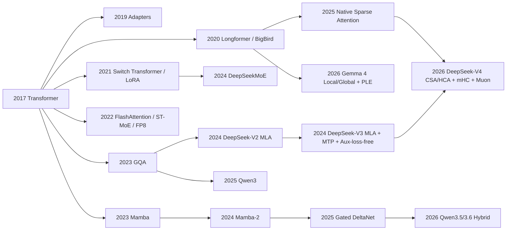

# LLM模型架构与关键算子演进研究报告

## 执行摘要

过去三年里，LLM 架构演进的主线并不是“彻底抛弃 Transformer”，而是围绕 Transformer 做三类高收益重构：其一，降低注意力与 KV cache 的推理成本，例如 GQA、FlashAttention、MLA、局部/全局混合注意力与稀疏注意力；其二，用条件计算把“总参数”与“单 token 激活计算”解耦，例如 Sparsely-Gated MoE、Switch、ST-MoE、DeepSeekMoE 及其后续路由平衡改进；其三，以状态空间模型或线性注意力模块替换部分全注意力层，再与 Transformer 分层混搭，例如 Mamba、Mamba-2、Gated DeltaNet，以及 Qwen3.5/3.6 的混合堆栈。工业界近年的真正创新点，往往不是单一新公式，而是“算法、内核、并行、低精度格式、路由策略”的联动设计。citeturn23view0turn22view0turn39view0turn24view1turn24view3turn27view0turn28view0turn27view2turn19view1turn19view0turn31view0turn31view1

如果只看“低风险、易落地、对现有生态最友好”的路线，**Transformer + GQA + FlashAttention + LoRA/ZeRO/FP8** 仍是最稳妥组合：Qwen3 的 dense 主干仍沿用 GQA、SwiGLU、RoPE、RMSNorm，只是在 QKV bias、QK-Norm、thinking budget 等环节做了工程化升级；GQA 原论文也明确给出“接近 MHA 质量、接近 MQA 速度”的结论。换言之，GQA 已从“研究优化”演变为“工业默认项”。citeturn21view0turn22view0turn37view2turn39view0turn11search1turn11search2

如果目标是“旗舰质量/成本比”，**MoE** 已从 2017 年的概念验证，演进到可以在前沿开源模型中长期稳定训练与部署的主流方案。关键转折点包括：Switch Transformer 用 top-1 router 简化稀疏门控并显著提速；ST-MoE 将注意力从“能训起来”推进到“可迁移、可微调”；StableMoE 和 Expert Choice 等工作正面处理路由抖动与负载均衡；DeepSeekMoE 用“细粒度专家分割 + shared experts”强化专门化；DeepSeek-V3 则把“辅助损失负载均衡”进一步推进到“基于 per-expert bias 的 auxiliary-loss-free 批级平衡”。今天的 MoE 竞争，本质上已从“要不要稀疏”切换到“如何路由、如何并行、如何不掉 token、如何不让专家退化”。citeturn25view0turn24view1turn26view0turn24view4turn42search11turn24view3turn14view1turn14view2

如果目标是“长上下文的实际经济性”，目前公开证据最强的路线并不是纯全注意力，而是**压缩/稀疏/局部-全局混合**。DeepSeek-V2 的 MLA 通过低秩联合压缩 K/V，把 KV cache 压到远低于 MHA；DeepSeek-V3 在 MLA 之上再叠加 MTP 与 MoE；Gemma 4 用 sliding-window + global attention 的交错堆栈，辅以统一 K/V 与 p-RoPE；DeepSeek-V4 则进一步走到 CSA + HCA 的混合压缩注意力，在官方说明中给出 1M 上下文下 DeepSeek-V4-Pro 只需 DeepSeek-V3.2 约 27% 单 token 推理 FLOPs 和 10% KV cache 的结果。最近的 Native Sparse Attention 与 Switch Attention 则代表了“原生可训练稀疏模式”和“按 token 动态选择 full/local 分支”的研究前沿。citeturn36view0turn37view2turn13view0turn29view0turn30view3turn31view0turn31view1turn40search0turn41view0

状态空间与线性注意力并没有消失，相反，它们正在成为“混合骨干”的重要部件。Mamba 给出 selective SSM，在长序列上获得线性扩展与更高吞吐；Mamba-2 通过 SSD 框架将其进一步统一到更一般的结构化状态空间视角，并报告 2–8 倍于 Mamba 的速度；Gated DeltaNet 则把“门控擦除”和“delta rule 精确写入”结合起来，在论文摘要里直接报告其在语言建模、常识推理、检索、长度外推和长上下文理解上持续超越 Mamba2 与 DeltaNet。真正值得关注的现实趋势是：纯 SSM 主干仍不是主流落地方向，但 **SSM/Delta 模块与全注意力的混合分层堆栈**，已经进入 Qwen3.5/3.6 等生产模型。citeturn27view0turn28view0turn27view2turn27view3turn19view1turn19view0

截至 2026-05-21，就公开资料的“前沿开源代表”来看，可以把三条路线粗略概括为：**DeepSeek-V3/V4** 代表“MLA/压缩稀疏注意力 + MoE + 极致系统优化”，**Qwen3.5/3.6** 代表“Gated DeltaNet 混合注意力 + 稀疏 MoE + agentic/coding 强化”，**Gemma 4** 代表“局部/全局交错注意力 + PLE + 小模型端侧参数效率”。这三条线共同说明：近期创新不是单点替换，而是“多种算子在不同层位各司其职”的架构组合。citeturn13view0turn31view0turn31view1turn19view1turn19view0turn16view0turn29view0turn30view3

## 研究范围与方法假设

本文优先覆盖 2023–2026 年的公开创新，同时保留 2017–2022 年中仍然决定今天设计边界的经典里程碑，包括 Transformer、早期 MoE、Adapter/LoRA、Longformer/BigBird、FlashAttention、ZeRO 与 FP8。为保证可核验性，正文优先引用原始论文、官方技术报告、官方模型卡、官方 repo 和厂商技术文档；对 **Qwen3.6** 与 **DeepSeek-V4** 这类非常新的模型，当前公开信息主要来自官方 repo、模型卡和 preview 发布页，而不是像 Transformer、GQA、Mamba 一样已经有较稳定的论文叙事，因此某些细节只能标注为“未完全公开”。citeturn16view0turn19view0turn18view0turn31view0turn31view1turn31view2

本文按六个维度评价方法：参数效率、计算效率、推理延迟、训练成本、可扩展性、适用场景。这里“参数效率”对 PEFT 指可训练参数占比，对 MoE 指单 token 激活参数与总参数的解耦；“计算效率”同时看理论复杂度、KV/激活内存、以及论文或模型卡给出的 wall-clock/吞吐；“训练成本”则优先采用作者公开的 GPU 小时、训练 token 量或精度/并行框架说明。未指定硬件、数据集与服务框架时，本文统一按“无特定约束”处理；跨厂商 benchmark 只在原作者给定评测 harness 的范围内使用，不做无条件横向排名。 

下表中“作者/机构”优先写论文作者或官方团队名；若官方页面未直接给出机构，则不强行补全，以避免把二手记忆当作可核验事实。对未公开的层级超参、kernel 细节或内部训练 recipe，报告明确标注“未公开”而不做猜测。 

## 时间线与代际关系



这条演化线可以概括为三波。第一波是 **Transformer 把“表达力”和“GPU 友好并行”统一起来**，随后 Adapter、LoRA、MoE、Longformer/BigBird 等方向分别从“参数适配”“条件计算”“长上下文”三个角度补足弱点。第二波是 **IO-aware 与 KV-aware**：FlashAttention 让 dense attention 的 GPU 执行效率真正接近 GEMM，GQA/MQA/MLA 则把解码阶段的 KV cache 从“默认瓶颈”变成“可工程化优化对象”。第三波是 **混合化**：纯 attention、纯 MoE、纯 SSM 都不再是唯一答案，越来越多前沿模型采用“全注意力层 + 线性/局部注意力层 + 稀疏专家层 + 多 token 预测头 + 低精度 kernel”的分层协作。citeturn23view0turn10search0turn40search2turn40search3turn24view1turn4search3turn39view0turn22view0turn36view0turn24view3turn13view0turn27view0turn28view0turn27view2turn40search0turn21view0turn19view1turn19view0turn29view0turn31view0turn31view1

从“谁影响了谁”的角度看，GQA 是今天大多数 dense Transformer 长解码设计的保守延续；MoE 从 Shazeer 到 Switch 再到 DeepSeekMoE，说明稀疏容量扩张已经从研究技巧变成一级设计变量；Mamba 到 Gated DeltaNet 则说明“状态更新”开始重新进入主流语言模型的骨架层；而 Gemma 4、Qwen3.5/3.6、DeepSeek-V4 共同指向一个更现实的结论：**未来大模型更像异构算子平台，而不是单一算子霸权**。citeturn22view0turn25view0turn24view1turn24view3turn27view0turn28view0turn27view2turn29view0turn19view1turn19view0turn31view0turn31view1

## 核心架构演进分析

今天绝大多数 LLM 设计，可以先压缩为五个“共同接口”。Transformer 的核心仍是  
\[
\mathrm{Attn}(Q,K,V)=\mathrm{softmax}(QK^\top/\sqrt{d_k})V
\]
其最大工程问题是 \(QK^\top\) 的二次复杂度，以及自回归解码时逐层累积的 KV cache。citeturn23view0turn39view0

GQA 把 query 头数与 KV 头数解耦，可视为令 \(h_q > h_{kv}\)，使多组 query 共享更少的 K/V；MoE 的共性形式则是  
\[
y=\sum_{e\in \mathrm{TopK}(g(x))} p_e(x)\,E_e(x)
\]
挑战不在公式本身，而在路由抖动、负载不均衡、跨节点 All-to-All 和 token dropping。LoRA 的标准写法则是  
\[
W' = W + BA,\quad \mathrm{rank}(BA)=r \ll \min(d,k)
\]
把“学全量权重”改写成“学低秩增量”。citeturn22view0turn25view0turn24view1turn26view0turn14view1turn4search3

MLA 的关键在于先把 K/V 联合压到潜变量 \(c_t^{KV}\)，再由上投影恢复参与注意力的表示；生成时主要缓存 \(c_t^{KV}\) 与少量解耦位置编码相关分量，而不是完整 K/V。MTP 则把训练目标从“只预测下一个 token”扩展到“同时预测未来多个 token”，在 DeepSeek-V3 的公开报告中，第二个 token 的接受率达到 85%–90%，配合 speculative decoding 可把吞吐提升到 1.8 倍。citeturn36view0turn14view0turn13view0

下面的矩阵把用户关心的核心架构、关键算子与代表模型放在同一张图里。

| 条目 | 发表/发布与来源 | 原理与动机 | 实现要点与工程难点 | 优点、缺点与适用场景 | 已知性能/成本 |
|---|---|---|---|---|---|
| Transformer 原始设计 citeturn23view0 | 2017，Vaswani 等 | 用全注意力替代 RNN/CNN，把长依赖建模与大规模并行统一起来。核心由多头自注意力、位置编码、FFN、残差和归一化组成。 | 最成熟的实现路径是 fused QKV、FlashAttention、张量并行、KV cache；难点始终是 \(O(n^2)\) 复杂度与长上下文推理的显存压力。 | **优点**：质量上限高、生态最强、训练与推理基础设施最完整。**缺点**：长序列成本高。**适用**：通用基础模型、需要最强兼容性的场景。 | 原论文在 WMT14 En-De 上达 28.4 BLEU，在 En-Fr 上达 41.8 BLEU，并在 8 GPU、3.5 天内完成单模型训练。citeturn23view0 |
| GQA citeturn22view0turn37view2 | 2023，Ainslie 等 | 介于 MHA 与 MQA 之间：query 头保留较多，KV 头做分组共享，以更低 KV cache 换取接近 MHA 的质量。 | 关键超参是分组数；迁移到已有 checkpoint 时，论文给出只需原始预训练约 5% 计算量的 uptraining recipe。工程上通常与 KV cache paging、tensor parallel 一起调优。 | **优点**：低风险、易替换、解码速度提升明显。**缺点**：仍是二次 attention，且质量通常略逊于满配 MHA。**适用**：绝大多数 dense Transformer。 | 论文报告：uptrained GQA 质量接近 MHA、速度接近 MQA；DeepSeek-V2 的 7B 对比也显示 GQA 明显好于 MQA，但仍落后于 MHA。citeturn22view0turn37view2 |
| MoE 与路由器改进 citeturn25view0turn24view1turn26view0turn24view4turn24view3turn14view1turn14view2turn42search0turn42search11 | 2017–2026，Shazeer；Google；DeepSeek；等 | 核心动机是把“总容量”与“每 token 计算”解耦。早期是 Sparsely-Gated MoE；Switch 用 top-1 router 简化训练；ST-MoE 强调稳定与可迁移；StableMoE 通过蒸馏并冻结 router 降低 routing fluctuation；Expert Choice 让专家反向选择 token 以强约束负载均衡；DeepSeekMoE 用“细粒度专家分割 + shared experts”增强专门化；DeepSeek-V3 用 bias 动态更新替代显式辅助损失；DSelect-k 则代表连续可微稀疏路由。 | 工程瓶颈是 router 数值稳定性、容量因子、All-to-All 通信、负载均衡与 token dropping。MoE 训练到大规模后，系统几乎和算法一样重要。 | **优点**：最强的参数扩展杠杆。**缺点**：分布式复杂度高，推理延迟不一定随“激活参数少”同比下降。**适用**：旗舰模型、知识容量敏感任务。 | 原始 MoE 论文称参数容量可提高 1000× 以上而仅带来较小效率损失；Switch 报告同资源下预训练速度最高提升约 7×，相对 T5-XXL 最高 4×；DeepSeekMoE 16B 与 LLaMA2 7B 相当但仅约 40% 计算，145B 预备实验对比 DeepSeek 67B 仅需 28.5% 甚至 18.2% 计算；V3 的 aux-loss-free 策略在多项评测上优于纯 auxiliary-loss 路线。citeturn25view0turn24view1turn24view3turn14view1 |
| MLA 与 DeepSeek-V3 citeturn36view0turn37view2turn13view0turn14view0turn14view1turn14view2 | MLA 首发于 DeepSeek-V2（2024/05）；V3 技术报告发布于 2024/12，DeepSeek-AI | MLA 用低秩联合压缩 K/V，缓存潜变量而非完整 K/V；V3 在此基础上叠加 DeepSeekMoE、auxiliary-loss-free 负载平衡和 MTP。MTP 的本质是为每个位置附加多个未来深度的 CE loss。 | MLA 的难点在于低秩投影、RoPE 解耦、Tensor/Expert Parallel 下的 kernel 与缓存组织；V3 的难点在于批级负载平衡、node-limited routing、无 token dropping 的系统实现。 | **优点**：在公开路线里，MLA 是目前最强的 KV cache 压缩范式之一；V3 在开放权重模型里实现了极高性能/成本比。**缺点**：需要自定义 kernel 和部署栈，通用框架适配难度高于 GQA。**适用**：高吞吐长上下文服务、大规模 MoE。 | DeepSeek-V2 相比自家 67B dense 节省 42.5% 训练成本、降低 93.3% KV cache、最高生成吞吐提高 5.76×；在附录对比中，MLA 相对 MHA 只用小模型约 14%、大模型约 4% 的 KV cache，且性能更好。DeepSeek-V3 为 671B 总参/37B 激活、14.8T token 预训练，全流程仅 2.788M H800 GPU 小时；第二 token 接受率 85%–90%，带来 1.8× TPS。citeturn36view0turn37view2turn13view0 |
| Mamba 与 Mamba-2 citeturn27view0turn28view0 | 2023/12 与 2024/05，Albert Gu、Tri Dao | Mamba 的核心是 selective SSM：让状态空间模型参数依赖输入，从而补足传统 SSM 缺乏内容感知的弱点；Mamba-2 通过 SSD 框架把 SSM 与 attention 放进更一般的结构化半可分矩阵统一视角。 | 工程要点是“训练时并行，推理时递归”之间的切换，以及 state update kernel 的高效实现。Mamba-2 相比 Mamba 更强调理论统一与现代硬件上的并行友好性。 | **优点**：长序列线性扩展、吞吐高。**缺点**：生态弱于 Transformer，很多真实任务里仍需和注意力混合。**适用**：超长序列、带宽受限推理、研究型新骨干。 | Mamba 论文报告 5× 于 Transformer 的推理吞吐，3B 模型优于同规模 Transformer 并接近 2× 参数的 Transformer；Mamba-2 报告在保持竞争力的同时比 Mamba 快 2–8×。citeturn27view0turn28view0 |
| Gated DeltaNet citeturn27view2turn27view3 | 2024/12 预印本，2025 ICLR；Songlin Yang、Jan Kautz、Ali Hatamizadeh；NVIDIA 官方实现 | 论文明确指出：gating 负责快速擦除旧记忆，delta rule 负责精确写入新信息，两者互补。Gated DeltaNet 通过“带门控的 delta update”补强 Mamba2/线性注意力在检索和长上下文任务上的不足。 | 工程关键是并行训练算法与 kernel；官方 repo 已给出 PyTorch 实现，并明确说明其后续被整合进 Qwen3.5 与 OLMo Hybrid。 | **优点**：对长上下文、检索、长度外推更有吸引力；很适合做混合注意力栈里的高效层。**缺点**：公开摘要未给统一 wall-clock 数字，部署生态仍在形成。**适用**：长上下文、代码/代理模型的高效 backbone。 | 摘要报告其在语言建模、常识推理、检索、长度外推与长上下文理解上持续优于 Mamba2 与 DeltaNet；具体统一吞吐/训练成本数字在摘要中未公开。citeturn27view2 |
| 稀疏注意力、局部/全局混合、分层/多尺度注意力 citeturn40search2turn40search3turn40search0turn41view0turn41view1turn30view3 | 2020–2026，Longformer、BigBird、NSA、Switch Attention、HSA、Gemma 4 等 | Longformer 把局部窗口与任务驱动 global attention 结合；BigBird 用滑窗 + 随机 + 全局 token 的稀疏图，并给出理论性质；NSA 进一步做“可原生训练、硬件对齐”的分层稀疏；Switch Attention 让每个 token 在每层动态选择 full 或 sliding-window 分支；Hierarchical Self-Attention 则把多尺度结构直接写进 attention 最优化形式。 | 真正难点在于稀疏模式必须和 GPU kernel 对齐，否则理论复杂度下降未必带来 wall-clock 收益。层级/多尺度方法还要处理数据结构、掩码与位置编码的一致性。 | **优点**：长上下文成本显著下降；局部/全局混合通常比纯 sparse 更稳。**缺点**：实现复杂、benchmark 强依赖评测任务。**适用**：文档、代码库、多文档代理、层级或多尺度输入。 | BigBird 报告可在相似硬件上处理 8× 更长序列，并保留 sparse Transformer 的理论表达能力；NSA 报告在 64K 长度下于 decode/forward/backward 均获得显著加速，同时在综合长上下文评测上与 Full Attention 持平或更好。citeturn40search3turn40search0 |
| Gemma 4：PLE 与局部/全局混合注意力 citeturn29view0turn30view0turn30view3 | 2026/04，Google | Gemma 4 采用 local sliding-window 与 full global attention 交错堆栈，最后一层总是 global；global 层使用 unified K/V 与 p-RoPE。小模型引入 PLE，让每一层都有自己的小 embedding 来提高端侧参数效率。 | PLE 的实现不是简单再加一层 embedding，而是把“token 表示对不同层的供给”部分拆分出来；global/local 交错则要求不同注意力类型的缓存和位置编码策略并行存在。 | **优点**：端侧友好，small model 的“effective params”概念非常实用；long-context 与 multimodal 兼顾。**缺点**：一些 trick（如 PLE）尚未成为通用生态标准。**适用**：消费级 GPU、边端部署、需要多模态但又要控制成本的场景。 | Google 官方模型卡给出的结构包括：E2B/E4B 使用 PLE，31B dense 与 26B A4B MoE 支持 256K context；31B dense 在 MMLU-Pro、AIME 2026、LiveCodeBench v6 上分别为 85.2、89.2、80.0，26B A4B 分别为 82.6、88.3、77.1。citeturn29view0turn30view0 |
| Qwen3 与 Qwen3.5/3.6 的架构升级 citeturn21view0turn19view1turn19view0turn18view0turn16view0 | Qwen3：2025/05；Qwen3.5/3.6：2026/02–04；Qwen Team / 阿里巴巴 | Qwen3 dense 主干仍是 Transformer：GQA、SwiGLU、RoPE、RMSNorm，去掉 QKV bias，引入 QK-Norm；Qwen3 MoE 采用 128 experts / 8 active、去掉 shared experts、采用 global-batch load balancing。到 Qwen3.5/3.6，则显式转向 **Gated DeltaNet + Gated Attention** 的混合堆栈，并在 MoE 版中加入 sparse MoE 与 MTP。 | 从 Qwen3 到 3.5/3.6 的关键不是“更大”，而是“把长上下文高效层插入主干”。模型卡公开了非常具体的 hidden layout：Qwen3.5-397B-A17B 为 15×(3×(Gated DeltaNet→MoE)→1×(Gated Attention→MoE))，Qwen3.6-27B 为 16×(3×(Gated DeltaNet→FFN)→1×(Gated Attention→FFN))，Qwen3.6-35B-A3B 为 10×(3×(Gated DeltaNet→MoE)→1×(Gated Attention→MoE))。 | **优点**：Qwen3 仍保留 Transformer 家族兼容性；Qwen3.5/3.6 在 coding/agent 方向给出很强的效率收益。**缺点**：Qwen3.6 尚无完整技术报告，很多系统细节来自模型卡而非系统论文。**适用**：多语言、大规模 agentic coding、长上下文推理。 | Qwen3 预训练 36T token、支持 119 种语言/方言；Qwen3.5-397B-A17B 为 397B 总参/17B 激活、262K 原生上下文并可扩展到约 1.01M；Qwen3.6-27B 在 Qwen 自家 benchmark 上的 SWE-bench Verified 为 77.2，略高于 Qwen3.5-397B-A17B 的 76.2；Qwen3.6-35B-A3B 为 73.4。citeturn21view0turn19view1turn19view0turn18view0 |
| DeepSeek-V4：混合压缩注意力与 1M 上下文 citeturn31view0turn31view1turn31view2 | 2026/04 预览发布，DeepSeek-AI | V4 在保留 DeepSeekMoE 与 MTP 的基础上，引入三项核心创新：CSA + HCA 混合注意力、mHC（把残差映射约束到双随机矩阵流形/Birkhoff polytope）、Muon optimizer。 | 对实现者来说，V4 真正难的是 sequence 维压缩、多级索引与压缩注意力的 cache 组织，以及与混合精度内核的协同。当前官方公开仍以模型卡与 preview 为主，层级配比、indexer 细节未完全公开。 | **优点**：目前公开开源体系里，对 1M 上下文“可用性/经济性”的推进最激进。**缺点**：仍是 preview 级公开；部署规模极大；很多系统细节尚不如 V3 报告那样完备。**适用**：代码库级代理、多文档推理、1M 上下文应用。 | 官方页面给出：DeepSeek-V4-Pro 为 1.6T 总参/49B 激活，Flash 为约 284–285B 总参/13B 激活，均支持 1M context；在 1M 上下文下，V4-Pro 只需 DeepSeek-V3.2 约 27% 的单 token 推理 FLOPs 与 10% 的 KV cache。模型下载表还显示 released instruct 版本采用 FP4+FP8 mixed，base 版本为 FP8 mixed。citeturn31view0turn31view1 |

有两个容易被忽视但非常关键的判断。第一，**最近三年的“架构创新”多半直接服务于 decode / memory / routing，而不是单纯提升 pretraining perplexity**；这是为什么 GQA、MLA、MTP、FlashAttention、FP8/FP4 的工业价值很高。第二，**新模型很少“纯替换”旧算子，而是按层混搭**：Gemma 4 混 local/global，Qwen3.5/3.6 混 Gated DeltaNet/Gated Attention/MoE，DeepSeek-V4 混 CSA/HCA/MoE/MTP。对实现者来说，这比单算子更难，但也是现实性能的来源。citeturn39view0turn22view0turn36view0turn13view0turn29view0turn19view1turn19view0turn31view0turn31view1

## 关键算子与系统优化

如果把“模型架构”进一步拆成“能在 GPU/集群上真正跑快的关键算子”，最近三年的公共知识已经相当清晰：**attention 的热点在 tile/block/sparse，MoE 的热点在 routing+dispatch+all-to-all，训练系统的热点在 ZeRO/SP/SAR/FP8/FP4，适配的热点在低秩与激活缩放类 delta modules**。citeturn39view0turn24view1turn11search1turn11search3turn11search8turn11search2turn31view0

```python
# DeepSeek-V3 的 auxiliary-loss-free router，可抽象为：
scores = affinity(x) + bias
route  = topk(scores, k)

for expert in experts:
    if load(expert) > target:
        bias[expert] -= eta
    else:
        bias[expert] += eta
```

这段伪代码并非逐字符复刻论文，而是把其公开机制压缩成实现者可直接理解的形式：top-k 决策仍看“affinity + bias”，但 FFN 输出权重仍来自原 affinity；每步根据 batch 级负载对 expert bias 做增减，从而在不把 auxiliary loss 硬加到主目标上的情况下完成负载均衡。citeturn14view1turn14view2

| 关键算子/系统 | 代表工作或官方实现 | 为什么重要 | 实现难点与工程注意事项 | 公开性能/成本信息 |
|---|---|---|---|---|
| 分块精确注意力 | FlashAttention / FlashAttention-2 / FlashAttention-3 beta citeturn39view0turn38view1turn38view2 | 把 attention 从“算子公式”变成“IO-aware 内核问题”，通过 tile 化降低 HBM↔SRAM 往返。 | 关键不是修改模型，而是重写 kernel 调度：block 划分、warp 分工、shared memory 读写、数值稳定 softmax 累加。不同 GPU 架构的最佳实现差异很大。 | FlashAttention 报告 BERT-large 端到端提速 15%，GPT-2 约 3×，Long Range Arena 约 2.4×；FlashAttention-2 相比 FlashAttention 再约 2×，单 A100 可达 225 TFLOPs/s、约 72% MFU。citeturn39view0turn38view1 |
| 块稀疏/原生稀疏注意力 | block-sparse FlashAttention、BigBird、Longformer、NSA、DeepSeek Sparse Attention/CSA citeturn39view0turn40search2turn40search3turn40search0turn31view1turn40search12 | 在长上下文中，把“看所有 token”改成“看局部窗口 + 看少量关键压缩块/全局 token”。 | 稀疏模式必须硬件对齐；随机稀疏、层级稀疏、压缩后 top-k 选择各自对 kernel 友好度不同。训练阶段若稀疏模式不可微或不可原生训练，效果容易差。 | BigBird 理论上保留 sparse Transformer 的表达能力并处理更长序列；NSA 在 64K 上于 decode/forward/backward 都有显著速度收益，并保持与 Full Attention 相当甚至更好的任务表现。citeturn40search3turn40search0 |
| KV 压缩与共享 | GQA、MLA、Gemma 4 unified K/V citeturn22view0turn36view0turn30view3 | 自回归解码里，KV cache 往往比算子 FLOPs 更早成为瓶颈。 | GQA 要选 group 数；MLA 需要低秩投影与专用 kernel；混合 local/global 模型还要管理多种缓存格式。 | GQA 论文给出接近 MHA 质量、接近 MQA 速度；DeepSeek-V2 给出 93.3% KV cache 降低；Gemma 4 官方明确把 unified K/V 作为长上下文内存优化的一部分。citeturn22view0turn24view2turn30view3 |
| MoE dispatch / combine / All-to-All | Switch、ST-MoE、DeepSeek-V3/V4 | MoE 不是“多几个 FFN”那么简单，真正的系统热点在 token 到 expert 的搬运与汇总。 | capacity factor、expert parallel、跨节点全互连、token dropping、router 平衡都高度耦合。DeepSeek-V3 还引入 node-limited routing 和 no token-dropping。 | Switch 报告最高 7× 预训练提速；DeepSeek-V3 公开了 node-limited routing、无 token dropping 与近乎全重叠的计算/通信训练框架。citeturn24view1turn26view0turn13view0 |
| 可微/稳定路由 | DSelect-k、Expert Choice、StableMoE、DeepSeek-V3 bias balancing citeturn42search0turn42search11turn24view4turn14view1turn14view2 | Router 往往决定 MoE 的真实上限：不稳就退化，不均衡就白白浪费专家。 | DSelect-k 把 top-k 路由写成连续可微稀疏门；Expert Choice 让专家反选 token 保证负载；StableMoE 先学 router 再冻结；DeepSeek-V3 则以 batch 监控 + bias 更新避免主 loss 被 auxiliary loss 扭曲。 | DSelect-k 在论文任务上显著优于传统 top-k；Expert Choice 官方称可保证完美负载平衡；StableMoE 直接改进收敛与性能。citeturn42search0turn42search11turn24view4 |
| 低精度 GEMM / 稀疏矩阵乘 | FP8 Formats、DeepGEMM、FlashMLA、TileKernels citeturn11search2turn38view3 | 当 attention、MLP、expert GEMM 都进入低精度和大批量 regime 后，矩阵乘内核往往决定总体成本。 | 低精度不是“把类型改成 FP8”这么简单，还要处理缩放因子、累加精度、通信与存储格式。MLA/Sparse Attention 通常还需要定制 kernel。 | FP8 论文报告在多种图像/语言任务上与 FP16/BF16 结果匹配；DeepSeek 已开源 DeepGEMM 与 FlashMLA，说明其把 GEMM 与 MLA kernel 视作一等公民。citeturn11search2turn38view3 |
| 激活内存优化 | Sequence Parallelism + Selective Activation Recomputation citeturn11search3turn11search8turn11search0 | 今天更实用的“激活压缩”路线，不是通用有损压缩，而是**少存、分序列切、必要时重算**。 | 需要与 tensor parallel/pipeline parallel 协同；过度重算会显著降低 wall-clock。 | Megatron/MLSys 结果显示可把 activation memory 降低约 5×，并把重算带来的时间开销降低 90% 以上。citeturn11search8 |
| 参数高效微调算子 | Adapter、IA3、LoRA、AdaLoRA、DoRA、OpenDelta/Delta Tuning citeturn10search0turn10search1turn4search3turn10search2turn9search3turn9search1turn10search3 | 对绝大多数团队来说，真正要频繁做的不是从零训 1T 模型，而是在已有底座上做低成本适配。 | 选什么位置插模块、是否引入额外推理延迟、rank 如何分配、量化后是否仍稳定，是 PEFT 成败关键。 | Adapter 在 GLUE 上只加约 3.6% 参数即可接近全量微调；LoRA 在 GPT-3 175B 例子中把可训练参数减少约 10,000×、显存降约 3×；AdaLoRA 在低预算下优于 LoRA；DoRA 在多个任务上稳定优于 LoRA 且不引入额外推理开销。citeturn10search0turn4search3turn10search2turn9search3 |
| 并行与混合精度训练 | ZeRO、FP8、DeepSeek-V3/V4 mixed precision citeturn11search1turn11search2turn12search1turn31view0 | 没有并行与低精度，现代 LLM 架构优势很难转化为真实训练成本下降。 | 需要统一考虑 optimizer states、激活、参数、通信、checkpoint 与容错；不同层未必都适合相同精度。 | ZeRO 论文指出可在有限显存下训练到百亿乃至万亿参数级；FP8 论文显示可匹配 FP16/BF16 结果；DeepSeek-V3 官方确认其大规模验证了 FP8 mixed precision，V4 release card 则给出了 FP8 mixed 与 FP4+FP8 mixed 的公开发布形态。citeturn11search1turn11search2turn12search1turn31view0 |

对实现者最重要的结论是：**真正昂贵的不是“一个新模块”，而是模块之间的接口**。例如，GQA 很容易接入现有 Transformer；MLA 的价值更高，但需要内核、cache 格式、并行切分一起配合；Gated DeltaNet 和稀疏注意力在数学上更高效，但如果缺少相应 kernel，实际收益会被实现损耗吃掉。也因此，近年最强的前沿模型几乎都把“算子 co-design”写进了核心叙事，而不再只谈 perplexity。citeturn39view0turn36view0turn27view2turn40search0turn38view3turn12search1

## 综合比较与推荐阅读顺序

### 架构路线综合比较

| 方法 | 参数效率 | 计算效率 | 推理延迟 | 训练成本 | 可扩展性 | 最适用场景 |
|---|---|---|---|---|---|---|
| Transformer MHA citeturn23view0turn39view0 | 低 | 中 | 中到高 | 高 | 高，但长上下文受二次复杂度约束 | 通用基础模型、最强生态兼容 |
| GQA citeturn22view0turn37view2 | 中 | 中到高 | 低于 MHA | 低到中 | 高 | 几乎所有 dense LLM 的解码优化 |
| MoE citeturn25view0turn24view1turn24view3 | 很高 | 高 | 中，取决于路由与通信 | 中到高，但容量/算力比优秀 | 很高 | 旗舰级知识容量、开源前沿模型 |
| MLA citeturn36view0turn37view2 | 与参数效率关系较弱，但**内存效率极高** | 高，尤其 decode | 显著降低长解码瓶颈 | 中，需要专用 kernel | 很高 | 长上下文高吞吐服务 |
| Mamba / Mamba-2 citeturn27view0turn28view0 | 中 | 长序列下很高 | 低 | 中 | 很高 | 超长序列、带宽受限推理 |
| Gated DeltaNet citeturn27view2turn27view3 | 中到高 | 高 | 低 | 中，依赖新 kernel | 高 | 混合长上下文 backbone、coding/agent |
| Gemma 4 混合注意力 + PLE citeturn29view0turn30view0turn30view3 | 小模型很高 | 高 | 中到低 | 官方未公开完整训练成本 | 高 | 端侧/消费级设备、多模态长上下文 |
| Qwen3.5/3.6 Hybrid citeturn19view1turn19view0turn18view0 | 很高 | 高 | 低到中 | 完整公开训练成本未见 | 很高 | agentic coding、长上下文、多语言 |
| DeepSeek-V3 citeturn13view0turn36view0 | 很高 | 很高 | 低 | 对同档模型极优 | 很高 | 开源旗舰、强性能/成本比 |
| DeepSeek-V4 citeturn31view0turn31view1 | 很高 | 1M 上下文下极高 | 长上下文相对很低 | 细节未完全公开 | 极高 | 百万上下文代理、多文档推理 |

上表如果压缩成一句话：**默认选 GQA；追求旗舰参数效率选 MoE；追求长上下文经济性选 MLA/压缩稀疏混合；愿意押注新骨干则看 Mamba/Gated Delta 的混合化落地。** 其中，Gemma 4、Qwen3.5/3.6、DeepSeek-V3/V4 分别代表了当下最值得看的三种工程答案。citeturn29view0turn19view1turn19view0turn13view0turn31view0turn31view1

### 参数高效微调算子比较

| PEFT 方法 | 核心算子 | 训练参数量 | 推理额外开销 | 优点 | 缺点 | 适用场景 |
|---|---|---|---|---|---|---|
| Adapter citeturn10search0 | 在层内插入 bottleneck MLP | 小 | 有额外前向路径 | 任务隔离清晰、可组合 | 在线短序列场景有额外延迟 | 多任务服务、模块化复用 |
| IA3 citeturn10search1turn10search5 | 学习少量激活缩放向量 | 极小 | 极低 | 参数最省、实现简单 | 表达能力受限 | 低资源快速适配 |
| LoRA citeturn4search3turn4search11 | 低秩权重增量 \(BA\) | 极小到很小 | 通常可忽略 | 工业默认、生态最强 | rank 分配需要经验 | SFT、DPO、偏好微调、行业落地 |
| AdaLoRA citeturn10search2 | 按重要性动态分配 rank | 很小 | 通常可忽略 | 预算固定时更优 | 实现复杂于 LoRA | 参数预算严格受限的适配 |
| DoRA citeturn9search3turn9search15 | 幅值/方向分解 + LoRA | 很小 | 通常可忽略 | 常优于 LoRA、稳定性更好 | 调参与实现更复杂 | 难任务、追求接近全量微调 |
| Delta Tuning 总论 / OpenDelta citeturn9search1turn9search9turn10search3 | 统称“只训练少量 delta 模块” | 视方法而定 | 视方法而定 | 形成统一框架，便于组合 | 需要根据底座与任务选型 | 企业内部 PEFT 基座与实验平台 |

对大多数团队，**LoRA 仍是默认起点，DoRA 是精度更敏感时的升级项，Adapter 更适合任务模块库，IA3 适合极低预算，AdaLoRA 适合 rank 预算固定又不想手工分配时**。这并不矛盾于最近的大模型架构创新；相反，PEFT 的现实意义恰恰在于：绝大多数组织不会亲自训练 DeepSeek-V4 或 Qwen3.5 这种级别的底座，却会长期需要在这些底座上做领域适配。citeturn4search3turn9search3turn10search0turn10search1turn10search2turn9search1

### 推荐阅读顺序

| 阅读阶段 | 先读什么 | 为什么这样排 | 核心来源 |
|---|---|---|---|
| 先建立最小公共语言 | 读 Transformer 原始论文，再读 FlashAttention | 先搞清“标准注意力为什么强”，再理解“为什么 attention 在 GPU 上真正慢”。 | *Attention Is All You Need* citeturn23view0；*FlashAttention* / *FlashAttention-2* / 官方 repo citeturn39view0turn38view1turn38view2 |
| 再看最稳的推理优化路线 | GQA → Qwen3 技术报告 | GQA 是理解现代 dense LLM 的第一步；Qwen3 则展示了成熟 Transformer 家族今天的默认配置。 | *GQA* citeturn22view0；*Qwen3 Technical Report* citeturn21view0 |
| 随后看 MoE 的主线 | Sparsely-Gated MoE → Switch → ST-MoE → DeepSeekMoE → DeepSeek-V3 | 这是从“概念验证”到“旗舰开源落地”的完整路由/专家演进链。 | 原始 MoE citeturn25view0；*Switch Transformers* citeturn24view1；*ST-MoE* citeturn26view0；*DeepSeekMoE* citeturn24view3；*DeepSeek-V3* citeturn13view0 |
| 再看 KV 压缩与长上下文 | DeepSeek-V2 MLA → DeepSeek-V3 → Gemma 4 → DeepSeek-V4 | 这是理解“长上下文不是只靠更大显存”的最短路径。 | *DeepSeek-V2* citeturn36view0；*DeepSeek-V3* citeturn13view0；Gemma 4 模型卡 citeturn29view0；DeepSeek-V4 模型卡/预览页 citeturn31view0turn31view1 |
| 若对替代骨干感兴趣 | Mamba → Mamba-2 → Gated DeltaNet → Qwen3.5/3.6 | 这条线解释了为什么今天很多前沿模型不是纯 SSM，而是“SSM/Delta + Attention”的混合层。 | *Mamba* citeturn27view0；*Mamba-2* citeturn28view0；*Gated Delta Networks* 和官方实现 citeturn27view2turn27view3；Qwen3.5/3.6 模型卡与 repo citeturn19view1turn19view0turn16view0 |
| 若对稀疏/混合注意力有兴趣 | Longformer / BigBird → NSA → Switch Attention / HSA | 先看经典稀疏图，再看最近三年的“硬件对齐”和“动态切换/分层化”新方向。 | *Longformer* citeturn40search2；*BigBird* citeturn40search3；*Native Sparse Attention* citeturn40search0；*Switch Attention* citeturn41view0；*Hierarchical Self-Attention* citeturn41view1 |
| 最后看系统与适配 | ZeRO → Sequence Parallelism/SAR → FP8 → LoRA/DoRA | 到这里再看系统，会更容易理解为什么“同一个架构”在不同训练栈上成本差别会这么大。 | *ZeRO* citeturn11search1；SP/SAR citeturn11search3turn11search8；*FP8 Formats for Deep Learning* citeturn11search2；LoRA / DoRA / Delta Tuning citeturn4search3turn9search3turn9search1 |

如果要把全文再压成一句“路线建议”，我会给出三条。第一，**做通用底座或企业应用时，不要低估 Transformer 系改良项的性价比**：GQA、FlashAttention、LoRA、ZeRO、FP8 依然是最可靠的主干。第二，**想做开源旗舰或强 agent/coding 模型时，MoE 几乎已经不是可选项，而是主选项**，但路由与系统实现比“多加几个专家”更重要。第三，**想真正把上下文拉到 10 万、100 万量级时，压缩/稀疏/局部-全局混合注意力目前比纯全注意力和纯新骨干更有工程证据**；Mamba 与 Gated Delta 的价值，更多体现在“与注意力混合后重分配层级职责”。citeturn22view0turn39view0turn4search3turn11search1turn11search2turn24view1turn24view3turn14view1turn36view0turn29view0turn31view0turn27view0turn27view2turn19view1turn19view0
