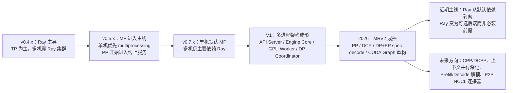

# vLLM 项目分布式推理方案演进研究报告

## 执行摘要

vLLM 的分布式推理方案，核心上经历了三段明显演进：第一阶段是 **Ray 主导的分布式执行**，在 v0.4.x 时期，官方文档把 Ray 直接作为分布式运行时，单机多卡和多机多卡都围绕 Ray 来组织，主要能力集中在张量并行；第二阶段是 **Ray 与 Python 多进程并存**，从 v0.5.x 到 v0.7.x，单机多卡开始优先走 Python native multiprocessing，Ray 逐步退到“多机仍必需/显式可选”的位置，同时流水线并行开始进入主线；第三阶段则是 **V1/MRV2 驱动的多进程原生化与 Ray 依赖剥离**，到 2026 年初，官方已经把 API Server、Engine Core、GPU Worker、DP Coordinator 拆成清晰的多进程架构，Ray 被从默认依赖中移除，data parallel 也出现了不依赖 Ray 的多机部署路径，而 MRV2 又把持久 batch、异步调度、GPU 原生输入准备、上下文并行、流水线并行和 CUDA Graph 管理系统化地重做了一遍。citeturn27view0turn27view1turn29view0turn45view1turn31view0turn32view0turn43view0

如果把“方案优劣”浓缩成一句话：**早期 Ray 架构的优势在于统一调度和跨机资源编排，劣势在于依赖重、控制面复杂、单控制器开销明显；近期去 Ray 的主路径则转向 Python 多进程 + ZMQ + PyTorch distributed/torchrun 的组合，优势是依赖面收缩、部署路径更可控、代码边界更清晰，代价是需要更明确地区分控制面与数据面，并把负载均衡、弹性、容错更多交给 vLLM 自己的 DP 协调器或外部编排系统。**这一判断，与 vLLM 官方文档、RFC、PR 描述是高度一致的。citeturn36view0turn37view0turn45view0turn45view1turn15view3turn32view0turn57view4

从工程实践看，当前最稳妥的路线已经不是“完全抛弃并行”，也不是“默认上 Ray”，而是按 workload 做分层选择：**单机多卡优先 TP，再视层切分和显存余量引入 PP；MoE 优先 DP+EP，并在 all-to-all 成本高时考虑 DBO；长上下文优先在 TP 之后再加 DCP；多机部署如果是在线服务，优先使用 vLLM 当前原生的多进程/多节点部署与外部负载均衡，仅在确实需要 Ray 生态能力时再显式启用 Ray。**但这些建议都强依赖未指定硬件参数，尤其是 GPU 型号、显存容量、节点间网络带宽/时延、是否有 InfiniBand/GDRDMA、KV heads 数量、模型是否为 MoE。本文凡是涉及“吞吐更高/延迟更低/更可扩展”的结论，都会指出其对未指定硬件的依赖。citeturn27view1turn29view0turn16view0turn16view1turn15view3turn52view0

下图先给出整体脉络图，后文再展开细节。对应证据与时间信息见后面的时间线表。citeturn27view0turn27view1turn29view0turn31view0turn32view0turn36view0turn37view0

## 演进主线与时间线

从官方版本线索看，**v0.4.2 是“Ray-only distributed runtime”的代表版本**。该版本的官方分布式文档明确写道：vLLM 支持分布式张量并行推理与服务，当前采用 Megatron-LM 的 tensor parallel 算法，并且“用 Ray 管理分布式运行时”；多机部署需要先启动 Ray runtime。与此同时，v0.4.2 的 release notes 又已经出现两条很关键的信号：一是“chunked prefill ready for testing”，二是“progress towards pipeline parallelism”和“progress towards multiprocessing based executors”。这说明在 2024 年春天，vLLM 的主线仍是 Ray，但开发方向已经开始从“只有 TP + Ray”转向“PP + MP + 更复杂调度”。citeturn27view0turn55view0turn55view1turn19academia0

**v0.5.4 是混合期的代表版本。**一方面，官方文档开始明确给出“如何选择分布式策略”的经验法则：单机多卡优先 TP；单节点装不下时用“TP + PP”，通常建议“每节点 TP、跨节点 PP”；如果模型虽然能放进单节点，但 GPU 数量不能整除模型层数，也可以用 `tp=1, pp=GPU数` 的方式做不均匀层切分。另一方面，这一版本的分布式文档已经明确写出：分布式运行时可以是 **Ray 或 Python native multiprocessing**；MP 用于单节点，多机当时仍需要 Ray；PP 作为 online serving 的 beta feature 被正式摆上台面。同一版本的 release notes 里，OpenAI server 的 HTTP 请求处理与模型推理循环已经被 ZeroMQ 解耦，并给出 **TTFT 提升约 20%、ITL 提升约 2×** 的官方说明，这对后来 V1 的“API server / engine core 分离”是重要前奏。需要强调的是，这个性能数字来自官方 release note，但其硬件、模型和负载构成在该条目中没有完整展开，因此只能作为“架构方向有效”的证据，不能直接外推到未指定硬件。citeturn27view1turn54view0

**v0.7.2 仍处在过渡期，但“默认行为”已经实质性改变。**这一版本的官方分布式文档写得更直接：单机场景下，如果没有运行在 Ray placement group 中，且本机 GPU 足够满足配置的 `tensor_parallel_size`，则默认使用 multiprocessing；否则才使用 Ray。与此同时，文档仍明确写着“多机推理当前需要 Ray”。这意味着到 v0.7.x，Ray 已经从“核心前提”退到了“多机基础设施”和“资源不足时的兜底后端”。citeturn29view0

**2026 年初的 v0.17.0 是现代分布式主线的关键转折点。**官方 release notes 把 MRV2 的成熟列为核心亮点：Pipeline Parallel PR #33960、Decode Context Parallel PR #34179、DP+EP for speculative decoding PR #35294、piecewise & mixed CUDA graph capture 与新的 ModelState 架构都被一起列出。几乎可以把 v0.17.0 看作“V1 多进程架构 + MRV2 执行内核 + 新并行能力”完成汇合的版本节点。紧接着，PR #33960 在 2026-02-17 合入，PR #34179 在 2026-02-18 合入，PR #35294 在 2026-03-03 合入，而 PR #35162 又在 2026-03-22 为 MRV2 的 PP 补齐了 piecewise/full CUDA graphs。citeturn31view0turn51view0turn51view1turn53view1turn53view2turn53view4turn52view0

**“去 Ray”并不是“一夜删除 Ray”，而是把 Ray 从默认依赖和多数主路径中剥离。**RFC #33445 在 2026-01-30 直白地写道：V1 的 PP 已经可以用 multiprocessing backend 运行；Ray 只在用户显式选择 Ray executor backend 时才需要；保持 Ray 为 CUDA/ROCm 默认依赖会带来困惑和不必要安装。随后，PR #36170 在 2026-03-09 合入，正式把 Ray 从默认依赖中移除；对应 release notes 也将“Ray removed from default dependencies”列为依赖层面的显著变更。到这个阶段，更准确的表述是：**Ray 支持仍在，但它不再是大多数部署路径的前提条件。**citeturn37view0turn32view0turn31view0

下面把关键时间点浓缩成表格，便于后续逐项展开。

| 时间信息 | 版本 / PR / Issue | 关键信号 | 对分布式推理演进的意义 |
|---|---|---|---|
| 发布页显示 05 May 04:31 | v0.4.2 | 官方分布式文档仍写明“Ray 管理分布式运行时”；release notes 同时出现“chunked prefill ready for testing”“progress towards pipeline parallelism”“progress towards multiprocessing based executors”。 citeturn27view0turn55view0turn55view1 | Ray 主导期，但已经露出 PP/MP 的技术路线。 |
| 发布页显示 05 Aug 22:38 | v0.5.4 | 官方文档明确单机可用 multiprocessing、多机仍需 Ray；PP 进入 online serving beta；release notes 记录 ZeroMQ 分离 HTTP 与推理循环，TTFT 约提升 20%、ITL 约提升 2×。 citeturn27view1turn54view0 | 进入 Ray/MP 并存期，控制面和推理面开始解耦。 |
| 发布页显示 06 Feb 07:30 | v0.7.2 | 单机默认 MP，只有不满足本机资源或 placement group 条件时才走 Ray；多机仍主要依赖 Ray。 citeturn29view0turn55view2turn55view3 | Ray 从“默认必经之路”退到“多机与可选后端”。 |
| 2026-02-17 | PR #33960 | MRV2 增加 Pipeline Parallel，并引入封装 PP 逻辑的 `PPHandler`。 citeturn51view0turn51view1 | 新执行内核开始系统接管 PP。 |
| 2026-02-18 | PR #34179 | MRV2 增加 Decode Context Parallel，并声明“有 CUDA graph 支持”。 citeturn53view1turn53view2 | 长上下文 decode 的 KV 分片进入主线。 |
| 2026-03-03 | PR #35294 | MRV2 补齐 DP+EP speculative decoding，修复 idle DP rank 在 spec decode 下的 EP 通信问题。 citeturn53view4 | MoE 分布式组合场景更完整。 |
| 2026-03-07 | v0.17.0 | release notes 把 PP、DCP、DP+EP spec decode、CUDA graphs、ModelState 一起列为 MRV2 成熟里程碑。 citeturn31view0 | V1/MRV2 成为现代主线。 |
| 2026-03-09 | PR #36170 | Ray 从默认依赖中移除。 citeturn32view0 | 去 Ray 主路径正式落地。 |
| 2026-03-22 | PR #35162 | MRV2 的 PP 补齐 piecewise/full CUDA graphs，官方 PR 给出在 2×B200、PP=2 上从 13.89 req/s 提升到 23.07 req/s 的测试结果。 citeturn52view0 | PP 的“能用”进入“性能可用”。 |
| 2026-01-30 / 2024-12-21 | RFC #33445 / RFC #11400 | 前者要求取消 Ray 强制安装；后者明确批评“单控制器/Ray driver”广播-回收模式的调度开销，并提出 Fully SPMD / torchrun 思路。 citeturn37view0turn36view0 | 去 Ray 不是纯粹打包层优化，而是执行模型层面的重新定型。 |

## 单机多卡实现细节

单机多卡这条线，vLLM 最核心的基础仍然是 **PagedAttention + KV cache 块化管理 + 统一调度器**。原始 vLLM 论文给出的定义非常清楚：PagedAttention 借鉴虚拟内存分页思路，把 KV cache 组织为固定大小 block，并通过引用计数与共享机制减少碎片和重复占用，从而实现近乎零浪费的 KV cache 管理；论文报告在相同延迟水平下，相比当时系统能取得 2–4× 吞吐提升。到了 V1 文档，prefix caching 又进一步采用了 **hash-based full-block caching**：只缓存完整 block，block hash 由 parent hash、block tokens 和额外哈希项（如 LoRA ID、多模态输入哈希、cache salt）共同决定；KV cache manager 内部维护 block pool、free block queue、cache blocks 和 request blocks 映射，并采用 LRU 风格的淘汰路径。这个设计直接关系到单机多卡场景下的显存效率、前缀复用效果和批处理中请求的“共存能力”。citeturn19academia0turn17view6

从调度与 batching 角度看，V1 已经把 prompt token 与 output token 放在同一个统一调度器里处理。官方 V1 指南明确写道：统一调度器用一个形如 `{request_id: num_tokens}` 的字典动态分配固定 token 预算，使 chunked prefill、prefix caching、speculative decoding 不再依赖“严格的 prefill/decode 二分”，并且支持 FCFS 与 priority-based 两类策略；同时，**chunked prefill 在 V1 中默认尽可能开启**。这意味着 vLLM 的“持续/滚动式批处理”已经不只是一个口号，而是体现在调度预算、请求增删和输入构造路径里的系统设计。对于单机多卡上线服务而言，这一改变通常会优先改善高并发下的吞吐与 TTFT/TPOT 折中，但具体收益依赖模型大小、prompt/output 长度分布和 GPU 内核后端，并不可以脱离硬件直接泛化。citeturn41view0turn41view3

V1/MRV2 在“如何把 batch 送上 GPU”这件事上做了很深的工程重构。MRV2 设计文档说明，V1 早期为了降低 Python 侧输入准备开销引入了 **persistent batch**，即维持跨 step 的持久状态张量，只增量更新发生变化的请求；MRV2 保留这个方向，但把“持久状态”和“每步输入张量”解耦了：预分配固定大小状态表，请求在其生命周期内占用固定行，真正给模型的输入则从持久状态中 gather 而来。MRV2 还把调度流程改成 **async-first**：CPU 端在 GPU 执行 step N 时，准备 step N+1 的输入；并用 `StagedWriteTensor` 将大张量的局部 diff 打包后应用到 GPU 常驻状态，避免每步全量 CPU→GPU 传输；输入元数据准备也尽可能下沉到 Triton kernel，必要时利用 UVA 让 GPU 直接访问 CPU 驻留的大张量。单机多卡上，这一整套改造减少了 Python 开销与同步点，改善了高 batch、长 block table、复杂 sampling 参数场景下的可扩展性。citeturn43view0turn43view1turn43view2turn42view4

通信后端方面，单机多卡的模型并行主线仍是 **Megatron-LM 风格的 Tensor Parallel**。早期文档和 0.5.x 文档都明确写到这一点。到了官方 torchrun 示例，vLLM 更进一步把通信平面暴露得很清楚：控制消息可以通过 world group 的 **CPU group（Gloo）** 传递，而模型设备组使用 **NCCL device group** 做 GPU 间通信；在 `distributed_executor_backend="external_launcher"` 模式下，每个 engine 只创建一个 worker，由 torchrun/Rendezvous 过程在外部完成 rank 编排。这种设计的工程含义是：**单机多卡不再强依赖“框架内一切皆由 Driver 拉起”，而可以让 PyTorch distributed 成为更低层的 rendezvous 与 collective 原语提供者。**citeturn27view0turn27view1turn34view2turn34view3

关于微批和流水线，vLLM 目前要分两层理解。第一层是传统的 **Pipeline Parallel**：模型按层切分，worker 数量等于 `TP × PP`，官方也在架构总览里明确写出“一张 GPU 对应一个 worker process”；当模型能落在单节点但不能被 GPU 数整齐切分时，官方建议 `tp=1, pp=GPU数`，利用 PP 的不均匀层切分能力。第二层则是更细粒度的 **microbatch/ubatch**，它不是所有场景都开启，而是在 DBO（Dual Batch Overlap）里为了 DP+EP 的 MoE 通信-计算重叠而引入：官方设计文档写得非常具体，DBO 会把 batch 一分为二，两个 UBatch 线程交错执行，让一个线程计算时另一个线程等待 all-to-all 通信，从而把稀疏 all-to-all 与周围计算重叠起来；是否对 batch 做 microbatch 需要所有 DP rank 达成一致，不可行时所有 rank 都回退为不做 microbatch。也就是说，**vLLM 里的“微批”当前更像一种 MoE/EP 优化手段，而不是所有 PP 场景的默认基本单元。**citeturn45view3turn27view1turn29view0turn16view3turn11view8turn11view9

单机多卡的一个新变化，是 **MRV2 对 PP 的性能兜底开始成形**。PR #33960 在 MRV2 中加了封装 PP 逻辑的 `PPHandler`；PR #35162 又补上了 PP 下的 piecewise/full CUDA graphs。该 PR 的官方测试结果显示，在 **Qwen3-30B-A3B-Thinking-2507-FP8、PP=2、2×B200、`--max-num-seqs 128`** 条件下，V2 eager 为 13.89 req/s、TTFT 231ms，而 V2 piecewise CUDA graph 为 23.07 req/s、TTFT 167ms，已经基本追平甚至逼近 V1 基线。这里必须强调：这个数字是高度硬件相关的，只能证明“PP + CUDA graph 在 MRV2 上具备显著优化空间”，不能直接推导到用户的未指定 GPU。citeturn51view1turn52view0

## 多机多卡实现细节与并行策略权衡

在多机多卡层面，vLLM 的并行策略已经从早期“TP 为主、必要时加 PP”扩展成了 **TP、PP、DP、EP、DCP/Context Parallel** 的组合体系。官方最新进程架构文档给出的拆分非常关键：API Server 进程负责 HTTP、输入处理和结果流式返回，并通过 **ZMQ** 与 Engine Core 通信；Engine Core 跑 scheduler、KV cache 管理和对 GPU workers 的调度；每个 GPU 对应一个 worker process；当 `data_parallel_size > 1` 时，还会有一个额外的 **DP Coordinator** 进程来做负载均衡和 MoE 同步协调。这实际上意味着今天的 vLLM 多机多卡，已经形成了“ZMQ 控制面 + PyTorch/NCCL 数据面 + Engine Core 调度中枢”的分层结构。citeturn45view0turn45view1turn45view2

对于 **Data Parallel**，官方当前文档给出了比过去更清晰的多机方案。文档明确表示：每个 DP rank 都是一个独立的 “core engine” 进程，通过 ZMQ 与前端通信；DP attention 可以和 TP attention 组合；对 MoE 模型而言，尤其是 DeepSeek 这类采用 MLA 的模型，attention 层用 DP，而专家层用 TP 或 EP 往往更有利。更重要的是，文档把多机部署分成三类：internal load balancing、hybrid load balancing、external load balancing。多机时可以在每台机器分别启动 `vllm serve`，通过 `--data-parallel-address`、`--data-parallel-rpc-port`、`--data-parallel-size-local`、`--data-parallel-start-rank` 告知每台机器自己负责哪些 DP rank；也可以把每个 DP rank 看成独立 vLLM 服务，由外部路由器根据实时遥测做请求分发。这个设计相较于早期 Ray-only 的单路径，显著提高了多机在线服务的可组合性。citeturn16view2turn15view2turn15view3

对于 **Tensor Parallel 与 Pipeline Parallel**，官方在旧版分布式文档和新版架构文档里给出的经验是相对一致的：若模型能在单节点多 GPU 容纳，优先单节点 TP；若单节点容纳不下，则通常采用“**每节点内部 TP，跨节点用 PP**”；如果做跨节点 TP，则必须非常关注节点间互联，因为官方文档直接提醒，要让跨节点 TP 有性能，最好使用 InfiniBand，并通过 NCCL 日志确认是否真正走到了 `NET/IB/GDRDMA` 而不是普通 socket。换句话说，**跨节点 TP 的收益高度依赖未指定网络；在没有高速互联时，多数情况下更现实的做法是把跨节点维度留给 PP 或 DP。**citeturn27view1turn29view0

对于 **Expert Parallel**，vLLM 最新文档已经把它做成一条独立部署路线。文档指出：不开 `--enable-expert-parallel` 时，MoE 层默认跟着 TP 走；开启 EP 后，专家层切换为 expert parallel，能够带来更好的 locality 和总体效率。EP 通信后端方面，官方列出了 `allgather_reducescatter`、`deepep_high_throughput`、`deepep_low_latency` 等多个 all-to-all backend，并明确给了“prefill-dominated/high throughput”与“decode-dominated/low latency”的使用建议。也就是说，EP 的真正成本中心已经不是“有没有专家并行”本身，而是 **all-to-all 怎么做、在哪些阶段做、与 surrounding compute 怎么重叠**。这正是 DBO 存在的原因。citeturn16view0turn15view4turn15view6turn15view7

对于 **长上下文**，vLLM 近一年最重要的新轴并不是多一层 DP，而是 **Context Parallel / Decode Context Parallel**。官方最新文档的区分非常清楚：prefill context parallel 的目标是压 TTFT，做法可以是“partial query, full key/value”，也可以是“partial query, partial key/value + ring-attention 风格 chunk-by-chunk 传输”；而 decode context parallel 的核心是 **如何分片 KV cache**。官方直接指出：先提高 TP，把 KV cache 沿 KV-head 维度分片；如果 kv-head 数有限，继续增大 TP 会带来 KV duplication，这时再引入 DCP 沿 token/context 维度分片。例如对 Qwen3-235B-A22B，若其 kv-head 数为 4，部署为 `-tp 8` 时 KV cache 会有 2× duplication，再加 `-dcp 2` 可消除这部分重复。这个判断完全依赖模型结构参数与显存压力，对未指定模型和未指定长上下文负载不能机械套用。citeturn16view1turn15view1turn53view2

把这些策略放在一个决策表里，会更清晰。

| 并行策略 | 主要解决什么问题 | 吞吐 | 延迟 | 显存 | 可扩展性 | 实现复杂度 | 容错与运维 |
|---|---|---|---|---|---|---|---|
| TP | 单个模型权重放不下单卡；attention/MLP 张量切分 | 单节点内通常较好；跨节点高度依赖网络 | 单节点内较稳；跨节点容易受互联影响 | 直接分摊权重显存 | 单节点强，跨节点受限于 NCCL 网络 | 中等 | 失败域细到 rank；工程上通常依赖外部重启。该列为基于官方进程/通信模型的工程推断。 citeturn27view0turn27view1turn29view0turn45view3 |
| PP | 模型层切分、解决“能装下”问题，支持不均匀层切分 | 若 stage 平衡且有 CUDA graph，可显著提升；不平衡时有 bubble | TTFT/TPOT 受 stage 平衡影响大 | 分摊权重，不直接减少每层激活峰值 | 跨节点可扩，但受 stage 平衡影响 | 中高 | 排障复杂于 TP；性能对模型结构和 GPU 异构性敏感。 citeturn27view1turn29view0turn51view1turn52view0 |
| DP | 横向扩展独立批次/副本，扩大总服务能力 | 对独立请求吞吐最直接 | 单请求延迟通常不降，靠 LB 改善尾延迟 | 不省权重显存，靠副本横向扩容 | 很强 | 中等 | 更适合接入外部 LB / K8s；当前文档强调协调与负载均衡，而非细粒度恢复。 citeturn16view2turn15view2turn15view3turn45view2 |
| EP | MoE 专家分散部署，降低 MoE 本地热点和提升 locality | 对 MoE 吞吐常优于纯 TP | all-to-all 处理不好会伤延迟 | 权重分散更高效 | 强，但依赖 all-to-all 与后端选择 | 高 | 对后端、网络和负载结构敏感；需要 DBO/EPLB 等配套。 citeturn16view0turn15view4turn15view6turn15view7 |
| DCP / Context Parallel | 长上下文 KV cache 放不下或重复太多；压 TTFT/提升长上下文并发 | 长上下文吞吐潜力大 | 可显著影响长上下文 TTFT/TPOT | 直接改善长上下文 KV 占用 | 对超长上下文更可扩 | 高 | 依赖模型 KV-head 与 attention backend；并非所有模型/后端都同样成熟。 citeturn16view1turn15view1turn31view0turn53view2 |

如果进一步把“策略选择的决策因素”抽象成一句话，可以概括为：**先解决“装得下”，再解决“得跑快”，最后解决“好维护”。** 这三个层次在 vLLM 官方材料中都能看到对应证据：旧版文档强调先把模型放进显存，再根据 `# GPU blocks` 估算可服务 token 容量；新版文档强调 DCP/EP/DBO 等是为了长上下文、MoE 和高并发；而 V1/MRV2 与去 Ray 则明显是在“维护性”和“执行模型简洁性”上做系统重构。citeturn27view1turn29view0turn16view0turn16view1turn43view0turn32view0

## 早期 Ray 架构与近期去 Ray 方案对比

早期 vLLM 的 Ray 架构，可以概括为 **“Ray 负责分布式运行时，vLLM 负责调度与执行”**。在 v0.4.2 的官方分布式文档里，这种关系几乎是明牌：多机之前先搭 Ray runtime；随后在 head node 上启动 vLLM，把 `tensor_parallel_size` 设为全局 GPU 数。到了 v0.7.2，官方仍然保留了一整套 `run_cluster.sh` 的多机 Ray 集群脚本：head/worker 节点都以 Ray 容器加入集群，用 `VLLM_HOST_IP` 解决多网卡/多 IP 问题，在容器里 `ray status` 校验资源可见性。这一套方案的典型依赖点主要有三类：**Ray cluster 生命周期、placement/resource 发现、跨节点启动与资源打包。**citeturn27view0turn29view0

它的优点并不难理解。官方最新 data-parallel 文档仍然承认，使用 Ray 时，一个命令就能启动所有本地与远端 DP rank；不需要显式指定 `--data-parallel-address` 和 `--data-parallel-rpc-port`；远端 rank 可以依据 Ray 集群资源自动分配；如果单个 DP group 跨多节点，还可以借助 `VLLM_RAY_DP_PACK_STRATEGY="span"` 让 Ray 自动决定本地 rank 打包策略。也就是说，**Ray 的核心价值是“编排便利性”和“资源调度便利性”，不是低层通信本身。**citeturn15view3

但早期 Ray 架构的缺点，在官方 RFC 和设计讨论中也被讲得越来越直接。RFC #11400 指出，分布式 offline inference 的现有实现使用一个集中式控制器进程，例如 Ray Driver：调度器输出由单控制器广播给 workers，workers 执行后结果再被回收到单控制器，从而形成单控制器范式的 dispatch overhead；该 RFC 进一步强调，多机离线推理还需要先搭 Ray 集群，增加了部署复杂度。类似地，RFC #33445 则从依赖治理视角指出：既然 V1 的 PP 已可跑在 multiprocessing backend 上，Ray 只在显式选择 Ray executor backend 时才需要，那继续保持 Ray 为默认依赖既会造成困惑，也会把用户环境无谓地变重。citeturn36view0turn37view0

“近期剥离 Ray”的方案，则不是用一个新框架把 Ray 原封不动替掉，而是把原本混在 Ray 里的几件事拆开了。今天的主路径，大致可分成三层：

第一层是 **Python 多进程拉起 worker**。官方 Python Multiprocessing 文档说明，vLLM 需要在 `fork`、`spawn`、`forkserver` 之间做折中；`fork` 速度快但和线程/CUDA 依赖有兼容问题，`spawn` 兼容性更好但会重新执行未放在 `__main__` guard 里的代码。文档给出的 V1 改法是“best effort”：默认倾向 `fork`，在确认由 `vllm` 命令控制主进程时使用 `spawn`，若检测到 CUDA 已初始化则强制切到 `spawn` 并给出 warning。换句话说，**去 Ray 之后，进程拉起逻辑没有消失，而是下沉成了 vLLM 自己必须管理的一等问题。**citeturn57view0turn57view1turn57view3turn57view4

第二层是 **ZMQ 控制面**。在 V1 架构总览里，API Server 与 Engine Core 之间通过 ZMQ socket 通信，而且 DP 下是 many-to-many 拓扑；在 data-parallel 文档里，每个 DP rank 仍是独立 core engine，通过 ZMQ 接前端。再往前追，v0.5.4 的 release notes 已经提到 “Separated OpenAI Server's HTTP request handling and model inference loop with `zeromq`”。因此，**“去 Ray”在控制面上的真正替代物不是另一个通用分布式框架，而是 vLLM 自己的 API/Engine 分层 + ZMQ。**citeturn45view0turn45view1turn16view2turn54view0

第三层是 **PyTorch distributed / torchrun / external_launcher 数据面**。官方 torchrun 示例明确写道，`distributed_executor_backend="external_launcher"` 时，vLLM engine/instance 只创建一个 worker；数据并行的 load balancing 与 distribution 发生在引擎外部，external_launcher 模式不支持内部 LB。示例还明确区分了 CPU group（Gloo）和 device group（NCCL）。这表明当前去 Ray 路线并不追求“所有事情都收回 vLLM 中央进程”，而是倾向于让 **PyTorch distributed 做 rendezvous 与 collectives，vLLM 做调度与执行，外部系统做 rank 启动与部分负载划分**。citeturn34view0turn34view2turn34view3

把两代方案并排对比，会更清楚。

| 维度 | 早期 Ray 架构 | 近期去 Ray 主路径 |
|---|---|---|
| 依赖面 | Ray 是分布式运行时，早期多机必备，早期甚至是默认依赖的一部分。 citeturn27view0turn29view0turn37view0 | Ray 从默认依赖中移除，只有显式选择 Ray executor/backend 或 Ray Serving 场景才需要。 citeturn32view0turn37view0turn15view3 |
| 进程编排 | 借助 Ray 集群、resource discovery、placement/grouping，一条命令可拉起多节点 rank。 citeturn15view3turn29view0 | 由 vLLM 多进程、`vllm serve` 多节点参数或 torchrun/external launcher 共同完成。 citeturn15view3turn34view0turn57view4 |
| 控制面 | 更靠近 Ray Driver / centralized controller 模式。RFC #11400 明确指出其广播-回收开销。 citeturn36view0 | API Server ↔ Engine Core 通过 ZMQ，Engine Core 自己跑 busy-loop scheduler，结构更内聚。 citeturn45view0turn45view1 |
| 数据面 | 依赖 Ray 组织 worker，但真正 GPU collectives 仍绕不开 NCCL/PyTorch。该点可由 vLLM 长期使用 TP、NCCL 与 PyTorch distributed 示例侧面印证。 citeturn27view0turn34view2 | 更直接暴露为 PyTorch ProcessGroup：CPU group/Gloo、device group/NCCL，通信责任更清晰。 citeturn34view2turn34view3 |
| 性能特征 | 上手方便，但集中式控制器更易引入控制面开销。 citeturn36view0 | 减少了通用分布式框架层的额外包袱，更利于向 SPMD/外部 launcher 靠拢；但 LB、运维边界需要更明确设计。 citeturn36view0turn34view0turn45view1 |
| 可维护性 | 优势是“少自己造轮子”；劣势是依赖重、行为边界被 Ray 侵入。 citeturn37view0 | 代码边界更清晰：`api_server.py`、`v1/engine/core.py`、`v1/executor/multiproc_executor.py`、`v1/worker/gpu_worker.py` 都在官方架构文档中被直接点名。 citeturn45view0turn45view1turn45view2 |
| 负载均衡 | 依赖 Ray 资源调度与 placement。 citeturn15view3 | 原生提供 internal / hybrid / external LB 路径，尤其适合和 K8s / ingress / 外部 router 集成。 citeturn15view2turn15view3 |
| 容错 | Ray 生态天然更接近“统一作业管理”，但 vLLM 官方材料对推理内建容错语义并未重点展开。此处不宜夸大。 citeturn15view3turn36view0 | 主路径更像“多进程 + 外部编排器”的失败处理模型；官方资料重点在部署和调优，而非细粒度自动恢复。该列属于基于官方资料范围的保守推断。 citeturn45view1turn15view2 |

一个非常容易被误读的点是：**“剥离 Ray”不等于“vLLM 已完全放弃 Ray”。**从最新文档导航看，Ray Serving 相关页面仍然存在；data parallel 部署也仍支持 `--data-parallel-backend=ray`。因此更准确的结论是：**Ray 已从“默认主路径”退为“可选生态路径”。**这对工程组织的意义非常大，因为它允许团队用更小的依赖面做默认部署，同时保留在需要时接入 Ray 生态的自由度。citeturn10view0turn15view3turn32view0turn37view0

## 面向工程实践的建议与未来演进方向

如果把建议按时间尺度划分，我更建议这样落地。

### 短期建议

短期内，如果你的硬件“未指定”，最稳妥的默认方案是：**单机优先 TP；如果层切分不整齐或单节点显存刚好卡边界，再引入 PP；对于 MoE 在线服务优先评估 DP+EP；对于长上下文先提高 TP，再判断是否需要 DCP；多机在线服务优先采用 vLLM 当前原生多节点 DP/外部 LB 路线，把 Ray 作为显式可选而不是默认。**这是与官方 0.5.x/0.7.x 文档和最新 data/context/expert parallel 文档最一致的工程路径。citeturn27view1turn29view0turn16view0turn16view1turn15view3

对单机部署，建议尽量把调优顺序固定为：**显存管理 → 调度预算 → CUDA Graph → 并行策略**。先确认 PagedAttention、prefix caching、chunked prefill 是否真正帮助你提升并发容量；再确认统一调度器下的 token budget、`max_num_seqs`、`max_model_len` 是否匹配你的请求分布；最后再上 PP、EP、DCP。原因很简单：vLLM 的许多优势首先来自 KV cache 管理与调度，而不只是“多卡数量更多”。citeturn19academia0turn17view6turn41view3turn43view0

### 中期建议

中期内，如果你计划进入多机服务，建议把系统职责分开：**外部编排器负责服务发现、路由、重启和弹性；vLLM 负责推理调度与 GPU 执行；PyTorch distributed 负责 collectives；ZMQ 负责 API/Engine 控制面。** 这实际上就是当前官方架构已经呈现出来的边界。团队在设计监控与告警时，也应该沿着这个边界来拆分，而不是再把所有问题丢回一个“大 Driver 进程”。citeturn45view0turn45view1turn34view2turn34view3

如果你是 MoE 场景，建议尽早把 **EP backend 选择** 纳入基准测试矩阵。官方已经明确区分 `allgather_reducescatter`、`deepep_high_throughput`、`deepep_low_latency` 的适用负载；DBO 也明确只针对 DP+EP 部署。如果你的 workload 是 prefill-heavy，选择就不会和 decode-heavy 一样；如果你的节点间带宽较弱，则 all-to-all 成本会迅速主导系统表现。因为用户硬件未指定，这一类结论必须通过本地 benchmark 落地，而不能照搬社区经验。citeturn16view0turn16view3turn15view7

### 长期方向

长期看，vLLM 的演进方向已经很清楚，至少有四条主线。

第一条是 **更彻底的 SPMD / external launcher 化**。RFC #11400 已经把动机写得足够清楚：减少单控制器 dispatch overhead，简化多机离线与 RL/RLHF 场景中的 weight resharding 和部署复杂度。换句话说，当前 external_launcher/torchrun 还像“可选路径”，未来很可能会变成更核心的执行范式之一。citeturn36view0turn34view0turn34view3

第二条是 **PP 与长上下文的进一步融合**。截至 2026 年上半年，MRV2 已经拿到了 PP 与 DCP 主线支持，PP 下的 piecewise/full CUDA graphs 也已经合入；另一方面，社区/贡献者又在推进 CPP/DCPP。公开 PR #23545 仍是 Open 状态，但它给出的方向很有代表性：针对长上下文，固定 chunk 的 pipeline parallel 会由于 attention 成本随历史长度上升而产生 bubble，动态 chunk size 可能在大 chunk 场景下带来约 10% 吞吐改善。因为该 PR 尚未合入，所以更适合将其视为“高概率未来方向”，而不是当前稳定能力。citeturn52view0turn13view0

第三条是 **Prefill/Decode 解耦与连接器体系**。从 P2P NCCL Connector 设计文档看，vLLM 已经在探索 1P1D、1P2D 一类 prefill/decode 解耦部署，并通过 ZMQ 建立控制流、通过点对点 NCCL 发送 KV metadata 与 KV cache，同时强调“动态增删实例不需要全系统重启”。这条线与当前主路径不完全重叠，但非常可能成为更大规模、多池化部署的方向。不过文档也坦率指出，在很大规模的 xPyD 场景下，当前 NCCL group 的通信 buffer 开销会成为问题，后续正在考虑 RDMA 和 UCCL。citeturn46view0turn46view1turn46view3

第四条是 **执行内核继续向 MRV2 集中**。从官方 design doc 的口径看，MRV2 并不是简单把 V1 代码重写，而是在 persistent batch、async-first、StagedWriteTensor、GPU-native input prep、Triton-native sampler、CUDA graph management 等关键点上重新定义执行路径。只要这个方向保持，未来新增并行特性——无论是更深的上下文并行、spec decode 组合，还是新的 KV 交换/解耦连接器——都更可能优先接到 MRV2 上，而不是回头继续给旧路径打补丁。citeturn43view0turn43view1turn43view2turn42view4

### 关键结论的硬件依赖说明

本文中最重要、但又最依赖未指定硬件参数的结论主要包括以下几类。

| 结论 | 强依赖的未指定参数 | 为什么不能脱离硬件泛化 |
|---|---|---|
| “跨节点 TP 值得优先用” | 节点间带宽/时延、是否有 InfiniBand / GDRDMA | 官方文档直接提示跨节点 TP 的性能高度依赖 NCCL 是否走到 IB/GDRDMA。citeturn29view0 |
| “PP 的收益一定大于 TP” | 模型层数、各层计算不均衡、GPU 型号、stage 切分方式 | PP bubble 与 stage balance 强相关；MRV2 的 PR 结果也只在 2×B200 等具体条件下成立。 citeturn52view0 |
| “DCP 一定优于继续加 TP” | 模型 KV-head 数、上下文长度、显存容量、attention backend | 官方 DCP 文档明确基于 KV-head 复制问题来决定是否需要 DCP。 citeturn16view1turn15view1 |
| “EP 一定提升 MoE 性能” | 网络质量、prefill/decode 比例、DeepEP backend 选择 | 官方已经把 EP backend 按 prefill-heavy / decode-heavy 区分，不同负载最优后端不同。 citeturn16view0 |
| “去 Ray 一定更快” | 工作负载类型、离线/在线、是否需要弹性资源管理、外部路由能力 | 去 Ray 主要改善依赖和控制面边界；是否更快，还取决于是否能把负载均衡与 rank 启动安排好。 citeturn36view0turn45view1turn34view0 |

### 开放问题与局限

本文优先采用了官方仓库、官方文档、release notes、核心 PR/RFC，因此结论的可信度较高；但也有几处信息还不够完整。第一，较早版本的 release 页面对年份展示不如近期 PR 合入时间那样直观，因此早期时间线里我更保守地保留了 GitHub release 页原样时间格式。第二，官方资料对“框架内细粒度容错”的讨论明显少于对性能与部署的讨论，因此本文在“容错”维度上采用了保守、工程推断式表述。第三，若要把 TP/PP/DP/EP/DCP 做成严格的量化择优，仍然必须以你的具体 GPU 型号、显存、网络、模型结构和请求分布跑本地 benchmark，官方材料本身也没有提供一个可直接泛化到所有硬件的统一答案。citeturn31view0turn45view1turn16view0turn16view1turn52view0
