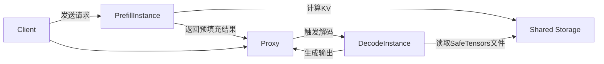
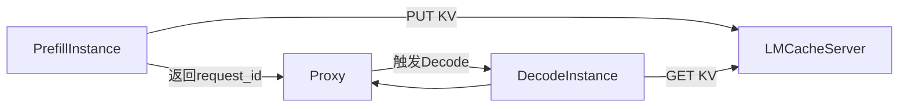
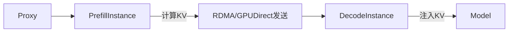
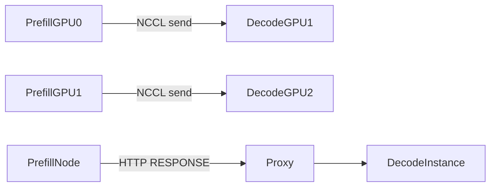
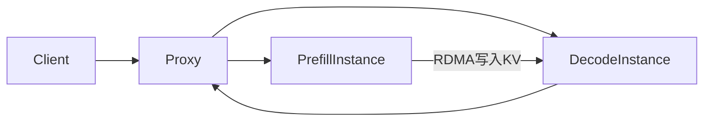

# 执行摘要

Prefill–Decode (PD) 分离推理将预填充（Prefill）与解码（Decode）阶段解耦部署，可独立调优两者性能。其核心挑战是高效传输大量 KV 缓存（Key/Value Cache）。常见的分离部署方案包括：**本地共享存储**、**中央缓存（如 LMCache）**、**NIXL/RDMA 直连**、**点对点（NCCL）**、**专用缓存/代理（如 Mooncake）**与**混合方案**等。各方案在配置复杂度、传输模式、性能和成本上有所差异。本文调研并分析了上述方案的设计与实现，包括配置示例、数据流、推/拉模式、一致性、容错、资源开销、安全性等，并对它们的延迟、吞吐、网络/存储/内存成本、实现与运维复杂度、适用场景、故障恢复和可观测性进行了表格化比较。同时总结了 KV 传输接口和序列化的最佳实践、监控和测试方法，并给出了从单机共享缓存到分布式/混合方案的迁移建议。实践表明，例如 Mooncake Connector 在长上下文场景下能使吞吐率提高数倍（实验中最高+525%），但不同场景下应结合网络环境、硬件资源和开发/运维能力选用合适方案。

## 目标与范围

本文聚焦于 vLLM（或兼容架构）在 Prefill/Decode 分离推理场景下的 KV（Key/Value Cache）传输和收集器（Connector/Collector）的设计与实现。具体仅讨论 vLLM 推理框架的方案，不涉及模型训练或其他非 vLLM 推理框架。研究的方案至少包括：**本地共享存储（SharedStorageConnector）**、**LMCache**、**Nixl**、**P2P（点对点/NCCL）**、**集中式缓存/代理（如 Mooncake）**及**混合方案（MultiConnector 等）**。对每种方案说明配置选项（命令行或配置文件示例）、架构组件、数据流（Prefill→Collector→Decode）、传输模式（push/pull/订阅回调）、一致性与并发控制、容错重试策略、延迟/带宽/内存开销估算、安全认证、可扩展性及部署复杂度。最后进行多维度对比，提供设计模式和最佳实践指导，并讨论从单机共享缓存迁移到分布式/混合方案的路径与注意事项。

## 常见方案详述

### 本地共享存储方案（SharedStorageConnector）

**配置示例：** 使用 vLLM 自带的 `SharedStorageConnector`。示例 CLI 配置如下：  
```bash
vllm serve <MODEL> \
  --port 8000 \
  --kv-transfer-config '{"kv_connector":"SharedStorageConnector","kv_role":"kv_both","kv_connector_extra_config":{"shared_storage_path":"/path/to/kvcache"}}'
```
其中 `shared_storage_path` 指定用于存放 KV 缓存文件的本地路径。该 Connector 会根据请求的 token_ids 生成 MD5 哈希作为文件名，预填充节点将每层 KV 序列化为 SafeTensors 格式文件写入该目录，解码节点根据同样的哈希值查找并加载对应文件。



**数据流：** 客户端请求先被送往 Prefill 实例（`kv_producer`）；Prefill 计算每层 KV，调用 `save_kv_layer` 将 KV 缓存写入本地磁盘。随后代理或控制器启动 Decode 实例（`kv_consumer`）计算并调用 `start_load_kv`，根据请求的标识读取对应文件并注入各层的 KV 缓存到模型中继续解码。整个过程仅依赖文件系统，无需显式网络传输。由于写入和读取是按请求唯一标识进行，能保证一致性。调用流程伪代码如：

```
# Producer (Prefill) 侧
for each layer:
    kv = compute_kv(layer)
    filename = hash(request_id, layer)
    save_safetensors(kv, shared_storage_path/filename)

# Consumer (Decode) 侧
wait_until_files_available(request_id)
for each layer:
    filename = hash(request_id, layer)
    kv = load_safetensors(shared_storage_path/filename)
    inject_kv_into_model(layer, kv)
```

**推/拉模式：** 可视作 “拉” 模式：Decode 端主动读取预填充端写好的文件。也可以通过轮询或文件通知机制等异步触发加载。

**一致性与并发控制：** 由于文件名基于请求哈希唯一确定，不存在不同请求冲突。若多条请求并发执行，分别生成独立文件。对于并发请求，解码端需阻塞等待对应文件生成（`start_load_kv` 实现会阻塞直到文件可读）。无需复杂锁机制，但需保证文件写完整后才能被读取。

**容错与重试：** 如果文件读写失败或丢失，解码端可抛出错误并触发业务重试。可以设计超时重传逻辑：Decode 可定期检查存储路径，有必要时重新触发 Prefill 或降级执行（例如回退到未拆分模式）。由于读写只在本地存储上进行，一般容错策略由应用层实现。

**性能开销：** 读写磁盘会带来 I/O 延迟，特别是 KV 数据量大时。假设使用 NVMe SSD，带宽可达数 GB/s；相比 GPU 内存复制速度慢一个数量级。整个过程涉及 GPU→CPU→磁盘、磁盘→CPU→GPU 的拷贝，消耗额外的 CPU 和主机内存。无需网络开销（若同机；如果共享路径为 NFS，则会有网络延迟）。本地方案适用于单节点或共享存储环境，对网络依赖小，但磁盘和 CPU 是瓶颈。

**安全与认证：** 数据仅存储在本地或共享存储上，可通过文件权限控制访问。若使用跨主机文件系统（NFS/SMB），需配置网络存储安全性和认证。但 vLLM Connector 本身不提供认证机制。

**可扩展性：** 适用于同机多 GPU 或同机多实例场景。跨机部署可借助网络文件系统，但性能下降且需额外运维（确保文件系统性能和权限）。部署复杂度低，无需额外进程，只需共享路径可读写。但仅适合规模较小的集群。

描述了 SharedStorageConnector 的原理和行为。通过 SafeTensors 序列化 KV 并放置在共享路径，解码端根据相同键值恢复数据，实现了零网络传输的简易 KV 传输方案。

### LMCache 方案

LMCache 是一个分布式 KV 缓存服务，支持多种后端存储（CPU 内存、本地文件、Redis、InfiniStore 等）。将 LMCache 作为外部服务接入 vLLM，可实现跨实例或跨会话的 KV 共享与重用。配置示例（需先启动 LMCache server）：

```bash
# 启动 LMCache 服务（V1）
lmcache server --l1-size-gb 20 --eviction-policy LRU

# Prefill 与 Decode 实例配置
vllm serve <MODEL> \
  --port 8000 \
  --kv-transfer-config '{"kv_connector":"LMCacheConnectorV1","kv_role":"kv_both"}'
```

上例中，`kv_connector` 指定使用 LMCacheConnectorV1 动态连接器。LMCacheConnector 会将 Prefill 生成的 KV 插入 LMCache 中，并允许 Decode 从中检索。示例日志显示 Prefill 向 LMCache 上报了 KV 地址，Decode 根据这些元数据读取 KV。



**数据流：** Prefill 实例计算完每层 KV 后，通过 `save_kv_layer` 调用将 KV 缓存“放入”LMCache（例如 CPU 内存或远程服务）。通常流程是 Prefill 向代理/元数据服务器上报包含请求 ID 或 block ID 的响应，然后 Decode 实例调用 `drop_select`（或类似接口）“获取”对应 KV，从 LMCache 读出数据并注入模型。可视为 Decode 端“拉取”KV，但如果后端支持异步推送，也可设计为 Prefill 推送 KV。LMCache 本身实现了事务一致性和并发控制，可以在多并发客户端间协调访问。

**推/拉模式：** 标准配置下 Decode 主动从 LMCache 拉取 KV（阻塞式），但 LMCache 支持异步操作，可作为混合模式。相较本地方案，网络通信增加，但可以跨主机多实例复用缓存。

**一致性与并发控制：** LMCacheConnector 通过统一的哈希算法（由 vLLM 提供）定位 KV，支持并发读写和 LRU 置换。使用相同 `PYTHONHASHSEED` 可保证 Prefill/Decode 端计算一致的键。并发情况下，多 Decode 可安全读取不同请求的 KV，LMCache 负责管理锁和版本。若多个 PreFill 同时插入同一请求 KV，应避免；一般一请求对应唯一 Prefill。

**容错与重试：** LMCache 服务故障时，Decode 无法获取 KV，可触发重试或降级到本地计算。LMCache 自带写入回放或持久化策略（可选），可减少丢失。vLLM 层面，可配置失败策略（例如 `kv_load_failure_policy`）来控制获取失败后的行为。

**性能开销：** 使用 LMCache 带来额外的网络延迟和内存消耗。网络带宽要求取决于请求并发和 KV 大小。优点是多节点可共享，减少重复计算。若启用 CPU/磁盘后端，传输速度受限于内存或磁盘速度；若用 RDMA（如 InfiniStore 后端），可接近 NIXL 性能。带宽成本视具体后端而定；例如用 Redis/RDMA 后端需要高速网络。存储成本为 LMCache 维护 KV 数据量，需要配置足够的 CPU 内存或远程存储。

**安全与认证：** LMCache 可通过 TLS/ACL 等机制限制访问（视选用后端而定）。在 vLLM 中，通常在私有网络运行，多数部署不单独做认证。接口调用可走内网或 VPN。

**可扩展性与部署：** LMCache 可做集群部署（MMPX 模式），适合多机房场景。部署要求启动 LMCache 服务节点，配置好 vLLM 动态连接器。配置复杂度中等，需管理额外服务但运维可通过标准工具（Docker、Kubernetes）。适合跨请求和跨模型场景下的 KV 共享，单机和多机皆可用。集群规模越大，LMCache 的可用性和吞吐更高，但通信开销也增加。

**示例伪代码（调用流程）：**

```python
# Prefill 侧：计算并保存 KV
for each layer:
    kv = compute_kv(layer)
    connector.save_kv_layer(layer_name, kv, attn_meta)

# Decode 侧：等待并加载 KV
connector.wait_for_save_complete()  # 等待 Prefill 完成所有保存
for each layer:
    kv = connector.load_kv(request_id, layer_name)
    inject_kv_into_model(layer, kv)
```

其中 `connector.load_kv` 会从 LMCache 拉取指定请求对应层的 KV。  

给出了 LMCache 连接器的配置示例和作用。通过外部缓存服务，实现跨节点 KV 传输与重用，是分布式场景下常用方案。

### NIXL 方案（RDMA 加速）

NIXL（NVIDIA Inference Xfer Library）提供高性能 GPU 之间和异构内存间的 RDMA 数据传输能力。vLLM 的 `NixlConnector` 基于 NIXL 库实现，适用于拥有 RDMA 设备（NVLink、InfiniBand）环境下的 Prefill–Decode 分离。使用前需安装 NIXL 库（`pip install nixl`）和配置传输后端（默认 UCX）。示例配置（使用 LIBFABRIC 后端）：

```bash
vllm serve <MODEL> \
  --kv-transfer-config '{
    "kv_connector":"NixlConnector",
    "kv_role":"kv_both",
    "kv_connector_extra_config":{"backends":["LIBFABRIC"]}
  }'
```

中给出了 NixlConnector 的使用示例，用户可根据环境选择 UCX、LIBFABRIC 等传输插件，并设置 `UCX_TLS`、`UCX_NET_DEVICES` 等环境变量。



**数据流：** 通常采用 **Pull** 模式（“读模式”）：Proxy 首先调度 Prefill 完成，获得远程 block ID 后通知 Decode，Decode 发起 NIXL READ 从 Prefill 拷贝 KV。在当前实现中，Decode 需等待 Prefill 全部计算完毕才能开始传输 KV。vLLM 团队正在推进 **Push** 模式（“写模式”）的支持，让 Prefill 在计算时就向 Decode 写入 KV。Push 模式可以重叠计算和传输，降低第一 token 延迟，提高并发利用率。无论何种模式，NixlConnector 都通过 NIXL 提供的异步 API 实现跨进程点对点传输，消除文件或 Socket 交互。

**推/拉模式：** 默认 Pull，Decode 发起；可选 Push（实验中）。Push 模式允许 Prefill 完成一个层后立即用 NIXL WRITE 写入 Decode 端预注册内存。这减少了 Decode 的空闲等待时间，提高了吞吐（见）。

**一致性与并发控制：** 使用 RDMA 时须预先在 Decode 端分配接收缓冲区并向 Prefill 注册（注册后 Prefill 才能写入）。vLLM 调度器负责分配 GPU 内存块和协调 Prefill/Decode 间握手。NIXL 自身保证了跨 GPU 传输的内存一致性，vLLM 的 `wait_for_layer_load` 等接口可同步每层写入完成。并发场景下，可开启多个 NIXL 流程（使用 `kv_parallel_size`）实现管道化传输。NIXLConnector 需与 vLLM 调度器一起工作，保持 Prefill 和 Decode 端对齐。

**容错与重试：** NIXL 传输若失败，可重试 RDMA 读取。vLLM 支持设置失败策略（比如超时后放弃），也可以回退到原地重新计算 KV。由于数据直接写入 GPU，避免了中间存储，只有在网络或硬件故障时才会丢失数据，必要时由上层业务重启请求。

**性能开销：** NIXL 通过 RDMA 利用高带宽网络或 NVLink，传输速率可达数十 GB/s，远高于 CPU 网络传输。开销主要是注册/解注册内存的 CPU 开销及设置数据路径，但可通过持久化连接与异步操作减小影响。与点对点 NCCL 类似，但 NIXL 提供更丰富的跨节点选择（如 InfiniBand）。内存开销为预先分配的接收缓冲区（由 `kv_buffer_size` 控制）。总体传输延迟极低，对前端 TTFT 影响最小。适用于多机高速互联或单机多 GPU（NVLink）环境。

**安全与认证：** NIXL 传输一般在受信任的数据中心内部进行，不提供用户级认证。可通过网络层安全设置（如 RDMA 访问控制）进行隔离。

**可扩展性与部署：** 适合多机多 GPU 环境，与硬件紧耦合。部署需安装 NIXL 库，并在每台机器上配置相同的 `kv_parallel_size`。vLLM 以静态或通过配置文件指定通信拓扑。NIXLConnector 可以横向扩展到多个 Prefill/Decode 组合，并实现多机低延迟 KV 传输，但运维和调试需协调网络配置（UCX/NCCL 参数），实现复杂度较高。

指出 NixlConnector 利用 NIXL 库加速 KV 传输。在 vLLM 的设计中，正如 RFC #36923 所述，NIXL 提供了现有的 Pull 模式，并正计划加入 Push 模式。其高带宽优势使其成为高性能需求场景的优选。

### P2P NCCL 方案（点对点通信）

**配置示例：** 使用 vLLM 的 `P2pNcclConnector`（基于 NCCL 的点对点通信）。示例配置：  
```bash
vllm serve <MODEL> \
  --gpu-memory-utilization 0.8 \
  --kv-transfer-config '{"kv_connector":"P2pNcclConnector","kv_role":"kv_producer","kv_rank":0,"kv_parallel_size":2}'
vllm serve <MODEL> \
  --gpu-memory-utilization 0.8 \
  --kv-transfer-config '{"kv_connector":"P2pNcclConnector","kv_role":"kv_consumer","kv_rank":1,"kv_parallel_size":2}'
```
上述示例中，`kv_parallel_size` 指定并行通道数量。`P2pNcclConnector` 在 Prefill 和 Decode 进程间建立 NCCL group，通过 NCCL 的 `send_tensor/recv_tensor` 实现 KV 的直接 GPU 到 GPU 传输。



**数据流：** 由 Proxy/路由器根据策略同时或依次发送请求到 Prefill 和 Decode 节点。Prefill 计算每层 KV 后，通过 NCCL 直接发送给 Decode 节点；Decode 在后台线程接收并存入自己预分配的 GPU 内存缓存。完成后，Decode 使用这些缓存继续生成输出，无需再等待额外的传输步骤。整个传输是**Push**式的点对点操作：Prefill 主动将 KV 通过 NCCL 写入 Decode。

**推/拉模式：** 典型为 Prefill 主动 **Push** KV 至 Decode。NCCL API 支持双向非阻塞 send/recv，可实现异步传输。与 NIXL “读模式”不同，NCCL 方案通过 PCIe/NVLink 直接驱动 GPU 间通信，无需先通知 Decode 拉取。

**一致性与并发控制：** NCCL 本身在启动时确定组拓扑，vLLM 负责调用顺序以匹配各请求的 KV。vLLM 的调度器需确保 Prefill 和 Decode 同步执行对应的 NCCL 通信操作，以免出现管道错位。`kv_parallel_size` 可用于多 GPU 共享分流并发，vLLM 内部会按请求序列化 NCCL 操作。所有控制同步在 NCCL 通道级完成，不需额外锁。

**容错与重试：** 若 NCCL 通信失败（如 GPU 断开），则相关请求会失败。vLLM 可以配置让 Decode 检测超时并回退到本地 Prefill 执行。一般点对点方式错误率低，但在多节点场景需要保证网络拓扑和 NCCL 环境正确。

**性能开销：** 点对点传输利用 GPU 直连通道（如 NVLink）或 GPU 互联网络（如 InfiniBand+CUDA IPC），延迟极低，带宽接近 GPU 内部传输速度，可达到数百 GB/s。网络开销集中在节点内部，外部网络使用较少。缺点是需要所有相关 GPU 彼此可直连（同机或高速互联）。内存开销包括 NCCL 消息队列和 vLLM 分配的缓冲，但总体很低。

**安全与认证：** NCCL 通信在同节点或可信网络中，缺少用户层面认证，仅受硬件拓扑限制。

**可扩展性与部署：** P2P NCCL 适合单机多 GPU 或 GPU 群集环境，对网络依赖小。部署时需确保相关环境变量（如 `NCCL_SOCKET_IFNAME`、`NCCL_IB_HCA`）正确配置。可扩展到多机（跨机 NCCL 组），但需高级配置。实现和运维复杂度中等：要求正确设置 NCCL、vLLM 和多进程协调，但无需额外进程或服务。适用于同一数据中心低延迟场景。

描述了 P2pNcclConnector 基于 NCCL 的通信特性。相比文件或外部服务，NCCL 方案直接在 GPU 间传输 KV，避免了系统开销，适合对延迟要求极高的场景。

### 集中式缓存/代理方案

此类方案通常通过一个中央服务或代理来协调 KV 传输，可能结合多级缓存。以 **Mooncake** 为例：Mooncake 是一款使用多层缓存和 RDMA 的 KV 传输引擎，可作为 vLLM 的连接器。使用时，Prefill 和 Decode 进程通过 Mooncake Connector 与中心协调。示例配置和流程：

```bash
# 假设已安装 mooncake-transfer-engine
vllm serve <MODEL> --port 8010 \
  --kv-transfer-config '{"kv_connector":"MooncakeConnector","kv_role":"kv_producer"}'
vllm serve <MODEL> --port 8020 \
  --kv-transfer-config '{"kv_connector":"MooncakeConnector","kv_role":"kv_consumer"}'
# 启动代理服务器，配置 Prefill/Decode 的 IP
python mooncake_connector_proxy.py --prefill http://192.168.0.2:8010 --decode http://192.168.0.3:8020
```

给出了 MooncakeConnector 的配置示例。在运行时，客户端请求先发至代理；代理并行转发给 Prefill（max_tokens=1）和 Decode。Prefill 计算每层 KV 后，通过 GPUDirect RDMA 将数据写入 Decode 端 GPU，并通知代理相关元数据；Decode 在后台接收线程保存这些 KV 至自身缓存。最终 Decode 返回结果经代理返还客户端。整个过程见下图：



**数据流：** Mooncake 采用多级缓存策略：在 GPU 之间使用 GPUDirect RDMA 直接传 KV，Agent/Controller（etcd/Redis）仅用于传递元数据和协调。从架构上看，与简单的点对点方案类似，但 Mooncake 借助中心服务实现 Prefill/Decode 的资源管理、线程池和超时处理。预填充发送机制为 Push，Decode 端主动注册自己并等待写入。

**推/拉模式：** 典型为 Prefill **Push** KV 给 Decode（如 NIXL 的 write 模式）。代理的存在使得 Prefill 可与 Decode 并行计算，无须 Decode 等到完成后再拉取。Mooncake 还支持在慢速对象存储环境下分层缓存（DRAM/SSD）。

**一致性与并发控制：** Mooncake Connector 管理了 Prefill/Decode 的握手和块注册，在内部保证传输顺序和内存一致性。每请求使用唯一 ID，元数据通过中心服务同步。代理可以根据负载策略选定 Prefill-Decode 对。多请求并发时，Mooncake 的调度器负责避免冲突。由于使用 RDMA，块的发送与释放由硬件保障一致。

**容错与重试：** Mooncake 支持请求超时自动回收缓存（如环境变量 `VLLM_MOONCAKE_ABORT_REQUEST_TIMEOUT`），防止长时间挂起。在网络故障时，可重传 RDMA；代理也能检测 Prefill/Decode 实例心跳并重新路由未完成的请求。

**性能开销：** 由于依赖高速互联和 GPU 直连，Mooncake 传输延迟极低，在大批量 KV 传输时可显著优于简单文件或 TCP 方案。它还通过多级缓存减少对外部存储的访问。配置和运维成本较高：需部署代理服务、etcd/Redis 元数据服务和可能的 Redis/SSD 缓存层，并保证它们高可用。

**安全与认证：** 使用时需保护代理和元数据服务接口，Mooncake 支持在私有网络使用。vLLM 连接器层面无额外认证。

**可扩展性与部署：** Mooncake 设计用于大规模集群，可跨主机扩展并支持异构环境。部署复杂度高，需要额外的服务组件和配置（代理 IP、端口）。但它将 Prefill–Decode 传输解耦为高效的分布式系统，适合大规模、对吞吐有极高要求的场景。与其他集中缓存方案相比，它集成了推送式 RDMA，特别适合慢存储环境下提升性能。

### 混合方案（MultiConnector 等）

vLLM 提供 **MultiConnector** 允许同时使用多个 Connector，以实现冗余或多级存储策略。典型用例如同时保存 KV 到本地文件和远程缓存，提高可靠性。配置示例：

```bash
vllm serve <MODEL> \
  --kv-transfer-config '{
    "kv_connector":"MultiConnector","kv_role":"kv_both",
    "kv_connector_extra_config":{
      "connectors":[
        {"kv_connector":"NixlConnector","kv_role":"kv_both"},
        {"kv_connector":"SharedStorageConnector","kv_role":"kv_both","kv_connector_extra_config":{"shared_storage_path":"local_storage"}}
      ]
    }
  }'
```

中的示例即在同一请求中并行使用 Nixl 和本地文件传输。工作流是：Prefill 调用每个子 Connector 的 `save_kv_layer`；Decode 则按优先顺序尝试从第一个可用 Connector 读取 KV，但所有 Connector 都写入同一 KV 数据。这样可实现主从缓存策略，如主用 RDMA、备份到文件或 LMCache。

**传输模式：** 混合方案内部可同时用推式和拉式。例如上述配置中，Prefill 通过 NIXL 推送 KV，同时将备份存入本地文件；Decode 可以先尝试从 NIXL 接收，如果失败再从本地文件加载。

**一致性与并发：** MultiConnector 由 vLLM 框架顺序调用多个子 Connector。它自身不做锁，仅保证 Prefill 会在所有子 Connector 处保存数据。Decode 默认从列表首个成功处加载，需确保不同 Connector 的结果一致（即同一个请求 KV 应同步落入每个后端）。

**容错与性能：** 多 Connector 增加写入开销（多份写），但提供容错：如果高性能通道失败，可以回退到备份。实现复杂度最高，需配置多套系统并处理更多异常。适用于对可靠性有特别需求的生产环境。

**其他示例：** 还有 OffloadingConnector 等专注于 GPU–CPU 传输的混合方案，但其应用场景更侧重内存管理，不在此处重点讨论。

说明了 MultiConnector 的工作原理：它可“同时向多个存储后端保存 KV”，在本地存储和远程缓存之间提供冗余。

## 方案比较分析

下表从多维度对比了各方案在性能和运维方面的异同：

| 方案                   | 延迟            | 吞吐          | 网络资源         | 存储资源           | 内存占用       | 实现复杂度     | 运维成本     | 适用场景                       | 故障恢复           | 可观测性/调试           |
|----------------------|---------------|-------------|--------------|------------------|--------------|------------|-----------|-----------------------------|----------------|--------------------|
| 本地共享存储（文件）       | **中等**（受磁盘I/O限）  | **中等**       | 无（同机）/中等（NFS） | 磁盘（需足够空间）     | 较低（只CPU/文件缓存） | 低         | 低        | 单机或局部多机<br>初期集成  | 容易（文件丢失可重填） | 简单（可查看文件系统）  |
| LMCache（集中缓存服务） | **中等**（网络+服务延迟）| **高**（多节点共享） | 中等至高（依后端） | CPU/RAM/分布式（可扩展）  | 取决于后端（RAM或SSD）   | 中等       | 中      | 跨请求/跨模型缓存<br>多机房 | 中等（服务故障需降级）    | 良好（监控服务、日志） |
| NIXL（RDMA直连）       | **低**（GB/s 级别）    | **高**         | **低**（NVLink/IB）  | 不额外（GPU直传）     | 需预留显存（接收缓冲）   | 高         | 高（需硬件环境） | 高速网络环境<br>多GPU  | 低（网络问题可重传）   | 中等（需分析RDMA状态） |
| P2P NCCL              | **低**（NVLink）       | **高**         | 低（同机NVLink）    | 不额外            | 低              | 中         | 中      | 同机多GPU<br>边缘集群   | 中（组内故障需回退）  | 中（可查看NCCL调试信息） |
| Mooncake（集中代理/RDMA） | **极低**              | **极高**        | 高（RDMA+元数据）   | GPU+RAM/SSD多级缓存   | 高（多级缓存消耗）     | 非常高      | 高      | 大规模分布式<br>慢存储场景 | 高（设计有预设回收）    | 高（多组件可监控）    |
| 混合（MultiConnector）    | **可配置**             | **可配置**       | 累加（各方案之和）    | 累加（多后端总和）       | 累加           | 很高        | 很高      | 要求高可靠性场景<br>级联存储 | 高（冗余可用降低风险） | 复杂（多系统联调）     |

上表仅供定性参考。例如，Mooncake 在一些模拟场景中将吞吐提升了数倍，而本地文件方案实现最简单但网络拓扑要求苛刻。具体选型需权衡延迟敏感性、硬件资源、开发运维能力等。

## 设计模式与最佳实践

- **接口设计：** vLLM 定义了统一的 Connector 接口，生产端调用 `save_kv_layer(layer, tensor, metadata)` 将一层 KV 缓存保存，消费端调用 `start_load_kv(forward_context)` 或者 `drop_select` 加载。建议各方案 Connector 保持无阻塞写入、阻塞读取的语义（如文档所示，`insert` 非阻塞、`drop_select` 阻塞）。层级接口 `wait_for_layer_load` 可用于跨层流水线，但可选留空。

- **序列化格式：** SafeTensors 是官方示例中常用的格式，因其轻量且支持零拷贝加载。对于大数据量，建议在传输前尽量保持 Tensor 格式直传（例如 RDMA/NCCL 可避免序列化开销）。对于文件或网络传输，使用位于 CPU 内存的张量和 SafeTensors/YAML 等高效二进制格式，可减少 CPU 序列化时间。

- **批量与增量传输：** 对于长上下文，KV 数据体积巨大。可将 KV 按 token 块（chunk）分批传输，每次发送有限大小的数据块。例如 NIXL 和 Mooncake 均可实现层间分批流传输。vLLM 参数如 `max_num_batched_tokens` 和 `kv_buffer_size` 可调节每批大小。批量分块允许 Prefill 在计算后持续推送，Decode 同时加载，减少关键路径。

- **压缩与去重：** 若 KV 数据可压缩（如模型特性冗余），可在保存前进行压缩以减少传输量。LMCache 本身支持插件式后端，可集成压缩机制。对于重复请求（相同前缀），可通过哈希或版本号检测，使 Decode 端直接重用同一 KV。对于多模型或多会话复用，应统一哈希策略确保一致的缓存命中。

- **缓存失效策略：** 集中式缓存（LMCache、Mooncake）通常内置了淘汰策略（如 LRU）。在 PD 场景中，如果请求非常多，应设置合适的缓存大小和超时。NIXL/P2P 因为不持久化外部存储，失效即删除内存。因此应保证 Prefill 在解码完成前不释放相关 KV。可以使用超时或显式信号在完成后回收（如 Mooncake 的 `ABORT_REQUEST_TIMEOUT`）。

- **版本兼容：** 不同 vLLM 版本可能改变 KV 布局或元数据格式。务必确保 Prefill/Decode 使用相同 vLLM 版本和模型配置。对于混合部署，可使用 `kv_connector_module_path` 或 `kv_connector_extra_config` 明确指定自定义 Connector 代码路径，避免因版本差异导致接口不匹配。

- **反压 (Backpressure) 控制：** 当 Decode 端处理能力不足时，应限制 Prefill 端生成速率。可以通过 vLLM 调度器限制并行度，或在 Connector 层实现队列长度限制。部分 Connector（如 NIXL）已支持异步模式下的回压机制，如限制同时传输块数，其他 Connector 可以监听缓冲状态并阻塞写入以实现自然背压。

- **监控与指标：** 建议收集以下关键指标：各 Connector 的传输延迟、传输大小、队列长度、失败次数、当前缓存使用量等。例如 NIXL/UCX 提供 `UCX_STATS`，NCCL 有通信拓扑日志，LMCache 可输出缓存命中率和内存占用。vLLM 也可在日志中记录每次 `save_kv`/`load_kv` 的时间消耗。测试时可使用专门的基准脚本：例如 vLLM 仓库中的 `benchmarks/disagg_benchmarks` 提供了 PD 方案的测试代码；自主测试可用不同长度输入模拟负载并测量 TTFT/ITL（inter-token latency）和整体吞吐。

- **测试方法：** 推荐设计 end-to-end 负载测试：部署 Prefill+Decode 组合，发送带长上下文的生成请求，并记录第一 token 延迟和整体吞吐。同时对比不开启 Disaggregation 的传统部署基线。可借助 `curl` 或 vLLM API 客户端模拟实际流量。对网络或文件方案，应测试在高并发和大 KV 情况下的可靠性。也可使用工具（如 nncp）模拟 RDMA/NCCL 性能，验证带宽利用率。定期检查异常日志确保数据一致性。

## 实施风险与迁移建议

- **兼容性与版本控制：** Prefill/Decode 端须使用相同的 vLLM 版本和模型参数。更新 vLLM 时注意 Connector 接口变动（如 v0->v1 KVConnector 重命名）。自定义 Connector 的路径需与新版本兼容。可在开发环境先行测试新版本的 Connector 集成。

- **迁移步骤：**  
  1. **本地验证**：首先在单台机器上配置 Prefill/Decode 实例（不同 GPU）以验证 KV 传输正确。例如使用 SharedStorageConnector 进行本地文件测试。  
  2. **引入中间件**：如果采用集中缓存（LMCache/Mooncake），先单独部署相关服务，如启动 LMCache Server 或 Mooncake metadata 服务，并验证 Prefill/Decode 能正确读写。  
  3. **分阶段切换**：在流量可控的环境逐步切换真实服务，比如先在测试环境使用 PD 模式并发请求对比性能；然后可切换一部分生产请求到新方案。  
  4. **指标监控**：切换时密切监控 TTFT/ITL、GPU 利用率、错误率等指标。确保新方案达到预期，并收集问题后快速回滚。  

- **回滚策略：** 保留单机（未拆分）模式的配置，一旦新方案出现问题，可切换回传统部署。建议使用配置版本管理或 Feature Flag 控制开关，按请求路径决定是否使用 PD Connector。断点续传或部分降级也可考虑，例如在传输失败时降级回归本地重新计算 KV。

- **注意事项：**  
  - **网络条件**：多节点部署对带宽和延迟敏感，应预评估网络质量并在高负载下测试。  
  - **资源预留**：对于 RDMA/CPU缓存方案，需预留足够内存和缓冲，避免 OOM。  
  - **安全隔离**：跨机时注意防火墙和安全组设置，保证 Prefill/Decode 节点互通并限制外部访问。  
  - **并发策略**：测试不同并发量下的表现，防止 KV 传输成为瓶颈。  

## 结论与推荐

Prefill–Decode 分离可显著提高推理系统的稳定吞吐和降低尾延迟。各类 KV 传输方案适用于不同场景：  
- 对延迟要求极高且资源集中（如同机多GPU）的场景，可优先考虑 **NCCL** 或 **NIXL** 方案，利用硬件直连带宽。  
- 需要跨机共享缓存时，则引入 **LMCache** 或 **Mooncake** 等集中式方案，以在多请求/多会话间复用 KV 并简化存储管理。  
- 对成本敏感、部署条件简单的场景，可用 **本地文件共享** 方案，但注意 I/O 性能和一致性。  
- 生产环境可选用**混合方案**提高可靠性，例如同时使用高速通道和远程缓存。  

总之，方案选择应结合硬件资源（GPU/网络/存储）、业务特性（是否有热点前缀）与团队能力。例如 **MultiConnector** 可灵活组合多种方式，提供冗余保证，但也最复杂。为兼顾低延迟与可扩展性，**NIXL（或 Mooncake）+ LMCache** 的混合方式是常见推荐：NIXL 负责实时传输，LMCache 负责跨请求缓存备份。配置时可先从简单方案入手（单机测试 SharedStorage），逐步添加复杂度（部署 LMCache/Mooncake），并通过监控逐步优化。迁移过程中保持回滚方案，确保服务连续性。 

**参考来源：** vLLM 官方文档与案例；LMCache 文档与示例；社区博客与论文等。
