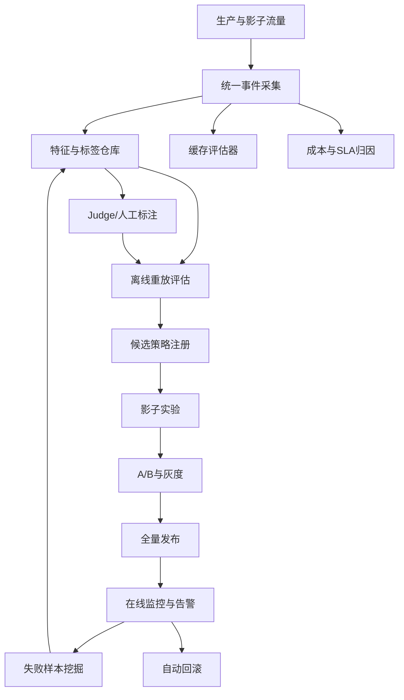

# 实用的模型路由评估与迭代体系


[下载 PDF 版](/files/research/实用的模型路由评估与迭代体系.pdf)

[下载 Word 版](/files/research/实用的模型路由评估与迭代体系.docx)

## 执行摘要

如果你要以产品负责人视角构建并持续优化模型网关，最实用的方向不是把“模型路由”看成单一算法，而是把它拆成一条可运营的决策链：**精确缓存/语义缓存 → 规则与约束过滤 → 轻量模型优先 → 置信度或难度驱动的级联升级 → 提供商与模型回退**。学术侧的 RouteLLM、FrugalGPT 已经验证了“在可控质量损失下显著降本”的可行性；工程侧的 LiteLLM、Portkey、Kong、Cloudflare AI Gateway、OpenRouter 则把缓存、故障转移、流量镜像、可观测与策略配置落到了生产层。最新的 vLLM Semantic Router 进一步把路由扩展为“信号驱动”的策略编排，把成本、隐私、延迟和安全约束一并纳入决策。citeturn17view1turn23view0turn24view1turn28view0turn26view1turn27view0turn17view3turn20search16

对产品建设而言，最关键的不是先做“最聪明的 router”，而是先做**可评估、可回放、可灰度、可回滚**的体系。离线面要有重放评估、分层采样、统计检验、业务效用函数；在线面要有影子流量、A/B、CUPED 等方差缩减、SLA 和安全监控；数据面要能沉淀“提示词—上下文—路由决策—实际成本—用户反馈—是否升级—是否命中缓存”的统一事件。没有这一层，学习型路由器很容易只是“会漂移的启发式”。citeturn12search0turn12search3turn12search1turn24view4turn18view4turn27view2

从 GPUStack 当前公开能力看，它已经具备做好“自托管/混合网关底座”的核心条件：模型路由管理支持别名、权重分流、回退、统一入口；可以把自托管部署与 Public MaaS 目标放在同一路由里；并且内置了 Prometheus/Grafana 观测栈与性能实验文档。这使它非常适合先把**基础流量编排、可观测、成本归因和灰度机制**做扎实。但公开文档仍主要强调模型路由、前缀/KV 类推理缓存和运行时观测，而不是“网关级语义响应缓存 + 学习型路由器”。这恰好定义了 GPUStack 接下来 6–12 个月最值得投入的产品增量。citeturn17view4turn29view2turn29view0turn29view3

因此，我给 GPUStack 的建议路线是：**三个月做评估 MVP，六个月做缓存与规则/分类混合路由，十二个月做学习型路由与自动调参**。先让每次路由改动都有可量化的质量、成本、延迟与业务价值回报，再把在线学习、语义缓存和级联升级变成自动化系统，而不是人工阈值工程。RouteLLM 的阈值校准、LiteLLM 的自适应路由与流量镜像、Portkey/Kong 的缓存与观测、OpenRouter 的提供商约束和回退，分别可以作为这条路线里不同阶段的参考实现。citeturn22view2turn24view0turn24view4turn28view3turn26view1turn18view1

## 场景划分与实用框架选型

从产品视角，模型网关里的“路由”至少可以分成六类场景。第一类是**同模型多实例/多提供商路由**，核心目标是可用性、成本和吞吐。第二类是**大小模型或不同能力模型路由**，核心目标是质量/成本折中。第三类是**级联升级**，先让便宜模型回答，再用置信度、不确定性或规则触发升级。第四类是**缓存优先路由**，先判断是否可复用既有答案。第五类是**约束感知路由**，例如数据驻留、ZDR、隐私、会话粘性、延迟预算、工具/多模态支持。第六类是**学习型路由**，用偏好数据、Judge 模型或 bandit 信号持续更新路由策略。OpenRouter 的 provider/model 两层路由、GPUStack 的公共/私有统一入口与回退、Portkey 的条件路由、LiteLLM 的 adaptive router、Kong 的 semantic routing，分别对应了这些场景的不同工程落点。citeturn17view3turn18view1turn17view4turn29view2turn28view0turn24view0turn26view1

下面这张表更适合作为“选型地图”，不是为了找唯一最佳方案，而是为了明确每个项目在你体系里的位置。

| 项目 | 定位 | 支持的路由类型 | 主要策略 | 运行时感知能力 | 语义缓存支持 | 可观测性与扩展性 | 部署模式 | 对 GPUStack 的借鉴价值 |
|---|---|---|---|---|---|---|---|---|
| RouteLLM | 开源研究/服务框架 | 强弱双模型路由、离线 benchmark | MF、相似度加权 Elo、BERT 分类器、LLM 分类器、阈值校准 | 以请求文本与成本阈值为主，弱运行时感知 | 无内建缓存 | 可扩展新 router 与 benchmark，带 OpenAI-compatible server | 自托管 | 非常适合作为**离线评估与阈值校准层**的参考实现。citeturn31view0turn31view1turn22view2 |
| FrugalGPT | 研究框架/原型代码 | 提示词适配、近似替代、级联 | 规则 + 学习型级联，强调预算约束下的组合策略 | 基本无在线运行时感知 | 无内建语义缓存 | Notebook/原型友好，工程化能力一般 | 自托管 | 适合作为**级联与成本基线设计**的方法学来源。citeturn23view0turn23view1 |
| LiteLLM | 开源网关/代理 | 负载均衡、超时、回退、预算路由、标签路由、健康检查路由、流量镜像、自适应路由 | 规则、LB、Failover、Bandit 风格 adaptive router | 有：健康检查、预算、请求类型学习、静默实验 | 有：Redis/Qdrant/Valkey 语义缓存与精确缓存 | OTel/Prometheus/Datadog/Langfuse 等回调丰富，可配置性强 | 自托管为主 | 适合作为 **MVP 网关评估平台 + 在线影子实验 + 轻量学习路由** 参考。citeturn24view1turn24view0turn24view2turn24view3turn24view4 |
| OpenRouter | 托管式多模型/多提供商路由网络 | Auto Router、provider routing、model fallback、session stickiness | 价格/吞吐/延迟/隐私约束、NotDiamond Auto Router、provider fallback | 强：provider 价格、吞吐、延迟、ZDR、会话粘性 | 无网关级语义响应缓存；与 prompt cache / stickiness 协同 | 有 analytics、observability destinations、broadcast 到外部平台 | 云托管 | 适合作为**约束感知路由与多提供商策略界面**的产品灵感。citeturn17view3turn18view0turn18view1turn30search2turn30search9turn30search11 |
| GPUStack | 自托管 GPU 集群与模型网关 | 路由别名、权重分流、回退、统一入口、公私模型混合 | 规则、权重、fallback、模型别名切换 | 中：依赖服务运行时指标与外部观测，但公开文档未见学习型路由 | 公开文档强调前缀/KV/层次化 KV 缓存，未见网关级语义响应缓存 | 内置 Prometheus/Grafana，具备性能实验文档 | 自托管 + 公私混合 | 非常适合做**企业自托管底座**；短板主要在语义缓存与学习型 router。citeturn17view4turn29view2turn29view0turn29view3 |
| Portkey | 商用 AI Gateway + 开源网关 | 条件路由、负载均衡、回退、重试、熔断、金丝雀 | 规则、条件判断、LB、Canary | 中上：支持 metadata、预算、观测、混合部署 | 有：精确缓存 + 语义缓存；exact miss 后再 semantic search | OTel、日志、Tracing、21+ 指标；可自托管/混合部署 | 云/自托管/混合 | 适合作为**“网关产品化”与混合部署架构**的最像素级对标。citeturn28view0turn28view3turn18view4turn28view2turn28view4 |
| Cloudflare AI Gateway | 托管式边缘 AI 网关 | 重试、fallback、限流、缓存 | 规则、fallback、provider proxy | 中：有请求、token、错误、成本、缓存分析 | 目前仅支持**精确匹配缓存**；官方写明语义缓存仍在规划中 | Analytics、Logs、OTel、DLP | 云托管 | 适合作为**边缘网关/多租户观测面板**的参照，但不适合直接借鉴语义缓存层。citeturn27view0turn27view1turn27view2turn27view3 |
| Kong AI Gateway | AI Gateway/企业 API 网关 | provider-agnostic 路由、LB、retry/fallback、semantic routing、semantic cache、canary | 规则、插件化语义路由、semantic cache | 中上：可结合 metrics、audit、Konnect 统一控制面 | 有：AI Semantic Cache 插件，向量库 + Redis | Audit log、LLM metrics、Konnect Observability，插件可扩展性很强 | 云/自托管/混合/DB-less/K8s | 适合作为**插件化语义路由与企业部署拓扑**的参考。citeturn26view0turn26view1turn26view2turn26view3turn26view4 |

如果只从“今天就能落地”的角度做判断，我会把这些方案分成三层。**第一层**是可直接借鉴的生产能力：LiteLLM、Portkey、Kong、Cloudflare、OpenRouter。**第二层**是非常值得内化的方法学：RouteLLM、FrugalGPT。**第三层**是需要跟进但不宜立刻重押的前沿方向：vLLM Semantic Router 这类“信号驱动、可组合决策”的运行时。它很有前景，但对大多数产品团队而言，更适合作为六个月以后的增强方向，而不是第一阶段目标。citeturn24view1turn28view0turn26view1turn27view0turn17view3turn17view1turn23view0turn20search16

## 评估框架与指标设计

一个实用的模型路由评估体系，建议用**单一北极星目标 + 多个守门指标**来组织。北极星不是“纯准确率”，而应当是**业务价值加权效用**：在满足安全、SLA、用户体验下，尽可能降低成本。因为路由系统本质上是多目标优化，单看质量会把所有流量压到大模型，单看成本又会把系统变成“便宜但不可用”。RouteLLM 的成本阈值校准、FrugalGPT 的级联思想、LLMRouterBench 的统一性能—成本评估，都说明了“质量—成本—延迟”必须被放在同一张图里。citeturn22view2turn23view0turn22view3

我建议把离线与在线统一成一个目标函数，形式可以非常直接：

```text
BusinessUtility
= Σ_i w_user(i) * [ q_i
                    - λ_cost * cost_i
                    - λ_lat * latency_penalty_i
                    - λ_err * error_i
                    - λ_sla * sla_breach_i
                    + λ_cache * cache_gain_i ]
```

其中 `q_i` 可以是人工标注分、Judge 分、任务成功率或用户显式满意度；`cache_gain_i` 不是单独优化缓存，而是把缓存命中折算成对成本和延迟的综合收益。这个函数本身是你的产品定义，不必追求“学术统一”，但必须在离线、影子、A/B 和全量监控里保持一致。

更具体地，建议把指标分成下面这组。

| 指标 | 推荐计算方式 | 适用阶段 | 解释 |
|---|---|---|---|
| 质量分 | 任务正确率、pass@k、Judge 分、人工分或用户满意度 | 离线/影子/在线 | 路由不是为了提升单模型能力，而是为了在给定成本下不降质或少降质 |
| 成本 | `输入 token * 输入单价 + 输出 token * 输出单价 + 嵌入/缓存/向量检索成本` | 离线/在线 | 必须把缓存、Judge、向量检索、重试都计入全成本 |
| 端到端延迟 | TTFT、首包延迟、总时延、p95/p99 | 影子/在线 | 路由多一层决策后，p95 往往比均值更重要 |
| 升级率 | `升级到大模型或备用模型的请求数 / 总请求数` | 离线/在线 | 用于评估 cascade 的保守程度 |
| 错误率 | 超时、5xx、工具调用失败、空响应、格式不合规率 | 在线 | 路由经常通过 fallback 降低系统性错误 |
| SLA 满足率 | `满足质量阈值 且 满足时延阈值 且 无关键错误` 的请求占比 | 在线 | 最适合作为灰度关口指标 |
| 缓存命中率 | 精确命中率、语义命中率、缓存回退率 | 离线/在线 | 必须拆开统计 hit 和 false-hit 风险 |
| 资源占用 | GPU 利用率、显存、队列深度、tokens/s、并发数 | 在线 | 网关路由最终要落到资源配置与调度效果 |
| 用户价值加权指标 | 按租户、付费等级、场景价值加权后的 Utility | 在线 | 能防止低价值流量“优化”掩盖高价值用户损失 |

在统计方法上，建议区分**离线配对检验**和**在线用户随机化**。离线评估通常是在同一批 prompt 上比较两个路由策略，最稳妥的是做**paired bootstrap 置信区间**；如果指标是二元正确/错误，可用 **McNemar**；如果是配对的连续得分或 Judge 分，可用成对 t 检验或 Wilcoxon；文本生成类整体指标可用**paired approximate randomization**。在线实验则应尽量采用**user-level randomization**，并使用 **CUPED** 等预实验协变量减方差方法，以缩短试验时间和减少样本需求。citeturn12search1turn12search17turn12search0turn12search3

采样策略决定评估是否有意义。一个生产路由器至少应按这些维度做分层：**任务类型、行业域、语言、上下文长度、附件/工具使用、RAG 与否、是否可缓存、租户等级、设备/地区、时间敏感性**。如果你不对“cache hit/miss”“短上下文/长上下文”“高价值/低价值租户”做分层，最终会高估 router 的收益，因为缓存、短问题和低风险请求会天然拉高指标。LLMRouterBench 强调统一大规模数据与多维指标，LiteLLM/Cloudflare/Portkey 则分别提供了镜像实验、分析指标与 tracing，正好可拼成这套评估面。citeturn22view3turn24view4turn27view2turn18view4

影子实验和 A/B 的职责应明确区分。**影子实验**只回答“如果把生产流量复制给候选路由器，它在成本、延迟、格式合规、缓存命中、Judge 分上是否安全”；**A/B 实验**才回答“真实用户价值是否提升”。LiteLLM 的 traffic mirroring 明确把 silent model 放在后台，不影响主请求延迟，这是影子评估的标准工程形态。citeturn24view4

下面给一个适合产品团队落地的 A/B 配置示意。它不是某个特定网关的官方格式，而是你在内部实验平台中应当具备的字段。

```yaml
experiment:
  name: router_v2_semcache_cascade
  unit: user_id
  traffic:
    control: 0.9
    treatment: 0.1
  guardrails:
    max_p95_latency_regression: 0.10
    max_quality_regression: 0.01
    max_error_rate_regression: 0.002
  stratification:
    - tenant_tier
    - language
    - task_type
    - cache_eligible
    - rag_enabled
  logging:
    capture_prompt_hash: true
    capture_cache_decision: true
    capture_router_features: true
    capture_selected_model: true
    capture_fallback_chain: true
    capture_user_feedback: true
```

样本量估算上，可以先用保守近似。若在线关键指标是二元成功率，基线成功率约 90%，你希望检测 **1 个百分点** 的变化，在显著性 0.05、把握度 0.8 下，粗略需要**每组约 1.4 万**用户级样本；如果要检测 **0.5 个百分点** 的变化，样本量会接近四倍。连续指标则建议基于历史方差做功效分析；如果采用配对重放或 CUPED，实际所需样本通常会明显下降。这里最重要的不是死守公式，而是把**MDE、停止规则、观察窗口、守门指标**预先写进实验设计。citeturn12search0turn12search3

## 数据集与合成负载设计

公开数据集不可能完全替代生产日志，但可以把它们组织成一套“路由评估训练集”：**通识问答、数学、代码、多轮对话、长上下文、工具调用、多语言检索、RAG 幻觉与中文场景**。这样做的价值不在于求一个统一分数，而在于让 router 在“什么场景该上大模型、什么场景可缓存、什么场景要回退”上形成结构化认识。LLMRouterBench 的结论也提醒了一点：不同 router 在统一评测下差距常常没有论文里看起来那么大，因此数据覆盖面往往比换一个更复杂的模型更重要。citeturn22view3

| 数据集 | 任务类型 | 规模 | 语言 | 适用路由场景 | 依据 |
|---|---|---:|---|---|---|
| MMLU | 多学科知识/推理 | 57 学科、15,908 题 | 英文 | 通识问答、知识型成本路由、大小模型分流 | citeturn34search8 |
| C-Eval | 中文多学科知识/推理 | 13,948 题、52 学科 | 中文 | 中文知识路由、中文大/小模型评估、租户语言分层 | citeturn32search0turn32search1 |
| GSM8K | 小学数学推理 | 8.5K 题 | 英文 | 数学难度分层、是否升级到 reasoning 模型 | citeturn6search1 |
| HumanEval | 代码生成 | 164 题 | Python/英文注释 | 代码场景路由、pass@k、工具调用前后比较 | citeturn34search1turn34search4turn34search16 |
| MT-Bench | 多轮对话/指令跟随 | 80 个高质量多轮问题 | 英文 | 对话场景、会话粘性、Judge 评分校准 | citeturn34search0 |
| LongBench | 长上下文理解 | 21 数据集、4,750 测试样本 | 中英双语 | 长上下文路由、RAG/长文摘要、上下文长度分桶 | citeturn21search11turn21search7 |
| BFCL | 工具/函数调用 | 5,551 问题-函数-答案对 | 多语言/多函数形态 | Agent / tool calling 路由、结构化输出与工具选择 | citeturn8search9turn8search15 |
| MIRACL | 多语言检索 | 18 语言、600k+ 训练对 | 多语言 | 多语种 RAG 路由、检索前置与低成本模型筛选 | citeturn8search17turn8search11 |
| BEIR | 检索/问答/事实核验等 9 类任务 | 18 数据集，文档规模 3.6k–15M | 多为英文 | RAG 检索层评估、检索器与生成器联动路由 | citeturn9search8turn9search4 |
| RAGTruth | RAG 幻觉检测 | 近 18,000 条带标注响应 | 多领域英文为主 | 幻觉风险路由、fallback 到大模型/人工审核 | citeturn9search3turn9search15 |
| CRUD-RAG | 中文 RAG 综合 | 大规模、CRUD 四类场景 | 中文 | 中文 RAG 路由、知识库构建/检索/生成协同 | citeturn21search2turn33view2 |
| CMMLU | 中文知识/推理 | 67 主题 | 中文 | 中文通识与中国本土知识路由 | citeturn21search1turn21search5 |

公开数据只解决“覆盖面”，不解决“贴近业务”。因此你还必须构建自己的**合成负载**。最有效的方法不是“让一个大模型批量生成问题”这么简单，而是围绕路由变量去控制分布：**难度分层、领域分布、上下文长度、RAG 片段质量、输出模式、时间敏感性、是否可缓存、用户偏好与成本标签**。例如，同样是问答，产品客服 FAQ 与法律合同问答对路由器来说是两类完全不同的问题；同样是代码请求，单函数修补与跨文件架构设计的升级率阈值也应不同。citeturn22view0turn25view2turn20search16

我建议你的合成负载至少包含以下扰动：其一，**错误注入**，包括检索片段缺失、冲突证据、噪声上下文、JSON schema 轻微变形；其二，**对抗样本**，包括改写、拼写变体、绕过缓存的近义问法、提示词注入片段；其三，**偏好标签**，把“快但一般”“慢但最好”“必须私有部署”“必须中文风格一致”等偏好显式打标签；其四，**成本标签**，把候选模型和提供商的实时单价、预计延迟、可用性快照一并入样本。这样 offline replay 才能学到“同一个任务在不同约束下答案不同”。citeturn18view1turn27view2turn30search13

下面是一个很适合内部数据工程的合成脚本思路。

```python
def synthesize_router_eval_case(seed_case, kb, models, policies):
    case = normalize(seed_case)

    case["difficulty_bin"] = bucket_difficulty(case)
    case["context_bin"] = bucket_context_length(case["context_tokens"])
    case["cache_eligible"] = infer_cache_eligibility(case)
    case["time_sensitivity"] = infer_time_sensitivity(case)

    # 注入检索扰动
    case["rag_variants"] = [
        inject_missing_evidence(case, kb),
        inject_conflicting_evidence(case, kb),
        inject_noise_chunks(case, kb),
    ]

    # 注入对抗改写
    case["paraphrases"] = paraphrase(case["query"], n=5)
    case["adversarial"] = generate_prompt_injection_variants(case["query"])

    # 约束标签
    case["preferences"] = [
        {"quality": 0.8, "cost": 0.2},
        {"quality": 0.5, "cost": 0.5},
        {"quality": 0.2, "cost": 0.8},
    ]
    case["policy_tags"] = infer_policy_tags(case, policies)

    # 候选模型成本与时延先验
    case["candidate_stats"] = estimate_runtime_priors(models, case)

    return case
```

在实践里，公开数据集最适合做**第一阶段离线标尺**；而真正支撑学习型路由和语义缓存收益评估的，一定是你自己的“提示—上下文—响应—反馈”事件仓库。公开数据负责给你结构，自有日志负责给你分布。citeturn22view3turn18view4turn29view0

## 语义缓存与在线学习路由

语义缓存不是“路由之外的优化项”，它本身就是路由系统的一部分。Portkey 的实现就明确采用了**先精确缓存、miss 后再做语义搜索**的顺序，并把 `model`、`temperature`、`max_tokens` 及其他 body 参数纳入匹配条件；Cloudflare 则展示了精确缓存的另一端——用 provider、endpoint、model、auth header 与完整 request body 做 SHA-256 key，从而保证严格隔离；Kong 的 AI Semantic Cache 则把向量数据库与 Redis 缓存结合起来，实现 exact + semantic 的双层缓存。citeturn28view3turn27view1turn26view0

这给产品设计一个非常重要的启发：**缓存键其实就是“可复用语义的边界定义”**。如果边界定义错了，缓存会比普通 router 更危险，因为它会在最便宜、最快速的路径上稳定地产生错误。基于现有工程实践，我建议把缓存分成两个层级。**精确缓存键**至少应包含：`tenant_id / app_id / model_contract / temperature / output_schema / tool_schema / knowledge_base_version / policy_version / locale / normalized_messages_hash`。**语义缓存 namespace** 至少应按 `tenant + app + output contract + knowledge snapshot + safety policy` 隔离，绝不能跨租户、跨知识版本、跨安全策略复用。Cloudflare 的 exact-key 设计、Portkey 对 metadata 与 body 参数的严格匹配、LangGraph 对 namespace 的组织方式，都支持这个方向。citeturn27view1turn28view3turn14search13

推荐的缓存键设计可以长这样：

```json
{
  "tenant": "acme-cn",
  "app": "support-bot",
  "cache_mode": "semantic",
  "namespace": "acme-cn/support-bot/json-v2/kb-2026-07-10/policy-pii-v3",
  "exact_key": "sha256(normalized_messages + tool_schema + output_schema + model_family + temp + locale)",
  "semantic_key_text": "last_user_turn + compacted_retrieval_facts",
  "ttl_seconds": 1800,
  "freshness": {
    "time_sensitive": false,
    "kb_version": "2026-07-10"
  }
}
```

阈值方面，不建议照搬任何单一默认值。Portkey 文档示例的默认语义阈值是 `0.95`，GPTCache 的论文报告则给出了 `0.7` 作为其评测中较好的平衡点；这两者差异本身就说明，**相似度阈值必须通过你的数据和误命中代价曲线来定**，而不是抄一个行业默认值。对 FAQ、模板化客服、标准表单抽取，阈值可以更激进；对金融、法律、医疗、合规文本，阈值应该保守，甚至只允许 exact cache。citeturn28view3turn14search15turn14search9

过期与一致性策略同样要前置设计。Cloudflare 提供了每请求 TTL 和 skip-cache；Portkey 文档也强调缓存为 opt-in，并支持 TTL 与 force refresh。在你的网关里，建议把 TTL 做成三类：**静态 TTL** 用于 evergreen FAQ，**知识版本失效** 用于 RAG，**短 TTL 或禁止缓存** 用于价格、政策、新闻、工单状态这类时效性内容。citeturn27view1turn14search18

缓存收益评估不能只看 hit rate，而要看**增量收益**。推荐拆成四个数：**命中率、回退率、误命中率、每次命中节省的平均成本/延迟**。其中误命中率要通过回退数据来估计，例如缓存命中后用户立即追问“这不对”“重新回答”、或 Judge 给出低一致性分，或者系统触发 fallback。只有把 `cache hit` 和 `router miss` 视作同一条决策链，你才能正确评估“缓存让路由少花了多少钱、又引入了多少风险”。Portkey 的 exact→semantic→LLM 顺序和候选 gating 条件，非常适合做这类回放。citeturn28view3turn26view0

在线学习型 Router 则建议把训练信号分成四层。**第一层是显式反馈**，如点赞/点踩、人工纠错、升级到人工。**第二层是隐式反馈**，如继续追问、重试、复制答案、停留时长、是否接受建议；LiteLLM 的 adaptive router 甚至把用户的“thanks”视为 satisfaction signal，并按请求类型维护每个模型的 `quality_mean`。**第三层是 Judge 信号**，尤其适合影子实验和离线回放。**第四层是离线标注或偏好数据**，这正是 RouteLLM 的核心做法。更进一步，BaRP、Adaptive LLM Routing under Budget Constraints 和 UCCI 这些工作把路由看成 contextual bandit 或可校准不确定性决策问题，说明“只在训练集上学一个静态分类器”很快会遇到天花板。citeturn25view2turn17view1turn11search3turn11search11turn11search0

一个实用的路由评分函数，建议显式把缓存、质量先验、成本、延迟和约束一起纳入：

```python
def route(request, candidates, cache):
    # 精确缓存
    hit = cache.lookup_exact(request)
    if hit and hit.is_valid():
        return Decision(kind="cache_exact", target="cache", score=1.0)

    # 语义缓存
    sem_hit = cache.lookup_semantic(request)
    if sem_hit and sem_hit.similarity >= request.semantic_threshold and sem_hit.policy_compatible:
        return Decision(kind="cache_semantic", target="cache", score=sem_hit.similarity)

    # 候选模型打分
    scores = []
    for m in candidates:
        if not policy_compatible(request, m):
            continue
        quality = predict_quality(request, m)          # classifier / judge prior / bandit posterior
        cost = estimate_cost(request, m)
        latency = estimate_latency(request, m)
        risk = estimate_format_or_safety_risk(request, m)

        score = (
            request.w_quality * quality
            - request.w_cost * normalize(cost)
            - request.w_latency * normalize(latency)
            - request.w_risk * normalize(risk)
        )
        scores.append((m, score))

    best = max(scores, key=lambda x: x[1])

    if uncertainty(best, request) > request.escalation_threshold:
        return Decision(kind="cascade_upgrade", target=request.strong_model)

    return Decision(kind="model", target=best[0], score=best[1])
```

最后，一定要把安全与合规风险视为一级能力，而不是“之后再加”。缓存和在线学习有三类高风险。第一类是**隐私和多租户泄露**：KV cache 与 prompt cache 已被研究展示存在输入重建、时序侧信道与共享缓存泄露风险。第二类是**缓存污染与 key collision**：2026 年已有针对语义缓存的 key collision / poisoning 研究。第三类是**反馈回路偏差**：人机交互会改变用户判断并放大偏差，持续用自身输出再训练规则或 router，容易形成自我强化回路。缓解措施应包括：租户隔离、策略标签进 key、敏感场景禁用语义缓存、仅保留匿名化特征做 router 学习、对高风险流量启用 ZDR/私有提供商约束、限制探索流量上限、以及对 Judge 和用户反馈做漂移监控。citeturn15search3turn15search15turn15search0turn15search9turn15search2turn15search17turn30search11turn18view1

## 实验平台、持续迭代与 GPUStack 路线图

一个面向模型网关的评估平台，最少要有七个组件：**流量分流层、候选路由执行层、影子/回放层、打分服务、指标与事件仓库、可视化与告警、模型/策略版本管理**。在这之上，再逐步叠加合规过滤层、冷启动模拟、成本模拟和自动回滚。LiteLLM 的流量镜像、GPUStack 的 Prometheus/Grafana、Portkey 的 tracing 与 metadata、Cloudflare 的 analytics/logging、Kong 的 canary 与 AI plugins，刚好对应这些能力拼图。citeturn24view4turn29view0turn18view4turn27view2turn27view3turn26view2

下面这个闭环，适合直接作为你的评估平台蓝图。



如果按最小可行平台来排优先级，我建议这样做。

**P0** 做“看得见和能回放”。包括统一请求事件 schema、模型/路由版本号、单请求成本核算、缓存决策记录、fallback 链记录、统一 dashboard、离线重放执行器、基础影子流量。没有这一步，后面所有学习型策略都站不住。  
**P1** 做“能比较”。加入 Judge 服务、分层采样、bootstrap/McNemar/CUPED、A/B 配置中心、灰度开关、自动 guardrail。  
**P2** 做“能学习”。加入语义缓存、请求难度分类器、级联升级、bandit/后验更新、阈值自动调参、租户/场景级个性化路由。  

持续迭代流程建议固定为：**数据收集 → 离线评估 → 小流量影子 → 小规模 A/B → 灰度扩大 → 全量 → 监控与回滚 → 失败样本回流**。这里最关键的是每一步都要有明确晋级门槛，而不是靠主观判断。下面是一套可操作的阈值示例，你可以直接改成内部标准。

| 阶段 | 建议晋级条件 |
|---|---|
| 离线评估 | BusinessUtility 相对基线提升 ≥ 5%；质量非劣于基线 1% 以内；p95 延迟恶化 < 10%；高风险任务无显著回退 |
| 影子实验 | 连续 3–7 天无严重告警；采样覆盖所有核心分层；Judge/规则判定的格式错误率不高于基线；缓存误命中率低于预设阈值 |
| 小规模 A/B | 95% 置信区间下 Utility 为正；投诉/重试/人工升级无显著增加；SLA breach 不升高 |
| 扩大灰度 | 至少跨一个业务周期稳定；高价值租户单独复核通过 |
| 全量发布 | 具备一键回滚、配置版本冻结、异常自动降级到保守策略 |

评估周期上，离线建议**每日或每次模型/策略变更必跑**；影子实验建议至少覆盖一个工作周；A/B 至少覆盖你的主要业务周期。如果业务有明显的日内周期、高峰期和周末行为差异，就不要用“跑两天看指标不错”来决定上线。citeturn12search0turn12search3turn24view4turn29view0

自动化策略可以从三个地方入手。第一，**阈值自动调整**：把升级阈值、语义相似阈值、fallback 顺序做成按租户/场景的配置，并用离线 replay 夜间自动重标；第二，**模型替换策略**：当某弱模型在特定请求类型上的 `quality_mean` 长期落后，就自动把它移出候选池；第三，**SLA 驱动的降级**：当 p95 时延、错误率或 provider 健康状态越线时，自动切换到保守策略或 exact-cache-only 模式。OpenRouter 的 provider sort/latency/throughput 约束、LiteLLM 的 health-check routing 与 adaptive router、GPUStack 的 route fallback 都证明这类自动化是非常实际的。citeturn18view1turn24view1turn25view2turn17view4

回到 GPUStack，本质问题不是“能不能做路由”，而是“如何把已有自托管能力升级成持续优化的模型网关”。基于其当前公开能力，我建议路线图如下。

### 三个月路线

目标是做出**路由评估 MVP**，而不是一开始追求复杂学习器。  
工程上，优先完成四件事：第一，统一事件 schema；第二，离线重放评估器；第三，影子流量与候选路由 registry；第四，成本与 SLA dashboard。  
数据上，先收集最近 4–8 周生产请求，至少补齐：提示摘要/哈希、context tokens、路由命中目标、请求耗时、token 成本、错误码、用户显式反馈、是否 follow-up、是否升级、租户与场景标签。  
产品交付上，提供一个“路由实验控制台”：能对比基线路由与候选路由的成本、质量、延迟、升级率、缓存命中率。  
关键风险是数据字段不完整与口径不统一；缓解方式是先把统一 schema 做成强制埋点，再谈学习。GPUStack 已有 route management 与 observability，这阶段主要是把“路由”和“评估”连起来。citeturn17view4turn29view0turn29view2

### 六个月路线

目标是做出**缓存优先 + 规则/分类混合路由**。  
工程上，新增网关级精确缓存与语义缓存，支持 TTL、namespace、knowledge version、force refresh；新增一个轻量请求分类器，把请求先分成通识问答、代码、分析、长上下文、工具调用、RAG、时间敏感几类；再在每类下面应用不同的模型集合和阈值。  
评估上，开始把 hit/miss 分层、缓存误命中率、fallback 收益、租户级 Utility 纳入日常报表。  
产品上，给用户提供三种策略模板：**低成本优先、平衡、质量优先**。这其实就是把 RouteLLM 的 cost threshold、LiteLLM 的 quality/cost weights 和 OpenRouter 的 cost_quality_tradeoff 抽象成产品控件。citeturn22view2turn24view0turn18view0  
关键风险是语义缓存带来的误命中与合规问题；缓解方式是默认 tenant 隔离、默认 exact-first、时间敏感场景默认禁用 semantic、并将政策版本写入 key。citeturn28view3turn27view1turn15search0

### 十二个月路线

目标是做出**学习型路由器与自动调参体系**。  
工程上，引入 bandit 或后验更新式 router，让系统按“请求类型 × 租户 × 约束配置”学习各模型的质量先验；引入 calibrated uncertainty 作为升级依据；把语义缓存阈值、升级阈值和 fallback 顺序纳入自动 nightly tuning。  
平台上，增加特征仓库与模型注册表，让“router version / feature version / judge version / cache version”都可回溯。  
产品上，形成完整闭环：用户可选择策略模板，系统自动给出“本周因为缓存节省了多少、因为路由减少了多少大模型调用、哪些场景应升级到质量优先”的建议。  
关键风险一是反馈回路偏差，二是在线学习把短期满意度学成长期质量退化；缓解方式是保留探索预算上限、高价值场景人工审核、长期 cohort 监控与定期人工抽样复核。citeturn11search0turn11search3turn11search11turn25view2turn15search2turn15search17

从投资回报排序看，我会把 GPUStack 的产品建设优先级排成这样：**评估平台 > 精确缓存 > 语义缓存 > 规则/分类混合路由 > 校准式级联 > 在线学习 bandit**。这不是说学习型路由不重要，而是说没有前面的数据、评估与回滚能力，后面的每一步都难以放心上线。对于企业用户而言，一个“始终知道自己为什么这么路由、出了问题能立刻回退”的网关，通常比一个纸面上更聪明但不可解释的 router 更有产品价值。
