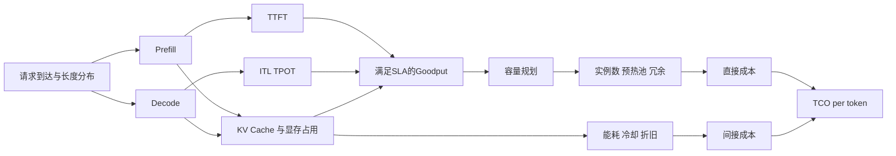

# 模型推理中的单 Token 成本 TCO 衡量与优化报告

## 执行摘要

在模型推理场景里，**单 Token 成本**最有价值的定义，不是“显卡时价/理论峰值 FLOPS”，而是**在给定服务质量约束下，每交付一个有效 Token 的全成本**。行业近年的表述正在向 *cost per token* 或 *cost per million tokens* 收敛；但在生产环境中，更严谨的写法应是 **all-in TCO per token**，即把计算资源、能耗、冷却、电费、许可证、开发运维、折旧、冷启动、冗余容量和 SLA 违约代价都纳入分子，再用**实际交付的 Token 数**而不是理论峰值吞吐做分母。NVIDIA 近期将“cost per token”明确表述为企业评估 AI 基础设施 TCO 的核心输出指标，并给出“成本/百万 Token = GPU 小时成本 ÷ 每秒 Token × 3600 × 100 万”的基本框架；同时，NVIDIA 的推理成本方法论也强调：必须先做 TTFT、ITL/TPOT、TPS、RPS 等基准测试，才能谈容量规划与 TCO。citeturn38view1turn38view0

对于 LLM 推理，**不能只看一个 blended 指标**。原因是请求天然分为 **prefill** 与 **decode** 两个阶段：prefill 更偏计算密集，decode 更偏显存/带宽受限；二者在资源瓶颈、排队行为、TTFT/TPOT 以及优化手段上都不同。DistServe 和 Sarathi-Serve 的结果都说明，在线服务的真实目标不是“裸吞吐最大化”，而是**在 TTFT 与 TPOT 双 SLO 下的 goodput**。因此，最稳妥的生产记账方式是至少同时维护三套口径：**输入 Token 成本、输出 Token 成本、混合 Token 成本**；若必须用单一标量，则应使用“等效 Token”或“分阶段加权 Token”做归一化。citeturn20search0turn20search2turn21search3

从降本效果看，收益通常按以下顺序出现：**量化与混合精度**、**连续/动态批处理**、**KV Cache 优化**、**长上下文的 chunked prefill 或 prefill/decode 解耦**、**请求路由与多模型分层**、**承诺式定价/预留实例/预热池策略**。公开结果显示，vLLM 的 PagedAttention 可在同等延迟下把吞吐提高 **2–4 倍**；DeepSpeed-FastGen 在长 prompt、短输出场景下可实现 **最高 2.3 倍** 更高有效吞吐并降低尾延迟；TensorRT-LLM 在 H100 及后续 GPU 上支持 FP8，官方文档称其相对 16-bit 可实现**性能翻倍、显存占用减半**；Sarathi-Serve 在部分 A100 场景可把服务能力提升到 **2.6 倍**，而 DistServe 在严格 SLO 下可显著提高 goodput。citeturn36search1turn28search1turn29view0turn20search2turn20search0

硬件与部署层面，**更高功耗不一定意味着更高单 Token 成本**。A100 80GB 提供 80GB HBM2e、最高 2,039 GB/s 带宽和 300–400W TDP，并支持最多 7 个 MIG；H100 引入 Tensor Core 与 FP8/Transformer Engine，并具备 900 GB/s NVLink，官方页面强调其推理性能可大幅提升；RTX 4090 以 24GB GDDR6X 和 450W TGP 适合 7B–8B 量化模型的边缘/工作站部署；AWS Inferentia2 和 Google TPU v5e/v6e 则把“价格—功耗—芯片吞吐”组合成新的成本前沿。无论选哪类硬件，TCO 都必须计入 PUE、能耗、基础设施折旧、空闲容量和运维人力；Google 2024 年平均 PUE 为 **1.09**，而 Uptime Institute 的 2024 行业平均 PUE 为 **1.56**，说明“冷却与附属设施”的差异会直接改变每个 Token 的真实成本。citeturn39view1turn39view0turn40view0turn41view0turn42view1turn17search0turn17search1turn17search10turn32view2turn31search2

## 方法与数据来源

本报告优先采用**官方文档、厂商白皮书与近三年论文**，并尽量使用一手资料来回答“定义—测量—建模—优化—部署—基准—案例—风险”这一完整链条。核心资料来源包括：NVIDIA TensorRT-LLM、Triton、GenAI-Perf/AIPerf 与 H100/A100 官方资料；AWS EC2/Inferentia2 官方页面；Google Cloud TPU 官方规格与价格页；Microsoft ONNX Runtime 官方文档；Intel OpenVINO 官方文档；vLLM 官方文档与 SOSP 论文；DeepSpeed 官方文档与 FastGen 论文；Ray Serve、KServe 官方文档；MLCommons Inference 规则与说明；以及 FinOps Foundation 关于成本分摊与 idle capacity 的框架说明。citeturn29view0turn23view0turn29view3turn41view0turn42view1turn26view2turn22view3turn36search1turn23view5turn28search1turn26view1turn22view1turn15search0turn15search8turn32view1turn32view2

用户未指定目标模型规模、QPS、预算与地理区域。为便于比较，报告采用三档**示例性场景假设**；所有涉及吞吐的数值演示，除特别标注为“官方/论文结果”外，均视为**建模假设**而非通用 benchmark 结论。

| 档位 | 模型规模示例 | 业务形态 | 典型并发/流量 | 预算 |
|---|---|---|---|---|
| 低档 | 7B–8B | 小型在线助手、边缘推理、内部工具 | 1–3 QPS 或低并发 | 未指定 |
| 中档 | 13B–70B | 面向部门级或产品级在线服务 | 5–15 QPS | 未指定 |
| 高档 | 70B+ / MoE | 大规模多租户在线服务、长上下文、高峰弹性 | 50+ QPS | 未指定 |

对“单 Token 成本”的所有示例表，本文统一使用**美元/百万 Token**作为比较单位，并在需要时补充 **J/token** 或 **kWh/百万 Token** 作为能源效率指标。云价格因区域、计费模式和发布日期可能变化；若未特别说明，云侧示例价格均取对应官方公开页中的代表值，**区域未指定**。citeturn41view0turn42view1turn42view0

## 定义与度量框架

### 精确定义

严格意义上的**单 Token 成本**，应定义为某个测量窗口内，为交付有效推理结果而发生的**全成本**，除以该窗口内交付的 Token 数。行业近年普遍用“cost per token / cost per million tokens”表述这一指标，但若把它用于企业内部核算，建议明确区分 **输出口径**、**混合口径** 和 **等效口径**。citeturn38view1turn38view0

设测量窗口为 \(W\)，则：

\[
\text{TCO}^{all}_{token}(W)=\frac{C^{direct}(W)+C^{indirect}(W)}{N_{in}(W)+N_{out}(W)}
\]

\[
\text{TCO}^{out}_{token}(W)=\frac{C^{direct}(W)+C^{indirect}(W)}{N_{out}(W)}
\]

其中，\(N_{in}\) 为已处理的 prompt tokens，\(N_{out}\) 为已交付的 completion tokens。**面向用户定价**常用输出口径或输入/输出分开计价；**面向平台运维**更建议同时维护输入与输出两条成本曲线，因为 prefill 与 decode 的资源行为并不对称。DistServe 与 Sarathi-Serve 都表明，这两个阶段会在资源竞争、SLO 和调度策略上产生显著差异。citeturn20search0turn20search2

如果必须输出一个单标量，建议引入“等效 Token”：

\[
N_{eq}(W)=N_{in}(W)+\omega \cdot N_{out}(W)
\]

其中 \(\omega\) 不应拍脑袋设定，而应由实测资源代价得到，例如：

\[
\omega = \frac{\text{平均 GPU 秒/输出 Token 或平均 J/输出 Token}}{\text{平均 GPU 秒/输入 Token 或平均 J/输入 Token}}
\]

这样做的意义在于：同样是“1 个 Token”，长 prompt 场景与长输出场景的真实成本可能完全不同。citeturn20search0turn20search2

### 直接成本与间接成本

建议把分子拆成两大块：

\[
C^{direct}=C_{compute}+C_{cloud}+C_{power}+C_{network}+C_{storage}+C_{license}
\]

\[
C^{indirect}=C_{dev}+C_{ops}+C_{maint}+C_{cooling}+C_{depreciation}+C_{idle}+C_{redundancy}+C_{SLA}+C_{compliance}
\]

其中，直接成本主要由实例计费、加速器占用、电力、网络与存储组成；间接成本则应至少覆盖开发运维人力、支持合同、设施冷却、折旧、闲置容量和 SLA 违约代价。FinOps Foundation 在数据中心成本建模中明确把 **CAPEX 摊销、Power/Cooling、Licensing/Maintenance、Platform Engineering staff、Idle capacity** 视作同一费率卡中的关键项；微软的 TCO 说明也将 **IT labor** 与 **software licensing** 作为必要成本项。citeturn32view2turn31search2turn32view1

电力与冷却的常用写法为：

\[
C_{power}=P_{avg}\times \Delta t \times r_{kWh}\times PUE
\]

其中 \(P_{avg}\) 为 IT 设备平均功率，\(r_{kWh}\) 为电价，PUE 用来吸收冷却、供配电等开销。Google 2024 年全球平均 PUE 为 1.09，而 Uptime Institute 2024 调查给出的行业平均 PUE 为 1.56；ASHRAE 文档则指出，传统机房中冷却成本可达到总能源成本的 25% 以上。换言之，**若忽略 PUE，TCO/token 往往会系统性低估**。citeturn17search0turn17search1turn17search10

折旧通常写为：

\[
C_{depreciation}= \frac{CapEx-Residual}{Life_{hours}}\times \Delta t
\]

如果是云部署，则应使用实际计费规则：AWS EC2 按需实例按**秒或小时**计费，Linux 等常见系统最小计费粒度为 60 秒；Google Cloud TPU 的价格页明确说明，**TPU 节点处于 READY 状态时即开始计费**。这意味着冷启动、预热池、空闲副本与待机容量，都应该进入 TCO 分子。citeturn42view0turn42view1

### 批量、流式、并发场景下的归一化

对于**批量推理**，归一化最简单：以整个 batch job 为窗口，从资源申请开始，到推理完成并释放资源为止，计算期间全部账单成本，再除以总 Token 数。此时吞吐优先级高于 TTFT，通常更适合用**总 Token/s** 和 **总美元/百万 Token** 做主指标。citeturn38view0turn15search0

对于**流式推理**，应至少同时记录 **TTFT、ITL/TPOT、e2e latency**。NVIDIA NIM 的指标定义给出：端到端延迟可写为 `e2e_latency = TTFT + generation_time`；Databricks 将 TTFT、TPOT、throughput 与总体响应时间作为四个核心服务指标。在线流式服务的单 Token 成本，建议以**成功交付的流式输出 Token**为分母，并把 **首 Token 之前的排队与预热成本**计入分子。否则，系统会在“看起来 token 很便宜”的同时牺牲首包体验。citeturn21search0turn21search3

对于**并发/多租户推理**，建议用**SLA 约束下的 goodput** 而不是裸吞吐。DistServe 的核心观点正是：在 TTFT 和 TPOT 双约束下，原始 tok/s 并不能代表真实可服务能力。若使用 Triton，还可以借助 `nv_inference_count / nv_inference_exec_count` 估算平均 batch size，并结合 `pending_request_count` 观察排队情况。这样的归一化比“总请求数 ÷ 时间”更接近真实单 Token 成本。citeturn20search0turn23view1



## 数据采集与成本建模

### 需要采集的关键指标

在 LLM 推理场景，指标采集至少要覆盖**请求层、调度层、设备层、能耗层、质量层、可靠性层**。vLLM 明确把指标分成 **server-level metrics** 与 **request-level metrics**；Triton 也把成功数、失败数、inference count、execution count、pending queue 等指标暴露为 Prometheus 指标；DCGM Exporter 则用于获取 GPU 级遥测。Prometheus 官方文档提醒，对延迟分位数的估计要注意 histogram bucket 设计，否则 p95/p99 会失真。citeturn34search6turn23view1turn16search0turn16search1

| 指标组 | 关键指标 | 建议采样频率 | 建议统计方式 | 说明 |
|---|---|---|---|---|
| 请求层 | prompt tokens、output tokens、RPS、TPS、TTFT、ITL/TPOT、e2e latency | **每请求必采** | p50/p90/p95/p99、均值、失败率 | TTFT 与 TPOT 是在线体验核心；e2e latency 可拆成 TTFT + generation time。citeturn21search0turn21search3 |
| 调度层 | queue length、pending requests、平均 batch size、prefill/decode 比例、冷启动次数 | 1s；压测时可到 200–500ms | 时间序列、峰值、分位数 | Triton 可直接通过 `pending_request_count`、`inference_count`、`exec_count` 计算；vLLM 也暴露 `/metrics`。citeturn23view1turn23view2 |
| 设备层 | GPU/CPU 利用率、SM/AMX 活跃度、显存占用、HBM/DRAM 带宽、NVLink/PCIe/NeuronLink 流量 | 1s；性能剖析时 100–200ms | 均值、峰值、利用率区间 | DCGM Exporter 用于集群级 GPU 遥测；Triton Model Analyzer 默认 1s 监控间隔。citeturn16search0turn35search1 |
| 能耗层 | 功率、温度、节流、J/token、kWh/百万 Token | 1s | 积分求能量，按窗口折算 | 功率要与吞吐配对，单看瓦数没有意义。citeturn16search0turn17search0turn17search1 |
| 质量层 | 任务准确率、拒答率、格式正确率、judge score、回归集通过率 | 发布前/每日 shadow/每次量化后 | 均值、回归差分、置信区间 | 压缩与路由策略都可能改变质量，不可只看成本。citeturn33search0turn33search1turn33search2turn33search3 |
| 可靠性层 | timeout、cancel、OOM、重试、SLA breach、冷启动比例 | 每请求 + 1/5/60 分钟滚动窗口 | 错误预算、告警阈值、p99 | 失败请求应保留成本、减少分母，真实反映 TCO。citeturn23view1turn27search9 |

工程上，**每请求事件流 + 每秒设备遥测**是一条足够稳妥的基础线；若要做优化前后归因，建议加一个高分辨率 profiling 模式，仅在短时间压测中打开，以免对吞吐本身造成过大干扰。Triton Model Analyzer 默认监控周期为 1 秒，vLLM 也支持高频日志与 Prometheus 采集；生产环境通常不建议长期以 100ms 级别抓全量设备指标。citeturn35search1turn34search8turn23view2

### 可复用的成本建模框架

下面给出一个适用于 **GPU/TPU/CPU/推理加速卡**、**云/边缘/本地**、**按小时/按秒/按请求/预留实例** 的通用建模框架。它的思想很简单：**先按费率算时间窗口成本，再按有效 Token 或等效 Token 分摊**。

```python
def tco_per_token(window):
    # 直接成本
    cloud_cost = sum(r.price_per_billed_second * r.billed_seconds for r in window.resources)
    power_cost = sum(d.avg_power_w * window.seconds / 3600 * pue * electricity_price
                     for d in window.devices)
    network_storage_cost = window.egress_cost + window.storage_cost + window.license_cost

    # 间接成本
    depreciation = sum((d.capex - d.residual_value) / d.life_hours * window.seconds / 3600
                       for d in window.owned_devices)
    staff_ops = staff_monthly_cost * service_allocation_ratio * window.month_fraction
    maintenance = support_contract_monthly * window.month_fraction
    idle_cost = reserved_capacity_cost - utilized_capacity_cost
    sla_cost = sum(b.penalty for b in window.sla_breaches)

    total_cost = (cloud_cost + power_cost + network_storage_cost +
                  depreciation + staff_ops + maintenance + idle_cost + sla_cost)

    tokens_in = sum(req.prompt_tokens for req in window.successful_requests)
    tokens_out = sum(req.output_tokens for req in window.successful_requests)

    tco_out = total_cost / max(tokens_out, 1)
    tco_all = total_cost / max(tokens_in + tokens_out, 1)

    return tco_out, tco_all
```

这个框架与 FinOps 的分摊逻辑是一致的：**共享成本、闲置成本和保留容量不能消失，只能被显式地分配或单列暴露**。FinOps Foundation 特别强调，idle capacity 应该被视为一个独立成本桶，而不是悄悄藏进平均费率里；否则费率会被失真，工程团队也很难判断问题到底来自“效率低”还是“容量规划过剩”。citeturn32view1turn32view2

### 成本比较示例表

下表先只比较**云价格模型**，以说明“计费模式改变本身”就能显著影响单 Token 成本。为可比性，吞吐列使用**同一 8B 级在线服务的建模假设**：Inferentia2 单实例有效输出吞吐 180 tok/s；TPU v5e 单芯片有效输出吞吐 220 tok/s。这里的吞吐是示意输入，不是官方 benchmark。官方价格来自 AWS 与 Google Cloud 当前公开价格页。citeturn41view0turn42view1

| 配置 | 官方价格输入 | 吞吐假设 | 估算成本 |
|---|---:|---:|---:|
| AWS Inf2 `inf2.xlarge` 按需 | US$0.76/小时 citeturn41view0 | 180 tok/s | **US$1.17 / 百万 Token** |
| AWS Inf2 `inf2.xlarge` 1 年预留 | US$0.45/小时 citeturn41view0 | 180 tok/s | **US$0.69 / 百万 Token** |
| AWS Inf2 `inf2.xlarge` 3 年预留 | US$0.30/小时 citeturn41view0 | 180 tok/s | **US$0.46 / 百万 Token** |
| GCP TPU v5e 按需 | US$1.20/芯片小时 citeturn42view1 | 220 tok/s | **US$1.52 / 百万 Token** |
| GCP TPU v5e 1 年承诺 | US$0.84/芯片小时 citeturn42view1 | 220 tok/s | **US$1.06 / 百万 Token** |
| GCP TPU v5e 3 年承诺 | US$0.54/芯片小时 citeturn42view1 | 220 tok/s | **US$0.68 / 百万 Token** |

再看**本地/边缘自建**示意。这里引入折旧、电费与维护费：假设电价 US$0.12/kWh、使用寿命 3 年、年维护费按设备成本 10% 估算；RTX 4090 采用 PUE=1.10，A100/H100 采用 PUE=1.20。硬件功率与规格来自 NVIDIA 官方页；设备采购成本与有效吞吐为建模假设。citeturn40view0turn39view1turn39view0turn17search0turn17search1

| 配置 | 规格依据 | 成本假设 | 有效吞吐假设 | 估算成本 | 估算能耗 |
|---|---|---|---:|---:|---:|
| RTX 4090 本地边缘 | 24GB GDDR6X，450W TGP citeturn40view0 | 整机 US$4,500 | 120 tok/s | **US$0.65 / 百万 Token** | **1.15 kWh / 百万 Token** |
| A100 80GB 本地机房 | 80GB HBM2e，最高 2,039 GB/s，300–400W，最多 7 MIG citeturn39view1 | GPU 切片等效 US$15,000 | 260 tok/s | **US$0.85 / 百万 Token** | **0.51 kWh / 百万 Token** |
| H100 SXM 本地机房 | FP8/Transformer Engine，900 GB/s NVLink，推理性能显著增强 citeturn39view0 | GPU 切片等效 US$30,000 | 520 tok/s | **US$0.85 / 百万 Token** | **0.45 kWh / 百万 Token** |

这两张表要表达的核心结论是：**定价模型与交付吞吐同时决定 TCO/token**。用 NVIDIA 的话说，真正重要的是分母——**在 SLA 下交付的 Token 输出**——而不是单看“每小时 GPU 多便宜”。citeturn38view1

## 优化手段与工具框架

### 优化影响矩阵

下表按“对单 Token 成本的主要作用路径”整理常见优化手段。表中的“定量影响”优先引用官方/论文给出的结果；若某项没有统一可迁移的数字，则用定性描述并强调依赖 workload。

| 手段 | 对 TCO/token 的主要作用 | 定量或定性影响 | 适用场景 | 实现复杂度 | 主要风险 |
|---|---|---|---|---|---|
| 权重量化与混合精度 | 降低显存占用、提高吞吐、减少带宽压力 | TensorRT-LLM 文档称 H100+ 的 FP8 相对 16-bit 可**性能翻倍、显存减半**；GPTQ 在论文中给出 A100 上约 **3.25x** 端到端加速；OpenVINO 文档给出 Llama 3 8B 4-bit 后约 **16.1GB→4.8GB**。 citeturn29view0turn18search2turn24search1 | 几乎所有推理场景 | 中 | 精度下降、校准偏差、内核支持差异 |
| KV Cache 优化 | 降低显存碎片与重复拷贝，提高可并发数 | vLLM PagedAttention 在同等延迟下可 **2–4x** 提升吞吐；ONNX Runtime 的 past/present share buffer 直接减少 KV 重分配；OpenVINO 支持 KV-cache quantization。 citeturn36search1turn23view3turn24search5 | 在线多并发、长上下文 | 中 | 命中率不稳定、实现复杂 |
| 连续批处理与动态批处理 | 把设备利用率从“请求级”提升到“token/iteration 级” | Triton 动态批处理可显著提高吞吐；Ray Serve 也明确将 batching 作为吞吐提升手段；vLLM/现代 LLM runtime 普遍依赖持续批处理。 citeturn23view0turn26view0turn36search1 | 在线中高并发 | 低到中 | p99 变差、队列超时 |
| Chunked Prefill 与 Prefill/Decode 解耦 | 同时改善 TTFT 与 TPOT，下压为 SLO 预留的过量容量 | Sarathi-Serve 在部分 A100 场景可达 **2.6x** 更高服务能力；DistServe 在双 SLO 下可大幅提高 goodput。 citeturn20search2turn20search0 | 长 prompt、高并发在线服务 | 高 | 实现复杂、跨机通信开销 |
| 推测解码 | 在不改变输出分布的前提下减少串行 decode 成本 | 原始 speculative decoding 论文强调可在**不改变输出**的前提下加速；TensorRT-LLM 与 llama.cpp 都已支持相关能力。 citeturn18search3turn29view0turn14search0 | 高交互、短输出、可接受 draft model 的场景 | 中到高 | 实际收益受接受率影响大 |
| 编译器与内核替换 | 减少 kernel launch、融合算子、利用硬件专用加速库 | ONNX Runtime 会做图优化与算子融合；DeepSpeed 提供 inference-customized kernels；TensorRT-LLM 做更深的硬件特化。 citeturn26view3turn23view5turn29view0 | 稳定模型、固定硬件 | 中 | 可移植性下降、编译成本上升 |
| 模型并行与流水线并行 | 让大模型可部署，也能在高并发下扩展吞吐 | DeepSpeed、TensorRT-LLM、vLLM 都支持多 GPU/多节点并行；没有它，大模型甚至无法上线。 citeturn23view5turn23view4turn34search7 | 70B+、MoE、多节点 | 高 | 通信开销、调试困难 |
| 剪枝 | 降低参数量与内存占用 | SparseGPT 论文表明可一-shot 剪到 **50% 稀疏** 且精度损失较小；LLM-Pruner 展示了结构化剪枝可行性。真实时延收益取决于稀疏内核支持。 citeturn19search2turn19search0 | 权重规模过大、硬件支持稀疏计算时 | 高 | 质量回退、内核不兼容 |
| 蒸馏 | 通过更小学生模型从根源上降低每 Token 算力成本 | 若学生模型大幅缩小，TCO/token 通常是所有优化里**绝对降幅最大**的一类；但收益来自“模型变小”而非某个 runtime trick。MiniLLM 说明了 LLM 蒸馏的有效性。 citeturn19search1 | 稳定任务、允许重训/再评测 | 高 | 训练成本高、知识遗漏 |
| 请求路由与多模型分层 | 让便宜模型处理大多数请求，仅把难请求升级 | KServe、Ray Serve 都支持流量治理、分层路由与组合服务；这往往是**产品层面最大的降本杠杆**。 citeturn22view1turn26view1 | 多租户、难度差异明显的业务 | 中 | 路由错误导致质量波动 |
| 预热、缓存与弹性策略 | 降低空闲成本或冷启动时间 | KServe 提供 model caching、KV cache offloading、request-based autoscaling；Knative 模式支持 scale-to-zero，但会引入冷启动；标准 K8s 模式更适合稳定的生成式推理。 citeturn22view1turn27search8turn27search9turn27search10 | 流量有明显波峰波谷 | 中 | 冷启动拉高 TTFT，预热又会增加空闲成本 |

实践中，优先级通常应是：**先量化与批处理，再做 KV/长上下文优化，再根据流量形态选择路由、弹性和定价模型，最后考虑剪枝/蒸馏这类“改模型”手段**。这是因为前两类通常对工程组织最友好，而后两类虽然收益大，但牵涉回归、合规和模型质量验证。citeturn36search1turn29view0turn20search0turn32view2

### 现有工具与框架对比

| 工具/框架 | 核心降本功能 | 优点 | 局限 | 更适合的场景 | 依据 |
|---|---|---|---|---|---|
| **vLLM** | PagedAttention、连续批处理、prefix/KV 优化、Prometheus 指标、bench serve | 开源生态强、吞吐高、模型支持广，线上/离线都方便 | 对极端硬件特化不如 TensorRT-LLM；性能上限依赖 CUDA 与具体模型 | 通用在线服务、快速试错、开源优先 | citeturn36search1turn15search6turn34search2turn23view2 |
| **TensorRT-LLM** | FP8/FP4、in-flight batching、paged KV cache、chunked prefill、spec decode、分布式并行、AIPerf | NVIDIA 栈内性能和硬件适配极强 | 硬件绑定明显，跨平台差 | H100/H200/B200 等 NVIDIA 生产部署 | citeturn29view0turn23view4turn29view1 |
| **DeepSpeed Inference / FastGen / MII** | 自定义 kernel、模型并行、MoQ、Dynamic SplitFuse、低延迟服务封装 | PyTorch 兼容性好，大模型接入成本低 | 相比 vLLM/TensorRT-LLM，社区热度与生态整合略分散 | 长 prompt/短输出、PyTorch 现有资产多 | citeturn23view5turn28search1turn28search3 |
| **ONNX Runtime GenAI** | Execution Providers、图优化、量化、KV 管理、generate API | 便携性强，CPU/GPU/OpenVINO/TensorRT/Vitis-AI 一套接口 | `generate()` 仍是 preview；大模型图优化在 >2GB 时有限制 | 跨硬件、跨环境部署 | citeturn26view2turn26view3turn26view4turn25search10 |
| **OpenVINO** | INT4/INT8 weight compression、动态量化、KV-cache quantization、GenAI API、CPU/GPU/NPU | Intel CPU/NPU/边缘侧很强，低资源部署友好 | 对非 Intel 生态吸引力较弱 | 边缘、本地、CPU/NPU 优先 | citeturn22view3turn24search1turn24search4turn24search5 |
| **FasterTransformer** | 早期高性能 Transformer kernel、FP16/INT8、多 GPU 推理 | 历史成熟、资料多 | NVIDIA 已明确转向 TensorRT-LLM，不再继续开发 | 存量系统维护，不建议新项目首选 | citeturn22view0 |
| **NVIDIA Triton** | 动态批处理、序列批处理、统一服务端、Metrics、Model Analyzer、TRT-LLM backend | 把推理服务的可观测、批处理、并发治理做得很完整 | 自身不是最底层 kernel 引擎；要和 TensorRT-LLM/ORT 等配套 | 企业级统一 Serving 平台 | citeturn23view0turn23view1turn35search0turn13search13 |
| **Ray Serve** | 动态批处理、队列驱动 autoscaling、Python 组合编排、流式响应 | 应用编排与服务组合能力强 | 官方明确说明它**不**负责模型级优化，要与 ORT/vLLM/TensorRT 等结合 | 带业务逻辑的 LLM 应用服务层 | citeturn26view0turn22view4turn26view1 |
| **KServe** | OpenAI 协议、vLLM/llm-d 后端、request-based autoscaling、model caching、KV offload、canary/A/B、Knative scale-to-zero | K8s 原生、多租户治理强 | 复杂度较高，生成式场景下网络/缓存/冷启动需要精调 | Kubernetes 生产平台、多团队共享集群 | citeturn22view1turn27search8turn27search9turn27search10 |
| **llama.cpp / ggml** | 1.5–8bit 量化、CPU+GPU hybrid、OpenAI-compatible server、spec decode、本地推理 | Commodity hardware 友好，边缘和客户端极强 | 大规模多租户集群治理能力不如企业级 serving stack | 本地、桌面、嵌入式与边缘 | citeturn22view2turn14search0turn13search2turn13search19 |

如果目标是**最低工程摩擦**，vLLM 往往是开源在线服务的首选；如果目标是**NVIDIA 单机/集群极限性能**，TensorRT-LLM 更强；如果目标是**Kubernetes 平台治理**，KServe/Triton 更合适；如果目标是**边缘与本地**，llama.cpp/ggml 与 OpenVINO 通常更经济。citeturn15search6turn29view0turn22view1turn22view2turn22view3

## 硬件与部署策略

### 不同硬件对单 Token 成本的影响

从 TCO/token 的角度看，硬件选择不应只看峰值算力，而应看 **显存容量、带宽、低精度支持、互连能力、功耗、软件栈成熟度、可被真正利用的吞吐**。A100 80GB 具有 80GB HBM2e、最高 2,039 GB/s 带宽、300–400W TDP，并支持最多 7 个 MIG，适合中等规模多租户切片；H100 引入 FP8 与 Transformer Engine，并具备 900 GB/s NVLink，TensorRT-LLM 官方文档还给出 FP8 相对 16-bit 的明显优势；RTX 4090 则用 24GB 显存和 450W TGP 形成“低资本支出、可边缘落地”的组合。citeturn39view1turn39view0turn29view0turn40view0

Google TPU v5e 的官方规格为 **16GB HBM、800 GiB/s 带宽**；Trillium v6e 提升到 **32GB HBM、1,638 GiB/s**，Google 同时宣称其相对 v5e 有更好的性能与能效；AWS Inferentia2 则给出 **每芯片 32GB HBM、最高 190 TFLOPS FP16**，并在 Inf2 实例页上强调其在 EC2 中具备较低推理成本和较高性能/瓦。此外，AWS 公开了 `inf2.xlarge` 到 `inf2.48xlarge` 的按需与预留价格，这使它很适合做“以价格模型为主导”的 TCO 设计。citeturn10view1turn10view2turn9search1turn39view3turn41view0

CPU 不应被排除在外。AWS C7i/C7i-flex 使用带 **Intel AMX** 的第四代 Xeon，可为 CPU-based ML 提供矩阵加速，在低 QPS、波动型流量、embedding/reranker、轻量模型与高合规场景里，CPU 方案经常因为**没有 GPU 空闲成本和调度复杂度**而获得更低的实际 TCO。它通常不是“绝对最快”，但可能是“最便宜且最稳”的。citeturn39view2

FPGA/可编程加速卡适合**算子稳定、功耗预算严格、生命周期较长**的场景。AMD 的 Vitis AI 与 ONNX Runtime Vitis-AI Execution Provider 说明，FPGA/Adaptable SoC/Alveo 卡可以实现硬件加速推理；代价是工具链、编译缓存与算子覆盖面通常比 GPU/CPU 生态更复杂。因此，它们更像**长期固定场景的 TCO 优化器**，而不是通用 LLM 快速迭代平台。citeturn30search0turn30search1turn30search7

### 混合部署、弹性与计费策略

对于**稳定高负载**服务，常见最优策略不是纯按需云，也不是纯自建，而是**基础容量用预留/承诺或本地折旧容量承接，峰值流量再用按需或可中断容量兜顶**。AWS 按需计费的最小粒度和 TPU 的 READY-state 计费规则意味着，若频繁冷启动/频繁拉起副本，账单会迅速被空转时间侵蚀；而 Spot/预留/承诺式价格则能显著改变分子。AWS 页面明确给出按需、预留与 Spot/Savings Plans 的折扣框架，Google TPU 页也给出 Flex-start 与 1 年/3 年 commitment 的价格层级。citeturn42view0turn41view0turn42view1turn6search0turn5view0

对生成式在线服务，KServe 官方文档明确建议：**稳定的生成式推理优先标准 Kubernetes 部署**，因为可以更细地控制 GPU 资源、长连接与流式响应；**波动流量、开发环境或内部副驾**可考虑 Knative/scale-to-zero，以控制空闲成本，但必须接受冷启动对 TTFT 的影响。KServe 自身也把 model caching、KV cache offloading 和 request-based autoscaling 列为关键功能。citeturn27search8turn27search9turn27search10turn22view1

从 TCO 角度，一个很有效但常被忽略的策略是**把 idle cost 单独暴露**。FinOps Foundation 的建议非常适用于推理平台：把“已消费成本”和“闲置成本”分开记账，并把空闲容量单独当作 waste bucket 追踪。这样工程团队才能看出：单 Token 成本上升，是因为模型/系统慢，还是因为流量低、预热池过大、可用区冗余过厚。citeturn32view2turn32view1

## 测量基准与案例研究

### 可复现的基准流程

建议采用一条“**微基准 + 服务基准 + 质量回归**”三层流程。公开比较时，优先遵守 MLPerf 的公平性原则：同一结果集中保持系统与框架一致，明确模型、输入分布、并发模式和测量规则；如果是 LLM 服务，至少同时报告 **TTFT、TPOT/ITL、TPS、RPS、p95/p99 延迟、美元/百万 Token、成功率**。MLPerf Inference Datacenter 持续把 LLM 纳入标准套件，v5.0 已包含 Llama 3.1 405B Instruct 与 Llama 2 Chat 70B，说明“公开可比较”的路径已经存在。citeturn15search0turn15search4turn15search8

工程实践上，一套可复现流程通常包括：固定模型版本与 tokenizer；固定输入长度分布；预热到缓存稳定；在多个并发点或请求速率点上扫点；每个点至少重复 3 次；记录原始 CSV/JSON 与 Prometheus 指标；计算均值、p50/p95/p99，并用 bootstrap 给出置信区间。Prometheus 官方也提醒，分位数来自 bucket 估计，因此 bucket 设计要围绕业务 SLO 设定，而不是“等距乱切”。citeturn16search1turn29view3turn23view2

下面给出两组可直接落地的示例命令。

```bash
# 示例一：vLLM 在线服务与客户端压测
vllm serve meta-llama/Llama-3.1-8B-Instruct

vllm bench serve \
  --backend openai \
  --model meta-llama/Llama-3.1-8B-Instruct \
  --dataset-name random \
  --input-len 1024 \
  --output-len 256 \
  --request-rate 4 \
  --num-prompts 200
```

这个流程来源于 vLLM 官方 bench serve；服务端同时可以抓取 `/metrics` 端点，结合设备遥测算出美元/百万 Token 与 J/token。citeturn34search2turn23view2

```bash
# 示例二：Triton / TensorRT-LLM 基准
genai-perf profile \
  -m gpt2 \
  --backend tensorrtllm \
  --streaming
```

NVIDIA 官方文档说明，GenAI-Perf 会输出表格并写出 CSV/JSON；TensorRT-LLM 最新文档则建议对 `trtllm-serve` 使用 **AIPerf**。Perf Analyzer 仓库同时给出提示：GenAI-Perf 正在向 AIPerf 迁移。因此，若做最新 NVIDIA 生态的公开基准，建议说明自己使用的是 GenAI-Perf 还是 AIPerf。citeturn29view3turn29view1turn15search7

### 推荐用于公开比较的模型与数据集

如果目的是比较**系统级 TCO/token**，最重要的不是“最强模型”，而是**可复现、覆盖不同长度与不同任务结构的标准负载**。推荐将**固定长度 synthetic 负载**与**真实长度分布**并用：例如 `128/128`、`1024/256`、`4096/512` 三组固定长度，再加一组真实聊天长度分布。质量回归则建议至少覆盖四类任务：知识理解、开放式对话、代码与数学。MMLU-Pro 对理解与推理更有区分度；MT-Bench 用于多轮对话；HumanEval 用于代码；GSM8K 用于多步数学。citeturn33search0turn33search1turn33search2turn33search3

### 案例研究

下表给出三个“**真实技术信号 + 仿真成本模型**”案例。表中的“公开技术依据”来自官方文档或近三年论文；而具体成本数字是按前述公式做的仿真，目的是展示**如何从指标采集走到 TCO 下行**，而不是声称某个供应商在所有场景都必然达到同样结果。

| 场景 | 基线状态 | 优化动作 | 结果 |
|---|---|---|---|
| **大规模在线聊天服务** | 单 A100 80GB，服务端观察到 TTFT p95 偏高、queue 波动、batch 不稳定；有效吞吐假设 140 tok/s，对应 **US$1.59 / 百万 Token** | 引入 vLLM 类连续批处理与 PagedAttention；对长 prompt 使用 chunked prefill；在严格 SLO 下按 DistServe/Sarathi 的思路调优 goodput | 保守仿真下有效吞吐到 260 tok/s，成本降到 **US$0.85 / 百万 Token**，**下降约 46%**；同时 TTFT/TPOT 约束更容易满足。citeturn36search1turn20search2turn20search0 |
| **批量长文档生成** | 以 Inf2 按需跑夜间长 prompt、短输出任务；有效吞吐假设 110 tok/s，对应 **US$1.92 / 百万 Token** | 软件层采用 DeepSpeed-FastGen 类长 prompt 优化；商业层改 1 年预留；任务改到批模式集中执行 | 保守仿真下吞吐提升到 187 tok/s，实例价从 0.76/h 变 0.45/h，对应 **US$0.67 / 百万 Token**，**下降约 65%**。公开论文给出的长 prompt 场景收益上限更高。citeturn28search1turn41view0 |
| **边缘客服终端** | 本地 RTX 4090 以较高精度运行 8B 模型，显存紧张、上下文受限；有效吞吐假设 55 tok/s，对应 **US$1.42 / 百万 Token** | 用 llama.cpp / OpenVINO 路线做 4-bit 权重量化、KV cache 优化、必要时 speculative decoding；把难请求上送云大模型 | 保守仿真下本地吞吐升到 120 tok/s，成本降到 **US$0.65 / 百万 Token**，**下降约 54%**；同时更容易把模型装进单机显存。citeturn22view2turn24search1turn24search5turn14search0 |

这三个案例共同说明，**单 Token 成本下降几乎从不来自“单一技巧”**。它通常是“**系统吞吐提升 + 边际容量减少 + 定价模型优化 + 空闲成本压缩**”的组合结果。只优化模型核函数、却不处理空闲副本和预留费率，往往只能拿到一半收益。citeturn38view1turn32view2turn41view0turn42view1

## 风险权衡与结论清单

压低 TCO/token 的最大风险是：**把“便宜”误当成“有效”**。量化、缓存、路由、多模型分层和弹性缩容都可能引入模型质量变化、格式错误、上下文污染、长尾延迟恶化、冷启动抖动与合规风险。OpenVINO 就明确提示 4-bit 重压缩可能影响准确率；ONNX Runtime 的 generate API 仍是 preview；KServe 的 scale-to-zero 能节省空闲成本，但会带来冷启动；Ray Serve 又明确表示自身不做模型级加速，若只上编排层而没有底层 runtime 优化，账单通常不会自动下降。citeturn24search4turn26view4turn27search9turn26view1

因此，真正可执行的降本方法，不应是“把精度压到最低”，而应该遵循以下顺序：

- **先把指标体系做对**：至少拿到 TTFT、TPOT/ITL、TPS、RPS、失败率、batch size、设备利用率、功率与质量回归。没有这些数据，任何 TCO 优化都只是猜测。citeturn38view0turn23view1turn23view2turn16search0
- **把成本分子做全**：实例费、电费、PUE、冷却、人力、许可证、折旧、闲置容量、SLA 罚款都要入账。citeturn32view2turn17search0turn17search1turn31search2
- **把分母换成有效交付 Token**：失败请求和冷启动空转应保留在分子，不能偷偷分摊掉。citeturn42view0turn42view1turn32view2
- **在线服务先优化 goodput，不是 peak tok/s**：长尾 TTFT/TPOT 才决定你要不要多买一倍机器。citeturn20search0turn20search2
- **优先做低风险高收益项**：量化、持续批处理、KV cache 管理、路由与预留定价，通常先于剪枝/蒸馏。citeturn29view0turn36search1turn41view0turn42view1
- **硬件选择按业务形态而不是按“最强卡”**：稳定高负载可上 H100/TPU/Inf2 或自建；突发流量要认真评估 warm pool 与 scale-to-zero 的平衡；边缘与本地优先考虑 RTX、CPU、OpenVINO、llama.cpp。citeturn39view0turn41view0turn42view1turn27search8turn22view2turn22view3
- **统一把质量回归纳入发布门禁**：至少用 MMLU-Pro、MT-Bench、HumanEval、GSM8K 中与业务最接近的一组回归，避免“成本降了，正确率也没了”。citeturn33search0turn33search1turn33search2turn33search3
- **把 idle capacity 单列成报表**：这比只看平均单 Token 成本更能暴露平台是否真正高效。citeturn32view2

### 开放问题与局限

本报告中的**吞吐示例值**有一部分是为了建模而设定的仿真假设，因为用户未指定模型、上下文长度、输出长度、地区价格和 SLO，且不同 runtime/模型家族之间的公开 benchmark 不完全可直接横比。另一个现实限制是：部分厂商对顶级 GPU 的精确云价、折旧口径和闭源优化细节披露不统一，因此本文对这些部分优先给出**可复用公式与决策方法**，而不是伪精确的单一数字。真正落地时，最关键的一步仍是：**在你的目标模型、目标长度分布和目标 SLO 下重跑一次服务基准，然后把实测吞吐填回本报告的费率模型**。citeturn38view0turn15search0turn15search8

总体结论可以压缩成一句话：**推理 TCO 的第一性原理不是“买更便宜的算力”，而是“在质量与 SLO 不退化的前提下，稳定地把更多有效 Token 交付出来，并把所有空转和共享成本显性化”**。只要定义、测量、分摊和优化顺序做对，单 Token 成本往往能在不换模型的情况下先下降 **30%–60%**；而当量化、批处理、路由和承诺式定价叠加时，降幅还会继续扩大。citeturn38view1turn36search1turn28search1turn41view0turn42view1
